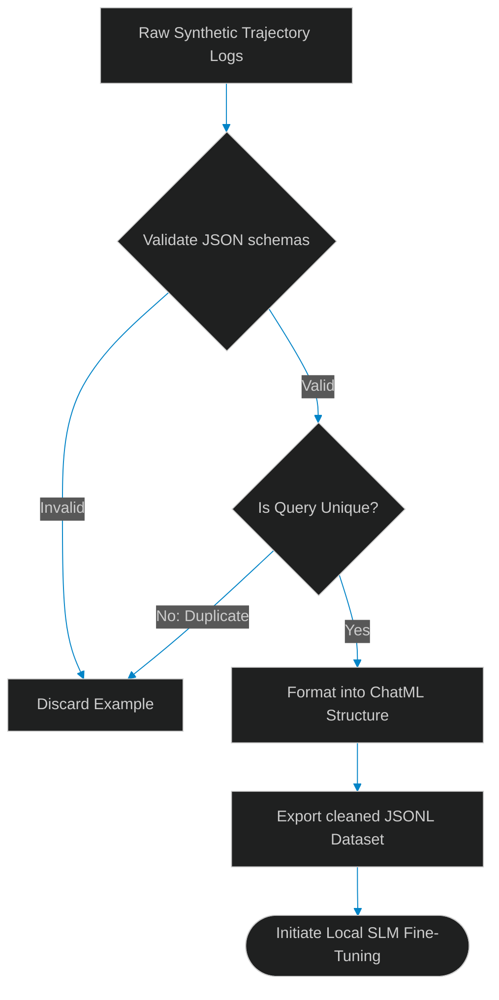

# Dataset Curation: Formatting High-Quality Synthetic Instruction Sets

> [!NOTE]
> **📖 Article Overview**
> While large language models (LLMs) running in the cloud handle general reasoning, running specialized agents on local edge devices requires optimizing Small Language Models (SLMs, e.g. Phi-3 or Llama-3-8B). To train an SLM to perform specific tool calls, developers rely on fine-tuning. However, fine-tuning accuracy is heavily dependent on data quality: "Garbage in, garbage out." If your synthetic dataset contains duplicate tasks or malformed JSON tool schemas, the model's accuracy will drop. In this article, we design a synthetic dataset curation pipeline and implement a trajectory filtering compiler in Python.

---

## The Threat of Malformed Synthetic Data

In typical model fine-tuning preparation:
* **Redundant Trajectories**: Synthetic datasets generated by larger models (e.g. GPT-4) contain hundreds of identical prompt patterns, causing model overfitting.
* **Syntax Inconsistencies**: Instruction sets often contain invalid JSON payloads or broken brackets that train the model to output corrupted tool parameters.
* **The Solution**: **Automated Dataset Curation**. We construct pipeline filters to validate JSON parsing parameters, de-duplicate instruction variations, and export outputs into standardized ChatML structures.



---

## 1. Validating Structured JSON Payloads

To protect training datasets:
* **Strict Schema Verification**: Parse every code example or tool call payload within the training set, throwing out entries that fail validation checks.
* **Discard Incomplete Snippets**: Trajectories cut off by generation limits (token limits) must be identified and removed.

---

## 2. Formatting into ChatML Schemas

The curation engine standardizes dataset formats:
1. **ChatML Structure**: Wrap entries inside `<|im_start|>` and `<|im_end|>` boundaries for `system`, `user`, and `assistant` roles.
2. **Standardize System Prompts**: Apply a consistent system prompt across all examples to align behavior.

---

## Code Demo: Synthetic Dataset Curation Parser

Below is a Python implementation of an instruction dataset curator. It filters syntax errors, removes duplicate examples, and exports clean ChatML JSONL configurations.

```python
import json
from typing import List, Dict, Any, Tuple

class DatasetCurator:
    def __init__(self):
        # Memory storage for unique prompt hashes to prevent duplication
        self.seen_prompts = set()

    def curate_trajectory(self, raw_entry: Dict[str, Any]) -> Tuple[bool, Dict[str, Any]]:
        # 1. Verify required keys exist
        if "prompt" not in raw_entry or "response" not in raw_entry:
            return False, {"error": "Missing key variables."}

        prompt = raw_entry["prompt"].strip()
        response = raw_entry["response"].strip()

        # 2. De-duplicate prompts
        prompt_hash = hash(prompt)
        if prompt_hash in self.seen_prompts:
            return False, {"error": "Duplicate prompt pattern."}

        # 3. If the response contains tool data, validate JSON syntax
        if "tool_call" in raw_entry:
            try:
                json.loads(raw_entry["tool_call"])
            except json.JSONDecodeError:
                return False, {"error": "Invalid JSON tool call format."}

        # 4. Success: Save hash and compile to ChatML format
        self.seen_prompts.add(prompt_hash)
        
        chatml_structure = {
            "messages": [
                {"role": "system", "content": "You are a helpful local automation agent."},
                {"role": "user", "content": prompt},
                {"role": "assistant", "content": response}
            ]
        }
        return True, chatml_structure

if __name__ == "__main__":
    curator = DatasetCurator()

    # Raw synthetic datasets containing duplicates, syntax issues, and valid logs
    raw_dataset = [
        {"prompt": "Get database stats", "response": "Fetching schema metrics", "tool_call": '{"action": "get_stats"}'},
        # Duplicate prompt
        {"prompt": "Get database stats", "response": "Fetching schema metrics", "tool_call": '{"action": "get_stats"}'},
        # Invalid JSON tool call
        {"prompt": "Run migration plan", "response": "Migrating database tables", "tool_call": '{"action": "migrate", }'}, # Trailing comma
        # Clean example
        {"prompt": "Clean sandbox directory", "response": "Removing temporary logs", "tool_call": '{"action": "clean_tmp"}'}
    ]

    print("🌲 Curating Synthetic Instruction Dataset...")
    print("---------------------------------------------")

    cleaned_dataset: List[Dict[str, Any]] = []
    for idx, entry in enumerate(raw_dataset):
        success, result = curator.curate_trajectory(entry)
        if success:
            cleaned_dataset.append(result)
            print(f"✅ [Row {idx + 1}] Cleaned and formatted successfully.")
        else:
            print(f"❌ [Row {idx + 1}] Discarded: {result['error']}")

    print("\n--- Exported ChatML JSONL Sample ---")
    for item in cleaned_dataset:
        print(json.dumps(item))
```

---

## Dataset Curation Takeaways

* **Validate JSON Syntaxes**: Enforce strict JSON parsing on all synthetic tool outputs before using them for training.
* **Apply Prompt Hash Checks**: Identify and delete duplicate questions to prevent model overfitting.
* **Standardize Format Wrappers**: Wrap training data inside ChatML tags to train models to output clear system, user, and assistant blocks.
