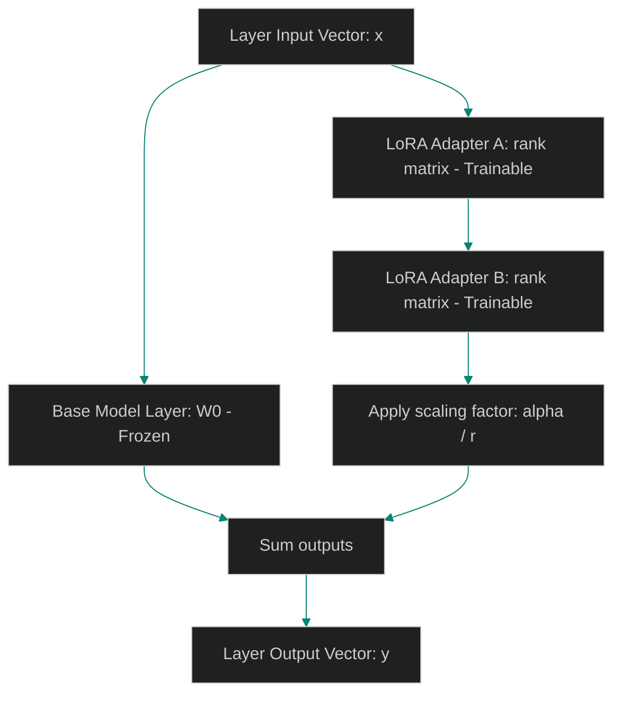

# LoRA & QLoRA: Parameter-Efficient Fine-Tuning on Local Hardware

> [!NOTE]
> **📖 Article Overview**
> Fine-tuning a Small Language Model (SLM) with billions of parameters directly consumes massive amounts of GPU memory. Backpropagating errors through all layers of a 7B model can easily exhaust consumer-grade hardware budgets. To enable local customization, machine learning engineers use **Low-Rank Adaptation (LoRA)** and **Quantized LoRA (QLoRA)**. Instead of updating all model weights, we freeze the base network and inject lightweight, trainable rank adapter matrices. In this article, we design a parameter-efficient adapter wrapper and implement a LoRA layer optimizer simulator in Python.

---

## The Efficiency of Low-Rank Adapters

In traditional model training setups:
* **Memory Exhaustion**: Storing optimizer states for 7 billion active weights requires high-end hardware infrastructure, blocking local edge deployment.
* **Storage Bloat**: Saving full model weights for each specific task-adapter requires gigabytes of disk storage.
* **The Solution**: **LoRA & QLoRA**. We freeze the pre-trained weights $W_0$. We decompose the weight updates $\Delta W$ into two low-rank matrices $A$ and $B$, significantly reducing the number of parameters trained.

$$\Delta W = B \times A$$

Where $B$ is a matrix of size $d \times r$, $A$ is of size $r \times k$, and the rank $r \ll d, k$.



---

## 1. Decomposing Weight Updates

To configure low-rank adapters:
* **Freeze Base Layers**: Disable gradient updates (`requires_grad = False`) on all base model weight parameters.
* **Specify Rank ($r$)**: Enforce low-rank constraints (typically $r = 8$ or $r = 16$) to limit trainable adapter size.

---

## 2. Applying Scaling Coefficients

The adapter scaling coordinates target contributions:
1. **Apply Scaling Factor**: Multiply adapter updates by a scaling constant $\frac{\alpha}{r}$, where $\alpha$ acts as a learning rate helper.
2. **Combine Output**: Sum the base frozen layer output with the scaled adapter contribution.

---

## Code Demo: LoRA Adapter Layer Simulator

Below is a Python implementation of a low-rank adapter (LoRA) layer simulator. It models freezing base weights, mapping rank adapter parameters, and executing forward training steps.

```python
import numpy as np
from typing import Tuple

class LoRALayerSimulator:
    def __init__(self, in_features: int, out_features: int, rank: int = 8, alpha: int = 16):
        self.in_features = in_features
        self.out_features = out_features
        self.rank = rank
        self.alpha = alpha
        self.scaling = alpha / rank

        # 1. Base weights: Frozen (Simulated by not calculating gradients for W0)
        self.W0 = np.random.randn(out_features, in_features) * 0.01
        
        # 2. Trainable Adapter Matrices A and B
        # Initialize A with normal distribution, B with zeros (ensures adapter starts at zero contribution)
        self.adapter_A = np.random.randn(rank, in_features) * 0.01
        self.adapter_B = np.zeros((out_features, rank))

    def forward(self, x: np.ndarray) -> np.ndarray:
        # y = W0*x + (B*A)*x * (alpha/rank)
        base_output = np.dot(x, self.W0.T)
        
        # Calculate adapter contribution
        adapter_output = np.dot(x, self.adapter_A.T)
        adapter_output = np.dot(adapter_output, self.adapter_B.T)
        
        scaled_adapter_output = adapter_output * self.scaling
        return base_output + scaled_adapter_output

    def update_adapter_weights(self, gradient_A: np.ndarray, gradient_B: np.ndarray, lr: float = 0.01):
        # Simulate simple optimizer update on trainable parameters
        self.adapter_A -= lr * gradient_A
        self.adapter_B -= lr * gradient_B
        print("💾 [Optimizer] Updated trainable LoRA adapter weights.")

if __name__ == "__main__":
    print("🛡️ Initializing LoRA Layer Simulator...")
    print("---------------------------------------")

    # Layer dimensions: 512 input, 256 output, rank 8 adapter
    layer = LoRALayerSimulator(in_features=512, out_features=256, rank=8, alpha=16)

    # Input batch representing sequence tokens
    mock_input = np.random.randn(4, 512)

    # Execute forward pass
    output = layer.forward(mock_input)
    print(f"📊 Forward Pass Output Shape: {output.shape}")

    # Simulate gradient backward step updates
    grad_A_mock = np.random.randn(8, 512) * 0.001
    grad_B_mock = np.random.randn(256, 8) * 0.001
    layer.update_adapter_weights(grad_A_mock, grad_B_mock)
```

---

## PEFT Fine-Tuning Takeaways

* **Freeze Base Weights**: Turn off gradients on base model parameters to minimize local GPU memory usage.
* **Tune Alpha and Rank**: Balance rank ($r$) and scaling coefficient ($\alpha$) parameter scopes to control domain learning rates.
* **Merge Adapters on Serve**: Fuse trainable adapter weights directly into the base weights during deployment to eliminate runtime latency overheads.
