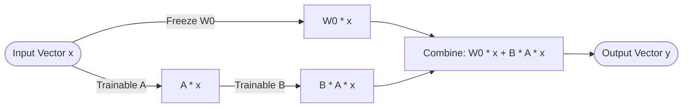

# Parameter-Efficient Fine-Tuning: Training SLMs on Custom Trajectory Trees

To deploy highly specialized AI agents in production, we do not need massive, expensive 70B+ models. Instead, we can distill execution expertise into **Small Language Models (SLMs)** ranging from 1.5B to 8B parameters (such as Llama-3-8B or Qwen-2.5-7B). 

To teach an SLM how to reason and call tools without losing its general language capabilities, we perform **Parameter-Efficient Fine-Tuning (PEFT)**. This article details the mathematical foundations of Low-Rank Adaptation (LoRA/QLoRA) and provides a production-grade Python script to train an SLM on multi-step agent trajectory trees.

---

## The Mathematics of LoRA and QLoRA

During standard full fine-tuning, every single weight parameter in the model's weight matrices ($W_0$) is modified. For an 8B model, updating 8 billion parameters requires massive GPU memory ($>160$ GB VRAM) due to storing gradients and optimizer states.

**Low-Rank Adaptation (LoRA)** simplifies this by freezing the original model weights $W_0 \in \mathbb{R}^{d \times k}$ and injects trainable rank decomposition matrices. The weight update $\Delta W$ is decomposed into two low-rank matrices $B$ and $A$:

$$\Delta W = B \cdot A$$

Where $B \in \mathbb{R}^{d \times r}$ and $A \in \mathbb{R}^{r \times k}$, with the rank $r \ll \min(d, k)$ (typically $r = 8$ or $16$).



By only updating $B$ and $A$, we reduce the number of trainable parameters by **99.9%**, enabling fine-tuning on a single consumer GPU (e.g., 24GB VRAM). **QLoRA** takes this further by quantizing the base model weights ($W_0$) into a specialized 4-bit NormalFloat (NF4) format, reducing memory usage even more.

---

## Python Trajectory Training Script

Here is a production-grade training script utilizing Hugging Face's `trl` (SFTTrainer), `peft`, and `transformers` to fine-tune an SLM on custom agent trajectories formatted in ChatML.

```python
import torch
from datasets import load_dataset
from peft import LoraConfig, get_peft_model, prepare_model_for_kbit_training
from transformers import (
    AutoModelForCausalLM,
    AutoTokenizer,
    BitsAndBytesConfig,
    TrainingArguments
)
from trl import SFTTrainer

# 1. Base Model & Training Configurations
BASE_MODEL = "Qwen/Qwen2.5-7B-Instruct"
DATASET_PATH = "G:/ReplitProjects/akmalkhaniub.github.io/blog/posts/dataset.jsonl"
OUTPUT_DIR = "./slm-trajectory-adapter"

# 2. Configure 4-bit Quantization (QLoRA)
bnb_config = BitsAndBytesConfig(
    load_in_4bit=True,
    bnb_4bit_use_double_quant=True,
    bnb_4bit_quant_type="nf4",
    bnb_4bit_compute_dtype=torch.bfloat16
)

# 3. Load Tokenizer and Base Model
print(f"Loading tokenizer and base model: {BASE_MODEL}")
tokenizer = AutoTokenizer.from_pretrained(BASE_MODEL)
tokenizer.pad_token = tokenizer.eos_token
tokenizer.padding_side = "right"

model = AutoModelForCausalLM.from_pretrained(
    BASE_MODEL,
    quantization_config=bnb_config,
    device_map="auto",
    torch_dtype=torch.bfloat16
)

# 4. Prepare Model for Peft Training
model = prepare_model_for_kbit_training(model)

# 5. Define LoRA Target Configurations
peft_config = LoraConfig(
    r=16,                           # Low-rank dimension (rank)
    lora_alpha=32,                  # Scaling factor
    target_modules=["q_proj", "k_proj", "v_proj", "o_proj", "gate_proj", "up_proj", "down_proj"],
    lora_dropout=0.05,
    bias="none",
    task_type="CAUSAL_LM"
)

model = get_peft_model(model, peft_config)
model.print_trainable_parameters()

# 6. Load Dataset
# Expected dataset format in dataset.jsonl:
# {"messages": [{"role": "user", "content": "..."}, {"role": "assistant", "content": "Thought: ... Tool: ..."}]}
dataset = load_dataset("json", data_files=DATASET_PATH, split="train")

# 7. Configure Training Hyperparameters
training_args = TrainingArguments(
    output_dir=OUTPUT_DIR,
    per_device_train_batch_size=4,
    gradient_accumulation_steps=4,
    learning_rate=2e-4,
    logging_steps=10,
    max_steps=100,                  # Short run for demonstration
    bf16=True,
    optim="paged_adamw_8bit",       # Optimizer suited for low VRAM
    save_strategy="steps",
    save_steps=50,
    warmup_ratio=0.03,
    report_to="none"
)

# 8. Initialize SFTTrainer
trainer = SFTTrainer(
    model=model,
    train_dataset=dataset,
    peft_config=peft_config,
    max_seq_length=2048,
    tokenizer=tokenizer,
    args=training_args,
)

# 9. Execute Fine-Tuning
print("Starting SLM fine-tuning execution...")
trainer.train()

# 10. Save LoRA adapter weights
print(f"Saving fine-tuned adapter to {OUTPUT_DIR}")
trainer.model.save_pretrained(OUTPUT_DIR)
```

---

## Important Pitfalls in Fine-Tuning

When fine-tuning SLMs on execution trajectories, keep these guardrails in mind:

> [!WARNING]
> **Catastrophic Forgetting**: Fine-tuning an SLM strictly on narrow code/tool datasets can destroy its general conversational coherence. Always mix your custom trajectory dataset with a small percentage (e.g. 10–15%) of general chat instruction data to preserve base model vocabulary.

> [!IMPORTANT]
> **Masking Loss**: Do not train the model to predict the user prompts. Ensure that your trainer configuration utilizes data-collator masks (`DataCollatorForCompletionOnlyLM`) to compute loss **only** on the assistant's reasoning thoughts and tool call answers, ignoring user instruction tokens.

---

## Real-World Production Adoption
High-performance AI platforms utilize QLoRA to customize micro-models:
* **Edge Diagnostics Swarms**: Train 3B parameter models that interpret local system telemetry, running QLoRA fine-tuning in under 4 hours on commercial workstation GPUs.
* **Specialized Code Generators**: Fine-tune SLMs to generate SQL queries matching specific enterprise database schemas, achieving 95% execution accuracy while completely ignoring out-of-domain knowledge.
