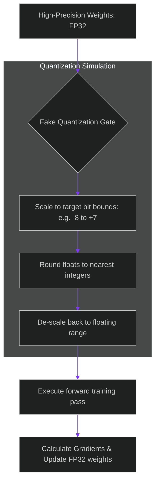

# Quantization-Aware Training: Protecting Model Precision against Bit Loss

> [!NOTE]
> **📖 Article Overview**
> Deploying fine-tuned models to edge devices requires converting high-precision weights (FP16 or BF16) into compressed formats (INT4 or INT8). However, performing post-training quantization (PTQ) directly on custom-trained adapters frequently causes a significant drop in accuracy. The rounding errors introduced by compressing weights scramble the specific features learned during fine-tuning. To prevent accuracy degradation, engineers use **Quantization-Aware Training (QAT)**. By simulating low-bit rounding errors during the forward pass, we train weights to adapt to compression noise. In this article, we implement a QAT rounding simulation module in Python.

---

## The Threat of Quantization Noise

In standard compression workflows:
* **The Post-Training Drop**: Quantizing a custom-tuned adapter post-hoc rounds floating-point values to discrete integer steps, destroying high-precision representations.
* **Loss of Domain Accuracy**: SLMs fine-tuned to output strict JSON schemas start outputting syntax errors after compression due to rounding losses.
* **The Solution**: **Quantization-Aware Training (QAT)**. We preserve weights in high-precision (FP32) but pass them through a simulated quantization gate (fake quantization) during forward training passes. The optimizer updates the FP32 weights based on the degraded outputs, learning robust parameters.



---

## 1. Simulating Integer Clamping (Fake Quantization)

To implement simulated low-bit training:
* **Scale weights to range**: Multiply weights by a scale factor derived from the maximum parameter ranges.
* **Clamp values**: Restrict outputs to target bit bounds (e.g. mapping to `[-8, 7]` for signed 4-bit configurations) to simulate clipping.

---

## 2. Straight-Through Estimators (STE)

Since rounding is a non-differentiable step (gradient is zero almost everywhere):
1. **Pass gradients unchanged**: Use a Straight-Through Estimator (STE) during backpropagation to bypass the rounding derivative.
2. **Apply updates**: Apply calculated gradients directly to the high-precision weights.

---

## Code Demo: Quantization-Aware Training Simulator

Below is a Python implementation of a quantization-aware training simulator. It injects fake quantization noise into weights, executes forward passes, and updates floating parameters.

```python
import numpy as np
from typing import Tuple

class QATWeightSimulator:
    def __init__(self, num_bits: int = 4):
        self.num_bits = num_bits
        # Calculate integer bounds for signed quantization (e.g. 4-bit is -8 to 7)
        self.qmin = -(2 ** (num_bits - 1))
        self.qmax = (2 ** (num_bits - 1)) - 1

    def fake_quantize_weights(self, weights: np.ndarray) -> np.ndarray:
        # Determine scale factor based on weight distribution
        max_val = np.max(np.abs(weights)) or 1e-5
        scale = max_val / self.qmax

        # 1. Scale and round float weights to simulated integer range
        quantized = np.round(weights / scale)

        # 2. Clamp values within target bit boundaries
        clamped = np.clip(quantized, self.qmin, self.qmax)

        # 3. De-scale back to floating-point representation (reconstructing FP32)
        dequantized = clamped * scale
        return dequantized

    def execute_forward_qat_layer(self, inputs: np.ndarray, weights: np.ndarray) -> Tuple[np.ndarray, np.ndarray]:
        # Apply fake quantization to weights before computing output
        qat_weights = self.fake_quantize_weights(weights)
        output = np.dot(inputs, qat_weights.T)
        return output, qat_weights

if __name__ == "__main__":
    print("🛡️ Initializing QAT Weight Simulator (4-Bit Target)...")
    print("-------------------------------------------------------")

    simulator = QATWeightSimulator(num_bits=4)

    # Simulated floating-point adapter weights (FP32)
    fp32_weights = np.array([
        [0.085, -0.124, 0.342],
        [-0.015, 0.448, -0.219]
    ])

    mock_inputs = np.array([[1.0, 2.0, -1.0]])

    # Run QAT forward pass
    output, simulated_weights = simulator.execute_forward_qat_layer(mock_inputs, fp32_weights)

    print("\n🌲 --- Quantization Comparison ---")
    print("Original FP32 Weights:")
    print(fp32_weights)
    print("\nSimulated 4-Bit Rounded Weights (FP32 representation):")
    print(simulated_weights)
    print(f"\nLayer Output with Quantization Noise: {output}")
```

---

## Quantization-Aware Takeaways

* **Simulate Rounding Noise**: Inject quantization rounding errors during training to train models to adapt to noise.
* **Keep High-Precision Backups**: Maintain master weights in high-precision (FP32) to aggregate gradients.
* **Enforce Safe Boundaries**: Clamp weights to prevent activation overflow during low-bit deployment.
