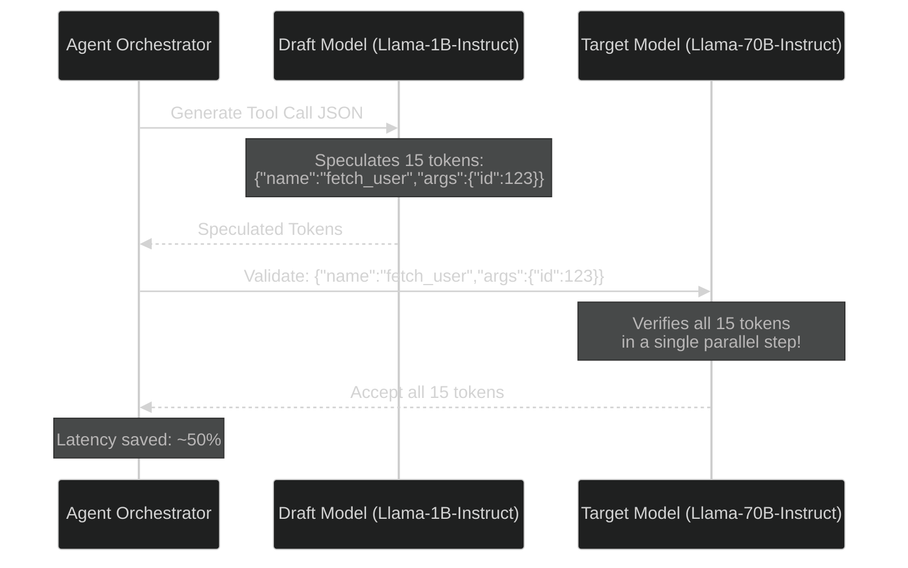

# Speculative Decoding for Function Calling: Slashing Tool-Loop Latency

> [!NOTE]
> **📖 Article Overview**
> Multi-step agent loops are notoriously slow. In a typical execution cycle, an agent must decide to call a tool, output the parameters in structured JSON, wait for the database/API return, and then parse the results to formulate the final answer. Generating structured JSON token-by-token is computationally expensive. This article explores **Speculative Decoding for Function Calling** — an optimization technique that utilizes a fast, lightweight "draft model" to speculate the JSON tool schema and parameters, leaving the large "target model" to validate it in a single forward pass, reducing tool-call latency by up to 50%.

---

## The Latency Problem in Agent Tool Use

When an LLM calls a tool, it generates JSON text (e.g. `{"tool": "fetch_user", "args": {"id": 101}}`). Because this text follows strict, highly predictable syntax constraints (like keys, braces, and commas), having a massive 70B parameter model spend cycles generating every single character is highly inefficient.

In standard inference, tokens are generated one-by-one. In **Speculative Decoding**, we run a fast draft model (like a 1B or 8B model) to guess a sequence of tokens. The larger target model then verifies these tokens in parallel in a single forward pass. Because verification is parallelized, we get the exact output of the large model, but at speeds close to the small model.



If the target model disagrees with any speculated token, it rejects the remainder of the sequence, corrects the mismatched token, and resumes speculation. For structured JSON outputs, speculation acceptance rates are exceptionally high (>85%) because schemas follow rigid formatting rules.

---

## Implementing Speculative Decoding in Python (vLLM)

vLLM provides native support for speculative decoding. Below is a Python script showing how to serve a large model using a smaller, fast draft model to accelerate inference, and how to verify execution latency.

### vLLM Server Startup Configuration:
To spin up a vLLM server with speculative decoding, specify your large target model and your smaller draft model:

```bash
python -m vllm.entrypoints.openai.api_server \
    --model meta-llama/Meta-Llama-3-70B-Instruct \
    --speculative-model meta-llama/Meta-Llama-3-8B-Instruct \
    --num-speculative-tokens 5 \
    --port 8000
```

---

### Python API Execution Client:
Once served, query the vLLM server using a standard structured schema contract. The draft model will guess the JSON structures, reducing the time-to-first-tool-call:

```python
# speculative_client.py
import time
from openai import OpenAI
from pydantic import BaseModel, Field

# Point to our vLLM server running speculative decoding
client = OpenAI(base_url="http://localhost:8000/v1", api_key="token-placeholder")

# Define the target tool schema
class UserLookupTool(BaseModel):
    user_id: int = Field(..., description="The unique database ID of the user.")
    fields: list[str] = Field(..., description="List of columns to fetch (e.g. email, phone).")

def execute_speculative_tool_call(prompt: str):
    start_time = time.time()
    
    # Request structured tool call parameters
    completion = client.beta.chat.completions.parse(
        model="meta-llama/Meta-Llama-3-70B-Instruct",
        messages=[{"role": "user", "content": prompt}],
        response_format=UserLookupTool,
        temperature=0.0 # Keep temperature low to maximize speculation alignment
    )
    
    latency = time.time() - start_time
    tool_call = completion.choices[0].message.parsed
    
    return tool_call, latency

# Example Run
if __name__ == "__main__":
    prompt = "Look up user 54892. I need their email address and phone number."
    
    # Run request
    tool_parameters, seconds = execute_speculative_tool_call(prompt)
    
    print(f"Time Taken: {seconds:.3f} seconds")
    print("Generated Parameters JSON:")
    print(tool_parameters.model_dump_json(indent=2))
```

---

## 🏁 Conclusion & Takeaways

Reducing latency in tool loops makes multi-agent systems feel real-time and responsive:
* [ ] **Use speculative decoding for structured formats**: Rigid JSON schemas are highly predictable, making them perfect candidates for draft-model speculation.
* [ ] **Keep temperature at 0**: Set temperature to 0 for tool calls to maximize the alignment between the draft and target models.
* [ ] **Configure appropriate speculative token lengths**: Settle on `--num-speculative-tokens 5` to `7` to optimize parallel verification without wasting compute.
* [ ] **Select compatible draft models**: Ensure your draft model shares the same tokenizer architecture as your target model to prevent token translation misalignments.
