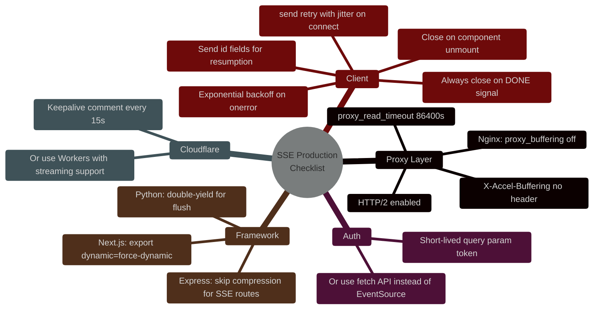

# SSE Gotchas: 10 Server-Sent Events Pitfalls That Will Break Your LLM Streaming in Production

> [!NOTE]
> **📖 Article Overview**
> Server-Sent Events (SSE) look deceptively simple — open a connection, stream text, done. But when you deploy an LLM streaming API behind a real infrastructure stack (Nginx, Cloudflare, ALBs, Next.js middleware), SSE breaks in ways that are maddening to debug. Tokens buffer for 30 seconds then dump all at once. Mobile clients reconnect in storms. Auth headers silently fail. This article documents **10 production SSE gotchas** that every AI engineer hits, with exact fixes in **TypeScript (Hono/Node.js)** and **Python (FastAPI)**. Consider this the battle-tested field guide that nobody wrote when you needed it.

---

## Why SSE Looks Easy But Isn't

The EventSource API on the browser side is three lines:

```javascript
const source = new EventSource('/api/stream');
source.onmessage = (e) => console.log(e.data);
```

The server side is barely more. But between your Node.js process and the browser sits a gauntlet: **reverse proxies, CDNs, load balancers, middleware frameworks, and mobile network stacks** — each with their own opinions about what a "response" looks like and when to flush it.

The result: SSE that works perfectly in local development silently breaks in every production environment it touches.

---

## The Full SSE Failure Map

```mermaid
%%{init: {'theme': 'dark', 'themeVariables': { 'primaryColor': '#0ea5e9', 'primaryTextColor': '#f3f4f6', 'primaryBorderColor': '#38bdf8', 'lineColor': '#0ea5e9', 'secondaryColor': '#111827', 'tertiaryColor': '#0f172a'}}}%%
flowchart TD
    C[Browser EventSource] --> P1{Proxy / CDN Layer}
    
    P1 -->|Buffering ON| G1[💥 Gotcha 1<br/>Tokens buffer 30s<br/>then dump all at once]
    P1 -->|HTTP/1.1| G2[💥 Gotcha 2<br/>6-connection limit<br/>new tabs kill old streams]
    P1 -->|Auth via Header| G3[💥 Gotcha 3<br/>EventSource can't<br/>set Authorization header]
    P1 -->|Cloudflare timeout| G4[💥 Gotcha 4<br/>100s hard timeout<br/>kills long responses]
    P1 -->|Passed| S[Server]

    S --> P2{Framework Layer}
    P2 -->|Next.js middleware| G5[💥 Gotcha 5<br/>Edge runtime buffers<br/>full response body]
    P2 -->|Express compress()| G6[💥 Gotcha 6<br/>Gzip middleware<br/>swallows stream chunks]
    P2 -->|No keep-alive| G7[💥 Gotcha 7<br/>Connection closes after<br/>first event — client loops]
    P2 -->|Passed| L[LLM API]

    L --> P3{Client Reconnect}
    P3 -->|No Last-Event-ID| G8[💥 Gotcha 8<br/>Reconnect replays<br/>full response from start]
    P3 -->|No exponential backoff| G9[💥 Gotcha 9<br/>Reconnect storm on<br/>server restart]
    P3 -->|No done signal| G10[💥 Gotcha 10<br/>Client never closes —<br/>connection leak]

    style G1 fill:#7f1d1d,stroke:#ef4444,stroke-width:2px
    style G2 fill:#7f1d1d,stroke:#ef4444,stroke-width:2px
    style G3 fill:#7f1d1d,stroke:#ef4444,stroke-width:2px
    style G4 fill:#7f1d1d,stroke:#ef4444,stroke-width:2px
    style G5 fill:#78350f,stroke:#f59e0b,stroke-width:2px
    style G6 fill:#78350f,stroke:#f59e0b,stroke-width:2px
    style G7 fill:#78350f,stroke:#f59e0b,stroke-width:2px
    style G8 fill:#1e3a5f,stroke:#3b82f6,stroke-width:2px
    style G9 fill:#1e3a5f,stroke:#3b82f6,stroke-width:2px
    style G10 fill:#1e3a5f,stroke:#3b82f6,stroke-width:2px
```

---

## Gotcha 1: Your Proxy Is Buffering Everything

**Symptom**: Works perfectly on `localhost:3000`. On production (behind Nginx or an AWS ALB), tokens don't appear until the full LLM response completes — then dump all at once. Streaming is completely broken.

**Root cause**: Nginx buffers upstream responses by default. It collects the full body before forwarding to the client, making SSE indistinguishable from a slow JSON response.

**Fix — Nginx config:**

```nginx
location /api/stream {
    proxy_pass http://localhost:3000;
    
    # THE critical SSE directives
    proxy_buffering off;                    # Disable response buffering
    proxy_cache off;                        # Disable caching
    proxy_set_header Connection '';         # Force HTTP/1.1 keep-alive
    proxy_http_version 1.1;
    chunked_transfer_encoding on;
    
    # Prevent proxy from closing idle SSE connections
    proxy_read_timeout 86400s;             # 24 hours — adjust to your LLM max runtime
    proxy_send_timeout 86400s;
    
    # SSE-specific headers
    proxy_set_header X-Accel-Buffering no; # Also disables Nginx buffering via header
    add_header X-Accel-Buffering no;
    add_header Cache-Control no-cache;
}
```

**Fix — From the application side (belt and suspenders):** Set `X-Accel-Buffering: no` on every SSE response. Nginx respects this header even if the config isn't set:

```typescript
// Hono (TypeScript)
app.get('/api/stream', (c) => {
  return new Response(stream, {
    headers: {
      'Content-Type': 'text/event-stream',
      'Cache-Control': 'no-cache, no-transform',
      'Connection': 'keep-alive',
      'X-Accel-Buffering': 'no',  // ← Disables Nginx buffering via header
    }
  });
});
```

```python
# FastAPI (Python)
from fastapi.responses import StreamingResponse

@app.get("/api/stream")
async def stream_endpoint():
    return StreamingResponse(
        event_generator(),
        media_type="text/event-stream",
        headers={
            "Cache-Control": "no-cache, no-transform",
            "Connection": "keep-alive",
            "X-Accel-Buffering": "no",  # ← Disables Nginx buffering
            "Access-Control-Allow-Origin": "*",
        }
    )
```

---

## Gotcha 2: HTTP/1.1 Browser Connection Limit (6 Per Domain)

**Symptom**: Your app opens multiple SSE streams (e.g., one per chat thread). After 6 concurrent tabs/streams to the same domain, new streams silently fail or existing ones freeze.

**Root cause**: HTTP/1.1 browsers enforce a **maximum of 6 simultaneous connections per domain**. Each SSE stream holds one connection open permanently — 6 streams exhausts the pool for the entire domain, blocking all other requests including regular API calls, image loads, and fetch requests.

**Fix — Option A: Upgrade to HTTP/2** (multiplexes all streams over one TCP connection — solves the problem entirely):

```nginx
server {
    listen 443 ssl http2;  # ← Enable HTTP/2
    # ... rest of config
}
```

**Fix — Option B: Use a SharedWorker to multiplex SSE across tabs:**

```typescript
// shared-sse-worker.ts — runs once, shared across all tabs
const connections = new Map<string, EventSource>();
const subscribers = new Map<string, Set<MessagePort>>();

self.onconnect = (e: MessageEvent) => {
  const port = e.ports[0];
  
  port.onmessage = (msg) => {
    const { type, streamId, url } = msg.data;
    
    if (type === 'SUBSCRIBE') {
      if (!connections.has(streamId)) {
        // Only ONE EventSource per stream ID — shared across all tabs
        const source = new EventSource(url);
        connections.set(streamId, source);
        subscribers.set(streamId, new Set());
        
        source.onmessage = (event) => {
          // Fan out to all tabs subscribed to this stream
          subscribers.get(streamId)?.forEach(p => p.postMessage(event.data));
        };
      }
      subscribers.get(streamId)?.add(port);
    }
    
    if (type === 'UNSUBSCRIBE') {
      subscribers.get(streamId)?.delete(port);
      if (subscribers.get(streamId)?.size === 0) {
        connections.get(streamId)?.close();
        connections.delete(streamId);
        subscribers.delete(streamId);
      }
    }
  };
};
```

---

## Gotcha 3: EventSource Cannot Send Authorization Headers

**Symptom**: You try to protect your SSE endpoint with a Bearer token. Every other endpoint uses `Authorization: Bearer <token>`. EventSource silently ignores it — the browser always opens the SSE connection **without custom headers**, sending only cookies.

**Root cause**: The `EventSource` API does not support custom headers. It is a known, unfixed limitation of the W3C spec.

```typescript
// ❌ THIS DOES NOT WORK — headers are silently ignored
const source = new EventSource('/api/stream', {
  headers: { 'Authorization': `Bearer ${token}` }  // Browser ignores this
});
```

**Fix — Option A: Pass token as a query parameter** (use short-lived tokens only — never long-lived JWTs):

```typescript
// Client
const shortLivedToken = await fetchShortLivedToken(); // expires in 60s
const source = new EventSource(`/api/stream?token=${shortLivedToken}`);

// Server (Hono)
app.get('/api/stream', async (c) => {
  const token = c.req.query('token');
  const user = await validateShortLivedToken(token); // Validate & expire immediately
  if (!user) return c.text('Unauthorized', 401);
  // ... stream
});
```

**Fix — Option B: Use fetch() with a ReadableStream instead of EventSource** (supports all headers, more control):

```typescript
// Client — fetch-based SSE (supports Authorization header)
async function streamWithAuth(url: string, token: string): Promise<void> {
  const response = await fetch(url, {
    headers: {
      'Authorization': `Bearer ${token}`,  // ✅ Works with fetch
      'Accept': 'text/event-stream',
    }
  });

  if (!response.ok || !response.body) throw new Error('Stream failed');

  const reader = response.body.getReader();
  const decoder = new TextDecoder();

  while (true) {
    const { done, value } = await reader.read();
    if (done) break;
    
    const chunk = decoder.decode(value, { stream: true });
    // Parse SSE format manually
    for (const line of chunk.split('\n')) {
      if (line.startsWith('data: ')) {
        const data = line.slice(6);
        if (data === '[DONE]') { reader.cancel(); return; }
        console.log('Token:', JSON.parse(data).token);
      }
    }
  }
}
```

---

## Gotcha 4: Cloudflare's 100-Second Hard Timeout

**Symptom**: Long LLM responses (e.g., generating a 5,000-word document) get cut off at exactly 100 seconds on Cloudflare-proxied domains. Connection drops, client gets no completion signal.

**Root cause**: Cloudflare's free and Pro plans enforce a **100-second HTTP response timeout**. It doesn't matter if you're streaming — if the connection is open longer than 100s, Cloudflare terminates it.

**Fix — Send keepalive comments every 15 seconds** (SSE comment lines starting with `:` are valid per spec, invisible to client, but reset Cloudflare's idle timeout):

```typescript
// Hono — SSE with Cloudflare keepalive pings
app.get('/api/stream', async (c) => {
  const { readable, writable } = new TransformStream();
  const writer = writable.getWriter();
  const encoder = new TextEncoder();

  const write = (data: string) => writer.write(encoder.encode(data));

  // Start keepalive ping every 15s
  const keepaliveInterval = setInterval(async () => {
    try {
      await write(': keepalive\n\n');  // SSE comment — valid spec, invisible to app
    } catch {
      clearInterval(keepaliveInterval);
    }
  }, 15_000);

  // Run LLM stream in background
  (async () => {
    try {
      const stream = await anthropic.messages.stream({ /* ... */ });
      for await (const chunk of stream) {
        if (chunk.type === 'content_block_delta' && chunk.delta.type === 'text_delta') {
          await write(`data: ${JSON.stringify({ token: chunk.delta.text })}\n\n`);
        }
      }
      await write('data: [DONE]\n\n');
    } finally {
      clearInterval(keepaliveInterval);
      writer.close();
    }
  })();

  return new Response(readable, {
    headers: {
      'Content-Type': 'text/event-stream',
      'Cache-Control': 'no-cache',
      'X-Accel-Buffering': 'no',
    }
  });
});
```

---

## Gotcha 5: Next.js Edge Runtime Buffers SSE

**Symptom**: Your Next.js Route Handler at `app/api/stream/route.ts` doesn't stream in production — even with `export const runtime = 'edge'`. Vercel deployments receive all tokens at once.

**Root cause**: Next.js's bundler and some Vercel edge network configurations can buffer ReadableStream responses. You need to explicitly signal streaming intent.

```typescript
// ❌ This may buffer in Next.js production
export async function GET() {
  const stream = new ReadableStream({ /* ... */ });
  return new Response(stream, {
    headers: { 'Content-Type': 'text/event-stream' }
  });
}

// ✅ Correct Next.js App Router SSE with explicit flush signals
export const runtime = 'edge';
export const dynamic = 'force-dynamic';  // ← Prevents static caching

export async function GET(request: Request) {
  const encoder = new TextEncoder();

  const stream = new ReadableStream({
    async start(controller) {
      const enqueue = (data: string) => {
        controller.enqueue(encoder.encode(`data: ${data}\n\n`));
      };

      // Send an immediate flush to establish the stream
      enqueue(JSON.stringify({ type: 'connected' }));

      const anthropicStream = await anthropic.messages.stream({
        model: 'claude-3-5-sonnet-20241022',
        max_tokens: 2048,
        messages: [{ role: 'user', content: 'Write a detailed essay on RAG systems.' }]
      });

      for await (const chunk of anthropicStream) {
        if (chunk.type === 'content_block_delta' && chunk.delta.type === 'text_delta') {
          enqueue(JSON.stringify({ token: chunk.delta.text }));
        }
      }

      enqueue('[DONE]');
      controller.close();
    }
  });

  return new Response(stream, {
    headers: {
      'Content-Type': 'text/event-stream; charset=utf-8',
      'Cache-Control': 'no-cache, no-transform',
      'X-Accel-Buffering': 'no',
      'X-Content-Type-Options': 'nosniff',
    }
  });
}
```

---

## Gotcha 6: Express `compression()` Middleware Breaks SSE

**Symptom**: SSE streams stall randomly. Works in development (no compression), breaks in production where `compression()` middleware is active.

**Root cause**: Express's `compression` middleware buffers response chunks to apply gzip — destroying SSE's real-time nature. It can't flush individual SSE events; it holds them waiting for more data to compress efficiently.

```typescript
// ❌ Global compression breaks SSE
app.use(compression());

// ✅ Apply compression selectively — skip SSE routes
import compression from 'compression';

app.use(compression({
  filter: (req, res) => {
    // Don't compress SSE routes
    if (req.path.startsWith('/api/stream')) return false;
    if (res.getHeader('Content-Type')?.toString().includes('text/event-stream')) return false;
    // Use default filter for everything else
    return compression.filter(req, res);
  }
}));
```

---

## Gotcha 7: Python FastAPI — asyncio Generator Must Explicitly Flush

**Symptom**: FastAPI SSE streams in development but not in production with Gunicorn/Uvicorn workers. Tokens batch in groups of ~20 instead of arriving one by one.

**Root cause**: Python's async generators buffer `yield` statements depending on the ASGI server configuration and OS socket buffer sizes. You need to yield the newlines as separate flushes.

```python
# ❌ May buffer — single yield per event
async def event_generator():
    async for chunk in anthropic_stream:
        yield f"data: {chunk}\n\n"  # OS may buffer this

# ✅ Double-newline as separate yield forces flush in most ASGI servers
async def event_generator():
    async for chunk in anthropic_stream:
        token = chunk.delta.text if hasattr(chunk, 'delta') else ""
        if token:
            yield f"data: {json.dumps({'token': token})}\n"
            yield "\n"  # ← Separate yield forces ASGI flush

# ✅ Even better: use sys.stdout.flush() signal for Uvicorn
from fastapi import FastAPI, Request
from fastapi.responses import StreamingResponse
from anthropic import AsyncAnthropic
import json

anthropic = AsyncAnthropic()
app = FastAPI()

@app.get("/api/stream")
async def stream(request: Request):
    async def generate():
        async with anthropic.messages.stream(
            model="claude-3-5-sonnet-20241022",
            max_tokens=1024,
            messages=[{"role": "user", "content": "Explain vector databases."}]
        ) as stream:
            async for text in stream.text_stream:
                # Check if client disconnected mid-stream
                if await request.is_disconnected():
                    break
                yield f"data: {json.dumps({'token': text})}\n\n"
        
        yield "data: [DONE]\n\n"
    
    return StreamingResponse(
        generate(),
        media_type="text/event-stream",
        headers={
            "Cache-Control": "no-cache",
            "X-Accel-Buffering": "no",
            "Connection": "keep-alive",
        }
    )
```

Run Uvicorn with `--workers 1` for SSE-heavy apps, or use `--loop uvloop` for better async performance:

```bash
uvicorn main:app --host 0.0.0.0 --port 8000 --loop uvloop --timeout-keep-alive 300
```

---

## Gotcha 8: EventSource Auto-Reconnect Replays Duplicate Tokens

**Symptom**: When a network blip causes the SSE connection to drop and reconnect, the client re-renders the entire partial response from the beginning — duplicating tokens that were already displayed.

**Root cause**: `EventSource` automatically reconnects after disconnection (after ~3 seconds). Without a `Last-Event-ID` mechanism, the server has no way to know what was already delivered, so it starts from scratch.

**Fix — Implement `id:` fields and resume-from-offset:**

```typescript
// Server: Tag every event with an incrementing ID
app.get('/api/stream/:sessionId', async (c) => {
  const sessionId = c.req.param('sessionId');
  const lastEventId = c.req.header('Last-Event-ID');  // Browser sends this on reconnect
  const resumeFromIndex = lastEventId ? parseInt(lastEventId) : 0;

  const { readable, writable } = new TransformStream();
  const writer = writable.getWriter();
  const encoder = new TextEncoder();
  let eventIndex = 0;

  (async () => {
    const allTokens = await getSessionTokens(sessionId); // Fetch from Redis/DB

    for (const token of allTokens) {
      eventIndex++;
      if (eventIndex <= resumeFromIndex) continue;  // Skip already-delivered events

      const sseEvent = [
        `id: ${eventIndex}`,              // ← Client stores this as Last-Event-ID
        `data: ${JSON.stringify({ token })}`,
        '',
        ''
      ].join('\n');

      await writer.write(encoder.encode(sseEvent));
    }
    writer.close();
  })();

  return new Response(readable, {
    headers: {
      'Content-Type': 'text/event-stream',
      'Cache-Control': 'no-cache',
    }
  });
});
```

```javascript
// Client: EventSource automatically sends Last-Event-ID on reconnect
const source = new EventSource(`/api/stream/${sessionId}`);
// No extra code needed — browser handles Last-Event-ID automatically!
source.onmessage = (e) => appendToken(JSON.parse(e.data).token);
```

---

## Gotcha 9: Reconnect Storms on Server Restart

**Symptom**: You deploy a new server version. All 500 concurrent SSE clients reconnect simultaneously. Your cold-start server is immediately overwhelmed — 500 concurrent LLM calls spike your costs and latency.

**Root cause**: `EventSource` has a fixed 3-second retry interval. 500 clients all waiting 3 seconds from the same disconnect event all reconnect at `t+3s` simultaneously — a **thundering herd**.

**Fix — Override retry interval with jitter from the server side:**

```typescript
// Server: Send custom retry interval on connect (with per-client jitter)
app.get('/api/stream', async (c) => {
  const { readable, writable } = new TransformStream();
  const writer = writable.getWriter();
  const encoder = new TextEncoder();

  // Immediate: set client retry with random jitter (5-30 seconds)
  const jitterMs = 5000 + Math.floor(Math.random() * 25000);
  await writer.write(encoder.encode(`retry: ${jitterMs}\n\n`));  // ← SSE retry directive

  // ... rest of stream
});
```

```javascript
// Client: Add additional application-level backoff on top
let retryCount = 0;
let source: EventSource;

function connectSSE() {
  source = new EventSource('/api/stream');
  
  source.onerror = () => {
    source.close();
    // Exponential backoff with jitter: 1s, 2s, 4s, 8s... capped at 60s
    const delay = Math.min(1000 * Math.pow(2, retryCount) + Math.random() * 1000, 60000);
    retryCount++;
    console.log(`[SSE] Reconnecting in ${delay}ms (attempt ${retryCount})`);
    setTimeout(connectSSE, delay);
  };
  
  source.onopen = () => {
    retryCount = 0;  // Reset on successful connection
  };
}

connectSSE();
```

---

## Gotcha 10: Connection Leak — Client Never Closes the Stream

**Symptom**: After the LLM finishes generating, the SSE connection stays open. The server holds the connection alive, consuming a file descriptor and memory. After hundreds of requests, your server hits its open-file-descriptor limit (`EMFILE` error).

**Root cause**: `EventSource` never closes itself. You must explicitly send a termination signal and call `source.close()` on the client, or the connection leaks indefinitely.

**Fix — Send a `[DONE]` signal and close on both sides:**

```typescript
// Server: Always send a terminal event
async function* llmStream() {
  // ... yield tokens ...
  yield 'data: [DONE]\n\n';  // ← Terminal signal
}

// Detect client disconnect and abort the LLM call
app.get('/api/stream', async (c) => {
  const abortController = new AbortController();
  
  c.req.raw.signal.addEventListener('abort', () => {
    abortController.abort();  // Cancel the upstream LLM call if client disconnects
    console.log('[SSE] Client disconnected — upstream call aborted');
  });

  // Pass signal to Anthropic SDK
  const stream = anthropic.messages.stream(
    { model: 'claude-3-5-sonnet-20241022', /* ... */ },
    { signal: abortController.signal }  // ← Abort upstream on client disconnect
  );
  // ...
});
```

```javascript
// Client: Listen for [DONE] and close the connection
const source = new EventSource('/api/stream');

source.onmessage = (e) => {
  if (e.data === '[DONE]') {
    source.close();  // ← CRITICAL: explicitly close to release connection
    console.log('[SSE] Stream complete, connection closed');
    return;
  }
  appendToken(JSON.parse(e.data).token);
};

// Also close on component unmount (React)
useEffect(() => {
  const source = new EventSource('/api/stream');
  return () => source.close();  // ← Cleanup on unmount
}, []);
```

---

## Quick Reference: The SSE Production Checklist



---

## 🏁 Conclusion & Key Takeaways

SSE is the right protocol for LLM token streaming — it's simpler than WebSockets, HTTP/2 compatible, and natively auto-reconnecting. But "simple" doesn't mean "trivial to deploy". The pitfalls are infrastructure-level, not code-level, which is why they're so hard to debug.

*   **`X-Accel-Buffering: no` is your most important header** — set it on every SSE response and it protects you from Nginx, Varnish, and most CDN buffering with a single line.
*   **Never use EventSource for authenticated endpoints** — use the `fetch` ReadableStream API instead; it gives you full header control and is equally well-supported.
*   **Always send `[DONE]` and always call `source.close()`** — every unclosed SSE connection is a file descriptor leak that will eventually crash your server under load.

---

### Research References & Resources
*   **W3C SSE Specification**: [Server-Sent Events Living Standard](https://html.spec.whatwg.org/multipage/server-sent-events.html)
*   **MDN EventSource API**: [Using server-sent events](https://developer.mozilla.org/en-US/docs/Web/API/Server-sent_events/Using_server-sent_events)
*   **Nginx Reverse Proxy**: [proxy_buffering directive reference](https://nginx.org/en/docs/http/ngx_http_proxy_module.html#proxy_buffering)
*   **Cloudflare Workers Streaming**: [Streaming responses from Workers](https://developers.cloudflare.com/workers/examples/streaming-responses/)
