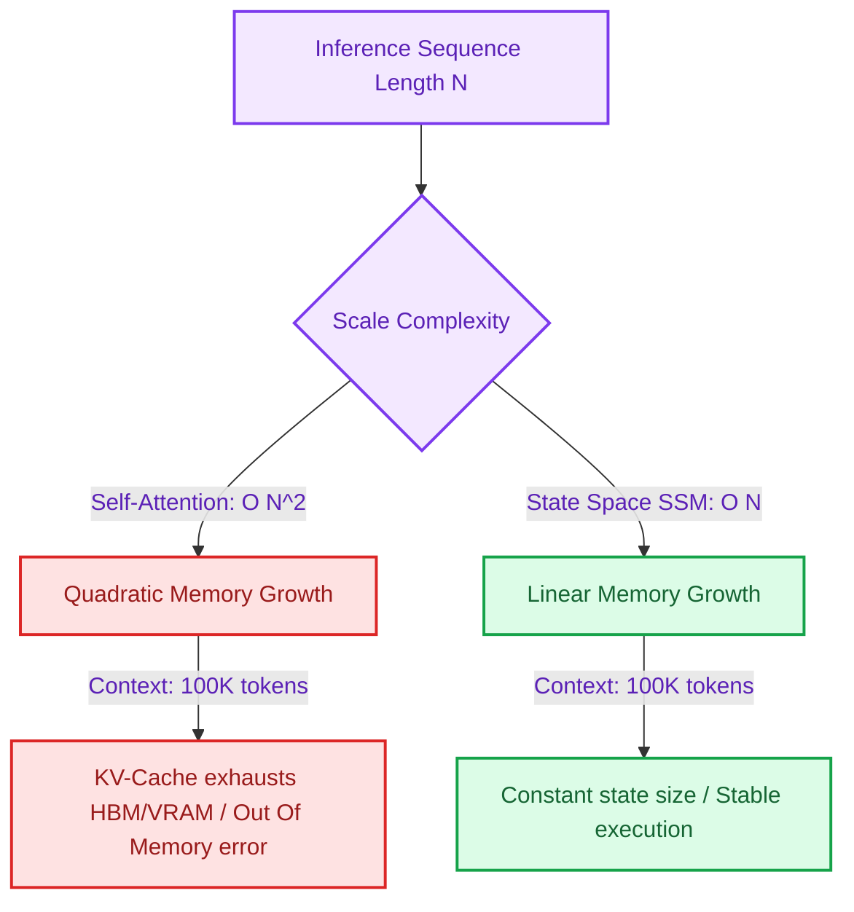

# State Space Models vs. Attention: The Quest for Infinite Context without VRAM Crashes

> ### 📖 Article Overview
> * **What this article is about:** A technical comparison between quadratic-time Self-Attention (used in standard Transformers) and linear-time State Space Models (SSMs like Mamba-2) for long-sequence tasks.
> * **Why it matters:** As prompt contexts scale into millions of tokens, the $O(N^2)$ VRAM memory footprint of standard attention becomes unsustainable, causing hardware crashes.
> * **What we synthesized:** State Space Models (SSMs) provide linear memory scaling and high token throughput by collapsing context history into a constant-size state. However, they struggle with high-fidelity factual recall ("needle-in-a-haystack") and exact copying tasks compared to attention.

---

The self-attention mechanism is both the secret to the Transformer's reasoning power and its biggest engineering limitation. 

Self-attention computes a relationship matrix comparing every token in a prompt to every other token. This creates a **quadratic complexity bottleneck**: doubling your input context length increases the computational load and VRAM memory footprint by **four times ($O(N^2)$)**.

To break past this barrier, researchers have developed **State Space Models (SSMs)**—most notably **Mamba-2**—to act as a linear-time sequence modeling alternative.

This article synthesizes the trade-offs of State Space Models vs. Transformers, evaluating **what is good (pros)**, **what is not (cons)**, and how SSM states are computed in PyTorch, drawing from research references tracked in my repository [agentic-apps-portfolio](https://github.com/akmalkhaniub/agentic-apps-portfolio).

---

## Memory Complexity: Attention vs. State Space Models

As context lengths scale into millions of tokens, the VRAM consumption of self-attention diverges quadratically, while SSMs maintain a constant state size, scaling memory usage linearly.



---

## Synthesis: What's Good & What's Not

### What's Good (The Pros)
*   **Linear $O(N)$ Complexity**: Mamba scales compute and memory footprint linearly with context length, enabling the processing of massive sequence payloads (entire code repositories or textbooks) on modest hardware.
*   **No KV-Cache Growth**: Standard transformers must store the Key-Value (KV) cache of all past tokens in memory during generation. SSMs collapse this history into a fixed-size state representation, eliminating VRAM expansion.
*   **High Inference Throughput**: By avoiding KV-cache read/write cycles, SSMs achieve significantly higher token generation throughput on GPUs.

### What's Not (The Cons)
*   **Factual Recall Degradation**: Because SSMs compress history into a fixed-size state, they suffer from "information decay." They perform poorly on "needle-in-a-haystack" tasks where a model must locate a single, precise fact inside a large document.
*   **Poor Copying and Retrieval**: SSMs struggle with precise text copying or lookup operations—tasks where the explicit routing matrix of Transformer attention shines.
*   **Training Infrastructure Latency**: The vast majority of deep learning hardware (TPUs/GPUs) and software libraries are optimized for Transformer matrix operations, making custom SSM training pipelines complex to run.

---

## Modeling an SSM Selective Scan in Python

The core of the Mamba architecture is the **Selective Scan**. Unlike traditional recurrent neural networks (RNNs) which apply static transition matrices, Mamba dynamically varies its transition matrix based on the current input token, choosing what to remember or forget.

Here is a PyTorch-style representation of a selective scan state transition, modeled on research structures in our [agentic-apps-portfolio](https://github.com/akmalkhaniub/agentic-apps-portfolio) repository:

```python
import torch
import torch.nn as nn

class SelectiveScanSSM(nn.Module):
    def __init__(self, d_model, d_state):
        super().__init__()
        self.d_model = d_model
        self.d_state = d_state
        
        # Projections to calculate dynamic parameters based on the current token input
        self.x_proj = nn.Linear(d_model, d_state * 2 + d_model, bias=False)
        self.dt_proj = nn.Linear(d_model, d_model, bias=True)
        
        # Standard State Space parameter matrices
        self.A = nn.Parameter(torch.randn(d_model, d_state))
        self.D = nn.Parameter(torch.randn(d_model))

    def forward(self, u):
        # u shape: [batch, seq_len, d_model]
        batch, seq_len, _ = u.shape
        
        # 1. Compute dynamic transitions (Selective logic)
        x_dbl = self.x_proj(u) # [batch, seq_len, d_state*2 + d_model]
        delta, B, C = torch.split(x_dbl, [self.d_model, self.d_state, self.d_state], dim=-1)
        
        # Apply softplus to ensure time-delta is positive
        delta = torch.nn.functional.softplus(self.dt_proj(delta))
        
        # 2. Execute the state recurrence loop
        h = torch.zeros(batch, self.d_model, self.d_state, device=u.device)
        ys = []
        
        for t in range(seq_len):
            u_t = u[:, t, :] # Current input token
            delta_t = delta[:, t, :]
            B_t = B[:, t, :]
            C_t = C[:, t, :]
            
            # Discretize continuous state matrices
            # h_t = (I + dA) * h_{t-1} + dB * u_t
            dA = torch.exp(delta_t.unsqueeze(-1) * self.A)
            dB = delta_t.unsqueeze(-1) * B_t.unsqueeze(1)
            
            # Update hidden state
            h = dA * h + dB * u_t.unsqueeze(-1)
            
            # Compute output: y = C * h + D * u
            y_t = torch.einsum("bms,bs->bm", h, C_t) + self.D * u_t
            ys.append(y_t)
            
        return torch.stack(ys, dim=1) # [batch, seq_len, d_model]
```

---

## SSM Ingestion Guardrails

* **Hybrid Architectures**: For tasks requiring both long context and exact recall, use hybrid models (like Jamba) that interleave Transformer attention layers (for retrieval) with Mamba SSM layers (for context scaling).
* **PII/Key Anchoring**: When passing document datasets to SSMs, place key facts or lookup terms at the very beginning of the prompt to maximize the model's initial state activation.

---

## Conclusion & Key Takeaways

Breaking the attention memory barrier is essential for the next generation of long-context applications:
1. **Linear Scaling is Real:** Mamba and other selective state space architectures offer a concrete pathway to processing millions of tokens without linear GPU cluster expansions.
2. **The Recall Trade-off:** Do not replace attention wholesale if your application requires 100% factual accuracy in document searches. SSMs suffer from information decay over long distances.
3. **The Rise of Hybrids:** Modern architectures (like Jamba) are moving toward hybrid designs—combining attention layers (for exact recall) with recurrent SSM layers (for context efficiency).

*Takeaway:* Choose your architecture based on your sequence memory bounds vs. your precise factual recall requirements.

---

## References & Further Reading

* **Mamba Architecture**: Gu & Dao, 2023. *Mamba: Linear-Time Sequence Modeling with Selective State Spaces*. [arXiv:2312.00752](https://arxiv.org/abs/2312.00752).
* **Mamba-2 Updates**: Dao & Gu, 2024. *Transformers are SSMs: Generalized State Space Models*. Details on hardware-aware matrix formulations.
* **SSM Video Breakdown**: Yannic Kilcher's tutorial on [Mamba: Linear-Time Sequence Modeling](https://www.youtube.com/watch?v=N6PiV3ESB-4).

*To review our experimental sequence models and agent evaluation benchmarks, explore the codebase inside [agentic-apps-portfolio](https://github.com/akmalkhaniub/agentic-apps-portfolio).*
