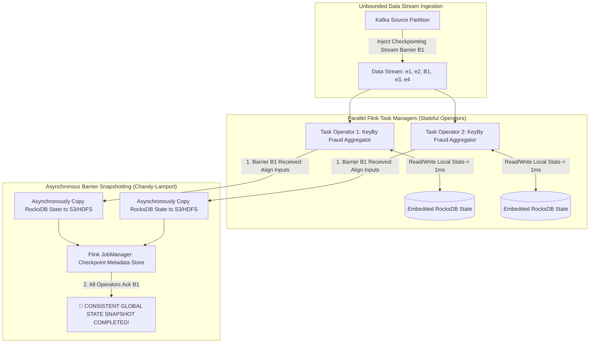

# Stream Processing Engine Architecture: Apache Flink Stateful Stream Execution & Chandy-Lamport Checkpointing

In real-time data engineering (financial fraud detection, ad-tech clickstream analytics, IoT telemetry), processing unbounded data streams requires continuous sub-second latency.

Early stream processing engines relied on **Micro-Batching** (such as Apache Spark Streaming), which grouped events into small discrete time intervals.

While micro-batching simplifies fault tolerance, it inherently introduces artificial latency ($100\text{ms}$ to $1\text{s}$) because events must wait for batch collection.

To achieve sub-10 millisecond processing latencies, modern stream engines—led by **Apache Flink**—utilize continuous, pipelined **Stateful Stream Processing**.

By integrating embedded local state backends (**RocksDB**) with **Asynchronous Barrier Snapshotting (ABS)** derived from the classic **Chandy-Lamport algorithm**, Apache Flink delivers true continuous streaming with strict **Exactly-Once Guarantees**.

This article details Flink's DAG execution engine, embedded state backends, Chandy-Lamport stream barriers, and two-phase commit sinks.

---

## Stateful Stream Processing & Chandy-Lamport Snapshot Architecture

How Flink injects Stream Barriers into continuous data streams to capture consistent global snapshots:



### Core Stream Processing Mechanics
1. **Pipelined Continuous Execution DAG**: Unlike batch processors that materialize intermediate results to disk between stages, Flink operators (Source, FlatMap, KeyBy, Window, Sink) run continuously in parallel task slots, passing records directly across network sockets via netty ring buffers.
2. **Embedded Local State (RocksDB Backend)**:
   * Computing running aggregates (e.g. 1-hour window totals per user) requires persistent state.
   * Querying an external database (such as Redis or PostgreSQL) for every single incoming event introduces high network latency ($10\text{ms}$ per event).
   * Flink embeds **RocksDB** (or in-memory heaps) directly inside each TaskManager process. State operations execute against local NVMe SSDs in $< 1\text{ms}$, decoupling state throughput from external database capacity.
3. **Chandy-Lamport Asynchronous Barrier Snapshotting (ABS)**:
   * How does a stream engine capture a consistent backup snapshot of millions of distributed operator states without pausing continuous execution?
   * Flink periodically injects **Stream Barriers** into input data streams. Barriers flow alongside data records without blocking processing.
   * When an operator receives Barrier $B_n$ on all input channels, it aligns the channels, captures an asynchronous snapshot of its local state backend, writes the state delta to durable cloud storage (S3/GCS), and forwards $B_n$ downstream.
4. **Exactly-Once Processing (EOS)**: Combines ABS state checkpointing with **Two-Phase Commit Sinks** (e.g., `TwoPhaseCommitSinkFunction` for Kafka). On failure, Flink rolls back state to the last successful checkpoint $B_n$ and re-populates Kafka offsets, guaranteeing zero data loss and zero duplicates.

---

## Python Implementation: Stateful Stream Operator & Chandy-Lamport Engine

Here is a production-grade Python implementation of a Stateful Stream Operator featuring RocksDB-style local state management and Chandy-Lamport Stream Barrier Snapshotting:

```python
import time
from typing import Dict, List, Union, Optional
from pydantic import BaseModel

class StreamRecord(BaseModel):
    key: str
    value: float
    timestamp: float

class StreamBarrier(BaseModel):
    barrier_id: int

class StatefulStreamOperator:
    """
    Simulates a Flink Parallel Stateful Operator with Chandy-Lamport ABS.
    """
    def __init__(self, operator_name: str):
        self.operator_name = operator_name
        self.local_rocksdb_state: Dict[str, float] = {}  # Local Key-Value State
        self.completed_checkpoints: Dict[int, Dict[str, float]] = {}

    def process_element(self, element: Union[StreamRecord, StreamBarrier]):
        """Processes incoming data records or stream barriers."""
        if isinstance(element, StreamRecord):
            self._handle_record(element)
        elif isinstance(element, StreamBarrier):
            self._handle_barrier(element)

    def _handle_record(self, record: StreamRecord):
        # Update local embedded state (e.g. running total sum)
        current_val = self.local_rocksdb_state.get(record.key, 0.0)
        new_val = current_val + record.value
        self.local_rocksdb_state[record.key] = new_val
        print(f" ⚡ [{self.operator_name}] Processed Event '{record.key}': +{record.value:.1f} -> Updated Local State: {new_val:.1f}")

    def _handle_barrier(self, barrier: StreamBarrier):
        """Chandy-Lamport ABS: Asynchronously Snapshot Local State."""
        print(f"\n 🛑 [{self.operator_name}] Received Stream Barrier #{barrier.barrier_id}!")
        
        # Capture deep copy of local state (Asynchronous Copy to S3 simulation)
        snapshot_state = dict(self.local_rocksdb_state)
        self.completed_checkpoints[barrier.barrier_id] = snapshot_state
        
        print(f" 📸 [{self.operator_name}] Checkpoint #{barrier.barrier_id} Snapshot Saved to Durable Storage! State: {snapshot_state}")
        print(f" ⏩ [{self.operator_name}] Forwarding Barrier #{barrier.barrier_id} Downstream...\n")

class StreamJobManagerController:
    """
    Orchestrates Stream Barrier Injection & Checkpoint Verification.
    """
    def __init__(self, operators: List[StatefulStreamOperator]):
        self.operators = operators
        self.barrier_counter = 0

    def trigger_checkpoint(self) -> int:
        self.barrier_counter += 1
        barrier_id = self.barrier_counter
        print(f"\n🎬 [Flink JobManager] Triggering Checkpoint #{barrier_id} -> Injecting Stream Barriers into DAG...")
        
        barrier = StreamBarrier(barrier_id=barrier_id)
        for op in self.operators:
            op.process_element(barrier)

        return barrier_id

# Demonstration Execution
if __name__ == "__main__":
    op1 = StatefulStreamOperator("Fraud-Aggregator-Task-1")
    op2 = StatefulStreamOperator("Fraud-Aggregator-Task-2")

    job_manager = StreamJobManagerController([op1, op2])

    print("🚀 Demonstrating Apache Flink Stateful Streaming & Chandy-Lamport ABS...")
    print("=" * 75)

    # 1. Ingest Continuous Data Stream
    op1.process_element(StreamRecord(key="acct_101", value=150.0, timestamp=time.time()))
    op2.process_element(StreamRecord(key="acct_202", value=450.0, timestamp=time.time()))
    op1.process_element(StreamRecord(key="acct_101", value=200.0, timestamp=time.time()))

    # 2. JobManager Triggers Periodic Checkpoint #1
    chkp_1 = job_manager.trigger_checkpoint()

    # 3. Stream Processing Continues Uninterrupted
    op1.process_element(StreamRecord(key="acct_101", value=50.0, timestamp=time.time()))
    op2.process_element(StreamRecord(key="acct_202", value=100.0, timestamp=time.time()))

    # Verify Snapshot Consistency
    print("📊 Verifying Checkpoint Snapshot Metadata:")
    print(f"   • Task 1 Checkpoint #{chkp_1} Snapshot: {op1.completed_checkpoints[chkp_1]}")
    print(f"   • Task 1 Current Live State (Post-Checkpoint): {op1.local_rocksdb_state}")
```

---

## Stream Processing Gotchas & Best Practices

When operating stateful stream processing clusters:

> [!IMPORTANT]
> **Use Incremental Checkpointing in RocksDB**: Full state snapshots for terabyte-scale state backends saturate network bandwidth. Enable **Incremental Checkpoints** (`state.backend.incremental: true`), which upload only newly mutated SSTable files created since the previous checkpoint.

> [!CAUTION]
> **Watch for Checkpoint Alignment Timeouts**: When stream partitions experience skew, fast channels wait for slow channels to receive the Stream Barrier (**Barrier Alignment**). If alignment takes too long, unaligned checkpoints (`execution.checkpointing.unaligned: true`) can be enabled to snapshot barrier in-flight buffers immediately.

---

## Real-World Enterprise Impact
Streaming platforms utilizing Flink and Chandy-Lamport ABS (such as **Uber**, **Netflix**, **Alibaba**, and **Stripe**) report:
* **Sub-10ms Processing Latency**: Continuous pipelined operators process millions of events per second with instant state updates.
* **100% Reliable Exactly-Once Guarantees**: Automatic recovery from node failures in seconds by restoring local RocksDB states from recent ABS S3 snapshots.
