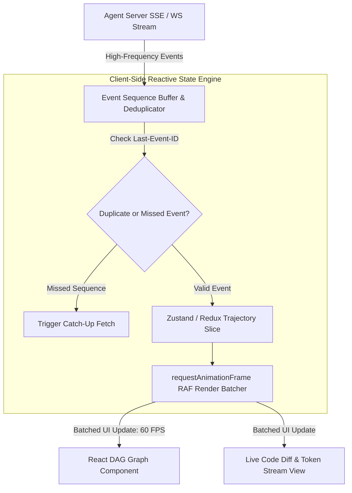

# Subagent Trajectory Streaming & Reactive UI State Management

When building modern web dashboards for multi-agent systems, rendering real-time execution trajectories presents a unique frontend engineering challenge. 

A multi-agent swarm executing complex tasks emits a continuous stream of events: raw LLM token deltas, tool invocation payloads, AST code diffs, and DAG node status updates. If a web application attempts to trigger a React component re-render on every incoming network chunk (e.g. at 60 tokens per second), the browser main thread quickly locks up, leading to **UI lag**, **dropped frames**, and **memory leaks**.

To build fluid, responsive frontend interfaces for agentic platforms, engineering teams implement **Reactive Trajectory State Stores** with render batching and **Sequence-Based Stream Resumption**.

This article details how to manage frontend state for streaming subagent swarms.

---

## 📖 Reactive Trajectory Stream Architecture

The frontend architecture decouples high-frequency WebSocket/SSE events from React render cycles using a buffered state store:



### Key Frontend Architecture Principles
1. **RequestAnimationFrame (RAF) Render Batching**: Instead of calling `setEvents(prev => [...prev, newEvent])` on every SSE message, incoming events accumulate in a mutable ring buffer. The UI drains and flushes the buffer to state once per animation frame (every 16ms), locking renders to a smooth 60 FPS.
2. **Sequence Numbers (`Last-Event-ID`)**: Every trajectory event carries an incremental integer ID (`seq_101`, `seq_102`). If the WebSocket or SSE connection drops, the client automatically passes the highest received sequence ID upon reconnecting, allowing the server to replay missed events cleanly.
3. **Immutable DAG State Slice**: Maintaining subagent task nodes in a normalized hash map (`nodesById`) ensures $O(1)$ lookups and targeted component re-renders when a specific worker changes state from `RUNNING` to `COMPLETED`.

---

## 🛠️ TypeScript / React Implementation: `useAgentTrajectoryStream` Hook

Here is a production TypeScript/React implementation of a custom hook that manages SSE trajectory streaming with sequence-based reconnection and render batching:

```typescript
import { useState, useEffect, useRef } from 'react';

export interface TrajectoryEvent {
  sequence_id: number;
  node_id: string;
  event_type: 'NODE_STARTED' | 'TOKEN_DELTA' | 'TOOL_EXECUTED' | 'NODE_COMPLETED';
  payload: string;
  timestamp: number;
}

export interface DAGNodeState {
  id: string;
  status: 'PENDING' | 'RUNNING' | 'COMPLETED' | 'FAILED';
  tokens: string;
  logs: string[];
}

export function useAgentTrajectoryStream(taskId: string, streamUrl: string) {
  const [nodes, setNodes] = useState<Record<string, DAGNodeState>>({});
  const [isConnected, setIsConnected] = useState<boolean>(false);
  
  // Refs for high-frequency mutable buffering
  const lastSequenceId = useRef<number>(0);
  const eventBuffer = useRef<TrajectoryEvent[]>([]);
  const animationFrameId = useRef<number | null>(null);

  useEffect(() => {
    // 1. Establish SSE Connection with Sequence Resumption
    const connectSSE = () => {
      const url = new URL(streamUrl);
      if (lastSequenceId.current > 0) {
        url.searchParams.set('last_event_id', lastSequenceId.current.toString());
      }

      const eventSource = new EventSource(url.toString());

      eventSource.onopen = () => {
        setIsConnected(true);
        console.log(`⚡ [SSE Connected] Streaming trajectory for task ${taskId}`);
      };

      eventSource.onmessage = (e: MessageEvent) => {
        try {
          const event: TrajectoryEvent = JSON.parse(e.data);
          
          // Track highest sequence ID for reconnection
          if (event.sequence_id > lastSequenceId.current) {
            lastSequenceId.current = event.sequence_id;
          }

          // Push to mutable buffer (no React re-render triggered yet)
          eventBuffer.current.push(event);
        } catch (err) {
          console.error('Failed parsing trajectory event:', err);
        }
      };

      eventSource.onerror = () => {
        setIsConnected(false);
        eventSource.close();
        console.warn('⚠️ [SSE Disconnected] Attempting reconnect in 3s...');
        setTimeout(connectSSE, 3000);
      };

      return eventSource;
    };

    const es = connectSSE();

    // 2. High-Performance RAF Render Loop (60 FPS Flusher)
    const flushBufferToState = () => {
      if (eventBuffer.current.length > 0) {
        const eventsToProcess = [...eventBuffer.current];
        eventBuffer.current = []; // Clear buffer

        setNodes((prevNodes) => {
          const updatedNodes = { ...prevNodes };

          for (const ev of eventsToProcess) {
            const existingNode = updatedNodes[ev.node_id] || {
              id: ev.node_id,
              status: 'PENDING',
              tokens: '',
              logs: []
            };

            if (ev.event_type === 'NODE_STARTED') {
              existingNode.status = 'RUNNING';
            } else if (ev.event_type === 'TOKEN_DELTA') {
              existingNode.tokens += ev.payload;
            } else if (ev.event_type === 'TOOL_EXECUTED') {
              existingNode.logs.push(`[TOOL] ${ev.payload}`);
            } else if (ev.event_type === 'NODE_COMPLETED') {
              existingNode.status = 'COMPLETED';
            }

            updatedNodes[ev.node_id] = existingNode;
          }

          return updatedNodes;
        });
      }

      animationFrameId.current = requestAnimationFrame(flushBufferToState);
    };

    animationFrameId.current = requestAnimationFrame(flushBufferToState);

    // Cleanup on component unmount
    return () => {
      es.close();
      if (animationFrameId.current) {
        cancelAnimationFrame(animationFrameId.current);
      }
    };
  }, [taskId, streamUrl]);

  return { nodes, isConnected };
}
```

---

## ⚠️ Important Frontend Performance Guardrails

When rendering real-time subagent streams in web applications:

> [!IMPORTANT]
> **Use Virtualized Lists for Token Streams**: Render long LLM outputs and trajectory log lists using virtualized windowing components (e.g. `react-window` or `tanstack-virtual`). Rendering 10,000 DOM nodes for a long agent trajectory will cause severe browser layout thrashing.

> [!CAUTION]
> **Avoid Un-Buffered React State Hooks**: Never call React state setters directly inside WebSocket `onmessage` handlers. Always buffer incoming messages and flush them using `requestAnimationFrame` to lock UI updates to the browser's native render cycle.

---

## 📈 Real-World Enterprise Impact
Teams adopting Reactive Trajectory State Management report:
* **60 FPS Smooth UI Rendering**: RAF batching eliminates main-thread lag during high-frequency token streams.
* **Zero Lost Events on Network Drops**: Sequence ID tracking guarantees 100% trajectory stream recovery after transient Wi-Fi drops.
