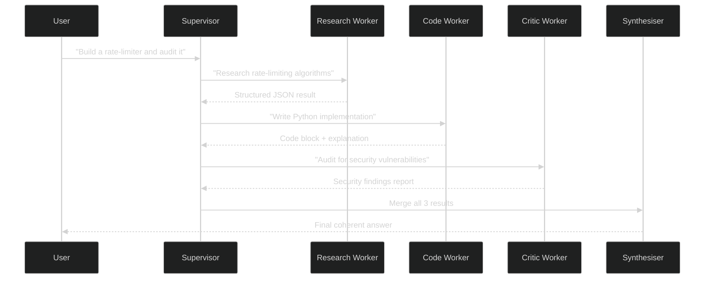

# Supervisor-Worker Agent Patterns: Orchestrating Multi-Agent Systems with LangGraph & CrewAI

> [!NOTE]
> **📖 Article Overview**
> Single-agent loops break under real enterprise complexity. When tasks require parallel sub-tasks, domain expertise separation, or adversarial review cycles, you need a structured multi-agent architecture. This article dissects the **Supervisor-Worker pattern** — the most production-proven orchestration topology in AI engineering — with concrete implementations in **LangGraph** and **CrewAI**. We evaluate when this pattern wins, where it fails, and provide a complete runnable Python blueprint.

---

## Why Single-Agent Loops Hit a Ceiling

A naive agent loop looks like this: one LLM receives a task, calls tools, observes results, and repeats until done. For isolated, well-scoped problems this is sufficient. But in enterprise production environments, single-agent loops suffer from three critical failure modes:

1.  **Context Window Saturation**: A 128K context window sounds large, but a 10-step research agent accumulates tool outputs, observations, and reasoning traces rapidly — often exceeding limits mid-task.
2.  **Capability Mismatch**: A generalist agent asked to write code, validate its security posture, and summarise findings is performing three cognitively distinct roles with a single prompt. Performance degrades across all three.
3.  **No Adversarial Review**: A single agent cannot critically challenge its own conclusions. Enterprise-grade AI systems require a **Validator** or **Critic** that is structurally separate from the Generator.

The Supervisor-Worker pattern solves all three by decomposing agent responsibilities into a hierarchy.

---

## The Supervisor-Worker Topology

In this pattern, a **Supervisor** (also called an Orchestrator) receives the high-level goal, decomposes it into sub-tasks, and dispatches each to a specialised **Worker** agent. Workers operate independently — often in parallel — and return structured results to the Supervisor, which synthesises the final output.

```mermaid
%%{init: {'theme': 'dark', 'themeVariables': { 'primaryColor': '#a855f7', 'primaryTextColor': '#f3f4f6', 'primaryBorderColor': '#c084fc', 'lineColor': '#a855f7', 'secondaryColor': '#111827', 'tertiaryColor': '#0f172a'}}}%%
graph TD
    U[User Request] --> S[🧠 Supervisor Agent<br/>Task Decomposer & Synthesiser]
    
    S -->|Sub-Task A: Research| W1[🔍 Research Worker<br/>Web Search + RAG Retrieval]
    S -->|Sub-Task B: Code| W2[💻 Code Worker<br/>Python Sandbox Execution]
    S -->|Sub-Task C: Review| W3[🛡️ Critic Worker<br/>Security & Accuracy Validator]
    
    W1 -->|Structured Result A| M[📬 Message Bus / State Graph]
    W2 -->|Structured Result B| M
    W3 -->|Structured Result C| M
    
    M --> S
    S -->|Final Synthesised Answer| U

    style U fill:#1e293b,stroke:#a855f7,stroke-width:2px
    style S fill:#4c1d95,stroke:#c084fc,stroke-width:2px
    style W1 fill:#0f172a,stroke:#38bdf8,stroke-width:2px
    style W2 fill:#0f172a,stroke:#10b981,stroke-width:2px
    style W3 fill:#0f172a,stroke:#f59e0b,stroke-width:2px
    style M fill:#1e293b,stroke:#6b7280,stroke-width:2px
```



### Role Contracts
*   **Supervisor**: Receives user intent, creates a task plan, routes sub-tasks, waits for all worker responses, and produces the final user-facing output. Uses a powerful frontier model (Claude 3.5 Sonnet, GPT-4o).
*   **Workers**: Receive a narrow, well-defined sub-task. Execute one domain function (search, code, summarise). Return a structured JSON response — not free-form text. Can use smaller, cheaper models (GPT-4o-mini, Gemini Flash).
*   **Message Bus**: Tracks all inter-agent messages, tool calls, and state transitions. In LangGraph this is the `StateGraph`; in CrewAI this is the `Crew` memory object.

---

## What's Good & What's Not

```
+----------------------------------------------------------------------------------------------------------------------+
|                                       SUPERVISOR-WORKER ARCHITECTURE TRADE-OFFS                                      |
+----------------------------------------------------+---------------------------------------------------------------+
| What's Good (Pros)                                 | What's Not (Cons)                                             |
+----------------------------------------------------+---------------------------------------------------------------+
| * Context Isolation: Each worker has a fresh,      | * Orchestration Overhead: The Supervisor adds 1-2 extra LLM  |
|   small context window — no cross-task pollution.  |   round-trips to plan and synthesise tasks.                   |
| * Parallel Execution: Workers run concurrently,    | * Dependency on Supervisor Quality: If the Supervisor's task  |
|   dramatically reducing total wall-clock latency.  |   decomposition is poor, all workers inherit the flaw.        |
| * Specialisation: Workers can be fine-tuned or     | * State Synchronisation Cost: Merging structured JSON results |
|   prompted for their exact domain competency.      |   from parallel workers requires careful schema enforcement.  |
| * Failure Containment: One worker failure does not | * Debugging Complexity: Tracing a failure across 3+ agents is |
|   cascade to the Supervisor or other workers.      |   significantly harder than debugging a single loop.          |
+----------------------------------------------------+---------------------------------------------------------------+
```

---

## LangGraph Implementation: Stateful Supervisor-Worker Graph

LangGraph models multi-agent systems as directed state graphs. Each node is an agent; edges define control flow. Below is a complete, runnable Python implementation.

```python
import operator
from typing import Annotated, TypedDict, List, Literal

from langchain_anthropic import ChatAnthropic
from langchain_core.messages import HumanMessage, AIMessage, BaseMessage
from langchain_core.prompts import ChatPromptTemplate
from langgraph.graph import StateGraph, START, END
from langgraph.checkpoint.memory import MemorySaver

# ─────────────────────────────────────────────
# 1. Define Shared State Schema
# ─────────────────────────────────────────────
class AgentState(TypedDict):
    user_request: str
    task_plan: List[str]                      # Decomposed sub-tasks
    worker_results: Annotated[List[str], operator.add]  # Accumulated results
    final_answer: str
    next: Literal["research_worker", "code_worker", "critic_worker", "synthesise", "__end__"]

# ─────────────────────────────────────────────
# 2. Model Configuration
# ─────────────────────────────────────────────
supervisor_llm = ChatAnthropic(model="claude-3-5-sonnet-20241022", temperature=0)
worker_llm = ChatAnthropic(model="claude-3-haiku-20240307", temperature=0)

# ─────────────────────────────────────────────
# 3. Supervisor Node: Plans and Routes
# ─────────────────────────────────────────────
SUPERVISOR_PROMPT = ChatPromptTemplate.from_messages([
    ("system", """You are a Supervisor that decomposes complex tasks into sub-tasks.
Given a user request, decide which worker to call next.
Workers available: research_worker, code_worker, critic_worker.
When all tasks are complete, respond with 'synthesise'.

Respond ONLY in JSON: {{"next": "<worker_name_or_synthesise>", "instruction": "<specific_task>"}}"""),
    ("human", "User Request: {user_request}\n\nResults so far: {worker_results}\n\nWhich worker should act next?")
])

def supervisor_node(state: AgentState) -> AgentState:
    """Routes task to the appropriate worker or synthesis step."""
    chain = SUPERVISOR_PROMPT | supervisor_llm
    response = chain.invoke({
        "user_request": state["user_request"],
        "worker_results": "\n".join(state.get("worker_results", []))
    })
    import json
    parsed = json.loads(response.content)
    return {"next": parsed["next"]}

# ─────────────────────────────────────────────
# 4. Worker Nodes: Domain-Specialised Executors
# ─────────────────────────────────────────────
def research_worker_node(state: AgentState) -> AgentState:
    """Simulates a web search + RAG retrieval worker."""
    prompt = f"You are a research specialist. Find key facts for: {state['user_request']}"
    result = worker_llm.invoke([HumanMessage(content=prompt)])
    return {"worker_results": [f"[Research Result]: {result.content}"]}

def code_worker_node(state: AgentState) -> AgentState:
    """Simulates a code generation and execution worker."""
    prompt = f"You are a Python engineer. Write clean, documented code for: {state['user_request']}"
    result = worker_llm.invoke([HumanMessage(content=prompt)])
    return {"worker_results": [f"[Code Output]: {result.content}"]}

def critic_worker_node(state: AgentState) -> AgentState:
    """Validates outputs for accuracy, security, and completeness."""
    context = "\n".join(state.get("worker_results", []))
    prompt = f"You are a security and quality critic. Audit the following outputs:\n\n{context}"
    result = worker_llm.invoke([HumanMessage(content=prompt)])
    return {"worker_results": [f"[Critic Review]: {result.content}"]}

def synthesise_node(state: AgentState) -> AgentState:
    """Supervisor synthesises all worker outputs into a final answer."""
    all_results = "\n\n".join(state.get("worker_results", []))
    prompt = f"Synthesise the following expert results into a final, coherent answer:\n\n{all_results}"
    final = supervisor_llm.invoke([HumanMessage(content=prompt)])
    return {"final_answer": final.content, "next": "__end__"}

# ─────────────────────────────────────────────
# 5. Build and Compile the State Graph
# ─────────────────────────────────────────────
def route_supervisor(state: AgentState) -> str:
    """Edge function: determines next node from supervisor decision."""
    return state.get("next", "__end__")

graph_builder = StateGraph(AgentState)

# Register all nodes
graph_builder.add_node("supervisor", supervisor_node)
graph_builder.add_node("research_worker", research_worker_node)
graph_builder.add_node("code_worker", code_worker_node)
graph_builder.add_node("critic_worker", critic_worker_node)
graph_builder.add_node("synthesise", synthesise_node)

# Entry point
graph_builder.add_edge(START, "supervisor")

# Supervisor routes to workers or synthesis
graph_builder.add_conditional_edges("supervisor", route_supervisor, {
    "research_worker": "research_worker",
    "code_worker": "code_worker",
    "critic_worker": "critic_worker",
    "synthesise": "synthesise",
})

# All workers return to supervisor for next routing decision
graph_builder.add_edge("research_worker", "supervisor")
graph_builder.add_edge("code_worker", "supervisor")
graph_builder.add_edge("critic_worker", "supervisor")
graph_builder.add_edge("synthesise", END)

# Compile with memory checkpointing for stateful multi-turn sessions
memory = MemorySaver()
agent_graph = graph_builder.compile(checkpointer=memory)

# ─────────────────────────────────────────────
# 6. Execute the Graph
# ─────────────────────────────────────────────
if __name__ == "__main__":
    config = {"configurable": {"thread_id": "session-001"}}
    
    result = agent_graph.invoke(
        {"user_request": "Build a Python rate-limiter for OpenAI API calls and audit it for security flaws.", "worker_results": []},
        config=config
    )
    
    print("\n===== FINAL ANSWER =====")
    print(result["final_answer"])
```

---

## Execution Flow & State Transitions



---

## CrewAI Alternative: Declarative Agent Teams

For teams that prefer a higher-level abstraction, **CrewAI** provides a declarative API for defining agent roles, goals, and backstories, automatically managing task routing via its internal planning layer.

```python
from crewai import Agent, Task, Crew, Process
from langchain_anthropic import ChatAnthropic

llm = ChatAnthropic(model="claude-3-5-sonnet-20241022")

# Define specialist agents
researcher = Agent(
    role="Senior Research Analyst",
    goal="Find comprehensive, accurate information on any technical topic",
    backstory="Expert at synthesising information from documentation, papers, and codebases.",
    llm=llm, verbose=True
)

developer = Agent(
    role="Principal Software Engineer",
    goal="Write production-quality, well-documented Python implementations",
    backstory="10+ years building scalable backend systems and APIs.",
    llm=llm, verbose=True
)

security_auditor = Agent(
    role="Application Security Engineer",
    goal="Identify vulnerabilities, race conditions, and logic flaws in code",
    backstory="Specialises in API security, injection attacks, and cryptographic weaknesses.",
    llm=llm, verbose=True
)

# Define tasks with explicit agent assignments
research_task = Task(
    description="Research token bucket and sliding window rate-limiting algorithms.",
    expected_output="A structured summary with algorithm trade-offs and Python library options.",
    agent=researcher
)

code_task = Task(
    description="Implement a production-ready AsyncIO rate-limiter using the sliding window algorithm.",
    expected_output="A complete, runnable Python class with docstrings and usage examples.",
    agent=developer,
    context=[research_task]  # Feeds research output as context
)

audit_task = Task(
    description="Audit the rate-limiter implementation for security vulnerabilities and edge cases.",
    expected_output="A security report listing any vulnerabilities with recommended mitigations.",
    agent=security_auditor,
    context=[code_task]
)

# Assemble and run the crew with hierarchical process
crew = Crew(
    agents=[researcher, developer, security_auditor],
    tasks=[research_task, code_task, audit_task],
    process=Process.sequential,  # Use Process.hierarchical for auto-supervisor
    verbose=True
)

result = crew.kickoff()
print(result.raw)
```

---

## 🏁 Conclusion & Key Takeaways

The Supervisor-Worker pattern transforms fragile single-agent loops into resilient, specialised teams that mirror how elite human engineering squads operate. By separating concerns into Supervisor (planning) and Workers (execution), you gain context isolation, parallel throughput, and structural quality review.

*   **Use LangGraph** when you need fine-grained control over state transitions, custom edge routing logic, and enterprise-grade checkpointing.
*   **Use CrewAI** when you want a declarative, role-based abstraction and can accept its opinionated task routing defaults.
*   **Always enforce typed contracts**: Worker outputs must be structured JSON — not free text — to prevent the Supervisor from misinterpreting results.

In our next article, we will explore **Tool-Calling Contracts & Error Recovery**: how to design robust tool schemas that prevent agents from hallucinating parameters, and how to implement graceful degradation when tools fail.

---

### Research References & Resources
*   **LangGraph Documentation**: [Building Multi-Agent Architectures](https://langchain-ai.github.io/langgraph/)
*   **CrewAI Documentation**: [Multi-Agent Role-Playing Frameworks](https://docs.crewai.com/)
*   **Research Paper**: *AutoGen: Enabling Next-Gen LLM Applications via Multi-Agent Conversation* (Microsoft Research, 2023)
