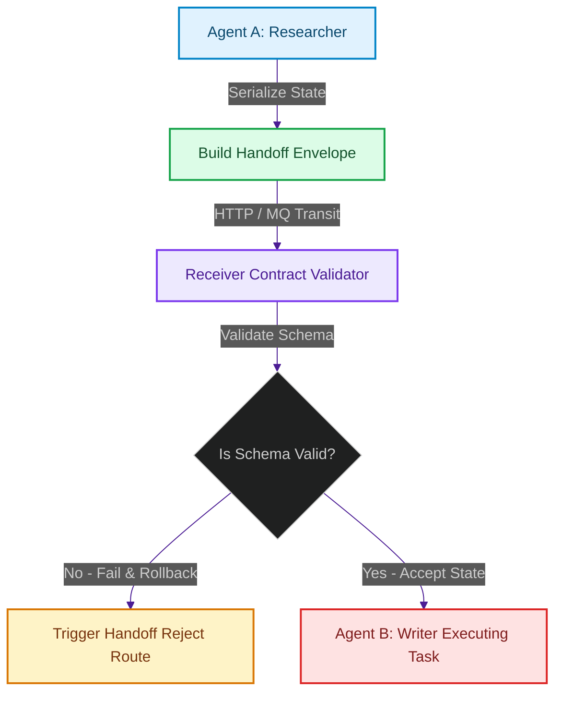

# Agent-to-Agent Communication: Designing Protocol Contracts & Handoff Schemas

> [!NOTE]
> **📖 Article Overview**
> As agentic ecosystems grow in size and complexity, coordination moves from simple function calls inside a single runtime to distributed handoffs between independent microservice nodes. To prevent chaotic executions and data corruption, developers must design strict **Agent-to-Agent Communication Protocols**. In this article, we analyze the structure of transaction-safe handoff envelopes, design a validation gate using Pydantic, and implement a protocol transition router in Python.

---

## Standardizing the Inter-Agent Envelope

When Agent A passes a task to Agent B, it is not merely sending text; it is migrating an active **execution state** [1]. Without a standardized communication envelope, downstream agents cannot determine:
1. **Lineage**: Which agent initiated the task and why?
2. **Context Window Limits**: How much raw context history is being passed along?
3. **Authorization Scope**: What user identity and permissions are associated with this execution branch?
4. **Error Boundaries**: What happens if the receiver cannot fulfill the schema or context constraints?

To address these concerns, we structure agent-to-agent communication payloads into a unified schema contract:



---

## Anatomy of the Handoff Schema

A robust inter-agent message envelope consists of four main sections:
* **Protocol Metadata**: Unique `message_id`, `conversation_id`, and timestamps.
* **Trace and Lineage**: Array of previous worker nodes, execution durations, and step summaries.
* **Security & Auth Claims**: JWT (JSON Web Token) or scoped auth tokens delegated by the root user to validate downstream tool-calling permissions.
* **State Payload**: The actual structured input needed by the receiver (e.g. JSON schema parameters).

---

## Code Demo: Validating Inter-Agent Handoffs

The following Python script defines a strict communication contract using Pydantic and implements a router that validates envelopes, logs task lineage, and handles schema mismatches gracefully.

```python
from typing import List, Dict, Any, Optional
from uuid import uuid4
from pydantic import BaseModel, Field, ValidationError

# 1. Define the Tracing and Lineage Schema
class ExecutionStep(BaseModel):
    agent_name: str
    completed_at: float
    summary: str

# 2. Define the Security Context Schema
class SecurityContext(BaseModel):
    user_jwt: str
    allowed_scopes: List[str]

# 3. Define the Global Handoff Envelope
class AgentHandoffEnvelope(BaseModel):
    message_id: str = Field(default_factory=lambda: str(uuid4()))
    conversation_id: str
    sender: str
    receiver: str
    security: SecurityContext
    lineage: List[ExecutionStep] = []
    payload: Dict[str, Any]

# Mock Receiver Agent with Validation Gates
class CodeGeneratorAgent:
    def __init__(self):
        self.name = "CodeGeneratorAgent"

    def receive_handoff(self, raw_message: Dict[str, Any]) -> bool:
        print(f"\n[{self.name}] Received incoming handoff payload. Running validation checks...")
        
        try:
            # Enforce validation contract
            envelope = AgentHandoffEnvelope(**raw_message)
            
            # Check receiver alignment
            if envelope.receiver != self.name:
                print(f"❌ Contract Mismatch: Expected receiver {self.name}, got {envelope.receiver}.")
                return False

            # Check security scopes
            if "write:code" not in envelope.security.allowed_scopes:
                print(f"❌ Security Access Denied: Missing 'write:code' scope claim.")
                return False

            # Success: Process the task
            self._execute_task(envelope)
            return True

        except ValidationError as e:
            print(f"❌ Contract Violation: Failed to parse handoff schema. Errors:")
            print(e.json(indent=2))
            return False

    def _execute_task(self, envelope: AgentHandoffEnvelope):
        print(f"🎉 Contract Verified! Processing request ID: {envelope.message_id}")
        print(f"Linage Path: {' -> '.join([step.agent_name for step in envelope.lineage])} -> {self.name}")
        print(f"Processing payload data: {envelope.payload}")

if __name__ == "__main__":
    receiver = CodeGeneratorAgent()

    # Valid message payload matching the schema
    valid_payload = {
        "conversation_id": "conv_998877",
        "sender": "ResearcherAgent",
        "receiver": "CodeGeneratorAgent",
        "security": {
            "user_jwt": "eyJhbGciOiJIUzI1NiIsIn...",
            "allowed_scopes": ["read:data", "write:code"]
        },
        "lineage": [
            {"agent_name": "ResearcherAgent", "completed_at": 1729012010.0, "summary": "Found database schema guidelines."}
        ],
        "payload": {
            "language": "python",
            "spec": "Create a database connection pool helper."
        }
    }

    # Invalid message payload (missing security claims, invalid format)
    invalid_payload = {
        "conversation_id": "conv_998877",
        "sender": "ResearcherAgent",
        "receiver": "CodeGeneratorAgent",
        # Missing 'security' key entirely
        "payload": {}
    }

    # 1. Process Valid Handoff
    receiver.receive_handoff(valid_payload)

    # 2. Process Invalid Handoff
    receiver.receive_handoff(invalid_payload)
```

---

## Key Takeaways

* **Schema Validation is the Firewall**: Rejecting malformed handoff envelopes at the network interface prevents agents from attempting to process bad context, cutting down on token waste and execution errors.
* **Propagate Lineage**: Always trace which agents executed which parts of the task. This ensures trace graphs are inspectable for auditing and performance bottlenecks.
* **Enforce Scoped Security**: Pass authentication and authorization context inside the envelope to prevent worker nodes from invoking tools they do not have permissions for. [2]

## References & Further Reading

1. **Mohan, C., et al. (1992)**. *ARIES: A Transaction Recovery Method Supporting Fine-Granularity Locking and Partial Rollbacks*. ACM TODS. [https://doi.org/10.1145/128765.128770](https://doi.org/10.1145/128765.128770)
2. **O'Neil, P., Cheng, E., Gawlick, D., & O'Neil, E. (1996)**. *The Log-Structured Merge-Tree (LSM-Tree)*. Acta Informatica. [https://www.cs.umb.edu/~poneil/lsmtree.pdf](https://www.cs.umb.edu/~poneil/lsmtree.pdf)
3. **PostgreSQL Global Development Group (2024)**. *PostgreSQL Documentation*. postgresql.org. [https://www.postgresql.org/docs/current/](https://www.postgresql.org/docs/current/)
4. **Malkov, Y. A., & Yashunin, D. A. (2018)**. *Efficient and Robust Approximate Nearest Neighbor Search Using Hierarchical Navigable Small World Graphs*. IEEE TPAMI. [https://arxiv.org/abs/1603.09320](https://arxiv.org/abs/1603.09320)
5. **Jégou, H., Douze, M., & Schmid, C. (2011)**. *Product Quantization for Nearest Neighbor Search*. IEEE TPAMI. [https://hal.inria.fr/inria-00514462v2/document](https://hal.inria.fr/inria-00514462v2/document)
6. **Johnson, J., Douze, M., & Jégou, H. (2019)**. *Billion-scale Similarity Search with GPUs*. IEEE Transactions on Big Data. [https://arxiv.org/abs/1702.08734](https://arxiv.org/abs/1702.08734)
