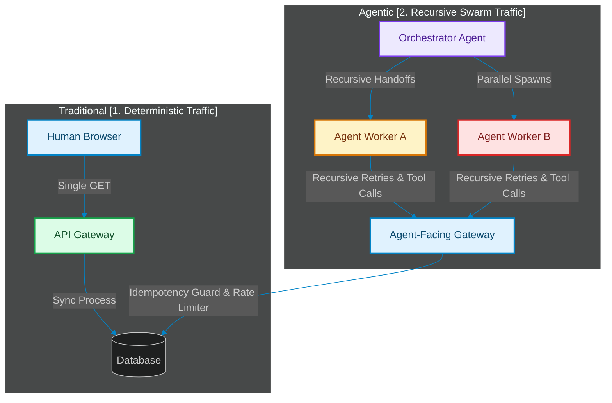

# Designing for Non-Deterministic Workloads: API Design & Rate-Limiting for Agentic Clients

> [!NOTE]
> **📖 Article Overview**
> Traditional REST APIs are architected around predictable, linear human behaviors (e.g., paging, form submissions, button clicks). AI agents, however, introduce highly concurrent, non-linear, and recursive calling patterns as they loop through planning and tool execution. In this article, we explore how to design API interfaces optimized for agentic clients, detail the propagation of idempotency keys, and implement a FastAPI rate-limiter tailored to prevent agentic loops from overwhelming backends.

---

## The Agentic Traffic Pattern

When an AI agent executes a multi-step task, it consumes APIs not as a static integration, but as dynamic tools [1]. This creates traffic behaviors that differ fundamentally from human clients:

1. **High Concurrency and Depth**: An agent might spawn parallel sub-agents, resulting in hundreds of API requests hitting downstream microservices in a single second.
2. **Recursive Validation Loops**: If a tool returns a validation error, the agent will rewrite its parameters and immediately retry the call—creating rapid, loop-driven retry spikes.
3. **Semantic Caching Vulnerability**: Traditional caching relies on exact string matches (URLs, headers). Agents construct varied queries to find the same information, bypassing standard cache keys.



---

## 1. Designing API Schemas for LLM Comprehension

To ensure agents execute tool calls reliably, APIs must be designed with LLM consumption in mind:
* **Self-Describing Fields**: Prefer verbose, semantic field names (e.g., `is_active_subscription` instead of `act_sub`).
* **Rich Metadata Descriptions**: Every API endpoint schema (OpenAPI/Swagger) must contain clean description blocks detailing the constraints and business logic.
* **Semantic Error Payloads**: Instead of returning a generic `400 Bad Request`, return a structured JSON response explaining exactly *what* was invalid and *how* to correct it. This allows the LLM agent to parse the error and self-correct.

---

## 2. Idempotency Key Propagation across Swarms

Since agents are prone to network timeouts or validation retries, every write endpoint must enforce **Idempotency**. 
* **Mechanics**: The client generates a unique `Idempotency-Key` (typically a UUIDv4) and sends it in the request header. The server stores the key and the resulting response payload in a fast cache (like Redis) with a short TTL (e.g., 24 hours).
* **Propagation**: If an orchestrator agent delegates a task to worker agents, it must propagate the root transaction's idempotency context down the call graph. This guarantees that even if a worker agent crashes and restarts, it cannot execute duplicate operations (e.g., billing a credit card twice).

---

## 3. Implementing a Rate-Limiting Guard in FastAPI

Below is a complete FastAPI application demonstrating how to enforce idempotency checks and apply a token-bucket rate limiter designed to guard against recursive agentic loops.

```python
import time
from typing import Dict, Optional
from fastapi import FastAPI, Header, HTTPException, status
from pydantic import BaseModel

app = FastAPI(title="Agentic API Gateway")

# Mock In-Memory Caches
idempotency_cache: Dict[str, Dict[str, Any]] = {}
rate_limit_cache: Dict[str, List[float]] = {}

class ToolRequest(BaseModel):
    account_id: str
    amount: float
    description: str

class ToolResponse(BaseModel):
    transaction_id: str
    status: str
    message: str

def check_rate_limit(client_id: str, rate: int = 5, capacity: int = 10) -> bool:
    """
    Implements a Token Bucket rate limiter.
    rate: tokens added per second
    capacity: maximum burst capacity
    """
    now = time.time()
    timestamps = rate_limit_cache.get(client_id, [])
    
    # Filter out timestamps older than 1 second
    timestamps = [t for t in timestamps if now - t < 1.0]
    
    if len(timestamps) >= capacity:
        return False
        
    timestamps.append(now)
    rate_limit_cache[client_id] = timestamps
    return True

@app.post(
    "/api/v1/transfer", 
    response_model=ToolResponse,
    status_code=status.HTTP_200_OK
)
def execute_transfer(
    payload: ToolRequest,
    idempotency_key: Optional[str] = Header(None, alias="Idempotency-Key"),
    client_id: Optional[str] = Header("anonymous", alias="X-Client-ID")
):
    # 1. Enforce Rate Limiting
    if not check_rate_limit(client_id):
        raise HTTPException(
            status_code=status.HTTP_429_TOO_MANY_REQUESTS,
            detail="Agent loop protection: Maximum execution frequency exceeded."
        )

    # 2. Enforce Idempotency
    if not idempotency_key:
        raise HTTPException(
            status_code=status.HTTP_400_BAD_REQUEST,
            detail="Idempotency-Key header is required for all state-writing tool calls."
        )

    if idempotency_key in idempotency_cache:
        print(f"[CACHE HIT] Returning saved payload for key: {idempotency_key}")
        cached_data = idempotency_cache[idempotency_key]
        return ToolResponse(**cached_data)

    # 3. Simulate Core Business Logic
    transaction_id = f"tx_{int(time.time() * 1000)}"
    response_data = {
        "transaction_id": transaction_id,
        "status": "SUCCESS",
        "message": f"Successfully transferred ${payload.amount} from account {payload.account_id}."
    }

    # Save to idempotency store
    idempotency_cache[idempotency_key] = response_data
    
    print(f"[EXECUTE] Processing new transaction: {transaction_id}")
    return ToolResponse(**response_data)
```

---

## key Takeaways for System Architects

* **Standardize Idempotency**: Never expose a state-altering tool to an LLM agent without requiring an idempotency key.
* **Design for Error Autonomy**: Include precise diagnostic fields and recovery instructions in error payloads to help agents self-correct without human intervention.
* **Token-Aware Gateways**: Set rate limits at the API gateway that check client IDs specifically for agent nodes to avoid rate-limiting legitimate human users during agent storms. [2]

## References & Further Reading

1. **Malkov, Y. A., & Yashunin, D. A. (2018)**. *Efficient and Robust Approximate Nearest Neighbor Search Using Hierarchical Navigable Small World Graphs*. IEEE TPAMI. [https://arxiv.org/abs/1603.09320](https://arxiv.org/abs/1603.09320)
2. **Jégou, H., Douze, M., & Schmid, C. (2011)**. *Product Quantization for Nearest Neighbor Search*. IEEE TPAMI. [https://hal.inria.fr/inria-00514462v2/document](https://hal.inria.fr/inria-00514462v2/document)
3. **Johnson, J., Douze, M., & Jégou, H. (2019)**. *Billion-scale Similarity Search with GPUs*. IEEE Transactions on Big Data. [https://arxiv.org/abs/1702.08734](https://arxiv.org/abs/1702.08734)
4. **Garcia-Molina, H., & Salem, K. (1987)**. *Sagas*. SIGMOD. [https://www.cs.cornell.edu/andru/cs711/2002fa/reading/sagas.pdf](https://www.cs.cornell.edu/andru/cs711/2002fa/reading/sagas.pdf)
5. **Nygard, M. (2018)**. *Release It! Design and Deploy Production-Ready Software (2nd ed.)*. Pragmatic Bookshelf. [https://pragprog.com/titles/mnee2/release-it-second-edition/](https://pragprog.com/titles/mnee2/release-it-second-edition/)
6. **Turner, J. S. (1986)**. *New Directions in Communications (or Which Way to the Information Age?)*. IEEE Communications Magazine. [https://doi.org/10.1109/MCOM.1986.1092946](https://doi.org/10.1109/MCOM.1986.1092946)
