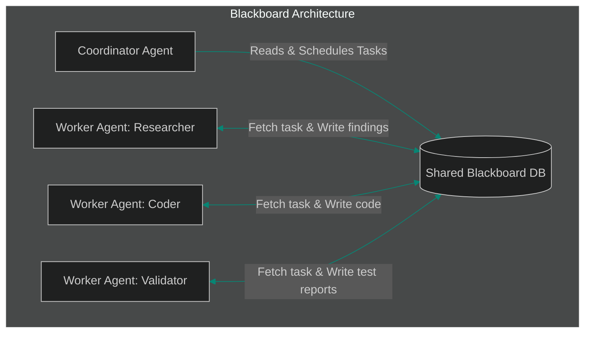

# The Database is the Blackboard: Shared State & Session Store Patterns for Agent Swarms

> [!NOTE]
> **📖 Article Overview**
> As AI agent architectures evolve from simple chain models into complex swarms, state coordination becomes the primary design challenge. Rather than relying solely on direct message exchanges (e.g. HTTP posts, WebSockets) which create coupling and high coordination overhead, advanced multi-agent systems rely on **Blackboard Architectures**. In this article, we analyze shared state patterns, design a PostgreSQL JSONB blackboard schema, and implement a concurrency-safe blackboard storage manager in Python.

---

## The Handoff Problem

In a decentralized swarm, agent nodes must transfer execution control and context data to one another. There are two primary architectural paradigms to handle this:

1. **Direct Peer-to-Peer Message Passing**: Agent A calls Agent B's API. This is easy to set up but highly coupled. If Agent B crashes, the state is lost, and auditing execution paths requires complex trace collectors.
2. **Blackboard Pattern (Shared State DB)**: A central, persistent memory store—the "Blackboard"—holds the global state, task lists, and execution history. Agent nodes poll or subscribe to this blackboard. They inspect the current board state, write updates, and hand off control by updating the task status.



Using a blackboard database decouples execution nodes, enforces transactional consistency, and provides built-in auditability of the agent swarm’s reasoning path.

---

## Designing a Concurrency-Safe Schema

When multiple agents write to the same blackboard concurrently, they risk overwrite errors (race conditions). We prevent this using **Transactional Locks**:
* **Relational Schema (PostgreSQL)**: We represent the blackboard as a table containing a unique `task_id`, a status column (`PENDING`, `RUNNING`, `COMPLETED`), and a JSONB column containing the execution context.
* **Concurrency Locking**: When an agent claims a task, it runs a `SELECT ... FOR UPDATE` query. This locks the database row, preventing other agent threads from claiming the same task. The agent updates the status and context, then commits the transaction, releasing the lock.

---

## Code Demo: Conactivity-Safe Blackboard Manager

Below is a complete Python script demonstrating a Blackboard manager using SQLite (with SQLAlchemy) that simulates concurrent workers processing tasks from a shared state repository using row-level transactional boundaries.

```python
import time
import threading
from typing import Dict, Any, List
from sqlalchemy import create_engine, Column, Integer, String, JSON
from sqlalchemy.orm import declarative_base, sessionmaker

Base = declarative_base()

class BlackboardTask(Base):
    __tablename__ = 'blackboard_tasks'
    id = Column(Integer, primary_key=True)
    status = Column(String(50), default="PENDING")
    assigned_agent = Column(String(100), nullable=True)
    context = Column(JSON, default=dict)

# Setup Database
engine = create_engine("sqlite:///:memory:", connect_args={"check_same_thread": False})
Base.metadata.create_all(engine)
SessionLocal = sessionmaker(bind=engine)

class BlackboardRepository:
    @staticmethod
    def claim_task(agent_name: str, task_id: int) -> bool:
        session = SessionLocal()
        try:
            # In PostgreSQL, we would run: SELECT * FROM blackboard_tasks WHERE id = :id FOR UPDATE
            task = session.query(BlackboardTask).filter(BlackboardTask.id == task_id).with_for_update().first()
            
            if task and task.status == "PENDING":
                print(f"[{agent_name}] Row lock acquired. Claiming task {task_id}...")
                task.status = "RUNNING"
                task.assigned_agent = agent_name
                task.context["claimed_at"] = time.time()
                session.commit()
                return True
            return False
        except Exception as e:
            session.rollback()
            print(f"[{agent_name}] Error claiming task: {e}")
            return False
        finally:
            session.close()

    @staticmethod
    def update_task_results(agent_name: str, task_id: int, results: Dict[str, Any]) -> None:
        session = SessionLocal()
        try:
            task = session.query(BlackboardTask).filter(BlackboardTask.id == task_id).first()
            if task and task.assigned_agent == agent_name:
                # Merge existing context data
                current_context = dict(task.context)
                current_context.update(results)
                task.context = current_context
                task.status = "COMPLETED"
                session.commit()
                print(f"[{agent_name}] Successfully submitted results for task {task_id}.")
        except Exception as e:
            session.rollback()
            print(f"Error updating task: {e}")
        finally:
            session.close()

# Simulate Agent Worker Node Execution
def run_worker_node(agent_name: str, task_id: int, task_duration: float, mock_data: Dict[str, Any]):
    print(f"[{agent_name}] Worker spawned.")
    # 1. Attempt to claim task
    if BlackboardRepository.claim_task(agent_name, task_id):
        # 2. Simulate processing
        time.sleep(task_duration)
        # 3. Write results back
        BlackboardRepository.update_task_results(agent_name, task_id, mock_data)
    else:
        print(f"[{agent_name}] Failed to claim task {task_id} (already locked/claimed).")

if __name__ == "__main__":
    # Seed a task in the blackboard database
    session = SessionLocal()
    new_task = BlackboardTask(id=101, context={"input": "Analyze security vulnerabilities in login.py"})
    session.add(new_task)
    session.commit()
    session.close()

    # Spawn two concurrent threads attempting to process the same task
    worker_a = threading.Thread(
        target=run_worker_node, 
        args=("Security_Scanner_A", 101, 1.0, {"vulnerabilities": ["SQL Injection on line 42"]})
    )
    worker_b = threading.Thread(
        target=run_worker_node, 
        args=("Security_Scanner_B", 101, 0.5, {"vulnerabilities": ["XSS on line 12"]})
    )

    worker_a.start()
    worker_b.start()

    worker_a.join()
    worker_b.join()

    # Read final results from the blackboard
    session = SessionLocal()
    final_task = session.query(BlackboardTask).filter(BlackboardTask.id == 101).first()
    print("\n--- Final Blackboard State ---")
    print(f"Status: {final_task.status}")
    print(f"Assigned Agent: {final_task.assigned_agent}")
    print(f"Context Payload: {final_task.context}")
    session.close()
```

---

## Key Takeaways

* **Decoupled Swarms**: Blackboard systems decouple agent logic. Workers do not need to know which agent takes the task next; they only need to know how to read and write to the database.
* **Audit Trail Out of the Box**: Because all intermediate thought tokens, tool execution payloads, and status changes are committed directly to the database, tracing lineage is trivial.
* **Strict State Locking**: Utilizing database locks (`FOR UPDATE`) prevents duplication and race conditions in high-throughput enterprise agent environments.
