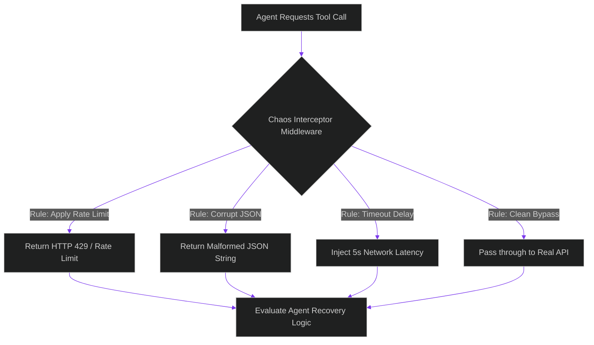

# Chaos Engineering for Agents: Simulating Network Failures and Payload Corruptions

> [!NOTE]
> **📖 Article Overview**
> As we transition from deterministic pipelines to agentic swarms, we introduce new failure modes. Unlike traditional software clients that fail predictably when a server goes down, an agent interacting with a broken tool might hallucinate parameters, enter infinite execution loops, or crash silently. To build resilient AI architectures, we must practice **Agent Chaos Engineering**: intentionally injecting rate limits, API timeouts, and payload corruptions into the tool loop. In this article, we design a chaos injection pipeline and implement a tool interceptor middleware class in Python.

---

## Moving Beyond Chaos Monkey for Servers

Traditional chaos engineering (like Netflix's Chaos Monkey) validates infrastructure resilience by killing server instances or injecting network latency.

When engineering agentic workflows, we face **cognitive and semantic vulnerabilities**:
* **API Rate Limits (HTTP 429)**: How does the agent react when an external inference API or vector database rate-limits its query?
* **Unparseable JSON Payloads**: What happens if a tool returns corrupt or unexpected data? Does the agent parse it gracefully, retry, or loop?
* **Tool Outages**: Does the agent identify that a database tool is offline and select a fallback strategy (like writing to a local mock), or does it crash?

To verify stability, we inject failures directly inside the **Agent-to-Tool boundary**.



---

## 1. Designing the Tool Interceptor Middleware

A clean chaos setup is best implemented as an **interceptor middleware** that sits between the agent executor and the tool schemas.
* **Metadata Tagging**: Each tool request has a execution payload. The middleware interceptor inspects the payload and applies configured chaos rules.
* **Randomized Probability**: Running chaos rules with a configurable probability (e.g. "corrupt 10% of tool returns") simulates real production conditions.

---

## 2. Setting up Recovery Benchmarks

When conducting chaos drills, we measure:
1. **Self-Healing Rate**: The percentage of runs where the agent identifies the failure and successfully retries.
2. **Infinite Loop Count**: Instances where the agent gets stuck in a retry loop without backing off.
3. **Graceful Degradation**: Does the system return a clean error trace back to the log, or does it leak internal stack traces?

---

## Code Demo: Tool Interceptor Chaos Simulator

Below is a Python implementation of an agent chaos interceptor. It wraps tool calls and injects simulated failures (rate limits, timeouts, corruptions) to test how client applications handle anomalies.

```python
import time
import json
import random
from typing import Dict, Any, Tuple

class ChaosInterceptor:
    def __init__(self, failure_rates: Dict[str, float]):
        # Failure rates: {"rate_limit": 0.2, "timeout": 0.1, "corrupt": 0.1}
        self.rates = failure_rates

    def execute_tool_call(self, tool_name: str, payload: Dict[str, Any], real_tool_func) -> Tuple[int, str]:
        # Generate random factor
        roll = random.random()

        # 1. Simulate API Rate Limit (HTTP 429)
        if roll < self.rates.get("rate_limit", 0.0):
            print(f"⚠️ [Chaos Interceptor] Injecting Simulated Rate Limit (HTTP 429) on '{tool_name}'!")
            return 429, json.dumps({"error": "Rate limit exceeded. Try again in 2 seconds."})

        # 2. Simulate API Timeout
        elif roll < (self.rates.get("rate_limit", 0.0) + self.rates.get("timeout", 0.0)):
            print(f"⌛ [Chaos Interceptor] Injecting Simulated Timeout Latency on '{tool_name}'!")
            time.sleep(2.0)  # Inject delay
            return 504, json.dumps({"error": "Gateway Timeout: API failed to respond."})

        # 3. Simulate Payload Corruption
        elif roll < (self.rates.get("rate_limit", 0.0) + self.rates.get("timeout", 0.0) + self.rates.get("corrupt", 0.0)):
            print(f"💥 [Chaos Interceptor] Injecting Malformed JSON Payload on '{tool_name}'!")
            return 200, "{ 'invalid_json': True, missing_quote: value " # Unparseable json

        # 4. Success case
        result = real_tool_func(payload)
        return 200, json.dumps(result)

# Mock tool functions
def get_user_profile(payload: Dict[str, Any]) -> Dict[str, Any]:
    return {"id": payload.get("user_id"), "name": "Alice Smith", "level": "admin"}

if __name__ == "__main__":
    # Configure chaos rates
    chaos_config = {
        "rate_limit": 0.25,  # 25% chance of HTTP 429
        "timeout": 0.25,     # 25% chance of Gateway Timeout
        "corrupt": 0.25      # 25% chance of Malformed JSON
    }
    interceptor = ChaosInterceptor(chaos_config)

    print("🐒 Starting Agent Chaos Simulation...")
    print("----------------------------------------")

    # Run 6 simulated tool calls to observe different failure modes
    for run in range(1, 7):
        print(f"\n[Run #{run}] Calling 'get_user_profile'...")
        status, response = interceptor.execute_tool_call(
            "get_user_profile",
            {"user_id": f"USR-{run}"},
            get_user_profile
        )
        
        # Test how a robust client parses the response
        print(f"👉 Received HTTP {status}")
        try:
            parsed = json.loads(response)
            if "error" in parsed:
                print(f"   ❌ Handled API Error: {parsed['error']}")
            else:
                print(f"   ✅ Success: User found -> {parsed['name']}")
        except json.JSONDecodeError:
            print("   ❌ Critical Failure: Failed to parse tool response. Payload is corrupt!")
```

---

## Chaos Engineering Best Practices

* **Audit Agent Logs**: Regularly inspect agent trajectories during chaos tests. If an agent loops on a failure, refine the prompt guidelines or configure max loop bounds.
* **Enforce Exponential Backoffs**: Guarantee all agent connectors use exponential backoff mechanisms when hitting API rate limits.
* **Isolate Tests in Staging**: Always run chaos drills inside sandbox configurations or staging databases to prevent real production data corruption.
