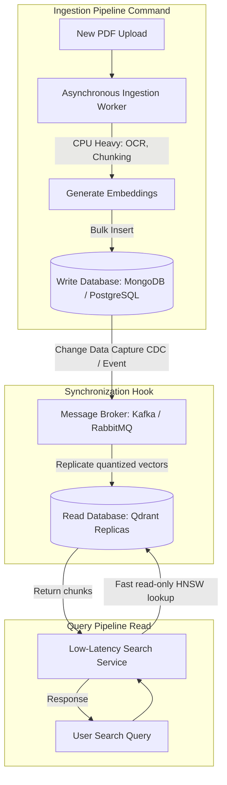

# CQRS in RAG: Decoupling Document Ingestion from Semantic Query Loops

When building a proof-of-concept Retrieval-Augmented Generation (RAG) system, hosting document ingestion and semantic search on a single unified database is standard practice. However, when scaling to enterprise production, this shared-resource model fails:
* **Write Bloat**: Running heavy document ingestion processes—parsing large PDFs, extracting tables, running OCR, generating embeddings—consumes massive CPU and disk I/O.
* **Read Latency Spikes**: If the database is busy indexing newly ingested files, concurrent semantic search queries (which require fast, memory-locked index scans) suffer latency spikes, degrading the user experience.

To solve this, high-performance RAG architectures apply **Command Query Responsibility Segregation (CQRS)**. By separating the write pathway (document ingestion) from the read pathway (vector search), we guarantee sub-10ms query times even during massive data ingestion runs.

---

## The RAG CQRS Architecture

In a RAG CQRS model, document ingestion (Command) and user querying (Query) are decoupled into isolated pipelines with dedicated databases:



1. **The Ingestion Pipeline (Write / Command)**: Reads incoming documents, runs PDF extraction engines, calls embedding APIs, and stores raw documents in a master document store (e.g., MongoDB or a write-optimized PostgreSQL node).
2. **The Synchronization Pathway**: A Change Data Capture (CDC) system or an event broker replicates only the indexable vector payloads and minimal metadata keys down to the read store.
3. **The Search Pipeline (Read / Query)**: Accesses low-latency, read-only vector replicas (e.g. Qdrant nodes or pgvector read replicas) to execute fast similarity lookups.

---

## Implementing a Decoupled RAG CQRS Pattern

Here is a Python implementation showing how to decouple the write command handler (processing incoming chunks) from the read query service.

### 1. The Command Handler (Ingestion / Write)
```python
import uuid
import time
from typing import Dict, Any

class DocumentIngestionCommand:
    """
    Handles heavy write operations asynchronously, storing raw data 
    and preparing vectors for replication.
    """
    def __init__(self, write_store_db: Dict[str, Any]):
        self.db = write_store_db

    def execute(self, file_name: str, raw_text: str) -> str:
        document_id = str(uuid.uuid4())
        print(f"[Command] Registering master document {file_name} in write store...")
        
        # Simulate CPU-heavy document parsing and chunking
        time.sleep(0.5) 
        chunks = [raw_text[i:i+200] for i in range(0, len(raw_text), 200)]
        
        # Save raw master data
        self.db[document_id] = {
            "file_name": file_name,
            "raw_chunks": chunks,
            "status": "PROCESSED"
        }
        
        print(f"[Command] Ingestion complete. Triggering sync events for {len(chunks)} chunks.")
        # Under CQRS, we would emit events (e.g., DocumentIngestedEvent) to a broker
        return document_id
```

### 2. The Query Handler (Search / Read)
```python
from typing import List, Dict, Any

class VectorSearchQuery:
    """
    Blazing-fast read-only service querying memory-locked vector indexes.
    """
    def __init__(self, read_replica_db: List[Dict[str, Any]]):
        self.read_store = read_replica_db

    def execute(self, query_vector: List[float], limit: int = 5) -> List[Dict[str, Any]]:
        print(f"[Query] Scanning read-optimized vector index for query...")
        
        # Simulate similarity scoring (dot product calculation)
        results = []
        for item in self.read_store:
            score = sum(q * v for q, v in zip(query_vector, item["vector"]))
            results.append({"chunk_id": item["chunk_id"], "content": item["content"], "score": score})
            
        # Sort by score descending
        results.sort(key=lambda x: x["score"], reverse=True)
        return results[:limit]
```

---

## Important Pitfalls in RAG CQRS

When decoupling reads and writes, keep these consistency rules in mind:

> [!IMPORTANT]
> **Eventual Consistency Latency**: Because sync updates are asynchronous, there will be a brief delay (typically 100ms–2000ms) between a document being uploaded and it appearing in vector search results. Ensure your frontend client indicates "indexing status" to prevent users from refreshing immediately and missing new data.

> [!CAUTION]
> **Data Synchronization Failures**: If the replication worker crashes, the read database will become out of sync with the master store. Implement a daily validation job that compares record counts between the write store and the read store, rebuilding missing vector indexes automatically.
