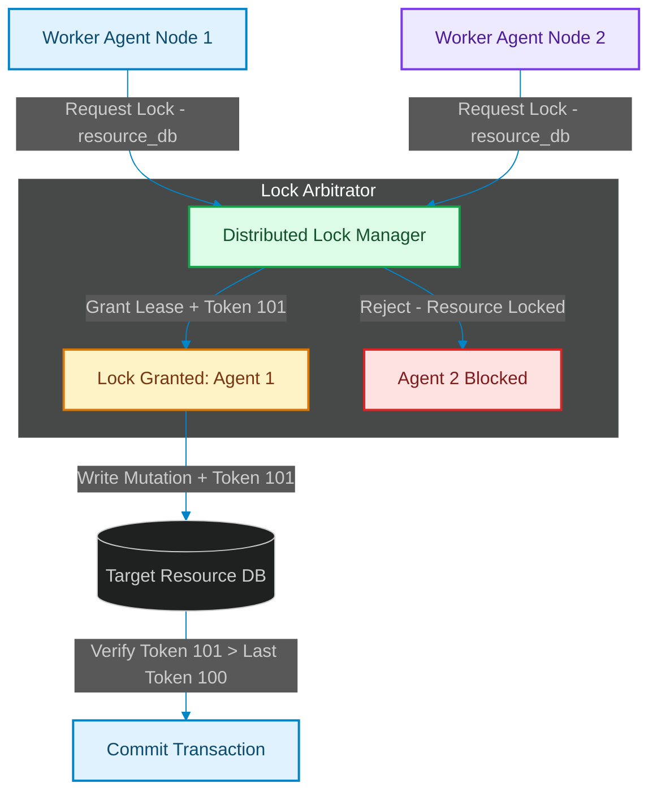

# Distributed Lock Arbitration: Preventing Concurrent Agent Tool Conflicts

> [!NOTE]
> **📖 Article Overview**
> When multi-agent systems run concurrent execution loops, worker nodes frequently issue tool commands against shared production resources (databases, API gateways, file systems). If two parallel worker agents attempt to mutate the same database record simultaneously without coordination, race conditions occur. Data becomes corrupted, and state invariants fail. To prevent concurrent write conflicts, distributed system engineers implement **Distributed Lock Arbitration**. By enforcing lock leases backed by monotonically increasing fencing tokens, agents arbitrate tool access safely. In this article, we implement a distributed lock arbitration manager in Python.

---

## The Race Condition Hazard in Swarms

In uncoordinated multi-agent networks:
* **The Simultaneous Mutation Trap**: Worker Agent A reads user balance $100 while Worker Agent B reads balance $100 concurrently [1]. Both write updated values based on initial state, causing lost updates.
* **Stale Lock Leases**: Slow agent tasks cause lock timeouts to expire while execution is in progress, allowing a second agent to grab the lock prematurely.
* **The Solution**: **Fencing Tokens**. Every granted lock lease includes an incremental integer fencing token (`fencing_token = 105`). Shared resources reject incoming write operations if the client presents an outdated token.



---

## 1. Acquiring Leases with Fencing Tokens

To manage lock leases safely:
* **Acquire Atomic Leases**: Set a key with Time-To-Live (TTL) expiration using atomic store operations (`SETNX` in Redis).
* **Increment Fencing Tokens**: Generate an auto-incrementing integer sequence for every granted lock.

---

## 2. Validating Resource Write Mutations

The storage target validates incoming lock tokens:
1. **Compare Fencing Tokens**: Reject any mutation request whose fencing token is less than or equal to the last recorded token.
2. **Release Leases Atomically**: Ensure lease releases verify lock ownership using Lua scripts or CAS (Compare-And-Swap) operations.

---

## Code Demo: Distributed Lock Arbitrator

Below is a Python implementation of a distributed lock arbitrator. It manages TTL leases, issues incremental fencing tokens, and rejects stale write operations.

```python
import time
from typing import Dict, Any, Tuple, Optional

class DistributedLockArbitrator:
    def __init__(self):
        # Resource lock storage: {resource_id: {"holder": agent_id, "expires_at": timestamp, "fencing_token": token}}
        self.locks: Dict[str, Dict[str, Any]] = {}
        # Storage resource last applied fencing tokens
        self.resource_fencing_state: Dict[str, int] = {}
        self.token_counter = 100

    def acquire_lock(self, resource_id: str, agent_id: str, ttl_seconds: float = 2.0) -> Tuple[bool, Optional[int]]:
        now = time.time()
        current_lock = self.locks.get(resource_id)

        # Check if lock exists and is unexpired
        if current_lock and current_lock["expires_at"] > now:
            print(f"🔒 [Lock Arbitrator] Access DENIED for '{agent_id}' on '{resource_id}'. Locked by '{current_lock['holder']}'.")
            return False, None

        # Issue lock with new fencing token
        self.token_counter += 1
        granted_token = self.token_counter
        self.locks[resource_id] = {
            "holder": agent_id,
            "expires_at": now + ttl_seconds,
            "fencing_token": granted_token
        }
        print(f"🔑 [Lock Arbitrator] Access GRANTED to '{agent_id}' on '{resource_id}' | Fencing Token: {granted_token}")
        return True, granted_token

    def execute_resource_mutation(self, resource_id: str, fencing_token: int, mutation_data: str) -> bool:
        last_applied = self.resource_fencing_state.get(resource_id, 0)
        
        # Verify fencing token monotonicity
        if fencing_token <= last_applied:
            print(f"🚨 [Storage Guard] REJECTED mutation! Stale fencing token {fencing_token} <= last applied {last_applied}.")
            return False

        self.resource_fencing_state[resource_id] = fencing_token
        print(f"💾 [Storage Guard] MUTATION SUCCESS on '{resource_id}' with Token {fencing_token}: '{mutation_data}'")
        return True

if __name__ == "__main__":
    arbitrator = DistributedLockArbitrator()

    print("🛡️ Starting Distributed Lock Arbitration Engine...")
    print("-----------------------------------------------------")

    # 1. Agent 1 acquires lock and receives fencing token 101
    success_1, token_1 = arbitrator.acquire_lock("db_user_101", agent_id="agent_alpha", ttl_seconds=1.0)
    
    # 2. Agent 2 attempts to acquire lock on same resource (Denied)
    success_2, token_2 = arbitrator.acquire_lock("db_user_101", agent_id="agent_beta", ttl_seconds=1.0)

    # 3. Agent 1 executes resource mutation with fencing token 101
    if success_1:
        arbitrator.execute_resource_mutation("db_user_101", fencing_token=token_1, mutation_data="UPDATE status = 'ACTIVE'")

    # 4. Simulate stale Agent attempt with old token (Rejected)
    arbitrator.execute_resource_mutation("db_user_101", fencing_token=100, mutation_data="UPDATE status = 'STALE'")
```

---

## Lock Arbitration Takeaways

* **Enforce Monotonic Fencing Tokens**: Always attach auto-incrementing integer fencing tokens to lock leases.
* **Validate Tokens at Storage Targets**: Reject write requests if the provided fencing token is older than the last applied token.
* **Set TTL Lease Expirations**: Include automatic lease expiration timeouts to prevent deadlocks when agent nodes crash. [2]

## References & Further Reading

1. **Apache Parquet Community (2024)**. *Apache Parquet Format*. Apache Software Foundation. [https://parquet.apache.org/docs/](https://parquet.apache.org/docs/)
2. **Apache Arrow Community (2024)**. *Apache Arrow Columnar Format*. Apache Software Foundation. [https://arrow.apache.org/docs/format/Columnar.html](https://arrow.apache.org/docs/format/Columnar.html)
3. **Apache Iceberg Community (2024)**. *Iceberg Table Spec*. Apache Software Foundation. [https://iceberg.apache.org/spec/](https://iceberg.apache.org/spec/)
4. **LangChain (2024)**. *LangGraph Documentation*. langchain.com. [https://langchain-ai.github.io/langgraph/](https://langchain-ai.github.io/langgraph/)
5. **Anthropic (2025)**. *Model Context Protocol Specification*. MCP Docs. [https://modelcontextprotocol.io/specification](https://modelcontextprotocol.io/specification)
6. **OpenTelemetry Authors (2024)**. *OpenTelemetry Specification*. CNCF. [https://opentelemetry.io/docs/specs/otel/](https://opentelemetry.io/docs/specs/otel/)
