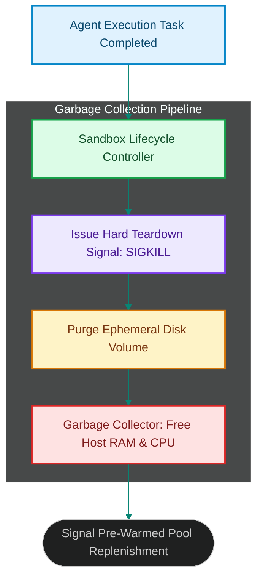

# Ephemeral Sandbox Lifecycles: Garbage Collection and State Teardown

> [!NOTE]
> **📖 Article Overview**
> Reusing execution sandboxes across multiple agent tasks introduces severe security and operational risks. When an agent executes untrusted code or handles sensitive API keys inside a container instance, residual files or environment variables can leak into subsequent agent sessions. Furthermore, orphan containers from crashed agent sessions consume host memory and disk space. To enforce zero-trust execution boundaries, infrastructure teams implement **Ephemeral Sandbox Lifecycle Management**. By enforcing single-use container lifecycles and background garbage collection loops, sandboxes are safely torn down and purged immediately after task completion. In this article, we implement an ephemeral sandbox lifecycle controller in Python.

---

## The Threat of Dirty Container Reuse

In basic container reuse models:
* **Credential & Token Leakage**: Environment variables containing DB passkeys or API tokens persist in bash history files, accessible to subsequent tasks [1].
* **Orphan Instance Accumulation**: Unhandled container timeouts leave stale instances consuming RAM and CPU resources indefinitely.
* **The Solution**: **Single-Use Ephemeral Lifecycles**. Containers process a single tool payload, after which the lifecycle controller destroys the container layer and releases host resources.



---

## 1. Enforcing Single-Use Execution Contracts

To maintain isolation:
* **Mark Containers Ephemeral**: Set single-use flags on active sandboxes so they cannot be checked out for secondary tasks.
* **Set Strict TTL Expiration**: Configure background janitor tasks to forcefully terminate sandboxes that exceed maximum runtime thresholds.

---

## 2. Automating Background Garbage Collection

The lifecycle manager purges container resources:
1. **Purge Disk Volumes**: Unmount and delete ephemeral overlay filesystems to erase modified file states.
2. **Reclaim Host Resources**: Reclaim allocated memory bounds and update pool availability metrics.

---

## Code Demo: Ephemeral Sandbox Lifecycle Controller

Below is a Python implementation of a sandbox lifecycle controller. It manages container lifecycle transitions, tracks instance TTLs, and executes automated garbage collection passes.

```python
import time
from typing import Dict, List, Any

class EphemeralSandboxLifecycleController:
    def __init__(self, max_ttl_seconds: float = 3.0):
        self.max_ttl_seconds = max_ttl_seconds
        # Active sandboxes: {instance_id: {"assigned_at": ts, "status": state}}
        self.active_sandboxes: Dict[str, Dict[str, Any]] = {}
        self.destroyed_count = 0

    def register_active_sandbox(self, instance_id: str):
        self.active_sandboxes[instance_id] = {
            "instance_id": instance_id,
            "assigned_at": time.time(),
            "status": "RUNNING"
        }
        print(f"📦 [Lifecycle] Registered active ephemeral sandbox: '{instance_id}'")

    def teardown_sandbox(self, instance_id: str, reason: str = "TASK_COMPLETED"):
        if instance_id in self.active_sandboxes:
            instance = self.active_sandboxes.pop(instance_id)
            self.destroyed_count += 1
            print(f"🗑️ [Teardown] Destroyed sandbox '{instance_id}' | Reason: {reason}")
            print(f"   🧹 Purged ephemeral disk volume and reclaimed host RAM.")

    def run_garbage_collection_pass(self):
        now = time.time()
        print(f"\n🔍 [Garbage Collector] Running janitor audit pass on {len(self.active_sandboxes)} active instances...")
        
        expired_ids = []
        for instance_id, info in self.active_sandboxes.items():
            duration = now - info["assigned_at"]
            if duration > self.max_ttl_seconds:
                expired_ids.append(instance_id)

        for expired_id in expired_ids:
            self.teardown_sandbox(expired_id, reason="TTL_EXCEEDED_TIMEOUT")

if __name__ == "__main__":
    controller = EphemeralSandboxLifecycleController(max_ttl_seconds=1.0)

    print("🛡️ Starting Ephemeral Sandbox Lifecycle Engine...")
    print("--------------------------------------------------")

    # 1. Register sandboxes for active tasks
    controller.register_active_sandbox("sandbox_alpha")
    controller.register_active_sandbox("sandbox_beta")

    # 2. Complete task on sandbox_alpha normally
    controller.teardown_sandbox("sandbox_alpha", reason="TASK_SUCCESS")

    # 3. Simulate time delay to trigger TTL timeout on sandbox_beta
    time.sleep(1.2)
    controller.run_garbage_collection_pass()

    print(f"\n📈 --- Final Lifecycle Statistics ---")
    print(f"Remaining Active Sandboxes: {len(controller.active_sandboxes)}")
    print(f"Total Purged Instances: {controller.destroyed_count}")
```

---

## Sandbox Lifecycle Takeaways

* **Enforce Single-Use Lifecycles**: Destroy sandboxes immediately after task execution to prevent credential and file leakages.
* **Run Background Janitor Passes**: Implement garbage collection loops to terminate orphan containers exceeding TTL limits.
* **Purge Overlay Volumes**: Delete container disk layers completely upon teardown to reclaim host disk space. [2]

## References & Further Reading

1. **Mohan, C., et al. (1992)**. *ARIES: A Transaction Recovery Method Supporting Fine-Granularity Locking and Partial Rollbacks*. ACM TODS. [https://doi.org/10.1145/128765.128770](https://doi.org/10.1145/128765.128770)
2. **O'Neil, P., Cheng, E., Gawlick, D., & O'Neil, E. (1996)**. *The Log-Structured Merge-Tree (LSM-Tree)*. Acta Informatica. [https://www.cs.umb.edu/~poneil/lsmtree.pdf](https://www.cs.umb.edu/~poneil/lsmtree.pdf)
3. **PostgreSQL Global Development Group (2024)**. *PostgreSQL Documentation*. postgresql.org. [https://www.postgresql.org/docs/current/](https://www.postgresql.org/docs/current/)
4. **V8 Team (2024)**. *V8 Orinoco and Garbage Collection*. v8.dev. [https://v8.dev/blog](https://v8.dev/blog)
5. **Lidén, P., & Karlsson, S. (2018)**. *ZGC: A Scalable Low-Latency Garbage Collector*. Oracle / OpenJDK. [https://openjdk.org/jeps/333](https://openjdk.org/jeps/333)
6. **McKenney, P. E., & Slingwine, J. D. (1998)**. *Read-Copy Update: Using Execution History to Solve Concurrency Problems*. PDCS. [https://www.rdrop.com/users/paulmck/RCU/rclockpdcsproof.pdf](https://www.rdrop.com/users/paulmck/RCU/rclockpdcsproof.pdf)
