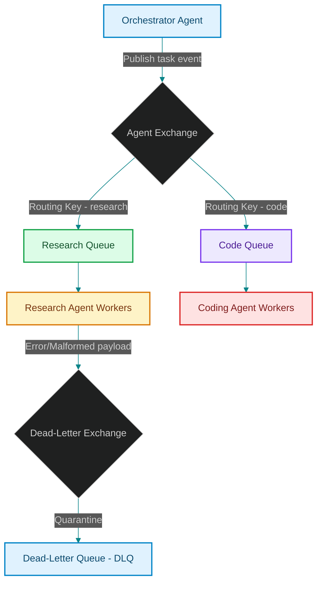

# Event-Driven Agent Swarms: Architecting RabbitMQ & Celery Pipelines for Asynchronous Execution

> [!NOTE]
> **📖 Article Overview**
> As agent workloads scale, relying on synchronous HTTP or gRPC request chains introduces extreme vulnerabilities: thread-blocking, connection timeouts, and cascading failure cascades. The solution is to transition to an **asynchronous event-driven architecture**. In this article, we explore building agent pipelines using message brokers like RabbitMQ and Celery, analyze task backpressure patterns, and implement a Dead-Letter Queue (DLQ) quarantine handler in Python.

---

## Why Synchronous HTTP Fails Agent Swarms

In standard web applications, a user action triggers a short request-response loop (often under 200ms) [1]. When an LLM agent executes, it loops through reflection, tool invocation, and API execution—a process that can take anywhere from 5 seconds to 5 minutes.

If Agent A calls Agent B synchronously over HTTP, Agent A's connection pool remains blocked waiting for a response. At scale, this quickly leads to:
* **Connection Exhaustion**: Socket blocks dry up, preventing new incoming requests.
* **Cascading Failures**: If Agent B experiences a brief API latency spike, Agent A times out, causing the entire multi-agent execution pipeline to fail.
* **Loss of State**: If an agent process crashes mid-execution during a synchronous request, the state of the task is lost.

---

## Message Broker Topology for Agents

Transitioning to a message broker (like RabbitMQ) solves these challenges by decoupling the task creator from the executor:



Using queues ensures that if an agent is overwhelmed, messages simply queue up in the broker (backpressure management) rather than causing server crashes.

---

## 1. Managing Backpressure and Worker Concurrency

When designing RabbitMQ queues for agents:
* **Prefetch Limit**: Configure a prefetch limit (`basic_qos(prefetch_count=1)`) on workers. This ensures that an agent worker only accepts a single task from the queue at a time, keeping it focused until execution finishes.
* **Exclusive Pools**: Set up separate queue channels for latency-sensitive tasks (e.g. real-time user chat) and heavy background jobs (e.g. repository analysis) to prevent background tasks from blocking fast user loops.

---

## 2. Quarantining Malformed Outputs with DLQs

AI agents are non-deterministic and can generate malformed tool arguments or unparseable JSON blocks. Rather than raising unhandled exceptions and dropping the task, systems use a **Dead-Letter Exchange (DLX)**:
1. **Detect Failure**: If an agent worker encounters a parser or structural error and fails to execute the message after a set number of retries, it sends a negative acknowledgment (`NACK`).
2. **Quarantine to DLQ**: RabbitMQ automatically routes the rejected message to the Dead-Letter Queue (DLQ).
3. **Audit/Heal**: A monitoring service or human operator inspects the quarantined message, corrects the syntax, and re-injects it into the execution loop.

---

## Code Demo: Mocking an Event-Driven Queue & DLQ Handler

Below is a Python simulation of an event-driven agent pipeline. It routes messages to worker tasks, manages a retry threshold, and moves repeatedly failing messages to a Dead-Letter Queue (DLQ) container.

```python
import sys
from typing import Dict, Any, List

# In-Memory Queue Simulation
queues: Dict[str, List[Dict[str, Any]]] = {
    "research_queue": [],
    "dead_letter_queue": []
}

class AgentQueueManager:
    @staticmethod
    def publish(routing_key: str, payload: Dict[str, Any]):
        if routing_key in queues:
            queues[routing_key].append(payload)
            print(f"✉️ [Broker] Published task message to: '{routing_key}'")
        else:
            print(f"❌ [Broker] Unknown queue key: {routing_key}")

    @staticmethod
    def route_to_dlq(payload: Dict[str, Any], error_reason: str):
        payload["error_reason"] = error_reason
        queues["dead_letter_queue"].append(payload)
        print(f"🚨 [DLQ] Message quarantined to Dead-Letter Queue! Reason: {error_reason}")

class ResearchWorkerAgent:
    def __init__(self, max_retries: int = 2):
        self.max_retries = max_retries

    def process_queue(self):
        queue = queues["research_queue"]
        if not queue:
            print("[Worker] Research Queue is empty.")
            return

        # Fetch first message
        message = queue.pop(0)
        task_id = message.get("task_id")
        retries = message.get("retries", 0)

        print(f"\n[Worker] Processing Task {task_id} (Attempt {retries + 1})...")

        try:
            # Simulate parsing check: fail if 'query' key is not present in payload
            if "query" not in message:
                raise ValueError("JSON_PARSE_ERROR: Missing required 'query' parameter.")
                
            print(f"✅ [Worker] Task {task_id} executed successfully: Researching '{message['query']}'.")
            
        except Exception as e:
            print(f"⚠️ [Worker] Exception caught: {e}")
            if retries < self.max_retries:
                # Increment retry counter and re-enqueue to retry
                message["retries"] = retries + 1
                AgentQueueManager.publish("research_queue", message)
                print(f"🔄 [Worker] Re-enqueued task {task_id} for retry.")
            else:
                # Retries exhausted: Route to DLQ
                AgentQueueManager.route_to_dlq(message, str(e))

if __name__ == "__main__":
    worker = ResearchWorkerAgent(max_retries=2)

    # 1. Publish a valid task
    valid_task = {"task_id": "tx_201", "query": "pgvector index sizing rules", "retries": 0}
    AgentQueueManager.publish("research_queue", valid_task)
    
    # 2. Publish an invalid task (missing query parameter)
    invalid_task = {"task_id": "tx_202", "retries": 0}
    AgentQueueManager.publish("research_queue", invalid_task)

    print("\n--- Starting Worker Queue Processing Loop ---")
    # Process valid task
    worker.process_queue()
    
    # Process invalid task (Attempt 1: Fail & Re-queue)
    worker.process_queue()
    # Process invalid task (Attempt 2: Fail & Re-queue)
    worker.process_queue()
    # Process invalid task (Attempt 3: Exhaust retries & Send to DLQ)
    worker.process_queue()

    print("\n--- Final Broker Queue States ---")
    print(f"Research Queue Size: {len(queues['research_queue'])}")
    print(f"Dead-Letter Queue Contents: {queues['dead_letter_queue']}")
```

---

## Architectural Guidelines

* **Always Decouple Long Tasks**: Never call a reasoning agent synchronously inside a human request thread. Return a `202 Accepted` status with a task ID and handle the execution in background broker workers.
* **Establish Dedicated DLQs**: Always hook up a Dead-Letter Queue to your agent exchanges. When parser nodes fail due to non-deterministic model outputs, the system must quarantine the state payload rather than crashing the pipeline.
* **Tune Prefetch Limits**: Enforce strict prefetch bounds on agent workers to manage resource allocation and GPU memory consumption. [2]

## References & Further Reading

1. **Belshe, M., Peon, R., & Thomson, M. (2015)**. *Hypertext Transfer Protocol Version 2 (HTTP/2)*. RFC 7540. [https://www.rfc-editor.org/rfc/rfc7540](https://www.rfc-editor.org/rfc/rfc7540)
2. **gRPC Authors (2024)**. *gRPC Documentation*. grpc.io. [https://grpc.io/docs/](https://grpc.io/docs/)
3. **Google (2024)**. *Protocol Buffers Language Guide*. protobuf.dev. [https://protobuf.dev/programming-guides/proto3/](https://protobuf.dev/programming-guides/proto3/)
4. **Bishop, M., Ed. (2022)**. *HTTP/3*. RFC 7541 / RFC 9114. [https://www.rfc-editor.org/rfc/rfc9114](https://www.rfc-editor.org/rfc/rfc9114)
5. **Fielding, R., Ed., Nottingham, M., Ed., & Reschke, J., Ed. (2022)**. *HTTP Semantics*. RFC 9110. [https://www.rfc-editor.org/rfc/rfc9110](https://www.rfc-editor.org/rfc/rfc9110)
6. **Cytron, R., et al. (1991)**. *Efficiently Computing Static Single Assignment Form and the Control Dependence Graph*. ACM TOPLAS. [https://doi.org/10.1145/115372.115320](https://doi.org/10.1145/115372.115320)
7. **Lattner, C., & Adve, V. (2004)**. *LLVM: A Compilation Framework for Lifelong Program Analysis & Transformation*. CGO. [https://llvm.org/pubs/2004-01-30-CGO-LLVM.pdf](https://llvm.org/pubs/2004-01-30-CGO-LLVM.pdf)
