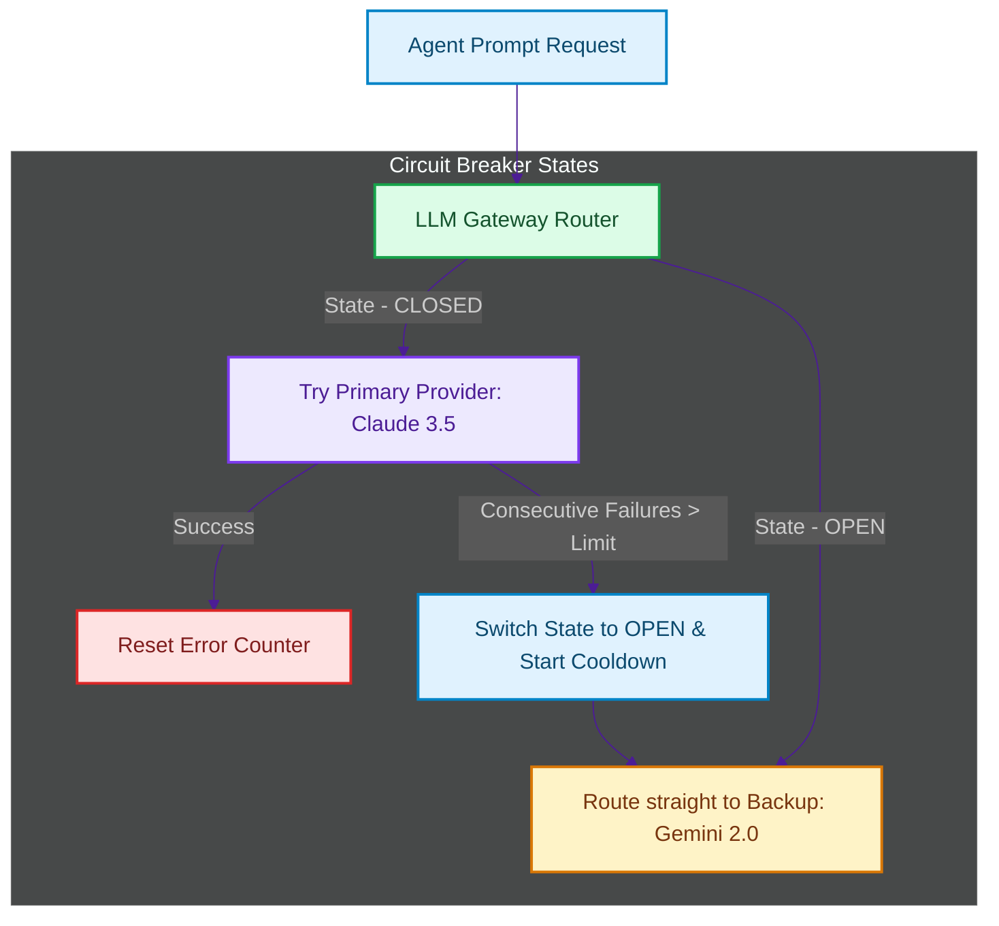

# LLM Gateway & Router Pattern: Resilient Multi-Provider Fallbacks and Circuit Breakers

> [!NOTE]
> **📖 Article Overview**
> In production agent swarms, relying on a single LLM provider is a critical point of failure. API rate limits (HTTP 429), connection timeouts, and provider outages can instantly halt a running agent chain. To secure high availability, architects deploy the **LLM Gateway & Router Pattern**. In this article, we design a middleware proxy that handles multi-provider fallback chains, retry backoffs, and implements a custom **Circuit Breaker** state machine in Python.

---

## The Provider Outage Threat

For agentic systems, LLM inference API calls are the core execution dependencies. When these calls fail, the entire application fails [1]. 

Three main issues threaten inference connections:
1. **Rate Limiting (429)**: High-throughput swarms exceed token-per-minute (TPM) allocations.
2. **Outages**: Model providers experience downtime or network packet loss.
3. **Model Versioning Failures**: A deprecated model release is retired, breaking API bindings.

To prevent outages, developers wrap their LLM calls inside a resilient **LLM Gateway**. The gateway acts as a smart router, managing API traffic and redirecting requests to alternate providers when errors occur.



---

## 1. Multi-Provider Fallback Routing Chains

A fallback chain defines an ordered routing list of secondary endpoints.
* **Semantic Parity**: Ensure that fallback models have similar structural capabilities (e.g. if the primary model is `claude-3-5-sonnet`, routing fallbacks to `gemini-2-0-pro` or `gpt-4o` rather than smaller, non-reasoning SLMs).
* **Token Translation**: The gateway must map API parameter configurations (e.g. translation from Anthropic message payloads to Google Gemini syntax models).

---

## 2. Implementing the Circuit Breaker Pattern

A circuit breaker prevents the application from making requests that are likely to fail, saving network resources and processing overhead:
* **CLOSED**: Normal state. All requests route to the primary provider.
* **OPEN**: The primary provider has failed multiple times in a row. The gateway "trips" the breaker, failing fast and routing all requests directly to the backup provider without contacting the primary.
* **HALF-OPEN**: After a cooldown period (e.g., 60 seconds), the gateway enters HALF-OPEN state, sending a single test request to the primary. If it succeeds, the breaker resets to CLOSED. If it fails, the breaker returns to OPEN.

---

## Code Demo: Resilient LLM Gateway with Circuit Breakers

Below is a Python implementation of a resilient LLM Gateway. It routes mock prompts, counts consecutive errors, manages cooldown timestamps, and switches breaker states dynamically.

```python
import time
from typing import List, Optional

class CircuitBreaker:
    def __init__(self, failure_limit: int = 3, cooldown_seconds: float = 5.0):
        self.failure_limit = failure_limit
        self.cooldown_seconds = cooldown_seconds
        
        self.state = "CLOSED"  # CLOSED, OPEN, HALF-OPEN
        self.failure_count = 0
        self.last_failure_time: Optional[float] = None

    def record_success(self):
        self.state = "CLOSED"
        self.failure_count = 0
        self.last_failure_time = None

    def record_failure(self):
        self.failure_count += 1
        self.last_failure_time = time.time()
        
        if self.failure_count >= self.failure_limit:
            self.state = "OPEN"
            print(f"🚨 [Breaker] Failure limit reached. Tripping circuit to OPEN!")

    def check_state(self) -> str:
        # If open, check if cooldown period has expired
        if self.state == "OPEN" and self.last_failure_time:
            if time.time() - self.last_failure_time >= self.cooldown_seconds:
                self.state = "HALF-OPEN"
                print(f"🔄 [Breaker] Cooldown expired. Testing provider in HALF-OPEN state.")
        return self.state

class ResilientLLMGateway:
    def __init__(self, primary_breaker: CircuitBreaker):
        self.primary_breaker = primary_breaker
        self.primary_provider = "Claude-3.5-Sonnet"
        self.backup_provider = "Gemini-2.0-Pro"

    def execute_prompt(self, prompt: str, mock_primary_fails: bool = False) -> str:
        breaker_state = self.primary_breaker.check_state()
        
        # 1. If breaker is OPEN, route directly to backup (fail-fast)
        if breaker_state == "OPEN":
            print(f"⚡ [Gateway] Breaker is OPEN. Routing straight to backup: '{self.backup_provider}'")
            return self._call_backup(prompt)

        # 2. Try calling primary provider
        print(f"📞 [Gateway] Attempting connection to primary: '{self.primary_provider}' (Breaker: {breaker_state})...")
        
        if mock_primary_fails:
            print(f"❌ [Gateway] Connection to '{self.primary_provider}' failed.")
            self.primary_breaker.record_failure()
            # Try backup provider immediately as fallback
            return self._call_backup(prompt)
        else:
            # Success
            self.primary_breaker.record_success()
            return f"[{self.primary_provider}] SUCCESS: Processed '{prompt}'"

    def _call_backup(self, prompt: str) -> str:
        return f"[{self.backup_provider}] SUCCESS (Fallback): Processed '{prompt}'"

if __name__ == "__main__":
    breaker = CircuitBreaker(failure_limit=3, cooldown_seconds=2.0)
    gateway = ResilientLLMGateway(breaker)

    # Turn 1: Happy path
    print(gateway.execute_prompt("Analyze database logs."))

    # Turn 2-4: Failures (Trips the breaker)
    print("\n--- Simulating Primary Provider Failures ---")
    print(gateway.execute_prompt("Generate index queries.", mock_primary_fails=True)) # Fails (Count: 1)
    print(gateway.execute_prompt("Generate index queries.", mock_primary_fails=True)) # Fails (Count: 2)
    print(gateway.execute_prompt("Generate index queries.", mock_primary_fails=True)) # Fails (Count: 3 -> Trips to OPEN)

    # Turn 5: Breaker is OPEN, routes straight to backup
    print("\n--- Breaker is OPEN ---")
    print(gateway.execute_prompt("Generate schema scripts."))

    # Wait for cooldown to expire
    print("\n⌛ Sleeping for 2.1 seconds to trigger cooldown...")
    time.sleep(2.1)

    # Turn 6: Breaker is now HALF-OPEN, tests primary. Let's simulate a success to reset the circuit.
    print("\n--- Breaker is HALF-OPEN (Testing recovery) ---")
    print(gateway.execute_prompt("Analyze database logs.", mock_primary_fails=False)) # Resets to CLOSED

    # Turn 7: Closed again, routes to primary
    print("\n--- Breaker returned to CLOSED ---")
    print(gateway.execute_prompt("Final check."))
```

---

## Architectural Guidelines

* **Propagate Status Codes**: Do not hide error types inside your gateway logs. Expose detailed error details (`429 Rate Limit`, `503 Service Unavailable`, `ConnectionTimeout`) to allow downstream routers to make informed fallback decisions.
* **Map Token Metrics**: Maintain a token-usage counter inside the gateway. If a backup model is much cheaper or has higher limits, route bulk background jobs (e.g. vector embedding indexing) directly to the backup.
* **Implement Cooldown Policies**: Keep breaker open states short during development but scale them to 60-120 seconds in production to allow remote provider server queues to clear. [2]

## References & Further Reading

1. **Michael, M. M. (2004)**. *Hazard Pointers: Safe Memory Reclamation for Lock-Free Objects*. IEEE TPDS. [https://www.cs.otago.ac.nz/cosc440/readings/hazard-pointers.pdf](https://www.cs.otago.ac.nz/cosc440/readings/hazard-pointers.pdf)
2. **McKenney, P. E., & Slingwine, J. D. (1998)**. *Read-Copy Update: Using Execution History to Solve Concurrency Problems*. PDCS. [https://www.rdrop.com/users/paulmck/RCU/rclockpdcsproof.pdf](https://www.rdrop.com/users/paulmck/RCU/rclockpdcsproof.pdf)
3. **Bloom, B. H. (1970)**. *Space/Time Trade-offs in Hash Coding with Allowable Errors*. CACM. [https://doi.org/10.1145/362686.362692](https://doi.org/10.1145/362686.362692)
