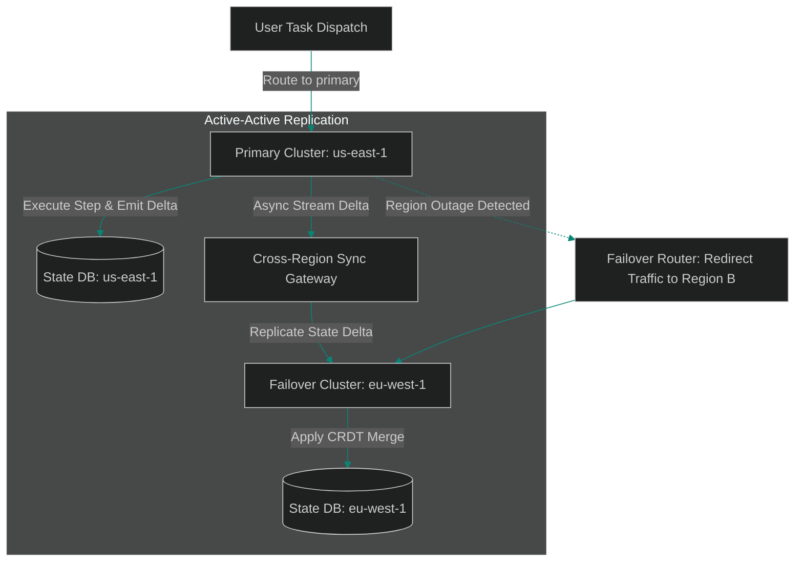

# Multi-Region Agent Clusters: Active-Active Task State Replication

> [!NOTE]
> **📖 Article Overview**
> Deploying agentic platforms for mission-critical enterprise applications requires high availability across geographical regions (e.g. `us-east-1` and `eu-west-1`). When an entire cloud region experiences an outage or network degradation mid-task, long-running agent workflows must fail over seamlessly without losing execution state or repeating expensive LLM reasoning steps. To build resilient agent platforms, engineering teams implement **Active-Active Multi-Region Clusters**. By utilizing Conflict-Free Replicated Data Types (CRDTs) and asynchronous replication buffers, agent task states synchronize across clusters continuously. In this article, we implement a multi-region state replication manager in Python.

---

## The Danger of Region-Bound State Silos

In single-region agent deployments:
* **The Cloud Outage Loss**: A regional outage drops active agent execution threads, discarding active task DAG state and forcing users to restart complex workflows.
* **Synchronous Latency Penalties**: Replicating agent state synchronously across continents before confirming step completion introduces 300+ millisecond cross-ocean network delays.
* **The Solution**: **Active-Active Asynchronous Replication**. Regions process agent tasks locally for low-latency responsiveness while streaming state update deltas asynchronously to standby clusters.



---

## 1. Structuring CRDT State Deltas

To replicate agent state without merge conflicts:
* **Vector Timestamps**: Tag every state modification delta with a vector clock `(region_id, sequence_num)` to establish causal order.
* **LWW (Last-Write-Wins) Registers**: Resolve conflicting attribute updates by comparing high-precision logical timestamps across regions.

---

## 2. Managing Asynchronous Sync Buffers

The replication manager coordinates cross-cluster updates:
1. **Buffer Deltas Locally**: Append state changes to an in-memory queue to decouple task execution from cross-region network latency.
2. **Apply Conflict-Free Merges**: When receiving remote state updates, merge state properties deterministically using CRDT rules.

---

## Code Demo: Multi-Region State Replication Manager

Below is a Python implementation of a multi-region state replication manager. It tracks local task execution state, buffers replication deltas, and merges cross-region updates using Last-Write-Wins (LWW) semantics.

```python
import time
from typing import Dict, Any, List

class MultiRegionStateReplicator:
    def __init__(self, region_name: str):
        self.region_name = region_name
        # Task state store: {task_id: {"state": data, "timestamp": ts, "region": region}}
        self.task_store: Dict[str, Dict[str, Any]] = {}
        # Outbound replication buffer queue
        self.outbound_replication_queue: List[Dict[str, Any]] = []

    def update_task_state(self, task_id: str, new_state: Dict[str, Any]) -> Dict[str, Any]:
        timestamp = time.time()
        state_record = {
            "task_id": task_id,
            "state": new_state,
            "timestamp": timestamp,
            "origin_region": self.region_name
        }
        
        # Save state locally in state store
        self.task_store[task_id] = state_record
        # Enqueue for cross-region replication
        self.outbound_replication_queue.append(state_record)
        
        print(f"📝 [{self.region_name}] Local state updated for '{task_id}' | Step: {new_state.get('step')}")
        return state_record

    def apply_remote_replication_delta(self, remote_record: Dict[str, Any]):
        task_id = remote_record["task_id"]
        local_record = self.task_store.get(task_id)

        # LWW (Last-Write-Wins) Conflict Resolution
        if not local_record or remote_record["timestamp"] > local_record["timestamp"]:
            self.task_store[task_id] = remote_record
            print(f"🔄 [{self.region_name}] Merged remote delta from '{remote_record['origin_region']}' into '{task_id}'.")
        else:
            print(f"⚠️ [{self.region_name}] Ignored stale remote delta for '{task_id}'. Local state is newer.")

if __name__ == "__main__":
    # Initialize Region A (us-east-1) and Region B (eu-west-1) managers
    region_us = MultiRegionStateReplicator("us-east-1")
    region_eu = MultiRegionStateReplicator("eu-west-1")

    print("🛡️ Starting Multi-Region State Replication Engine...")
    print("-----------------------------------------------------")

    # 1. Agent in us-east-1 executes step 1
    delta_1 = region_us.update_task_state("task_job_99", {"step": "1. Analyze Code Base", "status": "COMPLETED"})

    # 2. Replicate delta asynchronously to eu-west-1 cluster
    region_eu.apply_remote_replication_delta(delta_1)

    # 3. Simulate region failure in us-east-1; agent in eu-west-1 resumes step 2
    delta_2 = region_eu.update_task_state("task_job_99", {"step": "2. Deploy Patch", "status": "IN_PROGRESS"})

    print(f"\n📈 --- Final State in Failover Region (eu-west-1) ---")
    current_state = region_eu.task_store["task_job_99"]
    print(f"Task ID: {current_state['task_id']}")
    print(f"Active Step: {current_state['state']['step']}")
    print(f"Origin Region: {current_state['origin_region']}")
```

---

## Multi-Region Replication Takeaways

* **Decouple Task Execution from Sync**: Buffer state deltas locally so agents execute without waiting for cross-ocean network ACKs.
* **Adopt Last-Write-Wins (LWW) Semantics**: Tag state updates with high-precision timestamps to resolve cross-region merge conflicts deterministically.
* **Replicate Execution Graphs Continuously**: Stream intermediate task step outputs to standby clusters to enable instant failovers during outages.
