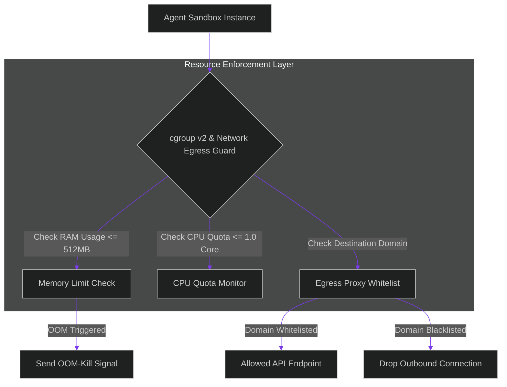

# Resource Quota Enforcement: Hard Limiters for CPU, Memory, and Network Egress

> [!NOTE]
> **📖 Article Overview**
> Running untrusted code generated by AI agents introduces resource exhaustion vulnerabilities. If a generated script contains an infinite `while True:` loop or attempts to allocate multi-gigabyte arrays, unconstrained container sandboxes can crash host nodes. Furthermore, compromised agents might attempt data exfiltration by sending HTTP POST requests to malicious external IP addresses. To protect host infrastructure and enforce multi-tenant isolation, enterprise systems deploy **Resource Quota Enforcement Engine**. By configuring cgroup v2 resource limits (CPU/RAM caps) and implementing network egress proxy filters, agent sandboxes operate within strict, immutable boundaries. In this article, we implement a resource quota monitor in Python.

---

## Hardening Host Infrastructure Against Runaway Agents

In unconstrained container setups:
* **The Noisy Neighbor Threat**: A single rogue agent execution thread consuming 100% host CPU starves adjacent container sandboxes.
* **Outbound Data Exfiltration**: Malicious code embedded in retrieved context makes unauthorized egress requests to untrusted external endpoints.
* **The Solution**: **cgroups v2 & Egress Whitelisting**. We attach Linux cgroup limits (`memory.max = 512M`, `cpu.max = 100000 100000`) and enforce domain-level egress proxies to restrict outbound network connections.



---

## 1. Defining Hard Resource Boundaries

To isolate sandbox execution:
* **Enforce Memory Caps**: Set hard OOM (Out-of-Memory) limits to terminate processes that exceed memory allocations.
* **Cap CPU Utilization**: Restrict CPU bandwidth using cgroup quota parameters to prevent CPU core starvation.

---

## 2. Filtering Outbound Egress Traffic

The network egress gateway inspects connection attempts:
1. **Domain Whitelisting**: Allow connections only to approved API domains (e.g. `api.openai.com` or `github.com`).
2. **Block Direct IP Egress**: Intercept raw IP traffic to prevent malicious port scanning or DNS tunneling.

---

## Code Demo: Sandbox Resource Quota Monitor

Below is a Python implementation of a sandbox resource quota monitor. It monitors container CPU/RAM consumption, enforces hard limits, and evaluates network egress domain permissions.

```python
import time
from typing import Dict, List, Any, Tuple

class SandboxResourceQuotaMonitor:
    def __init__(self, max_memory_mb: int = 512, max_cpu_percent: float = 100.0, allowed_domains: List[str] = None):
        self.max_memory_mb = max_memory_mb
        self.max_cpu_percent = max_cpu_percent
        self.allowed_domains = set(allowed_domains or ["api.github.com", "pypi.org"])

    def evaluate_resource_usage(self, sandbox_id: str, current_memory_mb: int, current_cpu_percent: float) -> Tuple[bool, str]:
        print(f"📊 [Quota Monitor] Auditing '{sandbox_id}' | RAM: {current_memory_mb}MB/{self.max_memory_mb}MB | CPU: {current_cpu_percent}%")

        # 1. Check Memory OOM Limits
        if current_memory_mb > self.max_memory_mb:
            return False, f"OOM_KILLED: Exceeded memory quota of {self.max_memory_mb}MB."

        # 2. Check CPU Quota Limits
        if current_cpu_percent > self.max_cpu_percent:
            return False, f"CPU_THROTTLED: Exceeded CPU quota of {self.max_cpu_percent}%."

        return True, "HEALTHY"

    def authorize_network_egress(self, sandbox_id: str, target_domain: str) -> bool:
        if target_domain in self.allowed_domains:
            print(f"🌐 [Egress Proxy] ALLOWED outbound connection to '{target_domain}' from '{sandbox_id}'.")
            return True
        
        print(f"🚨 [Egress Proxy] BLOCKED unauthorized outbound connection to '{target_domain}' from '{sandbox_id}'.")
        return False

if __name__ == "__main__":
    monitor = SandboxResourceQuotaMonitor(
        max_memory_mb=512,
        max_cpu_percent=100.0,
        allowed_domains=["api.github.com", "python.org"]
    )

    print("🛡️ Starting Resource Quota Enforcement Engine...")
    print("-------------------------------------------------")

    # 1. Evaluate healthy sandbox instance
    ok_1, msg_1 = monitor.evaluate_resource_usage("sandbox_101", current_memory_mb=256, current_cpu_percent=45.0)
    print(f"   Status: {msg_1}\n")

    # 2. Evaluate sandbox triggering OOM Memory Limit
    ok_2, msg_2 = monitor.evaluate_resource_usage("sandbox_102", current_memory_mb=600, current_cpu_percent=90.0)
    print(f"   Status: {msg_2}\n")

    # 3. Test Network Egress Proxy Whitelisting
    monitor.authorize_network_egress("sandbox_101", "api.github.com")
    monitor.authorize_network_egress("sandbox_101", "malicious-crypto-miner.com")
```

---

## Resource Quota Takeaways

* **Set Hard Memory Limits**: Configure Linux cgroup `memory.max` caps to prevent runaway memory allocation from crashing host nodes.
* **Restrict Outbound Network Egress**: Implement proxy firewalls to restrict sandbox traffic to approved API domains.
* **Monitor Resource Consumption**: Track real-time RAM and CPU usage metrics to detect infinite loops or abnormal execution patterns early.
