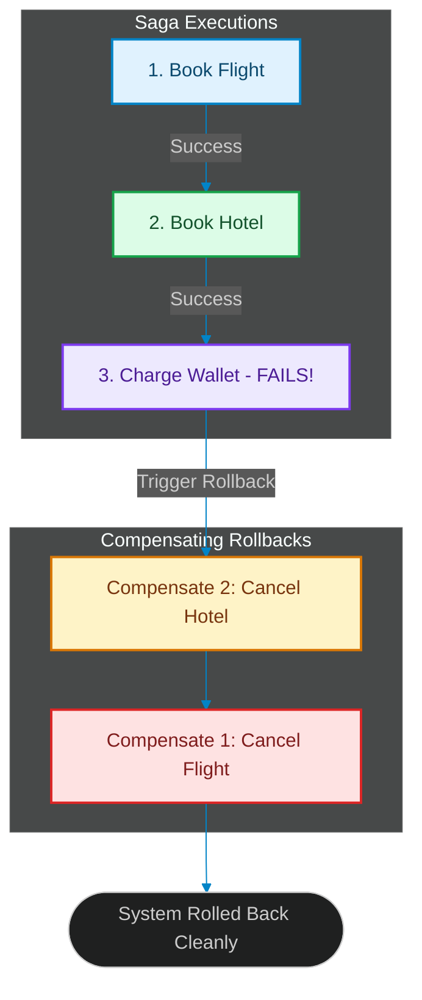

# The Saga Pattern for Agentic Workflows: Implementing Distributed Transaction Rollbacks in Swarms

> [!NOTE]
> **📖 Article Overview**
> As autonomous agent networks are trusted with write access to external APIs—booking flights, executing database transactions, sending emails, or provisioning cloud servers—error-handling becomes a critical system design challenge. In a traditional database, you can simply run `ROLLBACK`. In distributed agent workflows, we must design eventually consistent systems. In this article, we explore the **Saga Pattern** for agentic systems and implement an automated rollback orchestrator in Python.

---

## The Distributed Transaction Dilemma

Consider an autonomous travel booking swarm where three agents execute a pipeline:
1. **Flight Agent**: Books a flight via a Partner API.
2. **Hotel Agent**: Reserves a hotel room.
3. **Billing Agent**: Deducts funds from the user's wallet.

If the Flight and Hotel agents succeed, but the Billing agent fails due to insufficient funds, the system is left in an inconsistent state: flights and hotels are reserved, but unpaid [1]. Because these are external API calls, we cannot use database-level ACID transactions.

To solve this, we rely on the **Saga Pattern**, a design pattern that structures distributed transactions as a series of local steps. If any step fails, the coordinator executes a series of **compensating transactions** in reverse order to cancel changes and roll back the system.



---

## 1. Orchestration-Based vs. Choreography-Based Sagas

Sagas can be structured in two ways:
* **Choreography**: Each agent executes its step, publishes an event, and the next agent listens and executes. While highly decoupled, this becomes difficult to trace and audit in complex agent networks.
* **Orchestration**: A central class or controller coordinates execution. It invokes the agents, records progress, and directly triggers compensating actions if any node returns a failure state. For agentic swarms, **Orchestration** is highly recommended as it provides a single source of truth for debugging trace pathways.

---

## 2. Designing Idempotent Compensating Steps

Compensating actions must be designed with three core principles:
1. **Idempotency**: A compensation step might fail due to network timeouts and be retried multiple times. The cancel function must be safe to call repeatedly (e.g. `cancel_flight(id)` must return success even if the flight was already cancelled).
2. **Backward Recovery**: The rollback must execute in the exact reverse chronological order of the successful forward steps.
3. **Out-of-Order Handling**: In asynchronous networks, a compensation message might arrive before the forward command (e.g., if a network lag delayed the forward booking). The system must handle this gracefully, ensuring that if a cancel request arrives first, any subsequent forward request is blocked or immediately cancelled.

---

## Implementing a Saga Orchestrator in Python

Below is a complete Python implementation of a `SagaOrchestrator` executing a mock multi-agent transaction. It tracks completed steps and automatically triggers compensating rollbacks when a step raises a failure.

```python
import sys
from typing import List, Callable, Dict, Any

class SagaStep:
    def __init__(self, name: str, action: Callable[[], Any], compensate: Callable[[], Any]):
        self.name = name
        self.action = action
        self.compensate = compensate

class SagaOrchestrator:
    def __init__(self):
        self.steps: List[SagaStep] = []
        self.successful_steps: List[SagaStep] = []

    def add_step(self, name: str, action: Callable[[], Any], compensate: Callable[[], Any]):
        self.steps.append(SagaStep(name, action, compensate))

    def execute(self) -> bool:
        print("\n🚀 [Saga Orchestrator] Starting distributed agent transaction...")
        
        for step in self.steps:
            print(f"👉 Executing Step: '{step.name}'...")
            try:
                # Run the forward transaction action
                step.action()
                self.successful_steps.append(step)
                print(f"✅ Step '{step.name}' completed successfully.")
            except Exception as e:
                print(f"❌ Step '{step.name}' failed: {e}")
                self._rollback()
                return False
                
        print("🎉 [Saga Orchestrator] All distributed steps completed successfully!")
        return True

    def _rollback(self):
        print("\n⚠️ [Saga Rollback] Triggering compensating transactions in reverse order...")
        
        # Iterate backwards through successfully completed steps
        for step in reversed(self.successful_steps):
            print(f"🔄 Rolling back step: '{step.name}'...")
            try:
                step.compensate()
                print(f"✅ Compensating action for '{step.name}' completed.")
            except Exception as e:
                # In production, failures in rollbacks must go to a manual-intervention queue
                print(f"🚨 CRITICAL: Compensating action for '{step.name}' failed: {e}")
                
        print("🛑 [Saga Rollback] Rollback process finalized. System state returned to normal.")

# --- Mock Agent Action Hooks ---

def book_flight():
    print("   [Flight Agent] Reserved flight: UA-402.")

def cancel_flight():
    print("   [Flight Agent] Cancelled flight reservation: UA-402.")

def book_hotel():
    print("   [Hotel Agent] Reserved hotel room: Room 502.")

def cancel_hotel():
    print("   [Hotel Agent] Cancelled hotel reservation: Room 502.")

def charge_wallet():
    # Simulate a business logic failure (e.g. Insufficient Funds)
    raise ValueError("INSUFFICIENT_FUNDS: Deduct transaction failed on balance check.")

def refund_wallet():
    print("   [Billing Agent] Refunded wallet balance.")

if __name__ == "__main__":
    saga = SagaOrchestrator()
    
    # Register steps and their corresponding compensating rollbacks
    saga.add_step("Flight_Reservation", book_flight, cancel_flight)
    saga.add_step("Hotel_Reservation", book_hotel, cancel_hotel)
    saga.add_step("Wallet_Charge", charge_wallet, refund_wallet)

    success = saga.execute()
    if not success:
        sys.exit(1)
```

---

## Takeaways for System Designers

* **Map out Sagas Explicitly**: When designing multi-agent flows, always define a compensating rollback action for every forward API call that modifies state.
* **Orchestrate for observability**: In agentic ecosystems, rely on an orchestrator to manage state transitions rather than choreographing them blindly across event systems.
* **Build Alerting for Compensation Failures**: If a compensating action fails, the system must immediately issue a critical alert to a human queue for manual reconciliation. [2]

## References & Further Reading

1. **Mohan, C., et al. (1992)**. *ARIES: A Transaction Recovery Method Supporting Fine-Granularity Locking and Partial Rollbacks*. ACM TODS. [https://doi.org/10.1145/128765.128770](https://doi.org/10.1145/128765.128770)
2. **O'Neil, P., Cheng, E., Gawlick, D., & O'Neil, E. (1996)**. *The Log-Structured Merge-Tree (LSM-Tree)*. Acta Informatica. [https://www.cs.umb.edu/~poneil/lsmtree.pdf](https://www.cs.umb.edu/~poneil/lsmtree.pdf)
3. **PostgreSQL Global Development Group (2024)**. *PostgreSQL Documentation*. postgresql.org. [https://www.postgresql.org/docs/current/](https://www.postgresql.org/docs/current/)
4. **Malkov, Y. A., & Yashunin, D. A. (2018)**. *Efficient and Robust Approximate Nearest Neighbor Search Using Hierarchical Navigable Small World Graphs*. IEEE TPAMI. [https://arxiv.org/abs/1603.09320](https://arxiv.org/abs/1603.09320)
5. **Jégou, H., Douze, M., & Schmid, C. (2011)**. *Product Quantization for Nearest Neighbor Search*. IEEE TPAMI. [https://hal.inria.fr/inria-00514462v2/document](https://hal.inria.fr/inria-00514462v2/document)
6. **Johnson, J., Douze, M., & Jégou, H. (2019)**. *Billion-scale Similarity Search with GPUs*. IEEE Transactions on Big Data. [https://arxiv.org/abs/1702.08734](https://arxiv.org/abs/1702.08734)
