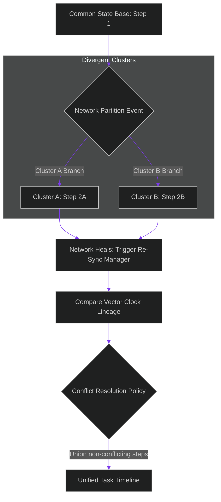

# Split-Brain Recovery: Partition Resolution & Consensus Re-Sync

> [!NOTE]
> **📖 Article Overview**
> During major cross-cloud outages or fiber cuts, network partitions split multi-agent clusters into isolated sub-networks. If both isolated partitions continue executing tasks independently, a dangerous **Split-Brain State** develops: both sides accept user commands and mutate task states along divergent execution paths. When the network partition heals, merging divergent state histories naively results in lost work or corrupted task DAGs. To maintain data consistency, systems engineers deploy **Consensus Re-Sync Handlers**. By comparing vector clock lineage and applying consensus reconciliation rules, clusters recover unified state timelines. In this article, we implement a split-brain reconciliation manager in Python.

---

## The Distributed Partition Dilemma

In partitioned agent networks:
* **The Divergent Branch Problem**: Partition A executes step 3A while Partition B concurrently executes step 3B for the same task key.
* **Corrupted Context Graphs**: Unifying divergent trace histories without causal ordering produces invalid execution sequences.
* **The Solution**: **Consensus Re-Sync & Lineage Pruning**. Upon network healing, nodes exchange state vector clock trees, identify divergence points, and apply deterministic consensus rules (such as leader-driven pruning or branch unioning).



---

## 1. Detecting Divergent Vector Clocks

To identify split-brain branches:
* **Track Vector Clock Lineages**: Attach vector clock maps `{"cluster_a": 2, "cluster_b": 1}` to state updates.
* **Detect Concurrent Divergence**: Identify states where neither vector clock dominates the other, signaling a split-brain branch.

---

## 2. Reconciling Divergent Histories

The re-sync manager resolves split-brain states:
1. **Locate Common Ancestor**: Traverses vector clock lineages to find the last agreed-upon state.
2. **Apply Consensus Merges**: Merge non-conflicting step logs and re-index sequential step execution keys.

---

## Code Demo: Split-Brain Reconciliation Manager

Below is a Python implementation of a split-brain reconciliation manager. It detects divergent execution branches across partitioned clusters and unifies task timelines upon network healing.

```python
import copy
from typing import List, Dict, Any

class SplitBrainReconciler:
    def __init__(self):
        pass

    def detect_divergence(self, state_a: Dict[str, Any], state_b: Dict[str, Any]) -> bool:
        vc_a = state_a.get("vector_clock", {})
        vc_b = state_b.get("vector_clock", {})
        
        # Concurrent divergence occurs when neither vector clock strictly dominates
        a_greater = any(vc_a.get(k, 0) > vc_b.get(k, 0) for k in vc_a)
        b_greater = any(vc_b.get(k, 0) > vc_a.get(k, 0) for k in vc_b)
        
        return a_greater and b_greater

    def reconcile_divergent_branches(self, branch_a: List[Dict[str, Any]], branch_b: List[Dict[str, Any]]) -> List[Dict[str, Any]]:
        print("⚡ [Re-Sync Manager] Network partition healed. Reconciling divergent state branches...")
        
        unified_timeline: List[Dict[str, Any]] = []
        seen_steps = set()

        # Combine steps from both branches while preserving uniqueness and causal order
        combined = branch_a + branch_b
        combined.sort(key=lambda x: (x.get("timestamp", 0), x.get("step_id")))

        for item in combined:
            step_key = (item["step_id"], item["action"])
            if step_key not in seen_steps:
                seen_steps.add(step_key)
                unified_timeline.append(item)
                print(f"   ✅ Merged Step '{item['action']}' from Cluster '{item['cluster_origin']}'")

        return unified_timeline

if __name__ == "__main__":
    reconciler = SplitBrainReconciler()

    # Divergent state logs produced during network partition
    branch_cluster_a = [
        {"step_id": 1, "action": "Init Task DAG", "cluster_origin": "Cluster_A", "timestamp": 100, "vector_clock": {"A": 1, "B": 0}},
        {"step_id": 2, "action": "Query Database Schema", "cluster_origin": "Cluster_A", "timestamp": 105, "vector_clock": {"A": 2, "B": 0}}
    ]

    branch_cluster_b = [
        {"step_id": 1, "action": "Init Task DAG", "cluster_origin": "Cluster_B", "timestamp": 100, "vector_clock": {"A": 0, "B": 1}},
        {"step_id": 3, "action": "Fetch External API Data", "cluster_origin": "Cluster_B", "timestamp": 108, "vector_clock": {"A": 0, "B": 2}}
    ]

    print("🛡️ Executing Split-Brain Reconciliation Pipeline...")
    print("-----------------------------------------------------")

    # Detect divergence
    is_split = reconciler.detect_divergence(branch_cluster_a[-1], branch_cluster_b[-1])
    print(f"🔍 Split-Brain Divergence Detected: {is_split}")

    if is_split:
        unified_history = reconciler.reconcile_divergent_branches(branch_cluster_a, branch_cluster_b)

        print("\n📈 --- Final Reconciled Unified Timeline ---")
        for step in unified_history:
            print(f"   Step {step['step_id']}: {step['action']} (via {step['cluster_origin']})")
```

---

## Split-Brain Recovery Takeaways

* **Use Vector Clock Lineages**: Attach vector clock maps to all state updates to identify when network partitions cause execution divergence.
* **Locate Common Ancestor**: Trace back vector clocks to find the last consensus state before the partition occurred.
* **Unify Non-Conflicting Steps**: Merge parallel non-conflicting agent step logs to preserve execution work when network connectivity restores.
