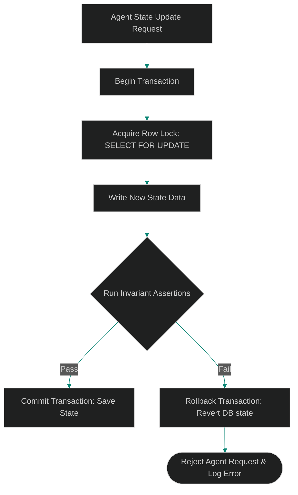

# State Invariants for Agentic Workflows: Enforcing Logic Assertions on Shared DB State

> [!NOTE]
> **📖 Article Overview**
> Multi-agent systems often communicate using a shared state space, commonly modeled as a Blackboard database architecture. However, when dozens of agents concurrently read, analyze, and write to a single postgres JSONB document or state table, race conditions arise. Logical rules (e.g. "a ticket status cannot revert from Done to Todo") get violated because LLMs do not verify database constraints. In this article, we design **State Invariant Assertions** and implement a transaction-wrapped state validator repository in Python.

---

## The Blackboard Race Condition

When scaling multi-agent topologies, synchronizing agent context via direct messaging gets expensive and slow. Instead, we use a central database to store session state, letting agents query and write updates independently.

However, since agents execute asynchronous processes, they can write conflicting information. For example, if two worker agents try to assign the same task to themselves simultaneously, both might write their name to the task document, violating structural invariants.

To guarantee system stability, we cannot rely on LLM prompts to behave. We must implement **system state invariants** at the application repository and database transaction level.



---

## 1. Defining Structural State Invariants

State invariants represent absolute rules that the application state must satisfy at all times:
* **Linear Lifecycle Progression**: Preventing an agent from moving a work item from `Backlog` to `Deployment` without passing through `Testing`.
* **Resource Mutual Exclusion**: Guaranteeing that a worker task node can only be locked by a single agent ID at any given millisecond.
* **Property Conservation**: Enforcing value boundaries (e.g. "total calculated budget must equal the sum of line items").

---

## 2. Implementing Row Locks and Rollbacks

To prevent race conditions, the repository layer must enforce:
1. **Optimistic Concurrency Control (OCC)**: Tracking version numbers on state documents. If an agent tries to write an update based on a version that has already changed, the transaction fails and requires a retry.
2. **Pessimistic Row Locking (`SELECT FOR UPDATE`)**: Locking target state rows during transaction execution to prevent other agent threads from executing concurrent edits.

---

## Code Demo: Transactional State Store with Invariants

Below is a Python implementation of a transaction-wrapped state repository. It enforces data validation rules on state updates and rolls back the database transition if the rules are violated.

```python
import json
import copy
from typing import Dict, Any, Tuple

class StateInvariantError(Exception):
    pass

class BlackboardStateStore:
    def __init__(self):
        # Database mock: stores task IDs and their respective state maps
        self._db: Dict[str, str] = {
            "TASK-100": json.dumps({
                "status": "TODO",
                "assigned_agent": None,
                "subtasks_count": 3,
                "completed_subtasks": 0,
                "version": 1
            })
        }
        # Define allowed state transitions
        self.allowed_transitions = {
            "TODO": {"IN_PROGRESS"},
            "IN_PROGRESS": {"TESTING", "TODO"},
            "TESTING": {"DONE", "IN_PROGRESS"},
            "DONE": set() # Terminal state
        }

    def update_state(self, task_id: str, new_state: Dict[str, Any], client_version: int) -> Tuple[bool, str]:
        # Start simulated database transaction
        db_raw = self._db.get(task_id)
        if not db_raw:
            return False, "Task ID not found."

        current_state = json.loads(db_raw)

        # 1. Optimistic Concurrency Check (OCC)
        if current_state["version"] != client_version:
            return False, f"OCC Conflict: State was modified by another agent process. Expected version {client_version}, found {current_state['version']}."

        # Make copy to simulate target state changes before committing
        proposed_state = copy.deepcopy(current_state)
        proposed_state.update(new_state)

        # 2. Run Invariant Assertions
        try:
            self._validate_state_invariants(current_state, proposed_state)
        except StateInvariantError as e:
            # Transaction Rollback: We discard proposed_state and do not write to _db
            return False, f"Transaction Rolled Back: Invariant violation -> {e}"

        # 3. Commit Transaction: Update version number and save
        proposed_state["version"] += 1
        self._db[task_id] = json.dumps(proposed_state)
        return True, f"Transaction Committed. New version: {proposed_state['version']}"

    def _validate_state_invariants(self, current: Dict[str, Any], proposed: Dict[str, Any]):
        # Invariant 1: Assert Status Lifecycle transitions
        curr_status = current["status"]
        prop_status = proposed["status"]
        if curr_status != prop_status:
            allowed = self.allowed_transitions.get(curr_status, set())
            if prop_status not in allowed:
                raise StateInvariantError(f"Illegal state transition from {curr_status} to {prop_status}.")

        # Invariant 2: Property Conservation (Completed subtasks cannot exceed total subtasks)
        tot = proposed.get("subtasks_count", 0)
        comp = proposed.get("completed_subtasks", 0)
        if comp > tot:
            raise StateInvariantError(f"Subtask out of bounds: completed count ({comp}) exceeds total count ({tot}).")

        # Invariant 3: Single ownership assignment
        if current.get("assigned_agent") and proposed.get("assigned_agent"):
            if current["assigned_agent"] != proposed["assigned_agent"]:
                raise StateInvariantError(f"Resource ownership conflict: Task is already locked by {current['assigned_agent']}.")

if __name__ == "__main__":
    store = BlackboardStateStore()

    # Client Agent A reads TASK-100 (version 1)
    print("🤖 Agent A reading task state...")
    task_v1 = json.loads(store._db["TASK-100"])
    
    # 1. Attempt invalid state transition (TODO -> DONE)
    print("\n[Transaction 1] Agent A requests transition: TODO -> DONE")
    payload = {"status": "DONE", "assigned_agent": "Agent_A"}
    success, msg = store.update_state("TASK-100", payload, task_v1["version"])
    print(f"Result: **{success}** | Message: {msg}")

    # 2. Attempt valid state transition (TODO -> IN_PROGRESS)
    print("\n[Transaction 2] Agent A requests transition: TODO -> IN_PROGRESS")
    payload = {"status": "IN_PROGRESS", "assigned_agent": "Agent_A"}
    success, msg = store.update_state("TASK-100", payload, task_v1["version"])
    print(f"Result: **{success}** | Message: {msg}")

    # Client Agent B tries to write to the same task using stale version 1 details (OCC check)
    print("\n[Transaction 3] Agent B requests update using stale version 1 data...")
    payload_b = {"completed_subtasks": 1, "assigned_agent": "Agent_B"}
    success, msg = store.update_state("TASK-100", payload_b, 1)
    print(f"Result: **{success}** | Message: {msg}")
```

---

## Architectural Guidelines

* **Enforce Optimistic Concurrency**: Include version metrics inside all state tables and blackboard schemas to prevent concurrent agent overwrites.
* **Isolate Logic Assertions**: Run state invariant validations inside transaction boundaries. Ensure any validation failure triggers a full rollback.
* **Standardize State Transitions**: Enforce permitted state change topologies inside code configurations rather than delegating state logic to LLMs.
