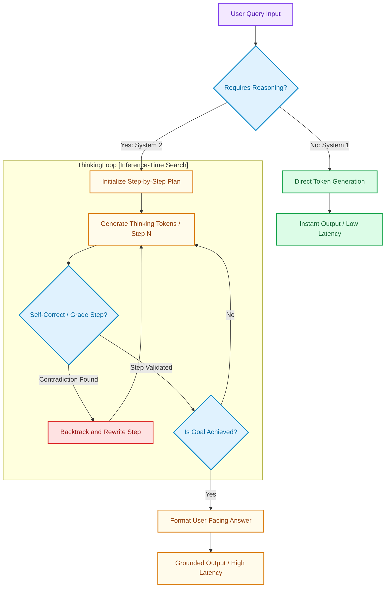

# System 1 vs. System 2 Thinking: The Token Economics of Inference-Time Scaling

> ### 📖 Article Overview
> * **What this article is about:** An analysis of the transition from pre-training scaling laws (dense scaling during training) to inference-time scaling (System 2 reasoning loops like OpenAI o1 or DeepSeek R1).
> * **Why it matters:** System 2 models scale reasoning capability dynamically at runtime, changing how we budget for latency and compute costs in real-world applications.
> * **What we synthesized:** While reasoning scaling achieves extreme accuracy on complex logical tasks (math, coding, science), it introduces significant user-facing latency and inflates token billing via hidden reasoning tokens.

---

In the first years of the generative AI boom, the industry was governed by **Pre-training Scaling Laws**. As established by Kaplan et al. (2020), model performance scaled predictably with parameter counts, dataset tokens, and training compute. To build a smarter model, you spent millions pre-training a larger dense network.

By 2025–2026, the paradigm has shifted. We have hit the limits of high-quality human text data, forcing a transition to **Inference-Time Scaling (System 2 Thinking)**.

Popularized by reasoning models like OpenAI's o1 and DeepSeek's R1, System 2 scaling shifts the compute budget from training to inference. Instead of generating an answer instantly (System 1), the model runs reinforcement learning loops at runtime to plan, search, backtrack, and self-correct before outputting the final answer.

This article synthesizes the trade-offs of inference-time scaling, analyzing **what is good (pros)**, **what is not (cons)**, and how to audit "thinking token" economics, as modeled in my exam generator project, [QuestionPaperAI](https://github.com/akmalkhaniub/QuestionPaperAI).

---

## System 1 vs. System 2 Execution Paths

Unlike standard token generation, System 2 reasoning models execute a multi-turn, hidden computation loop before delivering the first user-facing token.



---

## Synthesis: What's Good & What's Not

### What's Good (The Pros)
*   **Logical Precision**: System 2 scaling solves multi-step reasoning puzzles (complex math proofs, competitive coding, scientific calculations) with unprecedented accuracy.
*   **Parameter Efficiency**: Instead of training a 1-trillion parameter dense model, we achieve equivalent reasoning accuracy using a 70B parameter model by scaling inference compute.
*   **Sample Efficiency**: The model learns to critique its own thoughts via reinforcement learning (RL) rather than relying exclusively on massive human-curated datasets.

### What's Not (The Cons)
*   **Inference Latency Spikes**: Responses no longer appear instantly. User queries can block for 15 to 90 seconds while the model iterates through its hidden reasoning loop, breaking real-time UI expectations.
*   **Thinking Token Inflation**: The model might generate 2,000 hidden "thinking tokens" just to output a 100-word answer. This token inflation compounds API billing costs exponentially.
*   **Simple Query Overkill**: Running a System 2 loop for a basic query (e.g. *"What is the capital of France?"*) is highly inefficient, wasting CPU cycles and money.

---

## Auditing Thinking Tokens in Node.js

Because reasoning models bill for both hidden thinking tokens and user-facing output tokens, your API tracking layer must separate these metrics to calculate costs accurately. 

Here is a Node.js middleware wrapper that queries the reasoning engine, isolates the thinking token metadata, and logs cost metrics, modeled on the test-generation pipelines in [QuestionPaperAI](https://github.com/akmalkhaniub/QuestionPaperAI).

```javascript
// billingMiddleware.js
const { Pool } = require('pg');
const pool = new Pool({ connectionString: process.env.DATABASE_URL });

const DEEPSEEK_R1_RATES = {
  input: 0.00000055,        // $0.55 per Million
  thinking: 0.00000219,     // $2.19 per Million
  output: 0.00000219        // $2.19 per Million
};

async function logReasoningUsage(userId, query, responsePayload) {
  const { usage, model } = responsePayload;
  
  // Extract token categories
  const inputTokens = usage.prompt_tokens;
  const outputTokens = usage.completion_tokens;
  const thinkingTokens = usage.completion_tokens_details?.reasoning_tokens || 0;
  
  // Calculate cost
  const standardOutputTokens = outputTokens - thinkingTokens;
  const cost = (inputTokens * DEEPSEEK_R1_RATES.input) +
               (thinkingTokens * DEEPSEEK_R1_RATES.thinking) +
               (standardOutputTokens * DEEPSEEK_R1_RATES.output);

  const sql = `
    INSERT INTO token_billing_audit 
    (user_id, model_name, input_tokens, output_tokens, thinking_tokens, estimated_cost_usd)
    VALUES ($1, $2, $3, $4, $5, $6);
  `;
  
  await pool.query(sql, [userId, model, inputTokens, standardOutputTokens, thinkingTokens, cost]);
  console.log(`[Billing Log]: Cost for User ${userId}: $${cost.toFixed(6)} (${thinkingTokens} thinking tokens used).`);
}
```

---

## System 2 Implementation Checklist

* [ ] **Separate Thinking Token Budgets**: Always set a `max_completion_tokens` limit on reasoning calls to prevent the model from entering long, expensive self-critique loops.
* [ ] **Implement Client-Side Loading UI**: Replace standard typing indicators with a thinking log or progress bar showing the user that the model is actively reasoning in the background.
* [ ] **Cache Routing**: Route simple factual queries to System 1 models (like Claude Haiku or GPT-4o-mini) to save cost and latency.

---

## Conclusion & Key Takeaways

The shift from training-time scaling to inference-time scaling marks a major milestone in AI architecture:
1. **Reasoning on Demand:** System 2 models allow us to trade runtime compute (latency and cost) for task accuracy. Complex math and competitive programming no longer require giant pre-trained weights.
2. **The Hidden Billing Trap:** Tracking "thinking tokens" is mandatory. Because reasoning models consume massive internal token loops before returning user-facing data, middleware layers must inspect execution headers to prevent billing surprises.
3. **Hybrid Orchestration:** Routing queries based on their cognitive demand is key. General questions should bypass System 2 loops entirely, reserving high-latency reasoning for deep logic puzzles.

*Takeaway:* Scalable AI development is transitioning from prompt hacks to token economics auditing.

---

## References & Further Reading

* **Scaling Laws**: Kaplan et al., 2020. *Scaling Laws for Neural Language Models*. [arXiv:2001.08361](https://arxiv.org/abs/2001.08361).
* **DeepSeek R1 & GRPO**: Xiong et al., 2025. *DeepSeek: Paradigm Shifts and Technical Evolution in Large AI Models*. Outlines Group Relative Policy Optimization (GRPO) for reasoning. [arXiv:2507.09955](https://arxiv.org/abs/2507.09955).
* **System 2 Thinking in LLMs**: Andrej Karpathy's video lecture on [System 1 vs System 2 Thinking in LLMs](https://www.youtube.com/watch?v=zjkBMFhNj_g#t=2h15m).

*To check out our reasoning integrations for automated curriculum generation, inspect the source code of our [QuestionPaperAI](https://github.com/akmalkhaniub/QuestionPaperAI) repository.*
