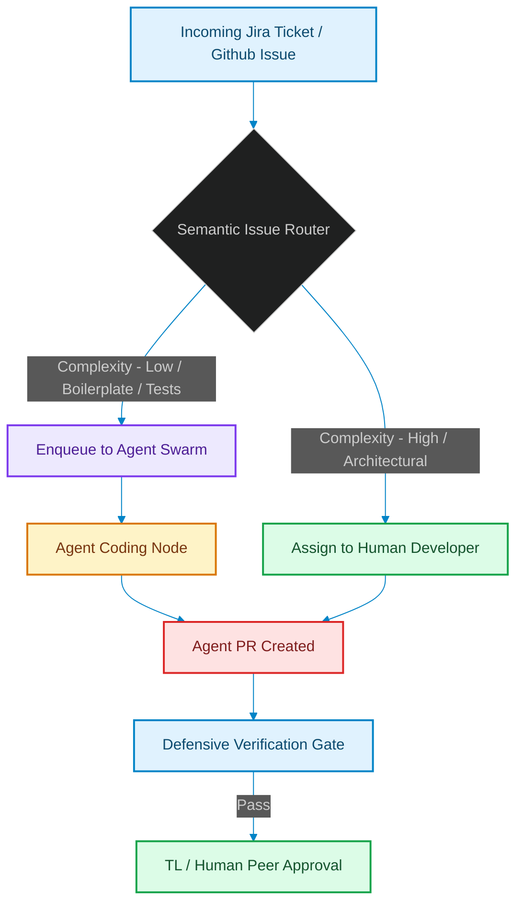

# Sprints for Swarms: Re-architecting Jira, Git, and Task Delegation for Hybrid Engineering Teams

> [!NOTE]
> **📖 Article Overview**
> Traditional agile methodologies, sprint cycles, and Git workflows were designed for human developers working at human speed. When autonomous coding agents join the team, executing entire feature migrations in minutes, the traditional planning pipeline breaks. In this article, we explore how Engineering Team Leads must re-architect Jira processes, design non-blocking Git trunk structures, and implement a **Semantic Issue Router** in Python to safely delegate tasks between human developers and AI swarms.

---

## The Ticket Pipeline Starvation

In a standard two-week sprint, a team lead estimates, Refines, and distributes 15 to 20 tickets to human developers [1]. This cycle is paced: writing, testing, and merging takes days.

When a team mounts a swarm of coding agents to the repository, those 20 tickets can be consumed, written, and generated as pull requests in under an hour. This leads to **Ticket Starvation** (the backlog runs dry instantly) and a **Review Bottleneck** (the TL is flooded with dozens of complex PRs simultaneously).

To prevent this chaos, team leads must build a triage gateway that dynamically evaluates, routes, and paces tasks.



---

## 1. Restructuring Git Trunk Channels

To prevent agent PRs from blocking human development, team leads must restructure branch routing:
* **The Staging Buffer**: Never allow agents to push directly to the main trunk or human development branches. Create a dedicated `staging/agents` buffer branch.
* **Auto-Triage Merging**: Set up GitHub actions that automatically merge agent PRs into the agent staging branch *only* if unit tests and syntax checks pass.
* **Batch Reviews**: Humans review the combined `staging/agents` branch as a single batched pull request once a day, rather than inspecting 50 individual PRs.

---

## 2. Implementing a Semantic Issue Router

The first gate of a hybrid team is the **Triage Router**. It analyzes incoming issue payloads (title, description, affected modules) to compute a complexity metric.
* **High-Complexity Tasks**: Architectural modifications, core design decisions, or security-sensitive modules are routed directly to human engineers.
* **Low-Complexity Tasks**: Creating mock tests, writing boilerplate configurations, upgrading version numbers, or styling components are dispatched to the agent queue.

---

## Code Demo: Semantic Issue Complexity Router

Below is a Python implementation of an issue triage router. It uses heuristic analysis of keywords and affected modules to classify incoming issues and assign them to the correct queue.

```python
import sys
from typing import Dict, Any, Tuple

class IssueTriageRouter:
    def __init__(self):
        # Define keywords that require architectural human oversight
        self.human_keywords = [
            "refactor core", "database migration", "auth security", 
            "jwt signature", "architect", "redesign encryption"
        ]
        # Define file extensions or modules that agents are safe to write
        self.agent_safe_areas = ["tests", "docs", "styles", "fixtures", "configs"]

    def triage_issue(self, issue: Dict[str, Any]) -> Tuple[str, str]:
        title = issue.get("title", "").lower()
        description = issue.get("description", "").lower()
        affected_files = issue.get("affected_files", [])

        # Rule 1: Check for architectural or security-critical keywords
        for keyword in self.human_keywords:
            if keyword in title or keyword in description:
                return "HUMAN_DEVELOPER", f"Critical architectural keyword found: '{keyword}'"

        # Rule 2: Evaluate complexity based on affected files count
        if len(affected_files) > 10:
            return "HUMAN_DEVELOPER", "Task modifies more than 10 files. Requires human system design context."

        # Rule 3: Check if changes are within agent-safe directories
        is_agent_safe = True
        for filepath in affected_files:
            # If path doesn't contain any of the safe directory names, flag it
            if not any(area in filepath for area in self.agent_safe_areas):
                is_agent_safe = False
                break

        if is_agent_safe and len(affected_files) > 0:
            return "AI_AGENT_SWARM", "Changes are confined to agent-safe modules (tests/docs/configs)."

        # Fallback to human assignment for unspecified tasks
        return "HUMAN_DEVELOPER", "Default safety routing: task requires context validation."

if __name__ == "__main__":
    router = IssueTriageRouter()

    # Issue 1: Simple unit test creation
    issue_1 = {
        "id": "JIRA-101",
        "title": "Add mock tests for billing gateway",
        "description": "Create new unit tests verifying correct token responses.",
        "affected_files": ["tests/test_billing.py", "tests/fixtures/mock_responses.json"]
    }

    # Issue 2: Refactoring authentication encryption schemas
    issue_2 = {
        "id": "JIRA-102",
        "title": "Refactor core session decryption handler",
        "description": "Update encryption key rotations to follow the new JWT security spec.",
        "affected_files": ["core/auth/decrypt.py", "core/db/session.py"]
    }

    print("🤖 Running Semantic Issue Triage...")
    for idx, issue in enumerate([issue_1, issue_2], 1):
        assignment, reason = router.triage_issue(issue)
        print(f"\nIssue #{idx} [{issue['id']}]: '{issue['title']}'")
        print(f"👉 Assigned to: **{assignment}**")
        print(f"   Reason: {reason}")
```

---

## Team Lead's Implementation Checklist

* **Establish Staging Buffers**: Never let agents target main developer branches. Buffer agent PRs in a dedicated environment.
* **Implement Complexity Classification**: Use routers to screen tasks before they enter the queue. Protect architectural modules from agent write access.
* **Redefine Sprint Velocity**: Stop measuring velocity in terms of story points completed. Instead, evaluate the team based on **system architecture stability** and **automated verification coverage**. [2]

## References & Further Reading

1. **Malkov, Y. A., & Yashunin, D. A. (2018)**. *Efficient and Robust Approximate Nearest Neighbor Search Using Hierarchical Navigable Small World Graphs*. IEEE TPAMI. [https://arxiv.org/abs/1603.09320](https://arxiv.org/abs/1603.09320)
2. **Jégou, H., Douze, M., & Schmid, C. (2011)**. *Product Quantization for Nearest Neighbor Search*. IEEE TPAMI. [https://hal.inria.fr/inria-00514462v2/document](https://hal.inria.fr/inria-00514462v2/document)
3. **Johnson, J., Douze, M., & Jégou, H. (2019)**. *Billion-scale Similarity Search with GPUs*. IEEE Transactions on Big Data. [https://arxiv.org/abs/1702.08734](https://arxiv.org/abs/1702.08734)
4. **Forsgren, N., Humble, J., & Kim, G. (2018)**. *Accelerate: The Science of Lean Software and DevOps*. IT Revolution / DORA. [https://dora.dev/research/](https://dora.dev/research/)
5. **Brooks, F. P. (1975)**. *The Mythical Man-Month*. Addison-Wesley. [https://en.wikipedia.org/wiki/The_Mythical_Man-Month](https://en.wikipedia.org/wiki/The_Mythical_Man-Month)
6. **Nygard, M. (2018)**. *Release It! Design and Deploy Production-Ready Software (2nd ed.)*. Pragmatic Bookshelf. [https://pragprog.com/titles/mnee2/release-it-second-edition/](https://pragprog.com/titles/mnee2/release-it-second-edition/)
