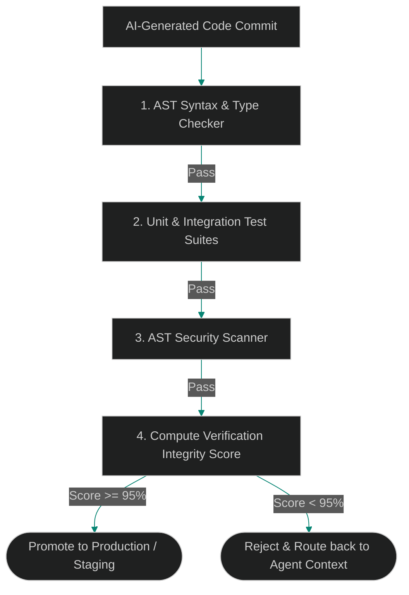

# The Verification Architect: Why the Modern Team Lead Focuses on Test Gates over Code Reviews

> [!NOTE]
> **📖 Article Overview**
> In a traditional engineering organization, the Team Lead acts as the primary code reviewer, manually inspecting every line of code to ensure quality and prevent regressions. However, when AI coding assistants can generate hundreds of lines of code per second, manual line-by-line review becomes a massive system bottleneck. In this article, we explore why TLs must transition to **Verification Architects**, detail the "Defensive Verification Funnel", and implement a validation pipeline checker in Python.

---

## The Line-by-Line Bottleneck

Human cognitive processing cannot keep pace with AI code output. When an agent updates a database connector, generates 15 tests, and rewrites a controller endpoint in 45 seconds, a TL trying to review it line-by-line experiences:
* **Review Fatigue**: After inspecting the 5th AI-generated PR of the morning, critical details slip past.
* **Semantic Blind Spots**: AI code is syntactically perfect, making logical bugs or security vulnerabilities (e.g. subtle SQL injections or race conditions) hard to spot visually.
* **The Solution**: Shifting focus from *inspecting code* to *engineering the verification gates*. The Team Lead's primary job is to write the strict boundaries (assertions, validation contracts, integrations) and let the gates verify the code.



---

## 1. Establishing Strict Verification Contracts

To become a Verification Architect, a team lead must enforce:
* **Contract-Driven API Schemas**: Using Pydantic or TypeScript interfaces to validate all input and output bounds of services. The code *within* the boundary can be written by AI, but the *boundary* itself must be defined strictly.
* **E2E Behavior Coverage**: Writing high-level integration tests that assert expected end-to-end user paths. If the tests pass and the boundaries are secure, the internal implementation details matter less.
* **Automated Security Gates**: Running AST-level security analyzers (like Bandit for Python or Semgrep) inside the CI/CD pipeline to catch vulnerability patterns automatically.

---

## Code Demo: Defensive Verification Pipeline Checker

Below is a Python implementation of a defensive verification runner. It simulates a CI/CD gate that executes validation tests, checks compilation, scans for code vulnerabilities, and outputs an integrity score to determine if a commit is safe to merge.

```python
import sys
from typing import Dict, Any, List

class VerificationPipelineChecker:
    def __init__(self):
        self.minimum_integrity_score = 95.0

    def run_verification(self, source_code: str, test_suite: List[str]) -> Dict[str, Any]:
        report = {
            "compilation": False,
            "security_check": False,
            "tests_passed": 0,
            "tests_failed": 0,
            "integrity_score": 0.0,
            "status": "REJECTED"
        }

        # 1. Check Compilation/Syntax
        try:
            compile(source_code, "<string>", "exec")
            report["compilation"] = True
        except SyntaxError as e:
            print(f"❌ Compilation Check Failed: {e}")
            return report

        # 2. Run AST Security Check (Simple regex-based scanning for simulation)
        # In production, this uses Semgrep or AST node inspectors
        insecure_patterns = ["eval(", "exec(", "shell=True", "password ="]
        security_fails = []
        for pattern in insecure_patterns:
            if pattern in source_code:
                security_fails.append(pattern)
                
        if not security_fails:
            report["security_check"] = True
        else:
            print(f"❌ Security Scan Failed: Found insecure pattern(s) {security_fails}")

        # 3. Simulate Running Test Suites
        # Assume we execute assertions written in the test suite list
        local_scope = {}
        try:
            exec(source_code, local_scope)
            for test in test_suite:
                try:
                    exec(test, local_scope)
                    report["tests_passed"] += 1
                except AssertionError:
                    report["tests_failed"] += 1
        except Exception as e:
            print(f"❌ Runtime error executing code under test: {e}")
            return report

        # 4. Compute Verification Integrity Score
        total_tests = len(test_suite)
        test_success_ratio = (report["tests_passed"] / total_tests) if total_tests > 0 else 0.0
        
        # Deduct score heavily if security checks fail
        security_modifier = 1.0 if report["security_check"] else 0.5
        compilation_modifier = 1.0 if report["compilation"] else 0.0

        integrity = (test_success_ratio * 100) * security_modifier * compilation_modifier
        report["integrity_score"] = round(integrity, 2)

        if report["integrity_score"] >= self.minimum_integrity_score:
            report["status"] = "APPROVED"

        return report

if __name__ == "__main__":
    pipeline = VerificationPipelineChecker()

    # Code Case 1: High quality code that compiles, passes security, and passes tests
    code_1 = """
def calculate_area(length: float, width: float) -> float:
    if length <= 0 or width <= 0:
        raise ValueError("Dimensions must be positive.")
    return length * width
"""
    tests_1 = [
        "assert calculate_area(10, 5) == 50.0",
        "try:\n    calculate_area(-1, 5)\n    assert False\nexcept ValueError:\n    pass"
    ]

    # Code Case 2: Insecure code containing 'eval' block (security vulnerability)
    code_2 = """
def run_command(command: str):
    # Insecure usage of eval
    return eval(command)
"""
    tests_2 = [
        "assert run_command('1 + 1') == 2"
    ]

    print("🛡️ Running Defensive Verification Funnel...")
    
    # Run Case 1
    report_1 = pipeline.run_verification(code_1, tests_1)
    print(f"\n[Commit 1] Status: **{report_1['status']}** | Score: {report_1['integrity_score']}%")
    print(f"   (Tests Passed: {report_1['tests_passed']}/{len(tests_1)}, Security: {report_1['security_check']})")

    # Run Case 2
    report_2 = pipeline.run_verification(code_2, tests_2)
    print(f"\n[Commit 2] Status: **{report_2['status']}** | Score: {report_2['integrity_score']}%")
    print(f"   (Tests Passed: {report_2['tests_passed']}/{len(tests_2)}, Security: {report_2['security_check']})")
```

---

## Architectural Guidelines for Team Leads

* **Define Boundaries, Not Implementations**: Focus your manual efforts on writing strict schemas (e.g. JSON schema, Pydantic templates) and architectural guidelines. Let the validation gates test the code logic.
* **Automate Security Scans**: Never rely on visual code reviews to catch security holes. Deploy automated checkers like Bandit, Semgrep, or Snyk directly inside the PR lifecycle.
* **Log Verification Metrices**: Maintain a database of code verification scores. If code from a particular source regularly drops below the threshold, refine the prompt context or update the model constraints.
