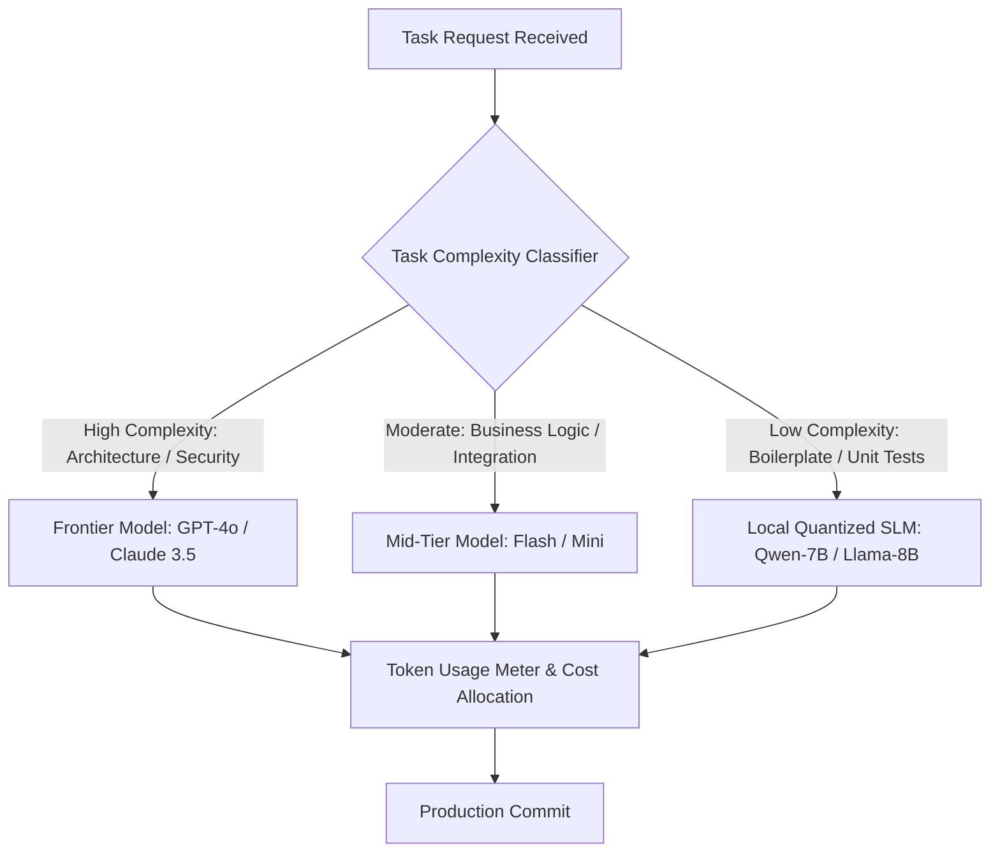

# AI Token Economics & Compute Engineering for Technical Leaders

In early AI adoption phases, engineering organizations treat model API costs as a minor experimental expense. However, as teams scale autonomous background swarms, continuous integration test generation, and automated documentation loops, AI compute spending becomes a major line-item operational cost.

Without deliberate engineering oversight, runaway agent loops, un-cached system prompts, and indiscriminate use of expensive frontier models can balloon monthly cloud bills by tens of thousands of dollars.

In 2026, Tech Leads must operate as **Compute Engineers**. This article details key strategies for managing AI Token Economics: model routing cascades, prompt caching optimization, and cost-per-feature attribution.

---

## Cost-Aware Model Routing Architecture

Not every code generation task requires a 200B+ parameter frontier model. The core principle of Token Economics is matching task complexity with model tier:



### The Three Tiers of Compute Routing
1. **Frontier Models ($5.00–$15.00 / M tokens)**: Reserved exclusively for high-ambiguity system design, root-cause vulnerability analysis, and initial specification generation.
2. **Mid-Tier Models ($0.50–$2.00 / M tokens)**: Assigned to feature implementation, multi-file edits, and standard PR code reviews.
3. **Local/Edge SLMs ($0.01–$0.10 / M tokens)**: Deployed on local server GPUs for repetitive unit test generation, AST linting, and docstring formatting.

---

## Python Automation: Cost-Aware Router & Budget Manager

To enforce model selection budgets automatically, Tech Leads implement router middleware that inspects prompt complexity and assigns the optimal model target.

Here is a production Python script that calculates estimated token costs and routes queries based on complexity heuristics:

```python
import json
from typing import Dict, Any

class ModelTier:
    FRONTIER = "frontier-model"  # e.g., GPT-4o / Claude 3.5 Sonnet
    MID_TIER = "mid-tier-model"  # e.g., Gemini Flash
    LOCAL_SLM = "local-slm-model" # e.g., Local Qwen-7B AWQ

class TokenCostCalculator:
    """
    Estimates token costs per call based on input/output pricing tiers.
    """
    PRICING = {
        ModelTier.FRONTIER: {"input": 0.005, "output": 0.015},   # $ per 1K tokens
        ModelTier.MID_TIER: {"input": 0.0005, "output": 0.0015},
        ModelTier.LOCAL_SLM: {"input": 0.00005, "output": 0.00005}
    }

    @classmethod
    def estimate_call_cost(cls, model_tier: str, input_tokens: int, estimated_output_tokens: int) -> float:
        pricing = cls.PRICING[model_tier]
        cost = (input_tokens / 1000.0 * pricing["input"]) + (estimated_output_tokens / 1000.0 * pricing["output"])
        return round(cost, 6)

class CostAwareRouter:
    """
    Inspects task prompts and routes requests to the lowest-cost model
    capable of handling the task complexity.
    """
    def route_task(self, prompt: str, is_security_critical: bool = False) -> Dict[str, Any]:
        estimated_input_tokens = len(prompt.split()) * 1.3  # Rough token approximation
        
        # Rule 1: High complexity or security tasks -> Frontier Model
        if is_security_critical or "architectural_invariants" in prompt or "refactor architecture" in prompt:
            selected_tier = ModelTier.FRONTIER
            reason = "Security-critical or complex architectural task"

        # Rule 2: Low complexity boilerplate or unit tests -> Local SLM
        elif "unit test" in prompt.lower() or "docstring" in prompt.lower() or "format json" in prompt.lower():
            selected_tier = ModelTier.LOCAL_SLM
            reason = "Deterministic boilerplate/test generation task"

        # Rule 3: Default -> Mid-Tier Model
        else:
            selected_tier = ModelTier.MID_TIER
            reason = "Standard business logic feature task"

        cost = TokenCostCalculator.estimate_call_cost(selected_tier, int(estimated_input_tokens), 500)
        
        return {
            "selected_model_tier": selected_tier,
            "routing_reason": reason,
            "estimated_cost_usd": cost,
            "input_token_count": int(estimated_input_tokens)
        }

# Demonstration Execution
if __name__ == "__main__":
    router = CostAwareRouter()

    task_a = "Generate 15 unit tests for user authentication validator"
    task_b = "Refactor architecture of distributed locking service to prevent deadlocks"

    print("Task A Routing Decision:")
    print(json.dumps(router.route_task(task_a), indent=2))

    print("\nTask B Routing Decision:")
    print(json.dumps(router.route_task(task_b, is_security_critical=True), indent=2))
```

---

## Important Economic Guardrails

When optimizing token economics, avoid these financial traps:

> [!IMPORTANT]
> **Prompt Caching Structure**: AI providers offer massive discounts (up to 80%) for cached input tokens. Ensure system prompts, static AST schemas, and corporate guidelines are placed at the **beginning** of the prompt window so providers can reuse prefix KV-cache blocks across calls.

> [!CAUTION]
> **Penny-Wise, Pound-Foolish Routing**: Routing complex architectural refactoring tasks to cheap SLMs to save pennies can result in subtle bugs that require hours of human engineering time to fix. Use cheap models for deterministic tasks, but invest in top-tier frontier models for core system design.

---

## Real-World Enterprise Impact
Engineering teams implementing Token Economics & Model Routing report:
* **70% Lower Monthly AI Compute Bills**: Routing 80% of repetitive tasks to mid-tier and local models cuts operational overhead drastically.
* **Predictable Feature Cost Modeling**: Product managers can forecast compute costs per user feature before initiating development.
