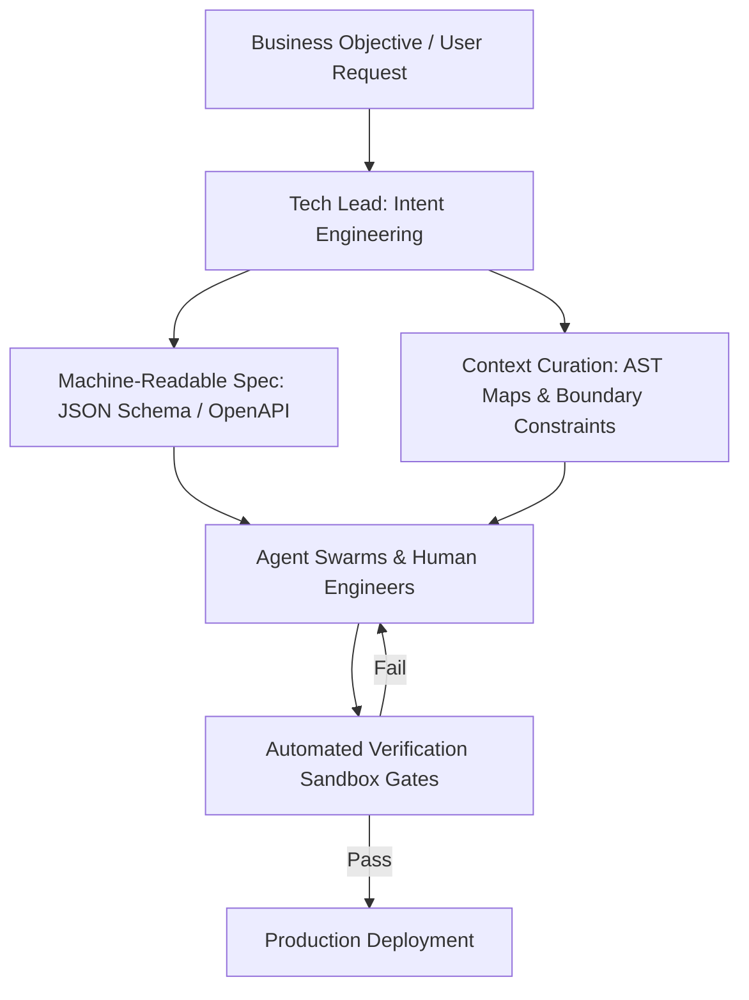

# The Architect of Intent: Transitioning from Code Author to Context & Spec Engineer

For decades, the standard measure of a Tech Lead's value was technical execution volume: how many lines of complex boilerplate they could write, how quickly they could fix tricky bugs, and how directly they guided team members through syntax and framework mechanics.

In 2026, autonomous AI coding agents generate over 70% of production code lines. As a result, the role of the Tech Lead has undergone a fundamental transformation. The primary engineering bottleneck is no longer *writing implementation code*, but rather **framing unambiguous technical intent**. 

Tech Leads have evolved into **Architects of Intent**. This article details how modern engineering leaders design machine-readable specifications, curate high-precision context windows, and establish clear boundary contracts for human and AI developer teams.

---

## The "Architect of Intent" Workflow

Instead of jumping straight into IDE code files, the modern Tech Lead operates at a higher level of abstraction:



### The Three Core Leadership Pillars
1. **Specification Engineering**: Writing exact, machine-readable specifications that eliminate ambiguity before any code generation begins.
2. **Context Window Curation**: Pruning irrelevant files and bundling precise Abstract Syntax Tree (AST) definitions so agents and developers work within a clean mental and computational context.
3. **Boundary Invariant Enforcement**: Defining non-functional constraints—such as memory budgets, locking behaviors, and latency SLAs—that code implementations must strictly satisfy.

---

## Python Automation: Context & Spec Bundle Generator

To ensure AI agents receive clean, authoritative context without hitting token limit bloat, Tech Leads use automated scripts to parse dependency graphs and build structured prompt payloads.

Here is a production Python tool that extracts target Python class definitions and generates an unambiguous agent task payload:

```python
import ast
import json
import os
from typing import Dict, Any, List

class CodebaseContextExtractor:
    """
    Parses source files to extract exact class signatures and docstrings,
    building a clean, low-token context bundle for AI coding agents.
    """
    def __init__(self, target_filepath: str):
        self.filepath = target_filepath

    def extract_signatures(() -> Dict[str, Any]:
        if not os.path.exists(self.filepath):
            return {"error": f"File {self.filepath} not found"}

        with open(self.filepath, "r", encoding="utf-8") as f:
            tree = ast.parse(f.read(), filename=self.filepath)

        classes = []
        for node in ast.walk(tree):
            if isinstance(node, ast.ClassDef):
                methods = []
                for item in node.body:
                    if isinstance(item, ast.FunctionDef):
                        args = [arg.arg for arg in item.args.args]
                        methods.append({
                            "method_name": item.name,
                            "arguments": args,
                            "docstring": ast.get_docstring(item)
                        })
                classes.append({
                    "class_name": node.name,
                    "docstring": ast.get_docstring(node),
                    "methods": methods
                })

        return {"file": self.filepath, "classes": classes}

class IntentSpecBuilder:
    """
    Combines technical requirements with codebase AST signatures
    to create a machine-readable task bundle for agents.
    """
    def __init__(self, objective: str, invariants: List[str]):
        self.objective = objective
        self.invariants = invariants

    def build_agent_payload(self, context_data: Dict[str, Any]) -> str:
        payload = {
            "task_objective": self.objective,
            "architectural_invariants": self.invariants,
            "authoritative_context": context_data,
            "output_format": "Python module implementing requested interfaces matching invariants"
        }
        return json.dumps(payload, indent=2)

# Demonstration Usage
if __name__ == "__main__":
    # Create sample file for context parsing
    sample_code_path = "sample_service.py"
    with open(sample_code_path, "w") as f:
        f.write('''
class PaymentGateway:
    """Handles external transaction processing."""
    def process_charge(self, account_id: str, amount_cents: int) -> bool:
        """Executes payment network call."""
        pass
''')

    # Step 1: Extract authoritative AST context
    extractor = CodebaseContextExtractor(sample_code_path)
    signatures = extractor.extract_signatures()

    # Step 2: Build Intent Spec
    spec_builder = IntentSpecBuilder(
        objective="Implement StripePaymentAdapter inheriting from PaymentGateway with retry exponential backoff",
        invariants=[
            "Must never block main looper thread",
            "Must throw PaymentNetworkTimeoutException on 3 consecutive failures",
            "Must format amounts strictly in integer cents"
        ]
    )

    agent_prompt_payload = spec_builder.build_agent_payload(signatures)
    print("Generated Agent Intent Spec Bundle:")
    print(agent_prompt_payload)

    # Cleanup sample file
    if os.path.exists(sample_code_path):
        os.remove(sample_code_path)
```

---

## Important Leadership Traps

When transitioning from code author to architect of intent, avoid these operational anti-patterns:

> [!IMPORTANT]
> **Vague Prompting as Specs**: Natural language prompts like *"Make this payment module robust"* lead to non-deterministic, buggy agent outputs. Specifications must state concrete schema requirements, exact error types, and quantifiable latency limits.

> [!CAUTION]
> **Context Window Flooding**: Feeding entire repository files into agent prompts causes hallucination and high token costs. Filter context down strictly to the specific AST signatures and interface contracts required for the task.

---

## Real-World Enterprise Impact
Engineering teams implementing "Architect of Intent" workflows report dramatic improvements:
* **80% Reduction in PR Rejections**: Tasks defined with clear AST context bundles pass automated verification checks on the first attempt.
* **10x Scaling of Engineering Output**: A single Tech Lead can effectively orchestrate 5 concurrent agent execution runs, maintaining complete control over code quality and system architecture.
