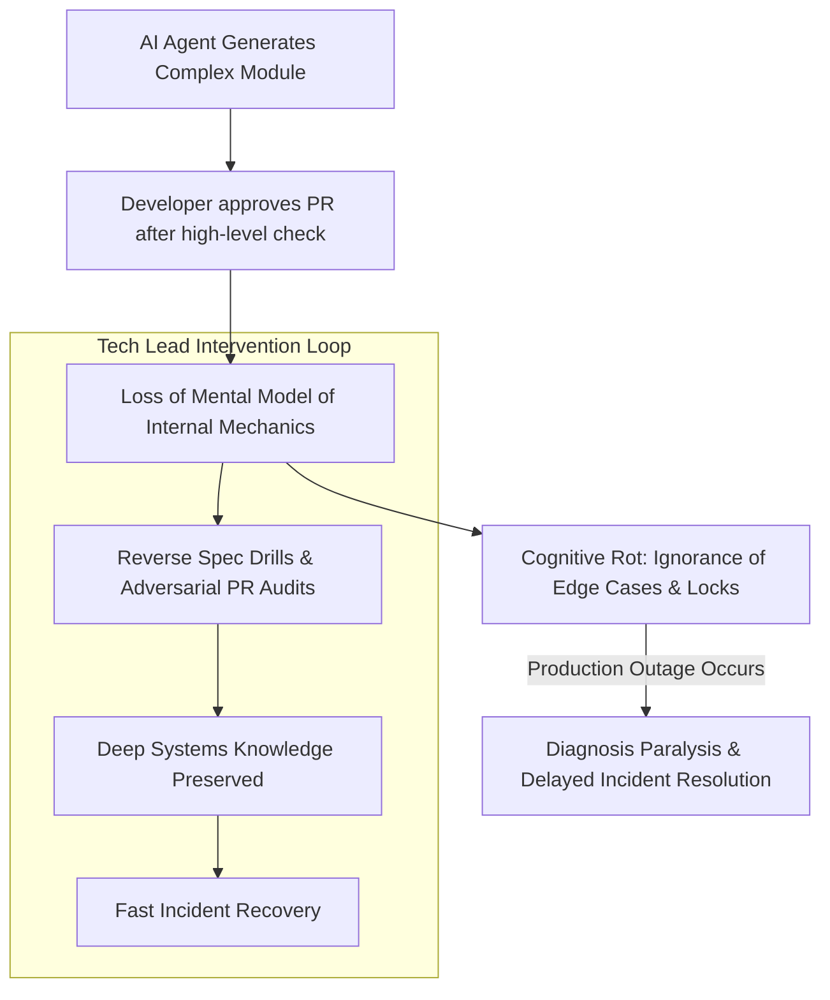

# Combatting Cognitive Rot: Preserving Deep Systems Understanding in AI-Driven Teams

As AI coding tools generate an increasing share of production software, engineering velocity reaches unprecedented heights. However, engineering leaders are discovering a subtle, insidious long-term risk: **Cognitive Rot** (or System Knowledge Atrophy).

When developers delegate implementation details, debugging, and edge-case handling to AI agents, their **mental model of the codebase degrades**. Over time, engineers become reliant on AI to explain their own systems. When a complex zero-day incident or silent deadlock strikes production, the team struggles to diagnose the root cause because nobody deeply understands the system's underlying runtime mechanics.

To maintain high team capability, modern Tech Leads actively fight cognitive rot. This article outlines technical strategies, review practices, and automation tools to preserve deep systems knowledge in AI-driven teams.

---

## The Cognitive Decay Cycle

Without deliberate intervention, delegating implementation leads to systemic mental model breakdown:



### The Three Symptoms of Cognitive Rot
1. **Passive PR Approval**: Reviewers approve AI-generated code by running unit tests without inspecting internal state mutation mechanics or lock safety.
2. **Loss of Invariant Awareness**: Developers cannot answer fundamental architectural questions, such as *"What happens to database connection pools if this streaming endpoint times out?"*
3. **Debugging Dependency**: Engineers are unable to debug production tracebacks without feeding the error output back into an AI prompt.

---

## Python Automation: Reverse-Spec Verification Engine

To prevent passive code approval, Tech Leads introduce **Reverse-Spec Exercises** into sprint workflows. In a Reverse-Spec drill, a tool strips docstrings and comments from AI-generated modules, requiring developers to inspect the raw code and document its hidden state invariants.

Here is a Python utility that parses Python modules, strips existing docstrings, and generates an interactive verification quiz for code review meetings:

```python
import ast
import os
from typing import Dict, Any, List

class ReverseSpecParser(ast.NodeTransformer):
    """
    Strips docstrings and comments from AST nodes to create 
    a bare implementation file for Reverse-Spec code review drills.
    """
    def visit_FunctionDef(self, node: ast.FunctionDef):
        # Remove docstring if present as first statement
        if node.body and isinstance(node.body[0], ast.Expr) and isinstance(node.body[0].value, ast.Constant):
            node.body.pop(0)
        self.generic_visit(node)
        return node

    def visit_ClassDef(self, node: ast.ClassDef):
        if node.body and isinstance(node.body[0], ast.Expr) and isinstance(node.body[0].value, ast.Constant):
            node.body.pop(0)
        self.generic_visit(node)
        return node

def generate_drill_file(source_path: str, output_path: str):
    """
    Reads target python file, removes documentation, and writes drill template.
    """
    with open(source_path, "r", encoding="utf-8") as f:
        tree = ast.parse(f.read(), filename=source_path)

    transformer = ReverseSpecParser()
    cleaned_tree = transformer.visit(tree)
    ast.fix_missing_locations(cleaned_tree)

    cleaned_code = ast.unparse(cleaned_tree)

    with open(output_path, "w", encoding="utf-8") as f:
        f.write("# REVERSE-SPEC DRILL: Read the code below and document:\n")
        f.write("# 1. What are the thread-safety invariants?\n")
        f.write("# 2. What exceptions can be thrown?\n\n")
        f.write(cleaned_code)

# Demonstration Execution
if __name__ == "__main__":
    sample_module = "complex_cache.py"
    drill_output = "drill_complex_cache.py"

    # Create sample AI-generated file with docstrings
    with open(sample_module, "w") as f:
        f.write('''
class MemoryCache:
    """Thread-safe TTL cache store."""
    def get_or_set(self, key: str, value_fn):
        """Fetches key or computes value under lock."""
        pass
''')

    print(f"Generating Reverse-Spec Drill file from {sample_module}...")
    generate_drill_file(sample_module, drill_output)
    
    print(f"✅ Drill file written to {drill_output}. Ready for team audit exercise.")

    # Cleanup sample files
    for p in [sample_module, drill_output]:
        if os.path.exists(p):
            os.remove(p)
```

---

## Important Leadership Guardrails

When fighting cognitive rot, balance learning with engineering velocity:

> [!IMPORTANT]
> **Adversarial PR Questions**: Require reviewers to ask at least one structural question on every AI-generated PR (e.g., *"Why did the agent use an async lock here instead of a reentrant RLock?"*). This forces developers to read and understand generated code before merging.

> [!CAUTION]
> **Avoid "Busywork" Audits**: Do not force developers to manually reverse-spec trivial boilerplate (like getter/setter methods or standard CRUD endpoints). Focus deep-dive audits strictly on critical infrastructure: distributed locking, payment gateways, and database state machines.

---

## Real-World Enterprise Impact
Teams implementing active anti-cognitive rot practices maintain strong operational capabilities:
* **60% Faster Incident MTTR (Mean Time to Resolution)**: Engineers retain deep mental models of system internals, allowing them to diagnose production outages instantly.
* **Higher Engineering Mastery**: Junior developers gain true architectural understanding rather than becoming mere "prompt operators."
