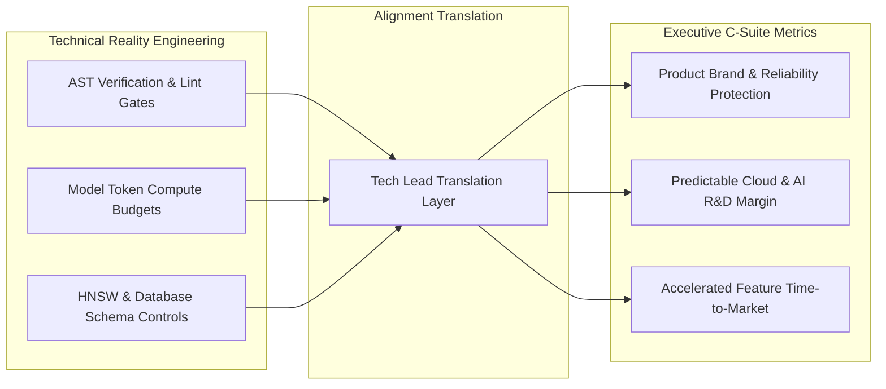

# Cross-Functional Alignment: Translating AI Engineering to Executive Stakeholders

In the era of autonomous coding agents and rapid AI advancement, non-technical executive stakeholders—CEOs, Product VPs, and Board Members—are inundated with media headlines promising instant software development. This frequently creates a massive operational disconnect:

> *Executives ask: "If AI can write code in seconds, why is our quarterly feature roadmap still taking two months?"*

Tech Leads must bridge this gap. While AI tools accelerate code typing, non-technical stakeholders often fail to understand the necessary engineering guardrails: specification engineering, automated verification gates, security audits, and rate-limit compute budgets.

This article details how Tech Leads build **Cross-Functional Alignment**, translate technical constraints into financial ROI metrics, and present authoritative executive dashboards.

---

## The Technical-to-Executive Alignment Bridge

Tech Leads must translate internal engineering mechanics into strategic business metrics:



### The Three Translation Pillars
1. **From "Code Generation" to "System Verification"**: Explaining that AI generates raw drafts quickly, but engineering value lies in automated verification that prevents costly production outages.
2. **From "API Token Costs" to "Unit Economics"**: Framing model token compute spend not as an overhead expense, but as a direct capital investment that reduces feature delivery cycles.
3. **From "Story Points" to "DORA Outcome Velocity"**: Reporting business-oriented DORA metrics (Deployment Frequency, Change Failure Rate) rather than arbitrary velocity points.

---

## Python Automation: Executive ROI & Velocity Dashboard Generator

To present clear data to executive leadership, Tech Leads build automated telemetry scripts that translate raw git and token logs into high-level business reports.

Here is a production Python tool that compiles a C-suite Executive Summary:

```python
import json
from typing import Dict, Any

class ExecutiveDashboardCompiler:
    """
    Translates raw engineering telemetry (token spend, verification rates, DORA metrics)
    into executive-ready business ROI summaries.
    """
    def __init__(self, monthly_token_spend: float, dev_count: int, deployments_shipped: int, failure_rate_pct: float):
        self.token_spend = monthly_token_spend
        self.dev_count = dev_count
        self.deployments = deployments_shipped
        self.failure_rate = failure_rate_pct

    def calculate_roi_metrics(self) -> Dict[str, Any]:
        # Estimate engineering hours saved (average 15 hours saved per dev/week via AI automation)
        monthly_hours_saved = self.dev_count * 15 * 4.33
        estimated_cost_per_hour = 85.0  # Average developer hourly cost
        gross_savings = monthly_hours_saved * estimated_cost_per_hour
        net_savings = gross_savings - self.token_spend
        roi_multiplier = round(gross_savings / max(self.token_spend, 1.0), 2)

        return {
            "monthly_ai_compute_spend_usd": self.token_spend,
            "estimated_dev_hours_saved": round(monthly_hours_saved, 1),
            "net_financial_value_generated_usd": round(net_savings, 2),
            "ai_investment_roi_multiplier": f"{roi_multiplier}x",
            "production_deployment_frequency": f"{self.deployments} releases/month",
            "system_reliability_rating": "EXCELLENT" if self.failure_rate < 5.0 else "WARNING"
        }

    def generate_executive_summary_markdown(self) -> str:
        metrics = self.calculate_roi_metrics()
        
        md = f"""# Executive Engineering ROI & Velocity Report
        
## Strategic Business Summary
* **Net Value Generated**: ${metrics['net_financial_value_generated_usd']:,.2f}
* **AI Investment ROI**: **{metrics['ai_investment_roi_multiplier']}**
* **Monthly Compute Investment**: ${metrics['monthly_ai_compute_spend_usd']:,.2f}

## Delivery & Reliability Metrics
* **Production Deployments**: {metrics['production_deployment_frequency']}
* **Estimated Engineering Hours Reallocated**: {metrics['estimated_dev_hours_saved']} hrs
* **Production Reliability Status**: **{metrics['system_reliability_rating']}** (Change Failure Rate: {self.failure_rate}%)
"""
        return md

# Demonstration Execution
if __name__ == "__main__":
    # Simulate monthly telemetry for a 10-developer team
    compiler = ExecutiveDashboardCompiler(
        monthly_token_spend=2450.00,
        dev_count=10,
        deployments_shipped=48,
        failure_rate_pct=2.1
    )

    report_md = compiler.generate_executive_summary_markdown()
    print(report_md)
```

---

## Important Executive Alignment Guardrails

When communicating with executive stakeholders, observe these alignment guidelines:

> [!IMPORTANT]
> **Set Realistic Roadmap Buffers**: Never reduce feature time estimates by 90% simply because AI writes code faster. Always factor in context assembly overhead, automated verification runs, and human architectural review buffers when committing to executive milestones.

> [!CAUTION]
> **Avoid Jargon Inflation**: Do not present raw LLM metrics (like "context length", "LoRA rank", or "embeddings dimensions") in executive meetings. Translate all technical metrics into business impacts: cost savings, risk reduction, and release speed.

---

## Real-World Enterprise Impact
Teams establishing Cross-Functional Alignment experience:
* **Complete Executive Trust & Support**: Transparent ROI modeling justifies AI infrastructure investments.
* **Realistic Product Roadmaps**: Engineering teams deliver on 95%+ of committed quarterly milestones without burnout.
