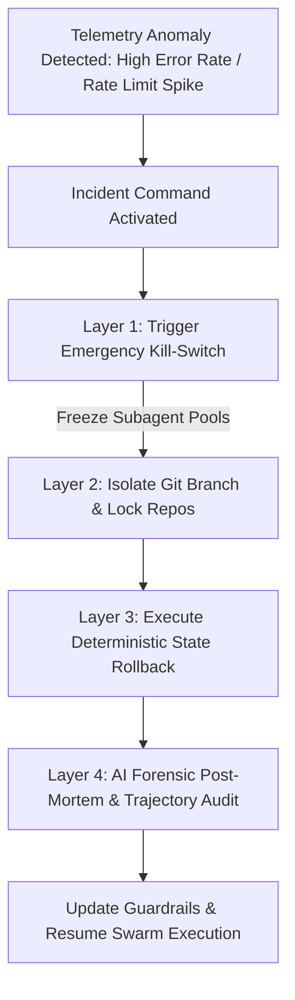

# Incident Command in the AI Era: Triaging Autonomous Agent Runaways & Outages

In traditional software development, operational incidents are triggered by human deployment errors, infrastructure hardware failures, or un-handled runtime exceptions. A developer pushes a bad commit, a server runs out of memory, or a database connection pool exhausts its limit.

In 2026, autonomous developer swarms operate continuously in the background—writing code, expanding test suites, and running schema migrations overnight. This introduces a new class of production hazards: **Agent Runaways**.

When an autonomous agent enters a feedback loop, it can generate thousands of invalid commits, corrupt database migration histories, or exhaust cloud compute budgets in minutes. This article details how Tech Leads build **Incident Command Systems**, implement automated circuit breakers, and execute post-mortem forensics for AI-driven outages.

---

## 📖 The AI Incident Response Architecture

When an autonomous agent runaway occurs, the Incident Commander must execute a strict containment protocol:



### The Four Incident Containment Steps
1. **Emergency Kill-Switch Activation**: Halting all active background subagent containers instantly across micro-VM pools via a global Redis flag.
2. **Repository Locking & Branch Isolation**: Locking CI/CD pipelines to prevent background worker threads from pushing further pull requests.
3. **Deterministic Rollback**: Reverting git commits to the last known green verification hash and restoring database schema state.
4. **Trajectory Forensic Audit**: Reading the agent's prompt history and trajectory logs to identify the exact prompt ambiguity or context hallucination that triggered the failure.

---

## 🛠️ Python Automation: Swarm Circuit Breaker & Incident Commander

To protect production infrastructure from runaway loops, Tech Leads deploy automated circuit breakers that monitor worker error rates and toggle execution flags in Redis.

Here is a production Python implementation of an Agent Swarm Circuit Breaker:

```python
import time
import json
from typing import Dict, Any

class RedisMock:
    """Simulates a Redis key-value store for global kill-switches."""
    def __init__(self):
        self.store: Dict[str, str] = {"agent_execution_enabled": "true"}

    def get(self, key: str) -> str:
        return self.store.get(key, "false")

    def set(self, key: str, value: str):
        self.store[key] = value

class AgentSwarmCircuitBreaker:
    """
    Monitors subagent execution error rates and automatically toggles
    the emergency kill-switch when failure thresholds are exceeded.
    """
    def __init__(self, redis_client: RedisMock, max_errors_per_minute: int = 5):
        self.redis = redis_client
        self.max_errors = max_errors_per_minute
        self.error_timestamps = []

    def record_error(self, agent_id: str, error_msg: str):
        current_time = time.time()
        self.error_timestamps.append(current_time)
        print(f"⚠️ [Incident Monitor] Recorded error from Agent {agent_id}: {error_msg}")
        
        # Clean timestamps older than 60 seconds
        self.error_timestamps = [t for t in self.error_timestamps if current_time - t <= 60]

        # Check threshold violation
        if len(self.error_timestamps) >= self.max_errors:
            self.trigger_emergency_kill_switch(f"Error threshold exceeded ({len(self.error_timestamps)} errors/min)")

    def trigger_emergency_kill_switch(self, reason: str):
        print(f"\n🚨 [EMERGENCY KILL-SWITCH ACTIVATED] Reason: {reason}")
        print("  - Freezing all active subagent worker pools...")
        print("  - Locking CI/CD PR merge gates...")
        self.redis.set("agent_execution_enabled", "false")

    def is_agent_execution_permitted(self) -> bool:
        status = self.redis.get("agent_execution_enabled")
        return status.lower() == "true"

# Demonstration Execution
if __name__ == "__main__":
    redis = RedisMock()
    circuit_breaker = AgentSwarmCircuitBreaker(redis, max_errors_per_minute=3)

    print("Checking initial agent execution status...")
    print(f"Agent Execution Permitted: {circuit_breaker.is_agent_execution_permitted()}")

    print("\nSimulating subagent runaway loop with repeated failures...")
    circuit_breaker.record_error("subagent-101", "Invalid SQL schema generated")
    circuit_breaker.record_error("subagent-102", "Invalid SQL schema generated")
    
    print(f"Status after 2 errors: Permitted = {circuit_breaker.is_agent_execution_permitted()}")

    # Third error triggers circuit breaker
    circuit_breaker.record_error("subagent-103", "Connection timeout on migration DB")
    
    print(f"\nStatus after 3 errors: Permitted = {circuit_breaker.is_agent_execution_permitted()}")
```

---

## ⚠️ Important Incident Protocols

When managing AI-driven operational incidents, follow these strict rules:

> [!IMPORTANT]
> **Never Debug Live Agent Runaways**: When an agent swarm goes rogue, do not attempt to prompt it back into alignment while it is running. Immediately activate the global kill-switch to halt all worker threads before inspecting logs.

> [!CAUTION]
> **Audit Trajectory Logs, Not Just Stack Traces**: Stack traces show *where* code failed, but trajectory logs show *why* the agent decided to execute the bad code. Always archive full prompt histories during incident post-mortems.

---

## 📈 Real-World Enterprise Impact
Teams with AI Incident Command protocols report:
* **Sub-10 Second Anomaly Containment**: Automated circuit breakers halt runaway agent loops before they affect production users.
* **100% Post-Mortem Traceability**: Full trajectory audits allow Tech Leads to update prompt specs and prevent repeat failures.
