# The 100x Developer Myth: Measuring Real Engineering Velocity & DORA Metrics

With the widespread adoption of AI coding assistants and autonomous subagent swarms, the tech industry has seen a resurgence of the **"100x Developer" myth** [1]. Marketing claims promise that AI tools will increase developer output by 100 times, pointing to metrics like thousands of lines of code generated per day or dozens of Pull Requests opened overnight.

However, experienced engineering leaders know that **more code does not equal more value**. In fact, generating massive volumes of un-verified code often increases technical debt, degrades review quality, and inflates production bug rates.

To measure true team leverage in the AI era, Tech Leads must discard vanity metrics and focus on **DevOps Research and Assessment (DORA) Metrics**. This article details how to track genuine engineering velocity and deployment health when AI tools generate the majority of code lines.

---

## Vanity Metrics vs. True DORA Velocity

Measuring developer productivity by lines of code in an AI-driven environment is like measuring aircraft efficiency by how much fuel it burns:

```mermaid
flowchart TD
  subgraph SG1_FlawedVanityMetrics ["Flawed Vanity Metrics (Focus on Output Volume)"]
    A["Lines of Code Generated"] --> B["High PR Count"]
    B --> C["False Sense of Velocity"]
    C -->|Hidden Risk| D["Bloated Technical Debt & Review Fatigue"]
  end
  subgraph SG2_TrueDoraOutcome ["True DORA Outcome Metrics (Focus on System Value)"]
    E["Deployment Frequency"] --> F["Lead Time for Changes"]
    F --> G["Change Failure Rate"]
    G --> H["Mean Time to Recovery MTTR"]
    H --> I["Sustainable High-Value Velocity"]
  end

classDef green fill:#dcfce7,stroke:#16a34a,stroke-width:2px,color:#14532d;
classDef red fill:#fee2e2,stroke:#dc2626,stroke-width:2px,color:#7f1d1d;
classDef blue fill:#e0f2fe,stroke:#0284c7,stroke-width:2px,color:#0c4a6e;
classDef yellow fill:#fef3c7,stroke:#d97706,stroke-width:2px,color:#78350f;
classDef purple fill:#ede9fe,stroke:#7c3aed,stroke-width:2px,color:#4c1d95;
class A,F blue
class B,G green
class C,H purple
class D,I yellow
class E red
```



### The Four Core DORA Metrics in the AI Era
1. **Deployment Frequency**: How often successfully verified code is shipped to production. High velocity means small, continuous, safe releases.
2. **Lead Time for Changes**: The time elapsed from a developer framing intent (commit) to that code running safely in production.
3. **Change Failure Rate**: The percentage of deployments that cause production outages or require emergency rollbacks. (If AI generation increases PR volume but doubles your failure rate, net velocity has decreased).
4. **Mean Time to Recovery (MTTR)**: How quickly the team restores service when an incident occurs.

---

## Python Tooling: DORA Metric & Deployment Health Calculator

To track true engineering leverage automatically, Tech Leads implement telemetry pipelines that analyze deployment events and git commit logs.

Here is a production Python tool that calculates DORA metrics from commit and deployment logs:

```python
import json
from datetime import datetime, timedelta
from typing import List, Dict, Any

class DeploymentEvent:
    def __init__(self, event_id: str, commit_time: str, deploy_time: str, is_failure: bool, recovery_time_mins: float = 0.0):
        self.event_id = event_id
        self.commit_time = datetime.fromisoformat(commit_time)
        self.deploy_time = datetime.fromisoformat(deploy_time)
        self.is_failure = is_failure
        self.recovery_time_mins = recovery_time_mins

class DORAMetricsCalculator:
    """
    Calculates authoritative DORA metrics from deployment event logs.
    """
    def __init__(self, events: List[DeploymentEvent]):
        self.events = events

    def calculate_lead_time_minutes(self) -> float:
        if not self.events:
            return 0.0
        total_lead_time = sum((e.deploy_time - e.commit_time).total_seconds() / 60.0 for e in self.events)
        return round(total_lead_time / len(self.events), 2)

    def calculate_change_failure_rate(self) -> float:
        if not self.events:
            return 0.0
        failures = sum(1 for e in self.events if e.is_failure)
        return round((failures / len(self.events)) * 100.0, 2)

    def calculate_mttr_minutes(self) -> float:
        failed_events = [e for e in self.events if e.is_failure]
        if not failed_events:
            return 0.0
        total_recovery = sum(e.recovery_time_mins for e in failed_events)
        return round(total_recovery / len(failed_events), 2)

    def generate_report(() -> Dict[str, Any]:
        return {
            "total_deployments_evaluated": len(self.events),
            "lead_time_for_changes_avg_mins": self.calculate_lead_time_minutes(),
            "change_failure_rate_pct": self.calculate_change_failure_rate(),
            "mean_time_to_recovery_mttr_mins": self.calculate_mttr_minutes(),
            "performance_rating": self._rate_performance()
        }

    def _rate_performance(self) -> str:
        cfr = self.calculate_change_failure_rate()
        lead_time = self.calculate_lead_time_minutes()
        
        if cfr < 5.0 and lead_time < 60.0:
            return "ELITE (High velocity & ultra-low failure)"
        elif cfr < 15.0:
            return "HIGH (Strong delivery pipeline)"
        else:
            return "NEEDS ATTENTION (High change failure rate - check AI verification gates)"

# Demonstration Execution
if __name__ == "__main__":
    # Simulate a week of deployment events
    sample_events = [
        DeploymentEvent("DEP-101", "2026-07-28T00:00:00", "2026-07-28T00:25:00", is_failure=False),
        DeploymentEvent("DEP-102", "2026-07-28T01:00:00", "2026-07-28T01:30:00", is_failure=False),
        DeploymentEvent("DEP-103", "2026-07-28T02:00:00", "2026-07-28T02:40:00", is_failure=True, recovery_time_mins=12.0),
        DeploymentEvent("DEP-104", "2026-07-28T03:00:00", "2026-07-28T03:20:00", is_failure=False)
    ]

    calculator = DORAMetricsCalculator(sample_events)
    report = calculator.generate_report()
    
    print("DORA Metrics & Engineering Health Report:")
    print(json.dumps(report, indent=2))
```

---

## Important Leadership Guardrails

When evaluating developer productivity in AI-driven teams, maintain these principles:

> [!IMPORTANT]
> **Protect Against Review Fatigue**: If AI tools increase PR creation rate by 5x, human code review queues become overwhelmed. Enforce automated verification gates (Layer 1–4) so human Tech Leads only review code that has already passed all static and dynamic tests.

> [!CAUTION]
> **Never Reward Raw Lines of Code**: Rewarding developers for high line counts incentivizes team members to accept bloated, un-optimized AI outputs. Reward developers for code deletions, architectural elegance, and low change failure rates.

---

## Real-World Enterprise Impact
Teams measuring DORA metrics rather than vanity volume report:
* **45% Drop in Change Failure Rates**: Shifting focus to verification and small deployment batches prevents production regressions.
* **Sustained High Team Morale**: Developers avoid review burnout by working within automated verification pipelines. [2]

## References & Further Reading

1. **Ongaro, D., & Ousterhout, J. (2014)**. *In Search of an Understandable Consensus Algorithm*. USENIX ATC. [https://raft.github.io/raft.pdf](https://raft.github.io/raft.pdf)
2. **Lamport, L. (2001)**. *Paxos Made Simple*. ACM SIGACT News. [https://lamport.azurewebsites.net/pubs/paxos-simple.pdf](https://lamport.azurewebsites.net/pubs/paxos-simple.pdf)
3. **Burrows, M. (2006)**. *The Chubby Lock Service for Loosely-Coupled Distributed Systems*. OSDI. [https://research.google/pubs/pub27897/](https://research.google/pubs/pub27897/)
4. **Axboe, J. (2019)**. *Efficient IO with io_uring*. kernel.dk. [https://kernel.dk/io_uring.pdf](https://kernel.dk/io_uring.pdf)
5. **Linux Kernel Community (2024)**. *BPF Documentation*. kernel.org. [https://docs.kernel.org/bpf/](https://docs.kernel.org/bpf/)
6. **Høiland-Jørgensen, T., et al. (2018)**. *The eXpress Data Path: Fast Programmable Packet Processing in the Operating System Kernel*. CoNEXT. [https://dl.acm.org/doi/10.1145/3281411.3281443](https://dl.acm.org/doi/10.1145/3281411.3281443)
