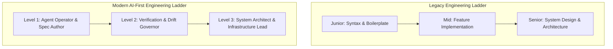

# Mentorship & Career Laddering in the Post-Junior Era: Nurturing System Architects

Historically, software engineers advanced their careers through a well-defined progression. Junior developers spent their first few years writing routine CRUD endpoints, fixing minor bugs, writing boilerplate unit tests, and learning framework syntax line by line.

In 2026, autonomous AI coding tools handle nearly all routine boilerplate, initial bug triage, and test expansion instantly. This has created a critical career growth paradox for engineering leaders:

> *If AI tools perform all the entry-level implementation tasks, how do junior and mid-level developers gain the experience needed to become senior system architects?*

To prevent a future shortage of senior engineering talent, modern Tech Leads have redesigned mentorship models and engineering career ladders. This article details how to train early-career developers into high-level **System Architects** in an AI-first software industry.

---

## The Evolved Career Progression Ladder

In the post-junior era, developer growth shifts from *syntax mastery* to *systems & architectural mastery*:



### The Three Levels of Modern Engineering Growth
1. **Level 1: Agent Operator & Spec Author**: Early-career engineers learn to write unambiguous, machine-readable specifications, curate context windows, and pair-program with AI subagent tools.
2. **Level 2: Verification & Drift Governor**: Engineers master Abstract Syntax Tree (AST) linters, build automated micro-VM test harnesses, enforce domain boundary rules, and prevent AI code drift.
3. **Level 3: System Architect**: Senior leaders design distributed data models, manage multi-agent swarm topologies, enforce security invariants, and balance token compute economics.

---

## Python Tooling: Mentorship Code-Decomposition Generator

To help junior developers understand complex AI-generated codebases, Tech Leads use automated code-decomposition tools. These tools analyze generated code modules and automatically synthesize architectural learning prompts for team mentoring sessions.

Here is a production Python script that parses complex Python code, identifies key design patterns (locks, database connections, threading), and outputs structured mentoring questions:

```python
import ast
import json
from typing import List, Dict, Any

class MentorshipCodeDecomposer(ast.NodeVisitor):
    """
    Parses complex agent-generated source code and extracts architectural 
    teaching points to guide junior developer code walkthroughs.
    """
    def __init__(self):
        self.teaching_points: List[Dict[str, Any]] = []

    def visit_With(self, node: ast.With):
        # Identify lock or context manager usage
        for item in node.items:
            var_name = ast.unparse(item.context_expr)
            if "lock" in var_name.lower():
                self.teaching_points.append({
                    "line": node.lineno,
                    "topic": "Concurrency & Locking Mechanics",
                    "code_snippet": f"with {var_name}: ...",
                    "mentorship_question": f"Why is '{var_name}' required here? What race condition would occur if this block ran without a lock?"
                })
        self.generic_visit(node)

    def visit_ExceptHandler(self, node: ast.ExceptHandler):
        # Identify exception handling blocks
        exc_type = ast.unparse(node.type) if node.type else "Bare Except"
        self.teaching_points.append({
            "line": node.lineno,
            "topic": "Fault Tolerance & Exception Recovery",
            "code_snippet": f"except {exc_type}:",
            "mentorship_question": f"How does catching '{exc_type}' impact system state? Is this exception retryable or fatal?"
        })
        self.generic_visit(node)

def generate_mentorship_guide(filepath: str) -> List[Dict[str, Any]]:
    with open(filepath, "r", encoding="utf-8") as f:
        tree = ast.parse(f.read(), filename=filepath)

    decomposer = MentorshipCodeDecomposer()
    decomposer.visit(tree)
    return decomposer.teaching_points

# Demonstration Execution
if __name__ == "__main__":
    sample_module = "distributed_lock.py"
    
    # Create sample agent-generated implementation
    with open(sample_module, "w") as f:
        f.write('''
import threading

mutex = threading.Lock()

def update_shared_state(data):
    try:
        with mutex:
            print("Updating critical section")
    except RuntimeError as e:
        print("Runtime failure")
''')

    print(f"Analyzing {sample_module} for Mentorship Teaching Points...\n")
    questions = generate_mentorship_guide(sample_module)
    
    for idx, item in enumerate(questions, 1):
        print(f"Teaching Point {idx} [Line {item['line']} - {item['topic']}]:")
        print(f"  Code: {item['code_snippet']}")
        print(f"  Discussion Question: {item['mentorship_question']}\n")

    # Cleanup sample file
    import os
    if os.path.exists(sample_module):
        os.remove(sample_module)
```

---

## Important Leadership Guardrails

When updating career growth structures for AI-native teams, maintain these principles:

> [!IMPORTANT]
> **Evaluate Impact, Not Lines of Code**: Traditional performance metrics like "commits per week" or "lines of code written" become meaningless when AI generates code. Evaluate engineers on specification quality, architectural soundness, verification thoroughness, and incident prevention.

> [!CAUTION]
> **Don't Skip Fundamentals**: While junior developers shouldn't spend months typing manual boilerplate, they must still learn core computer science fundamentals—data structures, memory allocation, OS process dynamics, and networking protocols. Use AI as an interactive tutor rather than a crutch.

---

## Real-World Enterprise Impact
Organizations implementing AI-first mentorship models report:
* **2x Accelerated Time-to-Senior**: Early-career developers reach system architect capability years faster by focusing on architecture and verification from day one.
* **Resilient Talent Pipeline**: Teams build sustainable, highly skilled engineering cultures capable of designing complex systems for decades to come.
