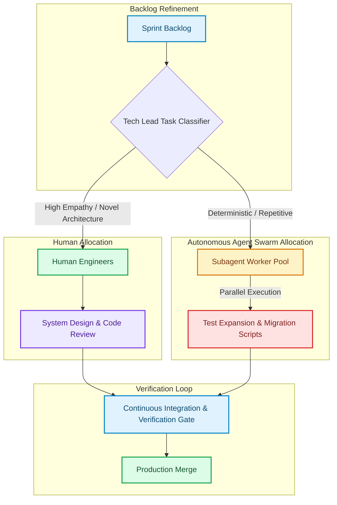

# Orchestrating Hybrid Swarms: Sprint Planning for Humans and Autonomous Agents

Traditional agile sprint planning assumes a static engineering capacity based on developer headcount and story points [1]. A team of six developers might commit to 40 story points per two-week sprint based on historical velocity.

In 2026, engineering teams no longer consist solely of human developers. High-performing teams operate as **Hybrid Swarms**, where human engineers lead design and review while autonomous background subagent swarms execute parallel implementation tasks.

This structural shift renders traditional story-point estimation obsolete. This article details how Tech Leads manage **Hybrid Sprint Planning**, decompose tasks into asynchronous dependency graphs, and allocate compute budgets across AI agent execution pools.

---

## The Hybrid Sprint Lifecycle

In a hybrid team model, task allocation is driven by **Task Complexity & Determinism**:



### The Task Categorization Matrix
1. **Human-Centric Tasks (Low Determinism, High Ambiguity)**: Core architectural decisions, threat modeling, API contract negotiations, and user experience design.
2. **Hybrid-Pair Tasks (Moderate Ambiguity)**: Complex feature implementations where a human developer writes the specification and pair-programs with an active AI assistant.
3. **Autonomous Agent Tasks (High Determinism, High Volume)**: Database migration script generation, comprehensive unit test suite expansion, third-party API adapter bindings, and dependency updates.

---

## Python Scheduler: Hybrid Task DAG Dispatcher

To manage asynchronous execution across background subagent pools without overloading CI queues or API rate limits, Tech Leads build DAG-based task dispatchers.

Here is a production Python script that parses sprint tasks, builds an asynchronous execution Directed Acyclic Graph (DAG), and dispatches subagents in parallel batches:

```python
import asyncio
import time
from typing import List, Dict, Any

class SprintTask:
    def __init__(self, task_id: str, title: str, execution_type: str, dependencies: List[str]):
        self.task_id = task_id
        self.title = title
        self.execution_type = execution_type  # "HUMAN", "PAIR", or "AUTONOMOUS_AGENT"
        self.dependencies = dependencies
        self.completed = False

class HybridSprintScheduler:
    """
    Orchestrates sprint task DAGs, routing deterministic implementation tasks
    to background subagent swarms while tracking completion states.
    """
    def __init__(self, tasks: List[SprintTask]):
        self.tasks = {t.task_id: t for t in tasks}

    def get_executable_agent_tasks(self) -> List[SprintTask]:
        """
        Locates autonomous agent tasks whose dependencies are fully satisfied.
        """
        executable = []
        for task in self.tasks.values():
            if task.completed or task.execution_type != "AUTONOMOUS_AGENT":
                continue
            
            # Check if all prerequisite tasks are completed
            deps_met = all(self.tasks[dep].completed for dep in task.dependencies)
            if deps_met:
                executable.append(task)
        return executable

    async def execute_subagent_task(self, task: SprintTask):
        print(f"[Agent Pool] Dispatched autonomous subagent for task '{task.task_id}': {task.title}")
        # Simulate subagent executing background implementation and test suites
        await asyncio.sleep(1.0)
        task.completed = True
        print(f"✅ [Agent Pool] Task '{task.task_id}' completed successfully.")

    async def run_sprint_cycle(self):
        print("Starting Hybrid Sprint Execution Cycle...")
        while True:
            ready_agent_tasks = self.get_executable_agent_tasks()
            if not ready_agent_tasks:
                # Check if all agent tasks are finished
                remaining_agent_tasks = [
                    t for t in self.tasks.values() 
                    if t.execution_type == "AUTONOMOUS_AGENT" and not t.completed
                ]
                if not remaining_agent_tasks:
                    print("All background agent tasks in sprint cycle completed!")
                    break
                print("[Scheduler] Waiting on human-dependent tasks before dispatching next agent batch...")
                await asyncio.sleep(0.5)
                continue

            # Execute batch of agent tasks concurrently
            await asyncio.gather(*(self.execute_subagent_task(t) for t in ready_agent_tasks))

# Demonstration Execution
if __name__ == "__main__":
    # Define sprint task graph
    sprint_backlog = [
        SprintTask("TASK-1", "Design Payment Boundary API Contract", "HUMAN", []),
        SprintTask("TASK-2", "Generate Stripe API Adapter & Mock Suite", "AUTONOMOUS_AGENT", ["TASK-1"]),
        SprintTask("TASK-3", "Generate PayPal API Adapter & Mock Suite", "AUTONOMOUS_AGENT", ["TASK-1"]),
        SprintTask("TASK-4", "Audit Payment Security Thread Safety", "HUMAN", ["TASK-2", "TASK-3"])
    ]

    scheduler = HybridSprintScheduler(sprint_backlog)
    
    # Simulate Human finishing TASK-1
    print("Human Engineer completing TASK-1 (API Contract Design)...")
    sprint_backlog[0].completed = True

    # Run background agent pool execution
    asyncio.run(scheduler.run_sprint_cycle())
```

---

## Important Pitfalls in Hybrid Sprint Management

When managing hybrid human-agent sprint cycles, keep these guardrails in mind:

> [!IMPORTANT]
> **Token & Rate-Limit Budgets**: Running 20 subagents concurrently can exhaust API rate limits or incur unexpected cloud compute costs. Set concurrency caps (e.g. max 4 active subagent tasks per developer) in your sprint dispatchers.

> [!CAUTION]
> **Context-Swapping Overload**: Do not assign human engineers to review 50 small agent pull requests per day. Group agent-generated outputs into consolidated feature branches so code reviews occur at logical milestone boundaries.
---

## Real-World Enterprise Impact
Teams adopting Hybrid Swarm Sprint Planning experience:
* **3x Increase in Feature Throughput**: Repetitive glue code and test expansions run asynchronously in the background.
* **Eliminated Developer Burnout**: Human engineers focus strictly on high-leverage architectural design and security reviews. [2]

## References & Further Reading

1. **Malkov, Y. A., & Yashunin, D. A. (2018)**. *Efficient and Robust Approximate Nearest Neighbor Search Using Hierarchical Navigable Small World Graphs*. IEEE TPAMI. [https://arxiv.org/abs/1603.09320](https://arxiv.org/abs/1603.09320)
2. **Jégou, H., Douze, M., & Schmid, C. (2011)**. *Product Quantization for Nearest Neighbor Search*. IEEE TPAMI. [https://hal.inria.fr/inria-00514462v2/document](https://hal.inria.fr/inria-00514462v2/document)
3. **Johnson, J., Douze, M., & Jégou, H. (2019)**. *Billion-scale Similarity Search with GPUs*. IEEE Transactions on Big Data. [https://arxiv.org/abs/1702.08734](https://arxiv.org/abs/1702.08734)
4. **Apache Parquet Community (2024)**. *Apache Parquet Format*. Apache Software Foundation. [https://parquet.apache.org/docs/](https://parquet.apache.org/docs/)
5. **Apache Arrow Community (2024)**. *Apache Arrow Columnar Format*. Apache Software Foundation. [https://arrow.apache.org/docs/format/Columnar.html](https://arrow.apache.org/docs/format/Columnar.html)
6. **Apache Iceberg Community (2024)**. *Iceberg Table Spec*. Apache Software Foundation. [https://iceberg.apache.org/spec/](https://iceberg.apache.org/spec/)
