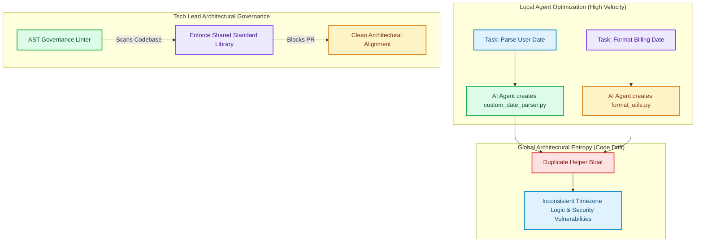

# Preventing AI Code Drift: Architectural Governance in Agentic Codebases

When software engineering teams begin using AI coding agents, initial developer velocity skyrockets [1]. Features that previously took days are generated in minutes. However, after several months of continuous AI-assisted development, many teams run into a severe structural bottleneck: **AI Code Drift**.

AI models operate within constrained context windows. When an agent generates code to solve a specific issue, it optimizes **locally**. It creates ad-hoc helper functions, introduces duplicate utility classes, imports duplicate third-party libraries, and bypasses established domain boundaries because it lacks a global mental model of the entire enterprise system.

Over time, this local optimization causes architectural degradation. This article details how modern Tech Leads implement **Architectural Governance** to catch and prevent AI code drift before it pollutes production repositories.

---

## Local Optimization vs. Global Architectural Entropy



### The Three Drivers of AI Code Drift
1. **Helper Duplication**: AI agents frequently generate custom utility functions (e.g., date parsing, string sanitization) instead of importing existing internal library helpers.
2. **Schema Fragmentation**: Agents create transient inline dictionaries or custom data structs rather than consuming central, typed schema definitions (e.g., Pydantic/TypeScript models).
3. **Layer Boundary Bypassing**: Agents frequently attempt to call database clients directly inside UI components or API controllers, breaking multi-tier separation.

---

## Python AST Governance: Automated Drift Detector

To enforce global architectural invariants automatically, Tech Leads implement custom Abstract Syntax Tree (AST) linters in pre-commit hooks and CI/CD pipelines.

Here is a production Python script that parses PR code changes to detect **unauthorized helper duplication** and **boundary layer violations**:

```python
import ast
import os
import sys
from typing import List, Dict, Any

class ArchitecturalGovernanceLinter(ast.NodeVisitor):
    """
    AST Linter that enforces strict codebase architectural rules:
    1. Blocks creation of ad-hoc date parsing helpers (enforces 'core.utils.datetime').
    2. Prevents direct database queries inside Controller modules.
    """
    def __init__(self, filename: str):
        self.filename = filename
        self.violations: List[str] = []

    def visit_ImportFrom(self, node: ast.ImportFrom):
        # Rule 1: Prevent importing raw sqlite3 or database drivers inside Controller files
        if "controllers" in self.filename and node.module in ["sqlite3", "psycopg2", "sqlalchemy"]:
            self.violations.append(
                f"[Layer Violation] Line {node.lineno}: Direct database import '{node.module}' "
                f"is forbidden inside Controller layer. Use Service Repository interfaces."
            )
        self.generic_visit(node)

    def visit_FunctionDef(self, node: ast.FunctionDef):
        # Rule 2: Detect duplicate date parsing helper functions
        banned_names = ["parse_date", "format_timestamp", "convert_datetime"]
        if node.name in banned_names:
            self.violations.append(
                f"[Code Drift] Line {node.lineno}: Custom function '{node.name}' detected. "
                f"Use authoritative shared library 'core.utils.datetime' instead."
            )
        self.generic_visit(node)

def audit_file(filepath: str) -> List[str]:
    if not filepath.endswith(".py"):
        return []
    with open(filepath, "r", encoding="utf-8") as f:
        try:
            tree = ast.parse(f.read(), filename=filepath)
        except SyntaxError as e:
            return [f"Syntax Error in {filepath}: {e}"]

    linter = ArchitecturalGovernanceLinter(filepath)
    linter.visit(tree)
    return linter.violations

# Demonstration Execution
if __name__ == "__main__":
    # Create sample violating controller file
    sample_controller = "controllers/user_controller.py"
    os.makedirs("controllers", exist_ok=True)
    with open(sample_controller, "w") as f:
        f.write('''
import psycopg2  # Violation!

def parse_date(date_str):  # Violation!
    return date_str.strip()

def get_user():
    pass
''')

    print(f"Auditing file for AI Code Drift: {sample_controller}")
    issues = audit_file(sample_controller)
    
    if issues:
        print("\n🚨 Architectural Governance Violations Found:")
        for issue in issues:
            print(f"  - {issue}")
    else:
        print("✅ File passed governance audit.")

    # Cleanup sample file
    if os.path.exists(sample_controller):
        os.remove(sample_controller)
        os.rmdir("controllers")
```

---

## Important Governance Guardrails

When establishing governance rules to prevent code drift, keep these boundaries in mind:

> [!IMPORTANT]
> **Central Schema Registries**: Require all data structures to be imported from single-source-of-truth schema files (e.g. `schemas/` directory). Configure linters to reject any pull requests where an agent defines custom data models outside the central schema directory.

> [!CAUTION]
> **Over-Rigid Lint Rules**: Do not create linters so strict that they prevent rapid prototyping. Governance checks should focus on core system boundaries (database access, security tokens, global utilities) while leaving local business logic flexible.

---

## Real-World Enterprise Impact
Engineering organizations using AST governance linters report:
* **75% Reduction in Code Duplication**: Pre-commit AST rules force AI agents to reuse existing corporate utility modules.
* **Preserved Systems Integrity**: Architecture retains clean domain separation even after hundreds of AI-generated pull requests. [2]

## References & Further Reading

1. **Mohan, C., et al. (1992)**. *ARIES: A Transaction Recovery Method Supporting Fine-Granularity Locking and Partial Rollbacks*. ACM TODS. [https://doi.org/10.1145/128765.128770](https://doi.org/10.1145/128765.128770)
2. **O'Neil, P., Cheng, E., Gawlick, D., & O'Neil, E. (1996)**. *The Log-Structured Merge-Tree (LSM-Tree)*. Acta Informatica. [https://www.cs.umb.edu/~poneil/lsmtree.pdf](https://www.cs.umb.edu/~poneil/lsmtree.pdf)
3. **PostgreSQL Global Development Group (2024)**. *PostgreSQL Documentation*. postgresql.org. [https://www.postgresql.org/docs/current/](https://www.postgresql.org/docs/current/)
4. **Forsgren, N., Humble, J., & Kim, G. (2018)**. *Accelerate: The Science of Lean Software and DevOps*. IT Revolution / DORA. [https://dora.dev/research/](https://dora.dev/research/)
5. **Brooks, F. P. (1975)**. *The Mythical Man-Month*. Addison-Wesley. [https://en.wikipedia.org/wiki/The_Mythical_Man-Month](https://en.wikipedia.org/wiki/The_Mythical_Man-Month)
6. **Nygard, M. (2018)**. *Release It! Design and Deploy Production-Ready Software (2nd ed.)*. Pragmatic Bookshelf. [https://pragprog.com/titles/mnee2/release-it-second-edition/](https://pragprog.com/titles/mnee2/release-it-second-edition/)
