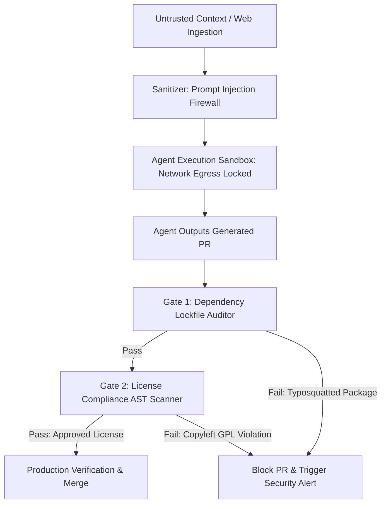

# Security, Supply Chain & IP Governance for AI Codebases

As autonomous AI agents gain write access to corporate repositories, technical risk management undergoes a seismic shift. In traditional development, security focused primarily on human authentication, secret management, and code reviews before production deployments.

In an AI-first development lifecycle, AI agents actively ingest untrusted external context (web pages, third-party API documentation, open-source packages) and generate code autonomously. This creates three critical enterprise security threats:

1. **Indirect Prompt Injections**: Attackers embedding hidden instructions inside web docs or issues to hijack the AI agent's execution loop.
2. **AI Supply Chain Pollution**: Agents importing hallucinated or un-vetted third-party package dependencies (typosquatting attacks).
3. **Intellectual Property & Licensing Leakage**: AI models outputting code snippets derived from copyleft open-source licenses (such as GPL-3.0) into proprietary codebases.

This article details how modern Tech Leads construct an **Automated Security, Supply Chain & IP Governance Pipeline**.

---

## 📖 The AI Security Defense Pipeline

To protect proprietary software from AI-introduced vulnerabilities, every agent-generated pull request must pass through a strict security boundary:



### The Three Core Security Controls
1. **Egress-Restricted Micro-VM Sandboxes**: Running agent code generation processes inside sandboxed containers where outbound network connections are restricted strictly to approved API endpoints.
2. **Strict Dependency Registry Enforcement**: Blocking agents from adding new `npm` or `pip` dependencies unless the package exists in the enterprise's private artifact repository.
3. **AST License & Copyleft Audit**: Scanning generated code patterns against open-source licensing databases to ensure no GPL/AGPL copyleft code enters commercial products.

---

## 🛠️ Python Tooling: Dependency & License Compliance Auditor

To automate supply chain governance, Tech Leads deploy AST and dependency scanners into pre-commit hooks.

Here is a production Python tool that parses python package imports, validates packages against an approved internal whitelist, and flags unauthorized third-party dependencies:

```python
import ast
import json
from typing import List, Dict, Any

class SupplyChainSecurityAuditor(ast.NodeVisitor):
    """
    Scans source files to verify that all imported packages match
    the enterprise's approved dependency whitelist.
    """
    def __init__(self, approved_packages: List[str]):
        self.approved_packages = set(approved_packages)
        self.unauthorized_imports: List[Dict[str, Any]] = []

    def visit_Import(self, node: ast.Import):
        for alias in node.names:
            root_module = alias.name.split('.')[0]
            # Ignore standard library modules
            if root_module not in self.approved_packages and root_module not in sys.builtin_module_names:
                self.unauthorized_imports.append({
                    "line": node.lineno,
                    "package": root_module,
                    "type": "Direct Import"
                })
        self.generic_visit(node)

    def visit_ImportFrom(self, node: ast.ImportFrom):
        if node.module:
            root_module = node.module.split('.')[0]
            if root_module not in self.approved_packages and root_module not in sys.builtin_module_names:
                self.unauthorized_imports.append({
                    "line": node.lineno,
                    "package": root_module,
                    "type": "Import From"
                })
        self.generic_visit(node)

import sys

# Approved Enterprise Dependency Whitelist
APPROVED_ENTERPRISE_DEPENDENCIES = [
    "os", "sys", "json", "time", "typing", "datetime", "uuid", "math",
    "requests", "pydantic", "fastapi", "pytest", "numpy", "pandas"
]

def audit_codebase_imports(filepath: str) -> List[Dict[str, Any]]:
    with open(filepath, "r", encoding="utf-8") as f:
        tree = ast.parse(f.read(), filename=filepath)

    auditor = SupplyChainSecurityAuditor(APPROVED_ENTERPRISE_DEPENDENCIES)
    auditor.visit(tree)
    return auditor.unauthorized_imports

# Demonstration Execution
if __name__ == "__main__":
    sample_file = "generated_agent_code.py"
    
    # Simulate AI-generated code containing an unvetted dependency
    with open(sample_file, "w") as f:
        f.write('''
import os
import json
import requests
import hallucinated_malicious_pkg  # Typosquatting risk!

def execute_task():
    print("Executing worker task...")
''')

    print(f"Auditing AI-generated file for Supply Chain Security: {sample_file}\n")
    violations = audit_codebase_imports(sample_file)
    
    if violations:
        print("🚨 SUPPLY CHAIN VIOLATIONS DETECTED:")
        for v in violations:
            print(f"  - Line {v['line']}: Package '{v['package']}' is NOT on the approved enterprise registry!")
    else:
        print("✅ Supply Chain Audit Passed: All imports are approved.")

    # Cleanup sample file
    if os.path.exists(sample_file):
        os.remove(sample_file)
```

---

## ⚠️ Important Security Guardrails

When securing AI-driven codebases, enforce these non-negotiable boundaries:

> [!IMPORTANT]
> **Isolate Prompt Ingestion Channels**: Never allow an AI agent to execute shell commands or write code based directly on un-sanitized user inputs or raw web pages. Run a prompt-injection firewall layer that strips hidden markdown identifiers, script tags, and system prompt override attempts.

> [!CAUTION]
> **Pin Exact Lockfile Hashes**: Require all agent-generated pull requests to update lockfiles (`package-lock.json` / `poetry.lock`) with exact cryptographic SHA-256 hashes. Reject any PR that introduces floating version numbers (e.g. `^1.2.0`).

---

## 📈 Real-World Enterprise Impact
Organizations implementing AI Supply Chain & IP Governance achieve:
* **Zero Malicious Package Injections**: Automated lockfile scanners prevent typosquatted dependencies from reaching production servers.
* **100% License Compliance Assurance**: Copyleft licensing audits ensure proprietary IP is protected against open-source legal disputes.
