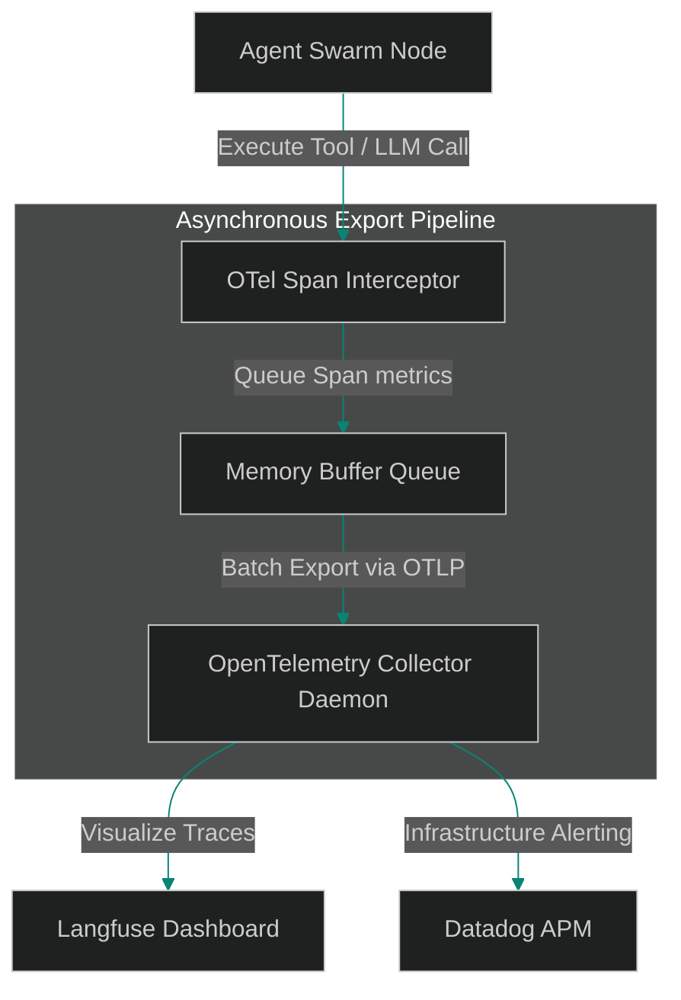

# OpenTelemetry Gateways: Exporting Agent Spans to Langfuse and Datadog

> [!NOTE]
> **📖 Article Overview**
> While structured JSON logs help developers debug local agent executions, auditing thousands of concurrent production runs requires a centralized observability backend. Manually parsing log text files is inefficient. To trace agent swarms at scale, developers must configure **OpenTelemetry Gateways**. By exporting execution spans asynchronously to specialized trace visualizers (like Langfuse, Datadog, or Phoenix), teams can audit model cost matrices and trace tool calls in real time. In this article, we implement an OpenTelemetry span exporter wrapper in Python.

---

## Centralizing Trace Observability

When managing distributed agent operations:
* **The Monitoring Challenge**: Aggregating logs across isolated containers makes it difficult to diagnose runtime errors.
* **The Latency Cost**: Sending HTTP log payloads synchronously blocks response threads, increasing latency.
* **The Solution**: **OpenTelemetry Exporters**. We intercept parent-child trace spans and publish them asynchronously to central tracing collectors using the standard OpenTelemetry protocol (OTLP).



---

## 1. Structuring OpenTelemetry Spans

To align agent actions with OTLP specifications:
* **Spans as Actions**: Map each agent planning cycle or tool execution to a standard OpenTelemetry Span.
* **Semantic Attributes**: Tag spans with custom semantic keys, such as `gen_ai.prompt` for LLM inputs and `gen_ai.completion` for generated text outputs.

---

## 2. Decoupling Log Shipments

To prevent logging bottlenecks:
1. **Batch Spans Asynchronously**: Buffer span metrics in memory and export them in batches to avoid blocking the main execution thread.
2. **Handle Connection Dropouts**: Implement fallback logging (e.g. saving metrics locally) if the collection server goes offline.

---

## Code Demo: OpenTelemetry Async Exporter

Below is a Python implementation of an asynchronous OpenTelemetry trace exporter simulator. It buffers metrics, batches exports, and routes payloads to external servers.

```python
import asyncio
import time
from typing import Dict, Any, List

class OpenTelemetrySpanExporter:
    def __init__(self, target_collector_url: str):
        self.target_collector_url = target_collector_url
        self.buffer_queue: List[Dict[str, Any]] = []
        self.is_running = True

    def record_span(self, name: str, trace_id: str, attributes: Dict[str, Any]):
        # Intercept span details and add to memory buffer
        span_payload = {
            "name": name,
            "trace_id": trace_id,
            "timestamp": time.time(),
            "attributes": attributes
        }
        self.buffer_queue.append(span_payload)
        print(f"📥 [Buffer] Queued OTel Span: '{name}' for trace: {trace_id[:8]}")

    async def run_batch_export_loop(self):
        # Asynchronous background loop shipping batches to collector
        while self.is_running:
            await asyncio.sleep(1.0) # Export batch every second
            
            if not self.buffer_queue:
                continue

            batch_to_ship = list(self.buffer_queue)
            self.buffer_queue.clear()

            print(f"\n📡 [OTLP Exporter] Exporting {len(batch_to_ship)} spans to collector: {self.target_collector_url}")
            for span in batch_to_ship:
                print(f"   ✈️ Shipped span '{span['name']}' | Attributes: {span['attributes']}")
            print("✅ [OTLP Exporter] Batch export completed.\n")

if __name__ == "__main__":
    exporter = OpenTelemetrySpanExporter(target_collector_url="https://api.langfuse.com/v1/otlp")

    async def run_simulation():
        print("🔒 Starting OpenTelemetry Observability Gateway...")
        print("-----------------------------------------------------")

        # Start exporter background thread loop
        loop_task = asyncio.create_task(exporter.run_batch_export_loop())

        # Simulate agent step runs generating span logs
        exporter.record_span(
            name="research_step",
            trace_id="trace_session_a1",
            attributes={"gen_ai.model": "claude-3-5-sonnet", "query": "Playwright sandbox setup"}
        )

        exporter.record_span(
            name="tool_call_sandbox",
            trace_id="trace_session_a1",
            attributes={"tool.name": "execute_command", "exit_code": 0}
        )

        # Allow loop to run and process the queue batch
        await asyncio.sleep(1.5)
        
        # Stop background loop
        exporter.is_running = False
        await loop_task

    asyncio.run(run_simulation())
```

---

## Observability Takeaways

* **Export Asynchronously**: Buffer span logs in memory and ship them in batches to prevent latency bottlenecks.
* **Standardize Attributes**: Use semantic tags (e.g., `gen_ai.prompt`) to enable consistent filtering in trace dashboards.
* **Monitor Collectors**: Implement local file fallback logging to protect logs if connection drops occur.
