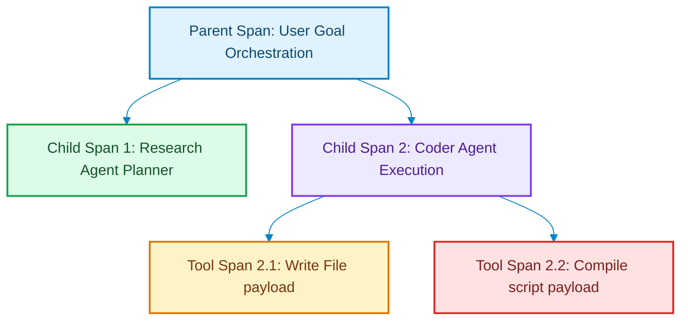

# Structured Tracing: Designing Trace Log Schemas for Swarms

> [!NOTE]
> **📖 Article Overview**
> When debugging a single-threaded server, basic stack traces are sufficient. However, debugging a multi-agent swarm in production is much more complex. An orchestrator agent might call three worker agents in parallel, each of which executes multiple tool loops and calls subagents. When a final answer is incorrect, finding the bug requires structural context. In this article, we analyze **Structured Tracing**, define JSON log span schemas, and implement an asynchronous trace logger in Python.

---

## The Chaos of Flat Logs

In typical multi-agent systems:
* **The Context Gap**: Flat system logs mix standard outputs together, making it impossible to map which subagent call triggered a specific SQL lock timeout [1].
* **Lack of Performance Mapping**: Analyzing execution delays is difficult without parent-child timing correlations.
* **The Solution**: **Structured Tracing**. We model agent runs as hierarchical tree structures consisting of parent and child "spans". Every span records start/end times, input prompts, tool params, and errors.



---

## 1. Structuring the JSON Trace Schema

We define the essential tracing fields:
* **`trace_id`**: A unique UUID mapped to the entire user session request.
* **`span_id`**: A unique identifier for the specific execution component block.
* **`parent_span_id`**: The identifier of the parent node, enabling tree construction.
* **`metadata`**: Variable storage for tokens consumed, tool parameters, and model configurations.

---

## 2. Setting up Trace Decorators

The tracer manages logs using context decorators:
1. **Open Span**: Generate a new `span_id`, inherit the active `parent_span_id` from thread context, and log start times.
2. **Close Span**: Record end times, calculate latency offsets, and serialize metrics.

---

## Code Demo: Hierarchical Trace Logger

Below is a Python implementation of a structured trace logger. It generates parent-child span maps, captures metadata properties, and exports serialized trace logs.

```python
import time
import uuid
import json
from typing import Dict, Any, List

class AgentSpanTracer:
    def __init__(self, trace_id: str = None):
        self.trace_id = trace_id or str(uuid.uuid4())
        self.spans: List[Dict[str, Any]] = []

    def start_span(self, name: str, parent_span_id: str = None) -> str:
        span_id = str(uuid.uuid4())
        span_entry = {
            "trace_id": self.trace_id,
            "span_id": span_id,
            "parent_span_id": parent_span_id,
            "name": name,
            "start_time_ms": int(time.time() * 1000),
            "end_time_ms": None,
            "metadata": {},
            "status": "RUNNING"
        }
        self.spans.append(span_entry)
        print(f"🌲 [Trace] Started Span: '{name}' (ID: {span_id[:8]})")
        return span_id

    def close_span(self, span_id: str, status: str = "SUCCESS", metadata: Dict[str, Any] = None):
        for span in self.spans:
            if span["span_id"] == span_id:
                span["end_time_ms"] = int(time.time() * 1000)
                span["status"] = status
                if metadata:
                    span["metadata"].update(metadata)
                
                duration = span["end_time_ms"] - span["start_time_ms"]
                print(f"✅ [Trace] Closed Span: '{span['name']}' in {duration}ms (Status: {status})")
                break

    def export_trace_tree(self) -> str:
        return json.dumps(self.spans, indent=2)

if __name__ == "__main__":
    tracer = AgentSpanTracer()

    print("📊 Initiating Agent Structured Tracing Test...")
    print("----------------------------------------------")

    # 1. Start parent orchestration task span
    parent_id = tracer.start_span("Orchestrate API Migration")
    time.sleep(0.1) # Simulate planning overhead

    # 2. Start child planning span
    plan_id = tracer.start_span("Compile Migration Plan", parent_span_id=parent_id)
    time.sleep(0.2)
    tracer.close_span(plan_id, metadata={"prompt_tokens": 1200, "completion_tokens": 300})

    # 3. Start child tool execution span
    tool_id = tracer.start_span("Execute Database Schema Write", parent_span_id=parent_id)
    time.sleep(0.3)
    tracer.close_span(tool_id, status="SUCCESS", metadata={"affected_rows": 12})

    # Close parent task span
    tracer.close_span(parent_id, metadata={"total_cost_usd": 0.045})

    print("\n--- Exported Tracing Tree ---")
    print(tracer.export_trace_tree())
```

---

## Observability Takeaways

* **Organize as Trees**: Format agent execution logs as hierarchical parent-child spans to maintain context.
* **Trace Metadata**: Log model token counts, tool parameters, and response states inside each span.
* **Track Latency Spikes**: Monitor timing metrics per span to identify performance bottlenecks in your agent chains. [2]

## References & Further Reading

1. **W3C Distributed Tracing Working Group (2021)**. *Trace Context*. W3C Recommendation. [https://www.w3.org/TR/trace-context/](https://www.w3.org/TR/trace-context/)
2. **OpenTelemetry Authors (2024)**. *OpenTelemetry Specification*. CNCF. [https://opentelemetry.io/docs/specs/otel/](https://opentelemetry.io/docs/specs/otel/)
3. **Fielding, R., Ed., Nottingham, M., Ed., & Reschke, J., Ed. (2022)**. *HTTP Semantics*. RFC 9110. [https://www.rfc-editor.org/rfc/rfc9110](https://www.rfc-editor.org/rfc/rfc9110)
4. **Apache Parquet Community (2024)**. *Apache Parquet Format*. Apache Software Foundation. [https://parquet.apache.org/docs/](https://parquet.apache.org/docs/)
5. **Apache Arrow Community (2024)**. *Apache Arrow Columnar Format*. Apache Software Foundation. [https://arrow.apache.org/docs/format/Columnar.html](https://arrow.apache.org/docs/format/Columnar.html)
6. **Apache Iceberg Community (2024)**. *Iceberg Table Spec*. Apache Software Foundation. [https://iceberg.apache.org/spec/](https://iceberg.apache.org/spec/)
