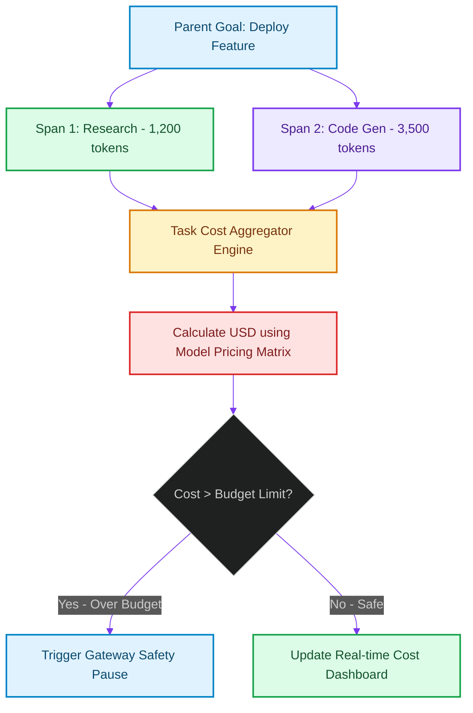

# Task Economics: Aggregating Run-Time Cost Dashboards

> [!NOTE]
> **📖 Article Overview**
> While deploying autonomous agents increases engineering velocity, it introduces a significant financial risk: **Runaway Token Costs**. If a planning loop gets stuck in an infinite recursion, a single task run can easily cost hundreds of dollars. To prevent budget exhaustion, teams must implement **Task Economics**. By aggregating prompt tokens, model pricing matrices, and tool runtimes per task execution, developers can display live cost charts and enforce automatic billing cut-offs. In this article, we implement a task cost aggregator in Python.

---

## The Threat of Runaway Agent Operations

In multi-agent architectures:
* **The Recursion Loop Risk**: A minor error in a tool's output can cause a self-reflective agent to run debug loops indefinitely, accumulating API fees [1].
* **Invisible Overhead**: Without per-task telemetry aggregation, tracking which user or branch consumes the most tokens is impossible.
* **The Solution**: **Task Economics Dashboards**. We aggregate token metrics across all sub-spans of a parent task. We apply model-specific cost rates to calculate expenses in real time, triggering automatic execution pauses if thresholds are exceeded.



---

## 1. Defining Model Price Matrices

We establish pricing parameters for common models:
* **GPT-4o**: \$5.00 per 1M input tokens, \$15.00 per 1M output tokens.
* **Claude 3.5 Sonnet**: \$3.00 per 1M input tokens, \$15.00 per 1M output tokens.
* **Qwen-7B (Local)**: \$0.00 (Infrastructure cost only).

---

## 2. Dynamic Budget Guardrails

Enforce safety boundaries directly within the execution loop:
1. **Define Task Budgets**: Set a maximum dollar limit (e.g. \$1.00) per run.
2. **Inject Checkpoint Gates**: Verify accumulated costs before invoking expensive LLM steps, halting execution if the budget is exhausted.

---

## Code Demo: Task Cost Aggregator

Below is a Python implementation of a task economics engine. It processes execution logs, calculates costs, plots real-time usage matrices, and triggers budget-limit alerts.

```python
import json
from typing import Dict, List, Any, Tuple

class TaskEconomicsAggregator:
    def __init__(self, budget_limit_usd: float = 0.50):
        self.budget_limit_usd = budget_limit_usd
        # Pricing rate per 1,000,000 tokens
        self.pricing_matrix = {
            "gpt-4o": {"input_rate": 5.00, "output_rate": 15.00},
            "claude-3-5-sonnet": {"input_rate": 3.00, "output_rate": 15.00}
        }

    def calculate_span_cost(self, model: str, input_tokens: int, output_tokens: int) -> float:
        rates = self.pricing_matrix.get(model, {"input_rate": 0.0, "output_rate": 0.0})
        input_cost = (input_tokens / 1_000_000.0) * rates["input_rate"]
        output_cost = (output_tokens / 1_000_000.0) * rates["output_rate"]
        return input_cost + output_cost

    def aggregate_task_economics(self, trace_spans: List[Dict[str, Any]]) -> Tuple[float, bool]:
        total_cost = 0.0
        
        for span in trace_spans:
            metadata = span.get("metadata", {})
            model = metadata.get("model")
            
            # Check if span contains token records
            if model and "prompt_tokens" in metadata:
                cost = self.calculate_span_cost(
                    model=model,
                    input_tokens=metadata["prompt_tokens"],
                    output_tokens=metadata.get("completion_tokens", 0)
                )
                total_cost += cost
                print(f"📊 [Aggregator] Span '{span['name']}' Cost: ${cost:.6f}")

        budget_exceeded = total_cost > self.budget_limit_usd
        return total_cost, budget_exceeded

if __name__ == "__main__":
    # Task budget limit: $0.05
    aggregator = TaskEconomicsAggregator(budget_limit_usd=0.05)

    # Simulated trace spans for a code generation task run
    simulated_spans = [
        {
            "name": "Initial Planning",
            "metadata": {"model": "claude-3-5-sonnet", "prompt_tokens": 12000, "completion_tokens": 800}
        },
        {
            "name": "Code Execution Refinement",
            "metadata": {"model": "gpt-4o", "prompt_tokens": 5000, "completion_tokens": 1200}
        }
    ]

    print("🛡️ Processing Task Economics Aggregator...")
    print("------------------------------------------")

    total_task_cost, is_exceeded = aggregator.aggregate_task_economics(simulated_spans)

    print(f"\n📈 --- Billing Dashboard Metrics ---")
    print(f"    Total Task Cost:   ${total_task_cost:.6f}")
    print(f"    Budget Limit:      ${aggregator.budget_limit_usd:.6f}")
    print(f"    Alert Status:      {'🚨 BUDGET EXCEEDED!' if is_exceeded else '✅ Under Budget'}")
```

---

## Observability Takeaways

* **Establish Budgets**: Enforce strict dollar-limit budgets per task to prevent runaway token costs.
* **Aggregate Real-Time Metrics**: Sum token usage across all nested sub-spans to calculate complete task expenses.
* **Inject Checkpoint Gates**: Verify accumulated costs before initiating expensive model planning runs. [2]

## References & Further Reading

1. **Malkov, Y. A., & Yashunin, D. A. (2018)**. *Efficient and Robust Approximate Nearest Neighbor Search Using Hierarchical Navigable Small World Graphs*. IEEE TPAMI. [https://arxiv.org/abs/1603.09320](https://arxiv.org/abs/1603.09320)
2. **Jégou, H., Douze, M., & Schmid, C. (2011)**. *Product Quantization for Nearest Neighbor Search*. IEEE TPAMI. [https://hal.inria.fr/inria-00514462v2/document](https://hal.inria.fr/inria-00514462v2/document)
3. **Johnson, J., Douze, M., & Jégou, H. (2019)**. *Billion-scale Similarity Search with GPUs*. IEEE Transactions on Big Data. [https://arxiv.org/abs/1702.08734](https://arxiv.org/abs/1702.08734)
4. **Apache Parquet Community (2024)**. *Apache Parquet Format*. Apache Software Foundation. [https://parquet.apache.org/docs/](https://parquet.apache.org/docs/)
5. **Apache Arrow Community (2024)**. *Apache Arrow Columnar Format*. Apache Software Foundation. [https://arrow.apache.org/docs/format/Columnar.html](https://arrow.apache.org/docs/format/Columnar.html)
6. **Apache Iceberg Community (2024)**. *Iceberg Table Spec*. Apache Software Foundation. [https://iceberg.apache.org/spec/](https://iceberg.apache.org/spec/)
