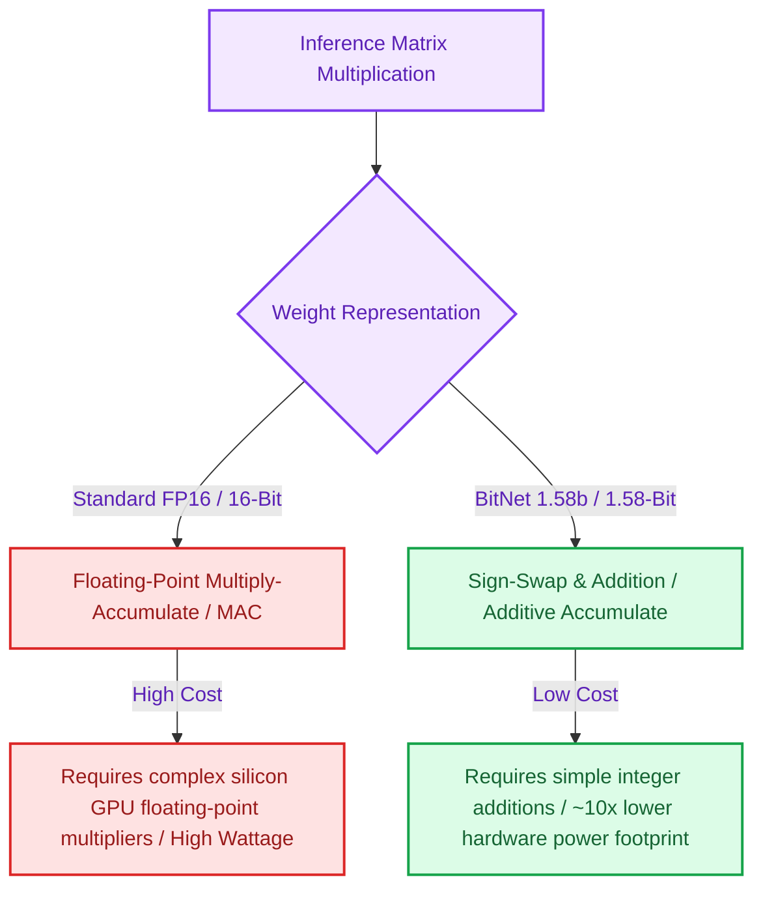

# The 1.58-Bit Era: How Ternary Weights Replace Matrix Multiplication with Integer Addition

> ### 📖 Article Overview
> * **What this article is about:** An investigation into 1.58-bit ternary quantization (BitNet) vs. standard 16-bit floating-point (FP16) weight representations.
> * **Why it matters:** Standard model training and serving are limited by GPU floating-point multiplications and high-bandwidth memory (HBM) bandwidth. Ternary weights replace floating-point operations with low-power integer additions.
> * **What we synthesized:** Ternary quantization offers up to 10x reductions in hardware power requirements and 5x compression of model sizes. However, training ternary models is highly unstable, and models under 7B parameters experience language decay.

---

Modern large language models are computationally heavy because they perform trillions of high-precision floating-point matrix multiplications. Standard models store weights in 16-bit floating-point (FP16) or 8-bit integer formats, consuming massive amounts of GPU memory and energy.

To bypass this hardware barrier, Microsoft Research introduced **BitNet 1.58b**, launching the **1.58-Bit Ternary Model Era**.

By restricting model weights to only three values—$\{-1, 0, 1\}$—BitNet replaces expensive floating-point multiplication with simple integer addition. This shifts the computational requirements of LLMs from energy-hungry multipliers to low-power additions, offering a path to running massive models on consumer hardware.

This article reviews the trade-offs of ternary quantization vs. standard float representations, detailing **what is good (pros)**, **what is not (cons)**, and how to write a custom ternary quantization layer in PyTorch, as modeled in my repository [python-interview-prep-suite](https://github.com/akmalkhaniub/python-interview-prep-suite).

---

## Compute Mechanics: FP16 Floats vs. BitNet Ternary

Standard floating-point representation requires complex multiplier circuits, while ternary representation simplifies the matrix kernel to simple sign-swaps and additions.



---

## Synthesis: What's Good & What's Not

### What's Good (The Pros)
*   **Extreme Energy Efficiency**: Replacing matrix multiplications with integer additions cuts hardware energy consumption by up to **89%**, which is crucial for mobile and edge deployments.
*   **5x Memory Footprint Reduction**: Storing weights in 1.58 bits compresses a 70B parameter model down to ~14GB, allowing it to fit entirely on a single consumer GPU instead of requiring a cluster of A100s.
*   **Memory Bandwidth Relief**: The bottleneck in LLM serving is often loading weights from high-bandwidth memory (HBM). Ternary models reduce HBM transfer overhead, increasing throughput.

### What's Not (The Cons)
*   **Extreme Training Instability**: Training a ternary model from scratch requires quantization-aware pre-training. Rounding continuous gradients to discrete ternary values is notoriously unstable, causing training runs to diverge.
*   **Linguistic Nuance Decay**: For models under 7B parameters, ternary quantization causes "language decay"—the model loses the ability to generate complex, nuanced sentences and shows a higher rate of syntax errors.
*   **Silicon Hardware Gap**: Modern GPUs are optimized for floating-point tensor cores. Ternary models require specialized custom ASIC or FPGA chips to realize their full energy efficiency benefits.

---

## Coding a Ternary Quantization Layer in PyTorch

To implement 1.58-bit weights, we use **Quantization-Aware Training (QAT)**. During the forward pass, the weights are scaled and rounded to the nearest ternary value $\{-1, 0, 1\}$. During the backward pass, we bypass the rounding function using a **Straight-Through Estimator (STE)** to allow continuous gradients to update the underlying FP16 weights.

Here is a PyTorch implementation of a BitNet 1.58b linear layer, modeled on the neural network structures in [python-interview-prep-suite](https://github.com/akmalkhaniub/python-interview-prep-suite).

```python
import torch
import torch.nn as nn

class TernaryQuantizeSTE(torch.autograd.Function):
    @staticmethod
    def forward(ctx, weight):
        # 1. Scale weights: Divide by average absolute value
        scale = torch.mean(torch.abs(weight)) + 1e-9
        scaled_weight = weight / scale
        
        # 2. Round to ternary set {-1, 0, 1}
        ternary_weight = torch.clamp(torch.round(scaled_weight), -1.0, 1.0)
        
        # Save scale factor for backprop
        ctx.save_for_backward(scale)
        return ternary_weight * scale

    @staticmethod
    def backward(ctx, grad_output):
        # Straight-Through Estimator: Pass gradient through unchanged
        return grad_output

class BitNetLinear(nn.Module):
    def __init__(self, in_features, out_features):
        super().__init__()
        self.in_features = in_features
        self.out_features = out_features
        
        # Store high-precision underlying weights for gradient updates
        self.weight = nn.Parameter(torch.randn(out_features, in_features))
        self.bias = nn.Parameter(torch.zeros(out_features))

    def forward(self, x):
        # 1. Quantize weights to ternary values during forward pass
        quantized_weight = TernaryQuantizeSTE.apply(self.weight)
        
        # 2. Perform linear operation: y = x * W^T + b
        return nn.functional.linear(x, quantized_weight, self.bias)
```

---

## Ternary Implementation Guardrails

* **Gradual Quantization**: Never apply ternary quantization directly to a pre-trained FP16 model. Doing so destroys the parameter representations. Instead, use a gradual quantization schedule during fine-tuning.
* **Feature Scaling**: Scale input activations carefully before passing them to ternary layers to prevent values from saturating the discrete weight channels.

---

## Conclusion & Key Takeaways

The transition to 1-bit or ternary architectures represents a massive co-design opportunity:
1. **Additive Kernels:** Restricting weight parameters to $\{-1, 0, 1\}$ replaces GPU-heavy floating-point multipliers with simple integer accumulators, reducing hardware power consumption by up to 89%.
2. **The Software-Hardware Gap:** Storing weights in 1.58-bit format is currently limited by standard GPU architecture optimized for float operations. Realizing ternary efficiency requires specialized ASIC/FPGA hardware.
3. **Quality and Instability:** Because ternary pre-training is unstable, teams must leverage gradual fine-tuning and scale parameters past 7B to avoid language decay and preserve style.

*Takeaway:* Ternary weights offer a path to running massive models on local consumer hardware, but compiler and silicon hardware co-design must mature first.

---

## References & Further Reading

* **BitNet 1.58b Paper**: Ma et al., 2024. *The Era of 1-bit LLMs: All Large Language Models are in 1.58 Bits*. [arXiv:2402.17764](https://arxiv.org/abs/2402.17764).
* **Quantization Workshops**: ICML/NeurIPS tracks on parameter-efficient compression and low-bit representations.
* **Ternary Quantization Guide**: Hugging Face's technical guide on [1-bit Quantization and BitNet Setups](https://huggingface.co/blog/moe).

*To review our neural network training structures and optimization exercises, inspect the scripts inside the [python-interview-prep-suite](https://github.com/akmalkhaniub/python-interview-prep-suite) repository.*
