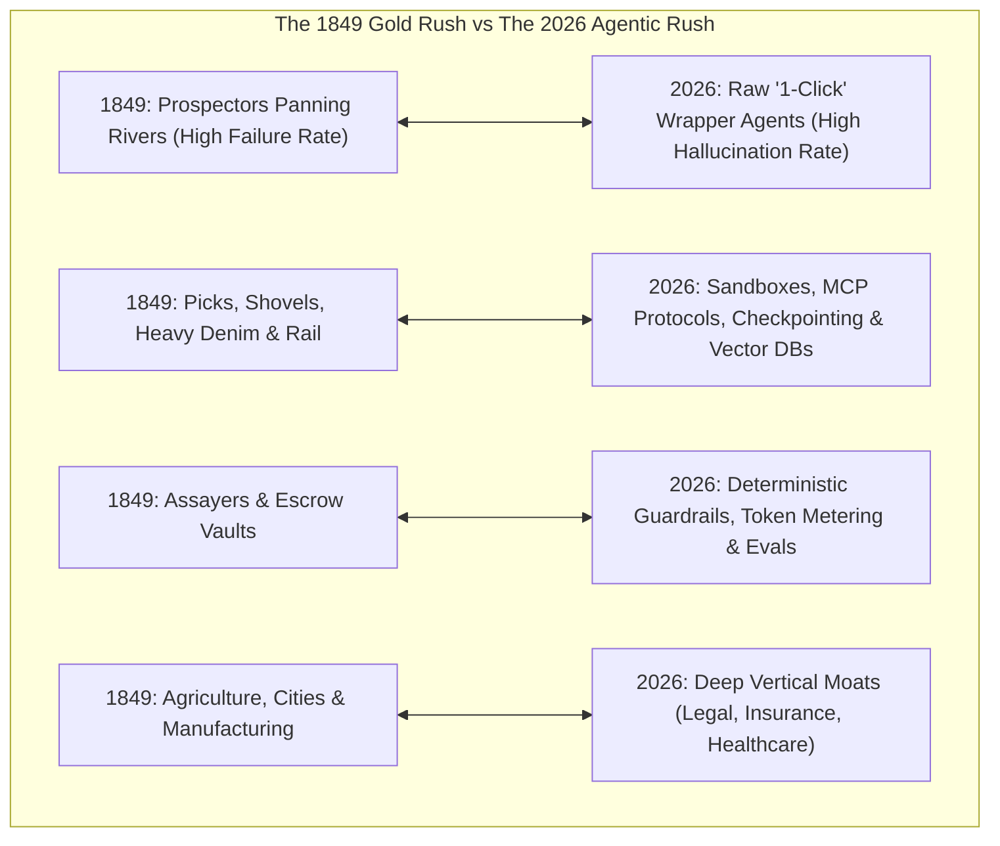
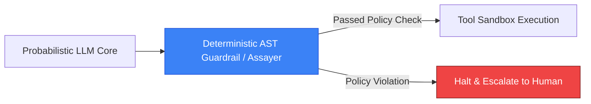

# The Agentic Rush: Why Selling Picks & Shovels Wins the Multi-Agent Gold Rush

In January 1848, James W. Marshall spotted flakes of gold in the American River at Sutter’s Mill, igniting the historic **California Gold Rush**.

Over the next seven years, more than 300,000 hopeful prospectors ("Forty-Niners") flooded the West, risking everything to pan for raw nuggets.

Yet, historical economic records reveal a stark reality: **the vast majority of prospectors went broke**.

The enduring fortunes of the era were made not by those panning the riverbeds, but by the **merchants who sold the picks, shovels, heavy denim workwear (Levi Strauss), wheelbarrows, and secure transit infrastructure (Wells Fargo)**. Samuel Brannan—who famously bought every shovel in San Francisco for $0.20 and resold them to prospectors for $15.00 apiece—became California’s first millionaire.

Today, in 2026, the technology landscape is engulfed in a parallel phenomenon: **The Agentic Rush**.



---

## 1. The Prospector’s Dilemma: The Illusion of "Free Gold"

Over the past two years, the AI ecosystem exploded with thousands of venture-backed startups and open-source projects promising autonomous "1-click agents" (AI SDRs, AI legal assistants, AutoGPT clones).

In controlled demo videos, a single unconstrained ReAct loop looks magical: an agent takes a prompt, searches the web, drafts a document, and sends an email.

In enterprise production, however, **raw prospector agents face devastating economic failure modes**:

1. **Non-Deterministic State Drift**: Without formal state machines, unconstrained agents deviate from mission paths, entering infinite recursive tool loops that consume thousands of dollars in API credits within minutes.
2. **The "Needle-in-a-Haystack" Memory Collapse**: Stuffing 200,000 tokens into raw context windows degrades retrieval accuracy, slows latency, and explodes $O(N^2)$ self-attention compute costs.
3. **Irreversible Real-World Side Effects**: An unmonitored agent executing shell scripts or sending unauthorized emails creates massive operational and legal liability.

Just like the prospectors who arrived at Sutter's Mill with a wooden pan, building shallow wrappers around foundation model APIs is an economically fragile game.

---

## 2. The "Picks and Shovels" of the Agentic Era

The true value in the 2026 agentic economy is consolidating around the **infrastructure layer**—the tools, execution runtimes, protocols, and security guardrails that make autonomous swarms reliable.

```
> **THE 4 PICKS & SHOVELS OF THE AGENTIC ERA**
| 1. Model Context Protocol (MCP)   : Standardized tool discovery & isolated execution interface    |
| 2. Ephemeral Micro-Sandboxes      : Containerized runtimes (E2B, Firecracker) for safe execution  |
| 3. State Checkpointers            : PostgresSaver & Redis state persistence for crash recovery    |
| 4. Hierarchical Memory Engines    : pgvector, Redis & Graph-RAG long-term entity consolidation     |

```

### 1. The Standard Gauge Railroad: Model Context Protocol (MCP)
In early rail transport, disparate track widths prevented trains from sharing lines. Anthropic's **Model Context Protocol (MCP)** has become the universal standard track for AI agents:
* Decoupling agent reasoning cores from tool execution.
* Allowing any agent to securely discover, inspect, and invoke databases, APIs, and file systems through a unified JSON-RPC protocol with strict least-privilege access control.

### 2. Isolated Execution MicroVMs (The Pickaxes)
Giving an LLM direct access to local servers (`exec("rm -rf ...")`) is catastrophic. Platforms like **E2B**, **Firecracker microVMs**, and **Docker sandboxes** provide sub-second ephemeral Linux environments where agents can run untrusted code safely.

### 3. Fault-Tolerant State Checkpointing (The Transit Lines)
Long-running agent workflows (15 to 45 minutes) cannot afford to restart from scratch upon a transient network glitch. Tools like **LangGraph `PostgresSaver`** serialize execution graphs atomically at every step, enabling instant crash recovery.

---

## 3. The Assayers: Trust, Verifiability & Token Economics

During the Gold Rush, anyone could claim they found gold dust; miners relied on **Assayers** to chemically verify purity and **Escrow Banks** (like Wells Fargo) to store value safely.

In the Agentic Rush, the assayers are the **deterministic verification and governance frameworks**:



* **Deterministic Code Parsing**: Validating agent-generated code with Abstract Syntax Tree (AST) parsers before execution to ensure no destructive system calls exist.
* **Token Economics Metering**: Setting strict per-task cost ceilings (e.g. $\$2.00$ maximum per issue fix) with dynamic prompt caching.
* **Human-in-the-Loop (HITL) Quality Gates**: Requiring explicit human authorization for high-risk operations (schema drops, financial transactions $> \$50$).

---

## 4. The Settlers: Building Deep Vertical Moats

Once the initial gold panning frenzy subsided, California's durable economy was built by farmers, infrastructure builders, and manufacturing enterprises.

Similarly, the enduring commercial winners of the agentic revolution will not be generic "do-anything" chatbots, but **deeply integrated vertical autonomous systems**:

```
> **VERTICAL AGENT MOAT EXAMPLES**
| • SpecForge    : Two-pass Claude pipeline transforming business prompts into validated code specs |
| • LeaseLogic   : Layout-aware PDF extraction with pgvector RAG and 10-year discounted cashflow    |
| • ClaimPilot   : Multi-modal vision damage adjudication with deterministic fraud rule guardrails  |

```

### Why Vertical Moats Win:
1. **Proprietary Domain Knowledge**: Generalist LLMs lack nuanced understanding of local zoning laws, commercial lease escalations, or insurance policy underwriting riders.
2. **Deterministic Integration**: Embedding agents into existing enterprise relational databases and ERP workflows creates high switching costs.
3. **Accountability & Compliance**: Enterprise buyers demand audit logs, reproducible trajectories, and deterministic SLAs.

---

## Python Simulation: The "Picks & Shovels" Agent Infrastructure Gatekeeper

Here is a Python implementation demonstrating how modern infrastructure acts as a protective "pick-and-shovel" gatekeeper for autonomous agents:

```python
import hashlib
import time
from typing import Callable, Dict, List, Optional

class TokenEconomicsMeter:
    """
    Pick-and-Shovel Tool: Real-time cost governance.
    """
    def __init__(self, max_budget_usd: float = 1.50, cost_per_1k_tokens: float = 0.003):
        self.max_budget = max_budget_usd
        self.cost_per_1k = cost_per_1k_tokens
        self.current_cost = 0.0

    def record_usage(self, tokens: int) -> bool:
        cost = (tokens / 1000.0) * self.cost_per_1k
        if self.current_cost + cost > self.max_budget:
            print(f" 🛑 [Budget Exceeded] Attempted ${self.current_cost + cost:.4f} > Limit ${self.max_budget:.2f}. Halting agent!")
            return False
        self.current_cost += cost
        return True

class DeterministicAssayerGuard:
    """
    Assayer Tool: Evaluates generated agent code before execution.
    """
    FORBIDDEN_PATTERNS = ["rm -rf", "eval(", "os.system(", "DROP TABLE", "format c:"]

    @classmethod
    def verify_code_safety(cls, code_snippet: str) -> bool:
        for pattern in cls.FORBIDDEN_PATTERNS:
            if pattern in code_snippet:
                print(f" 🚨 [Assayer Block] Flagged dangerous instruction: '{pattern}'")
                return False
        return True

class EphemeralSandbox:
    """
    Sandbox Tool: Executes code within isolated boundary.
    """
    def __init__(self, meter: TokenEconomicsMeter):
        self.meter = meter

    def run_agent_task(self, task_name: str, code: str, estimated_tokens: int) -> bool:
        print(f"\n🔍 [Sandbox Gate] Evaluating Agent Task: '{task_name}'...")
        
        # 1. Budget check
        if not self.meter.record_usage(estimated_tokens):
            return False

        # 2. Assayer safety check
        if not DeterministicAssayerGuard.verify_code_safety(code):
            return False

        # 3. Execution
        print(f" 🚀 [Execution Success] Task '{task_name}' safely executed in isolated microVM.")
        print(f"    Current Cumulative Cost: ${self.meter.current_cost:.4f}")
        return True

# Demonstration Execution
if __name__ == "__main__":
    print("⛏️ Initializing Agentic 'Picks & Shovels' Infrastructure Pipeline...")
    meter = TokenEconomicsMeter(max_budget_usd=0.05)
    sandbox = EphemeralSandbox(meter)

    # Safe task
    sandbox.run_agent_task("Synthesize REST Endpoint", "def handler(): return {'status': 200}", 2500)

    # Unsafe task (Blocked by Assayer)
    sandbox.run_agent_task("Wipe Temp Directory", "import os; os.system('rm -rf /tmp')", 1500)

    # Expensive task (Blocked by Token Meter)
    sandbox.run_agent_task("Deep Codebase Re-indexing", "def reindex(): pass", 25000)
```

---

## Summary: Navigating the Agentic Rush

| Phase | Gold Rush Paradigm (1849) | Agentic Rush Paradigm (2026) | Winning Strategy |
|---|---|---|---|
| **The Surface** | Panning riverbeds with tin pans | Thin wrapper bots on raw API endpoints | Avoid: High churn, zero moat, fragile economics |
| **The Infrastructure** | Selling picks, shovels & denim | MCP servers, micro-sandboxes & checkpointers | **High Value**: Sell developer tooling and runtimes |
| **The Governance** | Assay offices & secure transport | Deterministic AST guards, token metering & evals | **Critical Need**: Provide enterprise compliance & safety |
| **The Settlement** | Agriculture, railroads & manufacturing | Deep vertical autonomous engines | **Enduring Moat**: Integrate deeply with domain workflows |

---

## Architectural Takeaway
The lesson of the California Gold Rush is not that gold lacked value—it was that **sustainable wealth accrued to the builders of foundational infrastructure**.

In the Agentic Rush, the ultimate winners will not be the developers building brittle, unconstrained chatbots, but the engineers building the **resilient, verifiable, and economically governed infrastructure** that powers the autonomous enterprise.
