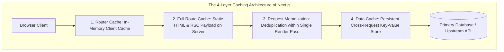

There is a famous adage in computer science, coined by Phil Karlton: *"There are only two hard things in Computer Science: cache invalidation and naming things."*

In October 2022, with the release of Next.js 13 and the App Router, Vercel decided to take on the first hard problem. Their thesis was audacious: modern web applications are too slow because developers forget to configure caching. Therefore, Next.js would make caching **opt-out rather than opt-in**.

By default, every standard `fetch()` call on the server was automatically cached indefinitely. Static route segments were aggressively frozen at build time. Client-side navigation preserved in-memory router snapshots for minutes. The goal was noble: make dynamic, data-driven web applications feel as instantaneous as static websites deployed to a global edge CDN.

What followed over the next eighteen months was one of the most intense developer revolts in the history of open-source frontend development.

Production apps shipped catastrophic bugs:
* Customers updated their shipping address, checked out, and their package was shipped to their previous address because an internal `fetch()` call cached the user profile indefinitely.
* E-commerce shopping carts showed items belonging to completely different users due to shared server-side Data Caches across requests.
* Development servers showed stale database values on page refresh, forcing engineers to delete their local `.next` directory dozens of times a day just to test a database migration.

In October 2024, Next.js 15 was released. At the top of the release notes was an extraordinary reversal: **The Great Un-Caching**. By default, `fetch` requests in Next.js 15 are no longer cached. The Client Router Cache no longer freezes page state.

Why did Next.js make caching the default in the first place? Why did it fail so spectacularly in production? And how does the redesigned four-layer caching architecture work today?



---

## 1. Why This Feature? The Dream of the Automated Edge CDN

To understand why the Next.js team built aggressive caching defaults, you must examine the economics of modern cloud hosting.

In a traditional Server-Side Rendered (SSR) application, every single HTTP request executes backend server code. If 100,000 users visit your homepage at the same time:
* Your database receives 100,000 queries.
* Your serverless compute instances scale up, spinning CPU cycles and incurring substantial compute bills.
* Time to First Byte (TTFB) is physically bounded by the geographic latency between your serverless containers and your primary database.

The Next.js 13 architectural vision sought to eliminate this by intercepting the standard Web API `fetch()` function:

```typescript
// Next.js 13 / 14 Default Behavior:
// Implicitly converted to: fetch('...', { cache: 'force-cache' })
const res = await fetch('https://api.example.com/products');
```

By patching the global `fetch` at the Node.js runtime level, Next.js created the **Data Cache**: a persistent, multi-tenant key-value cache that outlived individual server requests. If User A triggered a fetch, User B received the cached result in 5 milliseconds from the nearest edge node.

In theory, this meant every dynamic Next.js application automatically inherited the performance and cost characteristics of a static JAMstack site.

---

## 2. Why It Collapsed: The Post-Mortems of Implicit State

In computer systems engineering, **implicit behavior that alters data durability is catastrophic**.

The failure of Next.js 13/14 was not that caching existed; it was that caching was **silent, aggressive, and multi-layered**. Developers had to mentally track four distinct caching layers simultaneously, each with different lifecycles and invalidation triggers:

| Cache Layer | Physical Location | Lifetime | Invalidation Mechanism | Next.js 15 Default |
|---|---|---|---|---|
| **Request Memoization** | Server Memory (per request) | Single component render pass | Automatic (Garbage collected after render) | Active (Preserved) |
| **Data Cache** | Server Persistent Storage / Redis | Across multiple requests & deploys | `revalidateTag()`, `revalidatePath()` | **UNCLEANED (Now `no-store` by default)** |
| **Full Route Cache** | Server File System / CDN | Across requests | Build-time or manual revalidation | Uncached for dynamic routes |
| **Router Cache** | Browser Memory (Client-side) | Browser session / tab | Page refresh or expiration timer | **0-second stale time for dynamic pages** |

### The Real-World Failure Scenarios:

#### 1. The Multi-Tenant Bleed
When developers fetched user data using standard utility functions without realizing that `fetch` was caching by default, the first user's request populated the server-side Data Cache. Subsequent requests from other users were served the cached data from the first user, creating massive security and compliance violations.

#### 2. The Mutation Desync Waterfall
When a user submitted a form via a Server Action, developers called `revalidatePath('/dashboard')`. This invalidated the server-side Full Route Cache. 

However, when the user clicked the back button, the **Client-Side Router Cache** in their browser still had the old page snapshot stored in browser RAM with a hardcoded 30-second stale time. The user saw their old, un-mutated data, assumed the action had failed, and submitted the form three more times.

---

## 3. The Great Inversion: Next.js 15 Defaults

In Next.js 15, the engineering team aligned with the fundamental principle of least surprise: **Dynamic operations should be dynamic by default; caching must be an intentional, explicit engineering decision.**

### 1. `fetch` Requests Are Uncached by Default
```typescript
// Next.js 15 Default:
// Equivalent to fetch('...', { cache: 'no-store' })
const data = await fetch('https://api.example.com/data');
```
If you want to cache a request, you must now explicitly declare your intent:
```typescript
const staticData = await fetch('https://api.example.com/data', {
  cache: 'force-cache',
  next: { revalidate: 3600 } // Revalidate hourly
});
```

### 2. Client Router Cache Stale Times Set to Zero
In Next.js 14, navigating between dynamic routes cached the previous page's RSC payload in browser memory for 30 seconds. In Next.js 15, the default `staleTime` for dynamic pages is set to **0 seconds**:
```typescript
// next.config.js (Next.js 15 Architecture)
module.exports = {
  experimental: {
    staleTimes: {
      dynamic: 0, // Never cache dynamic route payloads in client RAM
      static: 300 // 5 minutes for truly static pages
    }
  }
};
```

---

## 4. Cross-Framework Comparison: How Other Frameworks Handle Caching

| Framework | Caching Philosophy | Default Behavior | Invalidation Model |
|---|---|---|---|
| **Next.js 15** | Multi-tier (Explicit Opt-In) | `cache: 'no-store'` by default | Tags (`revalidateTag`) & Paths |
| **Remix / React Router 7** | HTTP Standards First | Relies entirely on standard HTTP `Cache-Control` headers | Browser & CDN standard TTLs |
| **SvelteKit** | Transparent Pass-Through | Native Web `fetch` without runtime monkey-patching | Manual `invalidate()` calls |
| **Astro** | Static-First / Island Architecture | Static HTML by default; on-demand SSR is uncached | Build-time regeneration |
| **Nuxt 3** | Hybrid Route Rules | Configured declaratively via `routeRules` in config | Nitro storage engine handlers |

### The Remix Critique: HTTP Over Magic
Remix took the polar opposite architectural approach to Next.js. Rather than creating a custom Data Cache layer inside the framework runtime, Remix argued that **the internet already has a caching standard: HTTP headers**.

In Remix, if you want to cache a response, you simply return a standard HTTP header from your loader:
```typescript
export async function loader() {
  const data = await getDashboardData();
  return Response.json(data, {
    headers: {
      'Cache-Control': 'public, max-age=60, s-maxage=3600, stale-while-revalidate=86400'
    }
  });
}
```
CDNs like Cloudflare, Fastly, and Akamai understand these headers natively. There is no custom framework cache to debug, no proprietary server storage adapter, and no risk of local filesystem desync.

---

## 5. Architectural Summary

The story of Next.js caching is a cautionary tale for systems architects: **Never prioritize benchmark optimization over predictable correctness**.

By attempting to hide the physics of distributed caching behind an invisible abstraction on `fetch`, Next.js 13/14 created cognitive dissonance that fractured developer trust.

Next.js 15's return to uncached-by-default is a victory for sound distributed systems design. Caching is not a framework feature; it is an architectural commitment that requires explicit boundaries, defined lifetimes, and deterministic invalidation policies.
