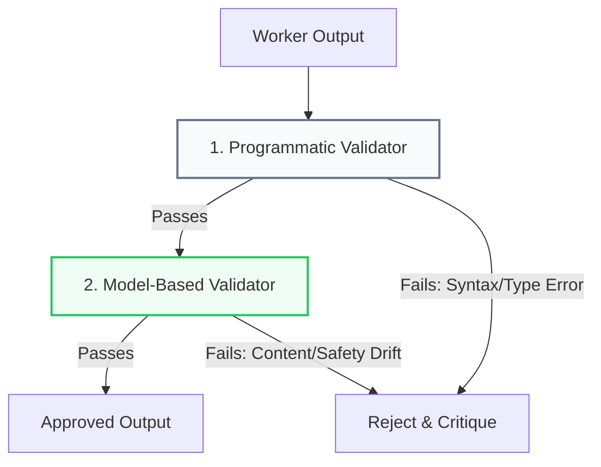

In software engineering, letting developers run their own manual QA on their code without testing standards is a known path to bug-ridden deployments. Yet, in generative AI systems, developers routinely instruct a single agent to write code and verify its correctness in the same context window.

This self-evaluation pattern fails because Large Language Models suffer from a systemic **confirmation bias**. Once a model outputs a generation, it tends to read past its own bugs in subsequent steps, declaring its own work "valid."

To build reliable systems, we must separate generation from verification using the **Validator Agent Pattern**.

---

## Programmatic vs. Model-Based Validators

A validator agent is a dedicated node in your system design whose sole responsibility is to evaluate a worker's output against a **Verification Contract**. Validators should be structured in two distinct layers, executing in a strict sequence:



### 1. Programmatic Validators (Rule-Based Gates)
Before invoking a model to evaluate output, run strict, rule-based code checks. Programmatic checks are deterministic, execute in milliseconds, and consume zero tokens.
*   **Syntax & Compilers**: Run compilers (e.g., `tsc` for TypeScript) or syntax parsers (e.g., python's `ast.parse`) to verify code compiles.
*   **Testing Suites**: Execute unit tests (e.g., `pytest`, `vitest`) inside a sandboxed container, capturing the exact stack traces.
*   **Schema Checkers**: Validate that JSON outputs match Pydantic or JSON Schema structures exactly.

### 2. Model-Based Validators (LLM-as-a-Judge)
If the output compiles and passes structural checks, route it to a separate model-based validator. This node evaluates subjective quality, compliance, and semantic drift.
*   **Role Isolation**: The model-based validator must use a distinct system prompt configured for criticism. It should *never* share the generation history or prompt files of the worker.
*   **Strict Grading Rubrics**: Provide the validator with a structured rubric (e.g., "Score the explanation from 1 to 5 on clarity, safety, and source alignment. Reject any score below 4").

---

## Designing the Verification Contract

When the Orchestrator delegates a task to a Worker, it must output a **Verification Contract** alongside the task instructions. The contract defines:
1.  **Structural Bounds**: Required variables, import statements, or JSON keys.
2.  **Functional Bounds**: Specific unit tests or regex schemas the output must satisfy.
3.  **Safety Bounds**: Content filters, brand compliance rules, and PII detection criteria.

If the Validator flags a contract violation, it compiles a structured critique:
```json
{
  "status": "failed",
  "reason": "Test case 'test_negative_balance' failed with AssertionError.",
  "failed_lines": [43, 44],
  "critique": "The transaction calculation allowed a negative balance. Ensure the worker locks the row and checks balance boundaries before debiting."
}
```
This critique is piped back to the Worker, which runs again with the critique as context.

---

## 📋 The Validation Gate Checklist

*   [ ] **Strict Pipeline Sequence**: Always run programmatic checks (linters, test suites) *first*. If a test fails, terminate or loop back immediately without calling the expensive validator model.
*   [ ] **Model Decoupling**: If the Worker uses Claude Opus, use a faster, cheaper model (like Claude Sonnet or GPT-4o-mini) for the validator node to optimize latency and costs.
*   [ ] **Loop Escape Valve**: Enforce a hard ceiling on the critique loop (maximum 3 iterations). If the worker cannot satisfy the validator after 3 turns, escalate to a **Human-in-the-Loop breakpoint**.

---

## 📚 References & Further Reading

*   **Reflexion Framework**: Shinn et al., 2023. *Reflexion: Language Agents with Active Generative Feedback*. Explains the systematic benefits of separating execution from critic loops. [arXiv:2303.11366](https://arxiv.org/abs/2303.11366)
*   **LLM-as-a-Judge**: Zheng et al., 2023. *Judging LLM-as-a-Judge with MT-Bench and Chatbot Arena*. System evaluation guidelines and biases when using model judges. [arXiv:2306.05685](https://arxiv.org/abs/2306.05685)
*   **VMAO Framework**: *Verified Multi-Agent Orchestration: A Plan-Execute-Verify-Replan Framework* (March 2026). Explains verification-driven agent replanning. [arXiv:2603.10952](https://arxiv.org/abs/2603.10952) (Needs verification)

*To explore complete code implementations of all 17 agent microservices in a single monorepo, check out the public [agentic-apps-portfolio](https://github.com/akmalkhaniub/agentic-apps-portfolio) repository.*
