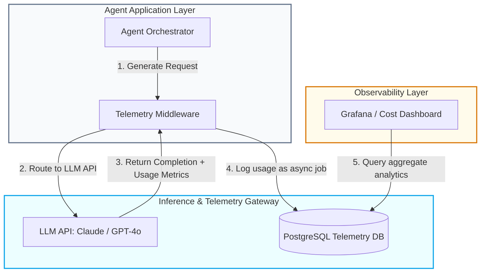

> ### 📖 Article Overview
> * **What this article is about:** This article explores how to optimize multi-agent LLM systems using Context Engineering for prompt caching and Token Economics Telemetry.
> * **Why it matters:** Unoptimized agentic workflows incur exponential API costs and latency spikes, making strict token tracking and cache-friendly prompt design critical for sustainable, enterprise-grade AI deployment.
> * **What we synthesized:** We synthesized a complete telemetry and cost-routing pipeline, prefix caching rules for maximizing hit rates, and a Node.js middleware implementation to track and log real-time token metrics.

When deploying large-scale Generative AI applications, API costs and latency compound exponentially. In a multi-agent system, agents repeatedly pass long conversations, document contexts, and tool definitions back and forth. This "agentic tax" can quickly run up thousands of dollars in cloud API fees and slow system response times to an crawl.

To operate enterprise-grade AI products sustainably, we must transition from basic prompt templates to strict **Context Engineering** and **Token Economics Telemetry**. 

This article details how to optimize prompt structures for **Prompt Caching**, track model telemetry (input, output, and cached tokens), and design real-time observability dashboards.

---

## Telemetry and Cost-Routing Pipeline

To audit and optimize costs, every single model call must pass through a wrapper that logs token metrics and latency data into an analytical database before resolving back to the agent application.



1. **Agent Request**: The orchestrator triggers an API call with static tools, system instructions, and dynamic context.
2. **Middleware Interception**: A custom middleware wraps the API call, capturing a timestamp.
3. **LLM Execution**: The provider executes the call, utilizing prompt cache hits if available, and returns the response metadata containing `input_tokens`, `output_tokens`, and `cached_tokens`.
4. **Asynchronous Audit**: The middleware calculates costs based on current pricing tables, measures Time to First Token (TTFT), and writes the metrics asynchronously to the database.
5. **Dashboard Visualization**: Visualization tools aggregate the metrics to expose cost-per-agent, average latency, and cache efficiency metrics.

---

## Context Engineering: Prefix Caching Rules

Modern LLMs (like Anthropic Claude and OpenAI GPT models) support **Prompt Caching**. Instead of paying full price to parse the entire prompt on every request, the model retrieves the Key-Value (KV) cache of previous tokens. This reduces input cost by **up to 90%** and cuts Time to First Token (TTFT) by **over 80%**.

However, prompt caching is **prefix-dependent**. The cache is read sequentially from the beginning of the prompt. If a single character changes at the beginning of the prompt, the entire cache is invalidated.

### Bad Prompt Layout (Invalidates Cache):
```markdown
[Dynamic Variable: User Name]
[Dynamic Variable: Today's Date]
[Static: 5,000-word System Instruction Manual]
[Static: 15 Tool Definitions]
[Dynamic Query: "What is my account status?"]
```
*Why it fails*: The dynamic user name and date change on every request, shifting the character alignment. The cache engine never matches the static instruction block.

###  Good Prompt Layout (Maximizes Cache Hits):
```markdown
[Static: 5,000-word System Instruction Manual] (Cache Marker 1)
[Static: 15 Tool Definitions]                  (Cache Marker 2)
[Dynamic Variable: User Name]
[Dynamic Variable: Today's Date]
[Dynamic Query: "What is my account status?"]
```
*Why it works*: The static instruction manual and tool definitions are placed at the very prefix of the prompt. They remain identical across requests, guaranteeing high cache hit rates.

---

## Coding LLM Telemetry Middleware in Node.js

Here is a backend wrapper designed to intercept LLM completions, calculate costs dynamically based on cache-hit percentages, and log usage statistics, modeled on analytics frameworks in [agentic-apps-portfolio](https://github.com/akmalkhaniub/agentic-apps-portfolio).

### 1. Database Ingestion Schema
```sql
CREATE TABLE llm_telemetry_logs (
    id UUID PRIMARY KEY DEFAULT gen_random_uuid(),
    agent_name VARCHAR(100) NOT NULL,
    model_name VARCHAR(100) NOT NULL,
    time_to_first_token_ms INT NOT NULL,
    total_latency_ms INT NOT NULL,
    input_tokens INT NOT NULL,
    output_tokens INT NOT NULL,
    cached_tokens INT DEFAULT 0,
    estimated_cost_usd NUMERIC(10, 6) NOT NULL,
    created_at TIMESTAMP DEFAULT CURRENT_TIMESTAMP
);
```

### 2. Telemetry Interceptor Implementation
```javascript
// telemetryService.js
const { Pool } = require('pg');
const pool = new Pool({ connectionString: process.env.DATABASE_URL });

const COST_TABLE = {
  'claude-3-5-sonnet': {
    input: 0.000003,      // $3.00 per Million
    cached: 0.0000003,    // $0.30 per Million (90% discount)
    output: 0.000015      // $15.00 per Million
  }
};

async function logLLMUsage({ agentName, model, durationMs, ttftMs, usage }) {
  const { inputTokens, outputTokens, cachedTokens = 0 } = usage;
  const rates = COST_TABLE[model] || { input: 0, cached: 0, output: 0 };
  
  // Calculate cost: cached tokens receive discount
  const freshInputTokens = inputTokens - cachedTokens;
  const cost = (freshInputTokens * rates.input) + 
               (cachedTokens * rates.cached) + 
               (outputTokens * rates.output);

  const query = `
    INSERT INTO llm_telemetry_logs 
    (agent_name, model_name, time_to_first_token_ms, total_latency_ms, input_tokens, output_tokens, cached_tokens, estimated_cost_usd)
    VALUES ($1, $2, $3, $4, $5, $6, $7, $8);
  `;
  
  await pool.query(query, [
    agentName,
    model,
    ttftMs,
    durationMs,
    inputTokens,
    outputTokens,
    cachedTokens,
    cost
  ]);
}
```

---

## Telemetry Dashboard Goals
* **P99 Latency Audits**: Drill down into which specific agents run long-running loops or experience deep prefill delays.
* **Cache-Hit Ratio (CHR)**: Track `(cached_tokens / input_tokens) * 100`. Strive to keep CHR above 70% for system prompts.
* **Direct Cost Allocation**: Assign dollar figures to specific departments or features (e.g., "Research Agent" vs. "Summarizer Agent") to isolate run-away agent loops.

---

## Conclusion & Key Takeaways

Optimizing agentic workflows requires shifting from simple prompt construction to rigorous token management and observability.
1. **Context Engineering is Critical:** Structuring prompts with static system instructions and tool definitions at the prefix ensures high prompt cache hit rates, reducing input costs by up to 90%.
2. **Telemetry Enables Accountability:** Implementing a middleware wrapper to capture latency, TTFT, and cached token metrics allows teams to attribute costs directly to specific agents and identify runaway loops.
3. **Observability Drives Optimization:** Real-time dashboards tracking Cache-Hit Ratio (CHR) and P99 latency provide the actionable insights needed to continuously refine agent performance and maintain budget control.

*Takeaway:* *By treating tokens as a core economic resource, enterprises can scale multi-agent systems sustainably without compromising on performance or cost.*

---

## References & Further Reading

* **Prompt Caching Benefits**: [Anthropic Prompt Caching Guide](https://docs.anthropic.com/en/docs/build-with-claude/prompt-caching). Specifications on minimum tokens and caching performance benchmarks.
* **Latency Optimizations**: *Tail-Optimized KV Cache Allocations*. Explains how prioritizing cached KV tensors for tail requests minimizes latency spikes. [arXiv:2501.09344](https://arxiv.org/abs/2501.09344)

*To check out our observability integrations, inspect the codebase of our [agentic-apps-portfolio](https://github.com/akmalkhaniub/agentic-apps-portfolio) repository.*