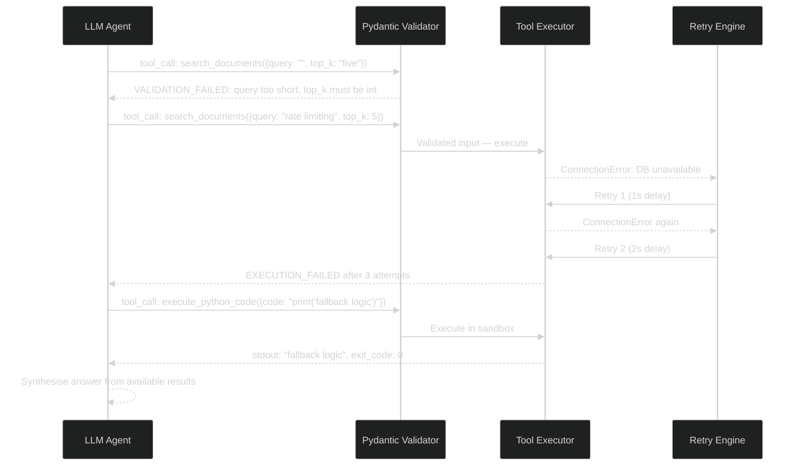

# Tool-Calling Contracts & Error Recovery: Building Resilient Agent Tool Schemas

> [!NOTE]
> **📖 Article Overview**
> Tool calls are the primary interface between LLM reasoning and the real world. When agents call tools with hallucinated parameters, invalid JSON, or unexpected edge cases, the entire pipeline breaks. This article covers **Tool-Calling Contract Design** — how to define strict, typed tool schemas using the OpenAI function-calling format and Anthropic's tool use API, validate every argument with Pydantic, and implement **graceful error recovery** patterns that prevent a single tool failure from crashing a multi-step agent run. Includes full Python implementations with retry logic, fallback strategies, and structured error feedback loops.

---

## Why Tool Calls Break in Production

Tool calling is conceptually simple: the LLM decides to call a function, the runtime executes it, and the result is fed back. In practice, production failures cluster around three anti-patterns:

1.  **Hallucinated Parameters**: The model confidently passes an argument that doesn't exist in the schema — e.g., `{"user_id": "abc123", "sort_by": "relevance"}` when `sort_by` is not a defined field. Without validation, this propagates silently.
2.  **Type Coercion Failures**: The model returns `"true"` (string) for a boolean field, `"5"` (string) for an integer, or an ISO date string when an epoch timestamp is expected.
3.  **Missing Graceful Degradation**: When a tool returns an error, naive agents either infinite-loop retrying or completely abort the task — both are unacceptable in enterprise workflows.

The solution is a three-layer defense: **Schema Contracts → Runtime Validation → Structured Recovery**.

---

## Tool Contract Architecture

```mermaid
%%{init: {'theme': 'dark', 'themeVariables': { 'primaryColor': '#10b981', 'primaryTextColor': '#f3f4f6', 'primaryBorderColor': '#34d399', 'lineColor': '#10b981', 'secondaryColor': '#111827', 'tertiaryColor': '#0f172a'}}}%%
flowchart TD
    A[🧠 LLM Reasoning Layer] -->|Generates tool call JSON| B{Schema Validator<br/>Pydantic v2}
    
    B -->|✅ Valid Schema| C[Tool Executor<br/>Function Registry]
    B -->|❌ Invalid Schema| D[Error Feedback Loop<br/>Structured Error Message]
    D --> A

    C -->|Success| E[Tool Result<br/>Typed Response Object]
    C -->|Exception / Timeout| F{Retry Policy<br/>ExponentialBackoff}
    
    F -->|Attempt ≤ Max Retries| C
    F -->|Max Retries Exceeded| G[Fallback Strategy<br/>Default Value / Alt Tool]
    
    E --> H[LLM Observation<br/>Continue Reasoning]
    G --> H

    style A fill:#4c1d95,stroke:#a855f7,stroke-width:2px
    style B fill:#0f172a,stroke:#10b981,stroke-width:2px
    style C fill:#0f172a,stroke:#0ea5e9,stroke-width:2px
    style D fill:#7f1d1d,stroke:#ef4444,stroke-width:2px
    style F fill:#1e293b,stroke:#f59e0b,stroke-width:2px
    style G fill:#1e293b,stroke:#f59e0b,stroke-width:2px
    style H fill:#4c1d95,stroke:#a855f7,stroke-width:2px
```



---

## What's Good & What's Not

| What's Good (Pros) | What's Not (Cons) |
| --- | --- |
| * Hallucination Containment: Pydantic validation catches invalid args before execution, returning structured feedback the LLM can correct. | * Schema Complexity Cost: Detailed JSON schemas with descriptions and constraints consume extra input tokens on every planning call. |
| * Graceful Degradation: Retry + fallback logic keeps agent runs alive through transient failures without human intervention. | * Retry Amplification: Exponential retries on flaky external APIs (rate limits, network) can multiply total latency from 5s to 60s+ in worst-case scenarios. |
| * Typed Contracts: Returning Pydantic models (not raw dicts) from tools prevents downstream attribute-access bugs in multi-step agents. | * Error Loop Risk: Poorly designed error feedback messages can confuse the LLM into repeatedly calling the same broken tool instead of pivoting to an alternative. |

---

## Implementation: Typed Tool Registry with Pydantic v2

```python
import json
import time
import functools
from typing import Any, Callable, Optional, Type, TypeVar
from pydantic import BaseModel, Field, ValidationError, field_validator
from anthropic import Anthropic

# ─────────────────────────────────────────────
# 1. Define Typed Tool Input/Output Contracts
# ─────────────────────────────────────────────

class SearchDocumentsInput(BaseModel):
    """Input contract for the document search tool."""
    query: str = Field(..., min_length=3, max_length=500, description="The search query string")
    top_k: int = Field(default=5, ge=1, le=20, description="Number of results to return (1-20)")
    filter_tags: list[str] = Field(default_factory=list, description="Optional tag filters")
    include_metadata: bool = Field(default=True, description="Whether to include document metadata")
    
    @field_validator('query')
    @classmethod
    def query_must_not_be_empty(cls, v: str) -> str:
        if not v.strip():
            raise ValueError("Query cannot be empty or whitespace only")
        return v.strip()

class SearchDocumentsOutput(BaseModel):
    """Output contract for the document search tool."""
    results: list[dict[str, Any]]
    total_found: int
    query_used: str
    latency_ms: float

class ExecuteCodeInput(BaseModel):
    """Input contract for the Python code execution tool."""
    code: str = Field(..., description="Valid Python code to execute in isolated sandbox")
    timeout_seconds: int = Field(default=30, ge=5, le=120, description="Execution timeout")
    
    @field_validator('code')
    @classmethod
    def code_must_not_import_os(cls, v: str) -> str:
        """Basic security gate — prevent filesystem and subprocess access."""
        dangerous = ['import os', 'import subprocess', '__import__', 'open(', 'eval(', 'exec(']
        for pattern in dangerous:
            if pattern in v:
                raise ValueError(f"Dangerous pattern detected: '{pattern}'. Sandboxed execution disallows system access.")
        return v

class ExecuteCodeOutput(BaseModel):
    """Output contract for code execution."""
    stdout: str
    stderr: str
    exit_code: int
    execution_time_ms: float

# ─────────────────────────────────────────────
# 2. Tool Decorator with Validation & Retry
# ─────────────────────────────────────────────

class ToolExecutionError(Exception):
    """Raised when a tool fails after all retry attempts."""
    def __init__(self, tool_name: str, original_error: str, attempts: int):
        self.tool_name = tool_name
        self.original_error = original_error
        self.attempts = attempts
        super().__init__(f"Tool '{tool_name}' failed after {attempts} attempts: {original_error}")

F = TypeVar('F', bound=Callable[..., Any])

def resilient_tool(
    input_model: Type[BaseModel],
    output_model: Type[BaseModel],
    max_retries: int = 3,
    base_delay: float = 1.0,
    fallback_result: Optional[Any] = None
):
    """
    Decorator that adds:
    - Pydantic input validation with structured error feedback
    - Pydantic output validation
    - Exponential backoff retry logic
    - Configurable fallback on terminal failure
    """
    def decorator(func: F) -> F:
        @functools.wraps(func)
        def wrapper(raw_args: dict[str, Any]) -> dict[str, Any]:
            tool_name = func.__name__
            
            # Step 1: Validate inputs
            try:
                validated_input = input_model(**raw_args)
            except ValidationError as e:
                # Return structured error for LLM to self-correct
                errors = [
                    {"field": err["loc"][-1], "issue": err["msg"], "invalid_value": err.get("input")}
                    for err in e.errors()
                ]
                return {
                    "error": "VALIDATION_FAILED",
                    "tool": tool_name,
                    "message": f"Input validation failed for tool '{tool_name}'. Fix the following errors and retry:",
                    "field_errors": errors,
                    "schema_hint": input_model.model_json_schema()
                }
            
            # Step 2: Execute with exponential backoff
            last_error = ""
            for attempt in range(1, max_retries + 1):
                try:
                    raw_result = func(validated_input)
                    validated_output = output_model(**raw_result) if isinstance(raw_result, dict) else raw_result
                    return validated_output.model_dump()
                    
                except ValidationError as e:
                    return {
                        "error": "OUTPUT_SCHEMA_VIOLATION",
                        "tool": tool_name,
                        "message": "Tool returned an unexpected output format",
                        "details": str(e)
                    }
                except Exception as e:
                    last_error = str(e)
                    if attempt < max_retries:
                        delay = base_delay * (2 ** (attempt - 1))  # 1s, 2s, 4s
                        print(f"[Tool:{tool_name}] Attempt {attempt} failed: {e}. Retrying in {delay}s...")
                        time.sleep(delay)
                    else:
                        print(f"[Tool:{tool_name}] All {max_retries} attempts exhausted.")
            
            # Step 3: Return fallback or structured error
            if fallback_result is not None:
                print(f"[Tool:{tool_name}] Using fallback result.")
                return fallback_result
            
            return {
                "error": "EXECUTION_FAILED",
                "tool": tool_name,
                "message": f"Tool '{tool_name}' failed after {max_retries} attempts. Consider an alternative approach.",
                "last_error": last_error
            }
        
        return wrapper  # type: ignore
    return decorator

# ─────────────────────────────────────────────
# 3. Register Concrete Tool Implementations
# ─────────────────────────────────────────────

@resilient_tool(
    input_model=SearchDocumentsInput,
    output_model=SearchDocumentsOutput,
    max_retries=3,
    fallback_result={"results": [], "total_found": 0, "query_used": "", "latency_ms": 0}
)
def search_documents(args: SearchDocumentsInput) -> dict:
    """Simulated document search — replace with actual vector DB call."""
    start = time.time()
    time.sleep(0.05)  # Simulate latency
    
    # Mock results
    results = [
        {"id": f"doc_{i}", "content": f"Document about {args.query}", "score": 0.95 - (i * 0.05)}
        for i in range(args.top_k)
    ]
    
    return {
        "results": results,
        "total_found": args.top_k,
        "query_used": args.query,
        "latency_ms": round((time.time() - start) * 1000, 2)
    }

@resilient_tool(
    input_model=ExecuteCodeInput,
    output_model=ExecuteCodeOutput,
    max_retries=2
)
def execute_python_code(args: ExecuteCodeInput) -> dict:
    """Executes Python code in a restricted namespace."""
    import io, sys
    from contextlib import redirect_stdout, redirect_stderr
    
    start = time.time()
    stdout_capture = io.StringIO()
    stderr_capture = io.StringIO()
    
    try:
        with redirect_stdout(stdout_capture), redirect_stderr(stderr_capture):
            exec(args.code, {"__builtins__": {"print": print, "range": range, "len": len, "str": str, "int": int}})
        exit_code = 0
    except Exception as e:
        stderr_capture.write(str(e))
        exit_code = 1
    
    return {
        "stdout": stdout_capture.getvalue(),
        "stderr": stderr_capture.getvalue(),
        "exit_code": exit_code,
        "execution_time_ms": round((time.time() - start) * 1000, 2)
    }

# ─────────────────────────────────────────────
# 4. Tool Registry & Dispatcher
# ─────────────────────────────────────────────

TOOL_REGISTRY: dict[str, Callable] = {
    "search_documents": search_documents,
    "execute_python_code": execute_python_code,
}

def dispatch_tool_call(tool_name: str, tool_args: dict[str, Any]) -> dict[str, Any]:
    """Routes LLM tool calls to the registered implementation."""
    if tool_name not in TOOL_REGISTRY:
        return {
            "error": "UNKNOWN_TOOL",
            "message": f"Tool '{tool_name}' not found. Available tools: {list(TOOL_REGISTRY.keys())}"
        }
    return TOOL_REGISTRY[tool_name](tool_args)

# ─────────────────────────────────────────────
# 5. Anthropic Agent Loop with Full Error Recovery
# ─────────────────────────────────────────────

TOOLS = [
    {
        "name": "search_documents",
        "description": "Search the enterprise knowledge base for relevant documents using semantic search.",
        "input_schema": SearchDocumentsInput.model_json_schema()
    },
    {
        "name": "execute_python_code",
        "description": "Execute Python code in a secure sandbox and return stdout/stderr output.",
        "input_schema": ExecuteCodeInput.model_json_schema()
    }
]

def run_agent_with_error_recovery(user_task: str, max_iterations: int = 10) -> str:
    """Agent loop that handles tool errors gracefully via structured feedback."""
    client = Anthropic()
    messages = [{"role": "user", "content": user_task}]
    
    for iteration in range(max_iterations):
        response = client.messages.create(
            model="claude-3-5-sonnet-20241022",
            max_tokens=4096,
            tools=TOOLS,
            messages=messages
        )
        
        if response.stop_reason == "end_turn":
            # Extract final text response
            for block in response.content:
                if hasattr(block, 'text'):
                    return block.text
        
        if response.stop_reason == "tool_use":
            messages.append({"role": "assistant", "content": response.content})
            tool_results = []
            
            for block in response.content:
                if block.type == "tool_use":
                    print(f"\n[Iteration {iteration+1}] Calling tool: {block.name}")
                    print(f"  Args: {json.dumps(block.input, indent=2)}")
                    
                    result = dispatch_tool_call(block.name, block.input)
                    
                    # If error, the structured error dict is returned to LLM for self-correction
                    is_error = "error" in result
                    print(f"  Result: {'❌ ERROR' if is_error else '✅ SUCCESS'}")
                    
                    tool_results.append({
                        "type": "tool_result",
                        "tool_use_id": block.id,
                        "content": json.dumps(result),
                        "is_error": is_error
                    })
            
            messages.append({"role": "user", "content": tool_results})
    
    return "Agent reached maximum iterations without completing the task."

if __name__ == "__main__":
    result = run_agent_with_error_recovery(
        "Search for documents about Redis rate limiting and then write a Python script to calculate the optimal token bucket refill rate for 1000 requests per minute."
    )
    print("\n===== FINAL RESULT =====")
    print(result)
```

---

## Error Recovery Sequence: LLM Self-Correction Loop



---

## Generating Tool Schemas Directly from Pydantic Models

Instead of hand-crafting JSON schemas, derive them automatically from your Pydantic models — guaranteeing schema and validation stay in sync:

```python
def pydantic_to_anthropic_tool(
    name: str,
    description: str,
    input_model: Type[BaseModel]
) -> dict:
    """Auto-generates an Anthropic-compatible tool definition from a Pydantic model."""
    schema = input_model.model_json_schema()
    # Remove Pydantic's $defs if they exist (Anthropic doesn't support refs)
    schema.pop("$defs", None)
    return {
        "name": name,
        "description": description,
        "input_schema": schema
    }

# Usage: Schema auto-generated from the Pydantic class
search_tool_def = pydantic_to_anthropic_tool(
    name="search_documents",
    description="Search enterprise knowledge base using semantic similarity.",
    input_model=SearchDocumentsInput
)

print(json.dumps(search_tool_def, indent=2))
# {
#   "name": "search_documents",
#   "description": "Search enterprise knowledge base...",
#   "input_schema": {
#     "type": "object",
#     "properties": {
#       "query": {"type": "string", "minLength": 3, ...},
#       "top_k": {"type": "integer", "default": 5, ...},
#       ...
#     },
#     "required": ["query"]
#   }
# }
```

---

## Conclusion & Key Takeaways

Robust tool-calling is the difference between a demo agent and a production agent. By encoding contracts in Pydantic models, validating at runtime, and returning structured error feedback, you give the LLM everything it needs to self-correct without human intervention.

*   **Always return structured errors to the LLM** — not raw exceptions. The model cannot learn from a Python traceback, but it can correct itself from a field-level validation message.
*   **Cap retries with jitter**: Add random jitter (`delay * random.uniform(0.8, 1.2)`) to retry delays to prevent thundering-herd effects when multiple agent workers hit the same external API simultaneously.
*   **Test failure modes explicitly**: Write unit tests that pass intentionally malformed tool arguments and assert that the error feedback message is parseable by an LLM.

In our next article, we explore **Agent Memory: Short-Term, Episodic & Semantic** — how to persist agent state across sessions using Mem0, Redis, and pgvector so agents accumulate knowledge and context over time.

---

### Research References & Resources
*   **Anthropic Tool Use Guide**: [Function Calling with Claude](https://docs.anthropic.com/en/docs/build-with-claude/tool-use)
*   **OpenAI Function Calling**: [Structured Tool Calling Reference](https://platform.openai.com/docs/guides/function-calling)
*   **Pydantic v2 Documentation**: [Data Validation for Python](https://docs.pydantic.dev/latest/)
