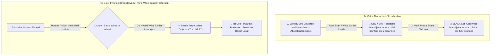

# Tri-Color Marking & Concurrent Sweep: Go Runtime Garbage Collector & Write Barriers

In cloud-native microservices (**Kubernetes**, **Docker**, **CockroachDB**, **Terraform**), the **Go Runtime** powers high-concurrency networking workloads.

To serve millions of concurrent Goroutines without latency disruptions, Go features a low-latency **Concurrent Tri-Color Mark-and-Sweep Garbage Collector**.

Unlike generational collectors that require complex object relocation, Go's GC collector operates concurrently alongside active Goroutines (**Mutators**), keeping Stop-The-World (STW) pauses well under **$1\text{ millisecond}$**.

To prevent Mutator threads from hiding live objects during concurrent marking, the Go runtime enforces strict memory invariants using **Hybrid Write Barriers**.

This article details Dijkstra's Tri-Color Abstraction, the Tri-Color Invariant breakdown, Dijkstra vs Yuasa vs Hybrid Write Barriers, concurrent sweep mechanics, and the GC CPU Pacer.

---

## 📖 Tri-Color Abstraction & Hybrid Write Barrier Architecture

How the Go runtime uses White, Grey, and Black object classifications alongside Hybrid Write Barriers to ensure zero object loss during concurrent marking:



### Core Go GC Principles
1. **The Tri-Color Marking Abstraction**:
   * **White Objects**: Unvisited objects. At the end of the Mark phase, all remaining White objects are unreachable garbage and will be freed during the Sweep phase.
   * **Grey Objects**: Reachable objects placed on the GC work queue waiting for their child pointers to be scanned.
   * **Black Objects**: Confirmed live objects. The collector has scanned all child pointers. **Invariant Rule**: Black objects can *never* contain direct pointers to White objects without an intervening Grey object.
2. **The Tri-Color Invariant Breakdown**:
   * A concurrent GC collector will erroneously delete a live object if two conditions occur simultaneously:
     1. A Mutator writes a reference from a **Black object** to a **White object** (`black.ptr = white`).
     2. All existing references from **Grey objects** to that **White object** are destroyed before the collector scans them.
3. **Write Barriers (Dijkstra, Yuasa & Go Hybrid)**:
   * **Dijkstra Write Barrier**: Whenever a pointer write occurs (`*slot = ptr`), color `ptr` Grey (**Insertion Barrier**). Prevents Black objects from pointing to hidden White objects.
   * **Yuasa Write Barrier**: Whenever a pointer is overwritten (`*slot = ptr`), color the *old* pointer `*slot` Grey (**Deletion Barrier**). Preserves reachability of old objects.
   * **Go Hybrid Write Barrier (Go 1.8+)**: Combines Dijkstra and Yuasa barriers:
     $$\text{WriteBarrier}(\text{slot}, \text{ptr}) \implies \text{shade}(*\text{slot}); \; \text{shade}(\text{ptr})$$
     Shades both the old overwritten pointer and the new written pointer Grey. *Eliminates the need to re-scan Goroutine stacks at the end of the mark phase, dropping STW pauses to microseconds!*
4. **Concurrent Sweep & GC CPU Pacer**:
   * **Concurrent Sweep**: Background Goroutines sweep unused White memory blocks back to thread-local allocation caches (`mcache` / `mcentral`) concurrently while application code runs.
   * **GC Pacer**: Dynamically calculates the GC trigger heap threshold (`GOGC`, default $100\%$). If heap allocation outpaces GC marking speed, the pacer forces heavy-allocating Goroutines to assist in marking (**Mark Assist**).

---

## 🛠️ Python Implementation: Tri-Color GC Engine & Hybrid Write Barrier

Here is a production-grade Python implementation of a Tri-Color Garbage Collection Engine featuring Hybrid Write Barriers and Concurrent Sweep:

```python
from typing import Dict, List, Set, Optional
from pydantic import BaseModel

class HeapObject(BaseModel):
    obj_id: str
    color: str = "WHITE"  # WHITE, GREY, BLACK
    fields: Dict[str, str] = {}  # { field_name -> target_obj_id }

class GoRuntimeGarbageCollectorEngine:
    """
    Simulates Go Concurrent Tri-Color Mark & Sweep GC with Hybrid Write Barriers.
    """
    def __init__(self):
        self.heap: Dict[str, HeapObject] = {}
        self.roots: Set[str] = set()
        self.grey_work_queue: List[str] = []
        self.write_barrier_enabled: bool = False

    def allocate(self, obj_id: str) -> HeapObject:
        obj = HeapObject(obj_id=obj_id, color="WHITE" if not self.write_barrier_enabled else "BLACK")
        self.heap[obj_id] = obj
        print(f" 📥 [Allocated] Object '{obj_id}' (Color: {obj.color})")
        return obj

    def shade(self, obj_id: Optional[str]):
        """Shades object GREY if currently WHITE."""
        if obj_id and obj_id in self.heap:
            obj = self.heap[obj_id]
            if obj.color == "WHITE":
                obj.color = "GREY"
                self.grey_work_queue.append(obj_id)
                print(f" 👵 [Shade GREY] Object '{obj_id}' turned GREY -> Added to GC Work Queue")

    def hybrid_write_barrier(self, src_obj_id: str, field_name: str, new_target_id: Optional[str]):
        """
        Go Hybrid Write Barrier: Shades BOTH old overwritten target AND new target.
        """
        src_obj = self.heap[src_obj_id]
        old_target_id = src_obj.fields.get(field_name)

        if self.write_barrier_enabled:
            print(f" ⚡ [Hybrid Write Barrier Intercept] '{src_obj_id}.{field_name}' = '{new_target_id}' (Old: '{old_target_id}')")
            self.shade(old_target_id)     # Yuasa Deletion Barrier
            self.shade(new_target_id)     # Dijkstra Insertion Barrier

        src_obj.fields[field_name] = new_target_id

    def run_concurrent_mark_phase(self):
        """Executes Tri-Color Concurrent Mark Phase."""
        print("\n🚀 Initiating Go Concurrent Tri-Color Mark Phase...")
        self.write_barrier_enabled = True
        print(" 🔒 [Write Barrier Enabled] Go Hybrid Write Barrier ACTIVE across all Goroutines")

        # 1. Root Scan: Turn all Root objects GREY
        for root_id in self.roots:
            self.shade(root_id)

        # 2. Drain Grey Work Queue
        while self.grey_work_queue:
            curr_id = self.grey_work_queue.pop(0)
            curr_obj = self.heap[curr_id]
            
            # Scan child fields
            for child_id in curr_obj.fields.values():
                if child_id:
                    self.shade(child_id)

            curr_obj.color = "BLACK"
            print(f" 🖤 [Marked BLACK] Object '{curr_id}' and all children fully scanned.")

    def run_concurrent_sweep_phase(self):
        """Sweeps unreferenced WHITE objects back to memory pool."""
        print("\n🧹 Initiating Go Concurrent Sweep Phase...")
        self.write_barrier_enabled = False
        freed_count = 0

        unreachable_keys = [k for k, v in self.heap.items() if v.color == "WHITE"]
        for k in unreachable_keys:
            del self.heap[k]
            freed_count += 1
            print(f" 🗑️ [Swept & Freed] Unreachable WHITE Object '{k}' reclaimed!")

        # Reset colors for next cycle
        for obj in self.heap.values():
            obj.color = "WHITE"

        print(f" 🎉 [Sweep Complete] Reclaimed {freed_count} garbage objects!")

# Demonstration Execution
if __name__ == "__main__":
    gc = GoRuntimeGarbageCollectorEngine()

    print("🚀 Demonstrating Go Tri-Color GC & Hybrid Write Barriers...")
    print("=" * 75)

    # 1. Allocate Heap Objects
    root = gc.allocate("Root_Goroutine_Stack")
    objA = gc.allocate("Object_A")
    objB = gc.allocate("Object_B_Garbage")

    gc.roots.add("Root_Goroutine_Stack")
    root.fields["child"] = "Object_A"

    # 2. Run Tri-Color Mark Phase
    gc.run_concurrent_mark_phase()

    # 3. Mutator attempts to write reference during marking (Intercepted by Hybrid Write Barrier!)
    objC = gc.allocate("Object_C_New")
    gc.hybrid_write_barrier("Object_A", "link", "Object_C_New")

    # Re-drain grey queue after barrier insertion
    gc.run_concurrent_mark_phase()

    # 4. Run Concurrent Sweep Phase
    gc.run_concurrent_sweep_phase()
```

---

## 🚨 Go GC Gotchas & Best Practices

When optimizing Go garbage collection:

> [!IMPORTANT]
> **Use Sync.Pool for High-Frequency Object Allocations**: In high-throughput HTTP servers, allocating millions of short-lived byte buffers overloads the GC pacer. Use `sync.Pool` to reuse allocated byte slices across Goroutines.

> [!CAUTION]
> **Beware of Pointer-Dense Slice Data Structures**: A slice containing $10,000,000$ pointers (`[]*MyStruct`) forces the GC mark phase to scan all $10$ million pointer slots individually. Use value types (`[]MyStruct`) or integer offsets (`[]int32`) so the GC skips scanning the slice payload.

---

## 📈 Real-World Enterprise Impact
Go's concurrent tri-color garbage collector (powering **Kubernetes**, **Docker**, and **CockroachDB**) reports:
* **Microsecond Max STW Pause Times ($< 500\mu\text{s}$)**: Hybrid write barriers eliminate long stack re-scanning pauses.
* **Predictable Microservice P99 Latency**: Background concurrent sweeping prevents stop-the-world latency spikes in API gateways and cloud control planes.
