# TrueTime & Hybrid Logical Clocks (HLC): External Consistency in Spanner & CockroachDB

In globally distributed database systems (**Google Spanner**, **CockroachDB**, **YugabyteDB**), executing read-only transactions across worldwide datacenters requires ordering events chronologically across the globe.

In standard Linux operating systems, physical system clocks synchronized via Network Time Protocol (NTP) experience **Clock Drift**. Due to network jitter and crystal oscillator variations, NTP clocks on two servers in the same rack can drift apart by $10\text{ms}$ to $100\text{ms}$.

If Server A commits Transaction $T_1$ at physical time 10:00:00.050, and Server B commits Transaction $T_2$ at physical time 10:00:00.010 due to clock drift, the database cannot determine which transaction occurred first!

To achieve **External Consistency (Strict Serializability)**—where transaction commit order strictly matches real-world wall-clock time globally—distributed databases utilize **Google Spanner's TrueTime API** or **Hybrid Logical Clocks (HLC)**.

This article details TrueTime atomic clock uncertainty bounds ($\epsilon$), Commit Wait protocols, and Hybrid Logical Clock mechanics.

---

## TrueTime & Hybrid Logical Clock Architecture

How TrueTime Commit Wait ($2\epsilon$) and Hybrid Logical Clocks (HLC) guarantee global transaction ordering:

```mermaid
graph TD
  subgraph SG1_GoogleSpannerTruetime ["Google Spanner TrueTime (Hardware Atomic Clocks)"]
    GPS[GPS Hardware Receivers] & Atomic[Rubidium Atomic Clocks] --> TrueTimeAPI[TrueTime.now API -> Returns Interval: t_earliest .. t_latest]
    TrueTimeAPI -->|Bounded Uncertainty: epsilon <= 1ms| CommitWait[Spanner Commit Wait Protocol: Wait 2 * epsilon before releasing locks]
    CommitWait -->|Guarantees Real-World Ordering| ExternalConsistency[🎉 External Consistency Achieved!]
  end
  
  subgraph SG2_HybridLogicalClocks ["Hybrid Logical Clocks - HLC (Software Commodity NTP)"]
    NTP[Standard NTP Physical Time pt] --> HLC[HLC State: tuple physical, logical]
    HLC -->|Causal Event Message: msg_physical, msg_logical| UpdateHLC[Update HLC: Max physical, msg_physical, pt]
    UpdateHLC --> CausalOrdering[Causal Consistency Preserved without Atomic Clocks!]
  end
```



### Core Global Time Synchronization Protocols
1. **Google Spanner TrueTime API**:
   * *Hardware Architecture*: Deploys dual independent time sources in every Google datacenter: GPS antenna receivers and Rubidium atomic clocks.
   * *Interval Representation*: `TrueTime.now()` does not return a single discrete timestamp. It returns a time range with an explicit error bound $\epsilon$ (typically $\epsilon \approx 1\text{ms}$):
     $$\text{TrueTime.now}() = [t_{\text{earliest}}, t_{\text{latest}}] \quad \text{where } t_{\text{latest}} - t_{\text{earliest}} = 2\epsilon$$
2. **TrueTime Commit Wait Protocol**: To guarantee that if Transaction $T_2$ starts after $T_1$ commits, $T_2$'s commit timestamp is strictly greater than $T_1$'s ($s_2 > s_1$), Spanner applies **Commit Wait**:
   * Transaction $T_1$ picks a commit timestamp $s_1 = t_{\text{latest}}$ from `TrueTime.now()`.
   * The database **delays releasing $T_1$'s commit locks** until `TrueTime.now().earliest > s_1` (waiting $2\epsilon$ time, or $\approx 2\text{ms}$).
   * *Result*: By the time $T_1$'s commit is visible globally, real-world wall-clock time has passed $s_1$, guaranteeing global **External Consistency**.
3. **Hybrid Logical Clocks (HLC)**:
   * Google Spanner requires expensive custom atomic clock hardware. Databases running on commodity cloud providers (**CockroachDB**, **YugabyteDB**) use **Hybrid Logical Clocks (HLC)**.
   * *HLC Structure*: Represents time as a tuple $(l, c)$ where $l$ tracks the highest observed physical time (NTP $pt$) and $c$ is a logical counter used to order events occurring within the same physical millisecond.
   * *Causal Updating*: When a node receives a message tagged with timestamp $(l_m, c_m)$, it updates its local HLC state:
     $$l_{\text{new}} = \max(l_{\text{current}}, l_m, pt_{\text{local}})$$

---

## Python Implementation: Hybrid Logical Clock (HLC) Engine

Here is a production-grade Python implementation of a Hybrid Logical Clock (HLC) Engine featuring Causality Tracking and Physical Clock Skew Enforcement:

```python
import time
from typing import Tuple, Dict, Any
from pydantic import BaseModel

class HLCTimestamp(BaseModel):
    physical_ms: int  # Highest physical time l
    logical_c: int    # Logical counter c

    def __lt__(self, other: 'HLCTimestamp') -> bool:
        if self.physical_ms != other.physical_ms:
            return self.physical_ms < other.physical_ms
        return self.logical_c < other.logical_c

    def to_str(self) -> str:
        return f"(Physical: {self.physical_ms}ms, Logical: {self.logical_c})"

class HybridLogicalClockEngine:
    """
    Implements Kulkarni et al. Hybrid Logical Clock (HLC) Algorithm.
    """
    def __init__(self, node_id: str, max_clock_offset_ms: int = 500):
        self.node_id = node_id
        self.max_clock_offset_ms = max_clock_offset_ms
        self.l = 0  # Physical component
        self.c = 0  # Logical component

    def _get_physical_time_ms(self) -> int:
        return int(time.time() * 1000)

    def now(self) -> HLCTimestamp:
        """Generates HLC timestamp for a local event."""
        pt = self._get_physical_time_ms()
        l_old = self.l
        self.l = max(l_old, pt)

        if self.l == l_old:
            self.c += 1
        else:
            self.c = 0

        return HLCTimestamp(physical_ms=self.l, logical_c=self.c)

    def update(self, msg_hlc: HLCTimestamp) -> HLCTimestamp:
        """Updates HLC upon receiving a remote event message."""
        pt = self._get_physical_time_ms()

        # Check Physical Clock Skew Guardrail
        if msg_hlc.physical_ms - pt > self.max_clock_offset_ms:
            raise RuntimeError(f" 💥 Clock Skew Error! Remote message time ({msg_hlc.physical_ms}ms) exceeds max drift threshold ({self.max_clock_offset_ms}ms) from local physical time ({pt}ms).")

        l_old = self.l
        self.l = max(l_old, msg_hlc.physical_ms, pt)

        if self.l == l_old and self.l == msg_hlc.physical_ms:
            self.c = max(self.c, msg_hlc.logical_c) + 1
        elif self.l == l_old:
            self.c += 1
        elif self.l == msg_hlc.physical_ms:
            self.c = msg_hlc.logical_c + 1
        else:
            self.c = 0

        return HLCTimestamp(physical_ms=self.l, logical_c=self.c)

# Demonstration Execution
if __name__ == "__main__":
    node_A = HybridLogicalClockEngine(node_id="Node-A")
    node_B = HybridLogicalClockEngine(node_id="Node-B")

    print("🚀 Demonstrating Hybrid Logical Clocks (HLC) & Causality Tracking...")
    print("=" * 75)

    # 1. Node A generates local event ts_A1
    ts_A1 = node_A.now()
    print(f" 📍 [Node A Event 1] Generated HLC: {ts_A1.to_str()}")

    # 2. Node A sends message to Node B with ts_A1
    print(f"\n ✉️ Node A sends message (tagged with {ts_A1.to_str()}) -> Node B")
    ts_B1 = node_B.update(ts_A1)
    print(f" 📍 [Node B Received] Updated Local HLC to: {ts_B1.to_str()}")

    # 3. Node B generates local event ts_B2
    ts_B2 = node_B.now()
    print(f" 📍 [Node B Event 2] Generated HLC: {ts_B2.to_str()}")

    # 4. Verify Causal Ordering: ts_A1 < ts_B1 < ts_B2
    print("\n🔍 Verifying Global Causal Ordering:")
    print(f"   • Is Event A1 < Event B1? {ts_A1 < ts_B1} (True)")
    print(f"   • Is Event B1 < Event B2? {ts_B1 < ts_B2} (True)")
```

---

## TrueTime & HLC Gotchas & Best Practices

When engineering time synchronization in distributed databases:

> [!IMPORTANT]
> **Enforce Maximum Physical Clock Offset Bounds in HLC**: If NTP on a single node drifts ahead by 10 minutes, that node's HLC will advance $l$ into the future, forcing all other cluster nodes to advance their HLCs to 10 minutes in the future (**Clock Pollution**). Configure strict `max_clock_offset` checks (e.g. $500\text{ms}$) to kill drifting nodes automatically.

> [!CAUTION]
> **Monitor Atomic Clock GPS Lock Loss**: In Google Spanner TrueTime, if a Rubidium atomic clock or GPS receiver loses satellite sync, error bound $\epsilon$ gradually grows larger. As $\epsilon$ grows from $1\text{ms}$ to $10\text{ms}$, Commit Wait delays ($2\epsilon$) increase, slowing down global write performance.

---

## Real-World Enterprise Impact
Global distributed databases utilizing TrueTime and HLC (such as **Google Spanner**, **CockroachDB**, and **YugabyteDB**) report:
* **Global External Consistency (Strict Serializability)**: Executing multi-region transactions across US, Europe, and Asia with 100% real-world timestamp ordering.
* **Consistent Multi-Region Read Snapshots**: Reading consistent historical snapshots from local regional read-replicas with zero network latency to remote master regions.
