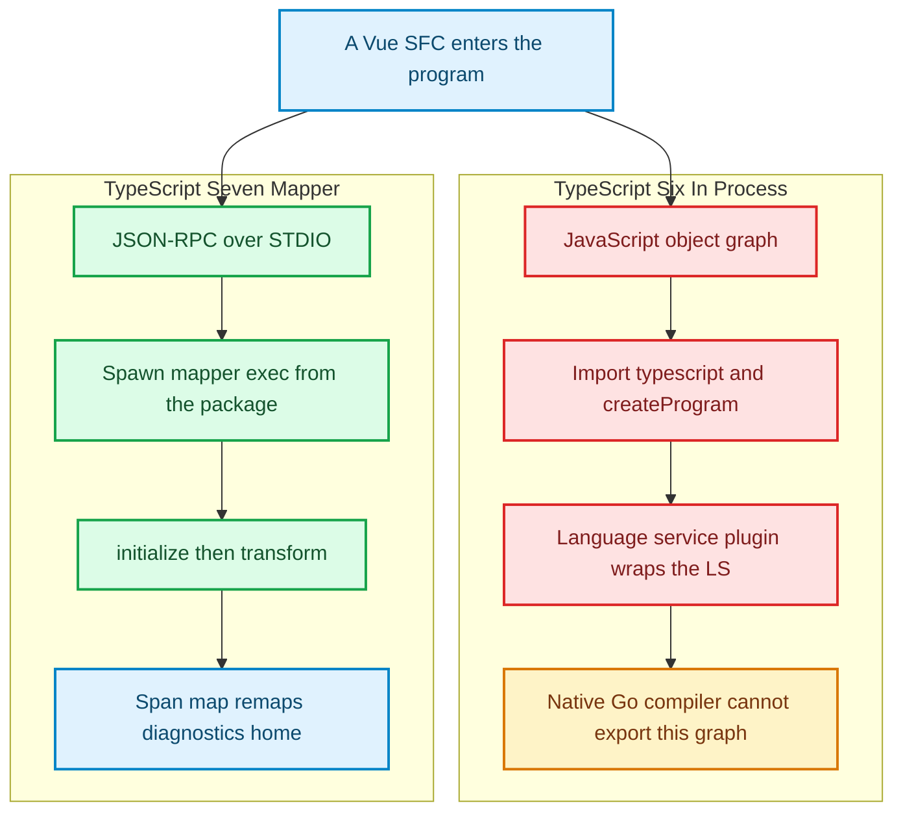
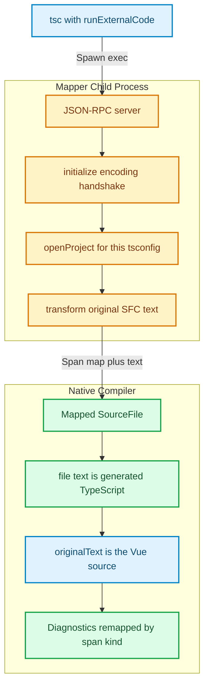

TypeScript 7.0 made `tsc` fast enough that Slack’s merge queue shed forty percent of its wait, and a VS Code checkout that used to show its first error in seventeen seconds started doing it in one [1]. None of that speed reaches `App.vue`.

Open a Vue single-file component under the native language server and the 10× compiler behaves as if the file is not there. Volar still imports TypeScript 6. The 7.0 announcement said this out loud: workflows that embed TypeScript into their own compilers—Vue, MDX, Astro, Svelte, Angular templates—stay on 6.0 until a *different* API ships [1]. Dual-install is not a migration footnote. It is the product. You run `tsc` from 7.0 for `.ts`, and you keep `@typescript/typescript6` around because someone still has to `createProgram` [1].

The obvious request—“export the compiler API from Go”—is the request TypeScript cannot honor. A native binary does not have a JavaScript object graph to hand Volar. Content mappers are the substitute that 7.1 is built around: spawn a child, speak JSON-RPC, take valid TypeScript back, and keep a span map so squiggles land on the file the human is editing [2][3][4].

That is not a plugin wrapping the language service. It is a process boundary. Figure 1 is the heap you used to share versus the pipe you get now.



*Figure 1: TypeScript 6 embeds the compiler in the same V8 heap as Vue tooling. TypeScript 7.1 keeps the Go compiler native and talks to a mapper process instead. Sources: TypeScript 7.0 announcement [1]; content mapper protocol in typescript-go#4712 and TypeScript 7.1 nightly [2][10].*

The left column is twelve years of `import ts from "typescript"`. The right column is what a Go compiler can actually promise a Vue team without pretending it still lives in node_modules as a library.

---

## The object graph that would not travel

TypeScript 7.0 is a faithful port, not a new type system. Builds that were clean under 6.0 with `stableTypeOrdering` stay clean. The thing that did not port is the accident of shipping as a JavaScript package: the entire checker, AST, and language service were one object graph in one isolate [1]. Volar did not “integrate” with TypeScript. It *was* TypeScript, with extra files stuffed into the program.

Go cannot export that graph. The 7.1 iteration plan therefore lists three APIs to stabilize—Content Mapper, Emit, Language Service—and the mapper is first because Vue cannot wait on a complete `createProgram` lookalike [4][5]. Andrew Branch’s API roadmap still budgets remaining work against that mapper; as of the committed 7.1 plan it is the replacement for TS Server plugins that rewrote foreign files, not a courtesy preprocessor [5].

Until that ships as stable, the compatibility package is the official lie you tell npm:

```json
{
  "devDependencies": {
    "@typescript/native": "npm:typescript@^7.0.2",
    "typescript": "npm:@typescript/typescript6@^6.0.2"
  }
}
```

`npx tsc` is native. `import ts` is 6.0. typescript-eslint, Volar, and every `createProgram` caller keep breathing [1]. Content mappers exist so the native side can start seeing `.vue` without dragging that import back into the Go process.

The 7.1 beta was scheduled for 6 October 2026, then slipped for API testing, then slipped again on infrastructure [4]. As of this writing the artifact you can actually run is `typescript@next`: **7.1.0-dev.20261009.1**. Everything below is that nightly, not a GA boxed as 7.1. Treat the method names as a live protocol.

---

## Four methods, one client, no object graph

A mapper is not a `compilerOptions.plugins` entry. Language service plugins were never loaded by `tsc` and never changed what the checker believed [9]. Content mappers run during program construction. They have to be declared twice: once in the project, once on the package that will be spawned.

```json
{
  "compilerOptions": {
    "strict": true,
    "noEmit": true,
    "target": "esnext",
    "module": "esnext"
  },
  "contentMappers": [
    {
      "package": "sfc-content-mapper",
      "extensions": [".sfc"]
    }
  ],
  "include": ["src"]
}
```

The package’s `package.json` does not export a plugin factory. Nightly reads `typescript.contentMapper.exec` and uses that argv, with the package directory as cwd [2][10]:

```json
{
  "name": "sfc-content-mapper",
  "version": "1.0.0",
  "typescript": {
    "contentMapper": {
      "exec": ["node", "./mapper-server.mjs"]
    }
  }
}
```

`exec` can be any command. Node is convenient. A Rust binary that speaks the same JSON-RPC is equally valid. Package resolution is identity, not runtime [2].

TypeScript is the JSON-RPC 2.0 client. The mapper never sends requests or notifications [2][6]. Framing is the LSP base protocol: `Content-Length` headers on STDIO, not newline-delimited JSON [7][10]. The 7.1 nightly host speaks four methods [10]:

```typescript
type PositionEncoding = 'utf-8' | 'utf-16';

interface InitializeParams {
  locale?: string;
  positionEncodings: PositionEncoding[];
}

interface InitializeResult {
  positionEncoding: PositionEncoding;
  diagnosticSource: string;
}

interface OpenProjectParams {
  configFileName: string;
  projectHandle: string;
  options?: Record<string, unknown>;
  compilerOptions: Record<string, unknown>;
}

interface TransformParams {
  fileName: string;
  content: string;
  projectHandle: string;
}

interface TransformResult {
  text: string;
  extension: '.ts' | '.tsx' | '.js' | '.jsx' | '.json' | '.mts' | '.cts' | '.mjs' | '.cjs';
  mappings?: Array<[number, number, number, number, SpanMapKind, number?]>;
  diagnostics?: MapperDiagnostic[];
}

enum SpanMapKind {
  Verbatim = 0,
  Atom = 1,
  Alias = 2,
}
```

The July PR described `initialize` and `transform` with a `protocolVersion: 1` field [2]. Nightly dropped the version field and inserted `openProject` / `closeProject` so one mapper process can serve many projects without assuming a 1:1 process-to-tsconfig mapping [10]. That is the monorepo rule: TypeScript deduplicates mapper processes by package name and version. A single child must handle any file, any project, in any order, using the `projectHandle` on each `transform` [2][10].

Initialize has a five-second timeout. `diagnosticSource` must not be `ts`, `tsc`, `typescript`, or a native file extension—TypeScript reserves those for itself [10]. After handshake, every `.sfc` lookup becomes a `transform`. Figure 2 is that round trip against the two texts the compiler then keeps.



*Figure 2: TypeScript is the JSON-RPC client. `file.text` is what the checker parses. `file.originalText` plus `file.spanMap` are how a diagnostic on generated TypeScript is reported on the SFC. Sources: nightly host methods [10]; JSON-RPC 2.0 [6]; LSP Content-Length framing [7].*

On the JavaScript API side of 7.1, a mapped `SourceFile` carries both texts and the map [10]:

```typescript
mappedFile.text;           // virtual TypeScript the checker parsed
mappedFile.originalText;   // the .sfc bytes the editor still shows
mappedFile.spanMap;        // Verbatim / Atom / Alias segments
mappedFile.contentMapper;  // "sfc-content-mapper@1.0.0"
```

`text` is a lie you tell the parser. `originalText` is the file. Confusing them is how a tool highlights the wrong column in a `.vue` buffer.

---

## Three kinds of honesty about a span

A span map is not a source map. Source maps record point correspondences and leave “this byte has no origin” implicit. A `SpanMap` records explicit segments; anything not covered is synthesized virtual text with no home in the original [2][10]. Tuples are `[virtualStart, virtualLength, originalStart, originalLength, kind]`, optionally plus a feature mask. Omit the mask and you get every language-service feature. Positions are in the encoding chosen at `initialize`; the JS API always re-exposes UTF-16 [2].

**Verbatim** means the two slices are the same length and the same bytes. Interior positions interpolate. Completions and rename require this geometry—TypeScript will not start a rename on an Atom [2]. A `<script lang="ts">` block that is copied unchanged into virtual text should be Verbatim. That is the contract Vue actually wants for the part of the SFC that is already TypeScript.

**Atom** means correspondence without interpolation. `+` in Lisp and `add` in the generated call are an Atom if you only care that they are “the same place.” Lengths may differ. A diagnostic covering `add` highlights `+`. The message still says `add`.

**Alias** is Atom geometry plus a claim that the two spellings name the same entity. Diagnostic *presentation* substitutes the original text. The Lisp example from the design doc is the canonical tell [2]:

```text
add.lisp:1:2 - error TS2304: Cannot find name '+'.
1 (+ 1 2 "oops")
   ~
```

Gaps are not discarded. Volar used to drop diagnostics in unmappable regions. TypeScript 7.1 prints a snippet of the generated text and names the mapper that invented it—typically an injected `import` that failed to resolve [2]. That is deliberate. A scaffolding import that does not exist is still your problem; hiding it would make the mapper look more correct than the program.

Language-service coverage is a baseline, not Volar. Hover and signature help use the first Semantic projection. Completions use the first Semantic projection *only if it is Verbatim*. Definitions, references, and implementations query every Navigation projection and merge. Rename searches every Navigation projection but only Verbatim spans may initiate or accept an edit [2]. Complex Vue features still need their own language server. The mapper is how that server gets a TypeScript program at all.

---

## The flag that punches the security model

For as long as `tsc` has been a compiler people pipe untrusted input into, the wiki’s headline guarantee has been: it will not execute the input. No eval, no macros, no plugin that runs author code during compilation [8]. Content mappers are the documented exception. The tsconfig schema on nightly says execution “must be enabled separately with `--runExternalCode`” [10]. `tsc --help --all` on 7.1.0-dev.20261009.1:

```text
--runExternalCode
Allow loading external content mapper plugins that execute code during compilation.
```

The July PR called this `--loadExternalPlugins`. The shipping name is `--runExternalCode`. VS Code passes it to `tsc --lsp` only in trusted workspaces; otherwise `contentMappers` are ignored [2][8]. CI has no such nanny. A `tsconfig.json` that names a mapper does nothing until someone adds the flag. That is the whole security story. The mapper’s `exec` is a subprocess with your user’s privileges. Treat `vue-content-mapper` like you treat a custom `eslint` plugin: pin it, review it, do not take it from a random lockfile bump on a Monday.

Failure handling is fail-closed, not fail-open. A crash or a protocol violation becomes a program diagnostic and an empty TypeScript file. After five failures in one project, TypeScript stops calling that mapper [2]. Empty files type-check. They also silently drop every export the rest of the program thought it imported. Watch the diagnostic, not the exit code.

Mapped files do not emit JavaScript. Declaration emit, when requested, writes names like `App.d.svelte.ts`. Declaration maps are not supported. Andrew Branch’s answer to “please emit JS from the virtual text” was: Vue’s generated TypeScript is fake on purpose; emitting it would be a new product, not a missing checkbox [2].

---

## What the pipe actually costs

A protocol-faithful mapper—Content-Length JSON-RPC, the four nightly methods, a Vue-like `.sfc` that extracts `<script lang="ts">` as a Verbatim span—ran against Node 22.14.0 on linux/x64. Five hundred transforms after a fifty-iteration warmup. The same extract in-process is the control. Then nightly `tsc --runExternalCode` type-checked the fixture for real.

| Path | What was measured | Result |
| :--- | :--- | :--- |
| Handshake | spawn + `initialize` + `openProject` | **22.3 ms** once |
| RPC `transform` | 500 SFC extracts over STDIO | p50 **39 µs**, p99 196 µs |
| In-process extract | 500 calls, no child | p50 **0.36 µs** |
| Reply size | mean JSON-RPC result | 115 bytes |
| Nightly `tsc` | `--noEmit --runExternalCode` | **85 ms**, exit 2 |

The isolation tax on the median transform is two orders of magnitude if you divide 39 by 0.36. That sentence is true and almost useless. Thirty-nine microseconds is not why your Vue CI is slow. Twenty-two milliseconds to spawn and handshake *is* a line item, which is why TypeScript deduplicates mapper processes by `name@version` across project references instead of forking one child per tsconfig [2][10]. Amortize 22 ms over a thousand SFCs and it disappears into `tsc` itself.

The number that is not a micro-benchmark is the diagnostic. Nightly TypeScript 7.1 printed:

```text
src/checkout-total.sfc(2,14): error TS2322: Type 'string' is not assignable to type 'number'.
```

The virtual file was extracted TypeScript. The path is the `.sfc`. The span map’s Verbatim segment sent column 14 back to `checkoutTotal` in the original script block. A planted Alias on `(+ 1 2 "oops")` mapped generated `add` onto original `+`. Crashing the mapper after one transform exited 1; that is the fail-closed path the host turns into an empty `SourceFile` [2].

Reproduce it:

```bash
npm run bench:mapper
# optional, if typescript@next is on disk:
TSC_BIN=/path/to/typescript/bin/tsc npm run bench:mapper
```

This is not 7.1 GA. The beta is late [4]. The protocol already moved once between the July PR and this nightly. Pin the gitHead you measured (`6ad8c56f`) if you are writing a mapper, not a blog post.

---

## Trusted workspaces and the end of type-level SQL

`--runExternalCode` is a cultural tell. TypeScript spent a decade advertising that `tsc` is safe to run on a gist. Mappers make that conditional, the same way `eval` is conditional in every “we don’t execute your code” runtime that later grows macros. Workspace trust is the editor’s answer. Pinning and code review are CI’s. There is no third answer.

The other tell is in the 7.1 iteration thread. Asked whether native `tsc` would raise instantiation-depth limits now that the compiler is fast, Ryan Cavanaugh said no—and then pointed at content mappers: projects that parse SQL or GraphQL in the type system should become static processes that emit a `.d.ts`, not deeper generic walks [4]. That is the same architecture as Vue. Foreign syntax enters as bytes. TypeScript receives TypeScript. The mapper owns the lie.

Vue tooling may still run a dedicated language server for template intelligence. The mapper’s job is to make `tsc --noEmit` true for the script block, and to give that language server a program it can query without importing a JavaScript TypeScript. Completions inside Verbatim `<script>` should work. Completions on an Alias `add`/`+` should not pretend they do.

The antithesis is still available. If your `.vue` files are a compiler IR that should never be type-checked as TypeScript—code-generated soup, or a DSL whose generated identifiers are meaningless—do not register a mapper. Dual-install and keep Volar on 6.0. A mapper that synthesizes a thousand lines of unused helpers will drown you in generated diagnostics the CLI refuses to hide. Fail-closed empty files after five crashes are worse than staying on 6.0.

---

You are no longer importing TypeScript into Vue. You are importing Vue into TypeScript, as a child process, over a pipe, with a map home. The object graph was an accident of shipping as a library. The protocol is what a native compiler can actually sign.

---

## References & Further Reading

1. **Rosenwasser, D. (2026)**. *Announcing TypeScript 7.0*. TypeScript Blog. [https://devblogs.microsoft.com/typescript/announcing-typescript-7-0/](https://devblogs.microsoft.com/typescript/announcing-typescript-7-0/)
2. **Branch, A. (2026)**. *Content mappers*. microsoft/typescript-go#4712. [https://github.com/microsoft/typescript-go/pull/4712](https://github.com/microsoft/typescript-go/pull/4712)
3. **Branch, A. (2026)**. *Content mappers (microsoft/typescript-go#4712)*. microsoft/TypeScript@57791fb. [https://github.com/microsoft/TypeScript/commit/57791fb7d00250b0ae7046b54750b32bab8ab641](https://github.com/microsoft/TypeScript/commit/57791fb7d00250b0ae7046b54750b32bab8ab641)
4. **Rosenwasser, D. (2026)**. *TypeScript 7.1 Iteration Plan*. microsoft/TypeScript#63703. [https://github.com/microsoft/TypeScript/issues/63703](https://github.com/microsoft/TypeScript/issues/63703)
5. **Branch, A. (2026)**. *API feature roadmap*. microsoft/TypeScript#63875. [https://github.com/microsoft/TypeScript/issues/63875](https://github.com/microsoft/TypeScript/issues/63875)
6. **JSON-RPC Working Group (2013)**. *JSON-RPC 2.0 Specification*. [https://www.jsonrpc.org/specification](https://www.jsonrpc.org/specification)
7. **Microsoft (2026)**. *Language Server Protocol — Base Protocol*. LSP 3.17. [https://microsoft.github.io/language-server-protocol/specifications/lsp/3.17/specification/#baseProtocol](https://microsoft.github.io/language-server-protocol/specifications/lsp/3.17/specification/#baseProtocol)
8. **TypeScript Team (2026)**. *tsc Security Properties*. TypeScript Wiki. [https://github.com/microsoft/TypeScript/wiki/tsc-Security-Properties](https://github.com/microsoft/TypeScript/wiki/tsc-Security-Properties)
9. **TypeScript Team**. *Writing a Language Service Plugin*. TypeScript Wiki. [https://github.com/microsoft/TypeScript/wiki/Writing-a-Language-Service-Plugin](https://github.com/microsoft/TypeScript/wiki/Writing-a-Language-Service-Plugin)
10. **TypeScript Team (2026)**. *typescript@7.1.0-dev.20261009.1* (`tsc/internal/contentmapper/hostimpl.go`, `ipc/protocol_jsonrpc.go`, `tsconfig.schema.json`). gitHead `6ad8c56f`. [https://www.npmjs.com/package/typescript/v/7.1.0-dev.20261009.1](https://www.npmjs.com/package/typescript/v/7.1.0-dev.20261009.1)
11. **Branch, A. (2026)**. *API usage patterns for complex editor extensions*. microsoft/TypeScript#63800. [https://github.com/microsoft/TypeScript/issues/63800](https://github.com/microsoft/TypeScript/issues/63800)
